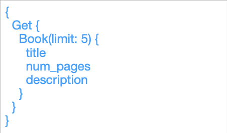
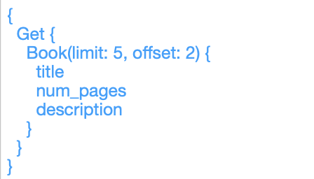
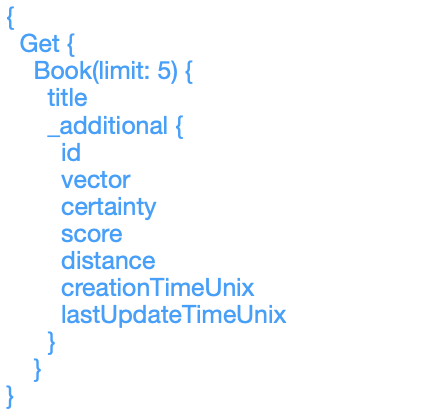
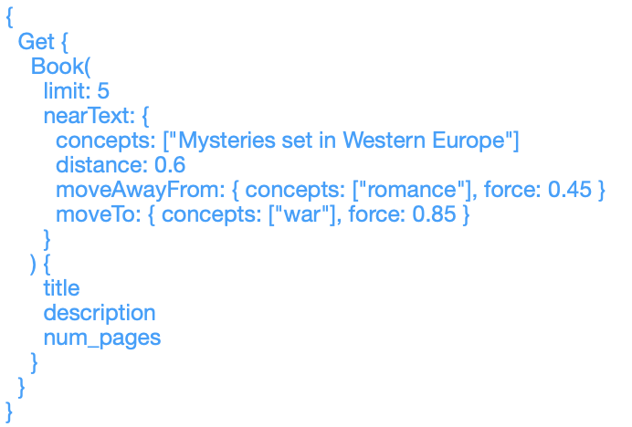
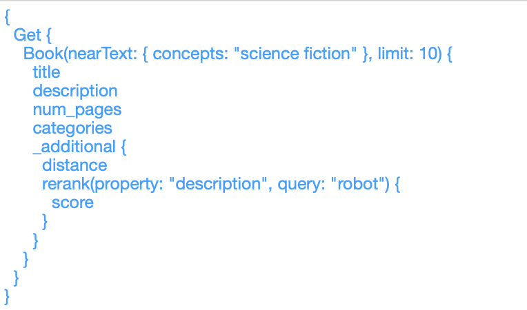
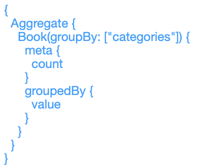
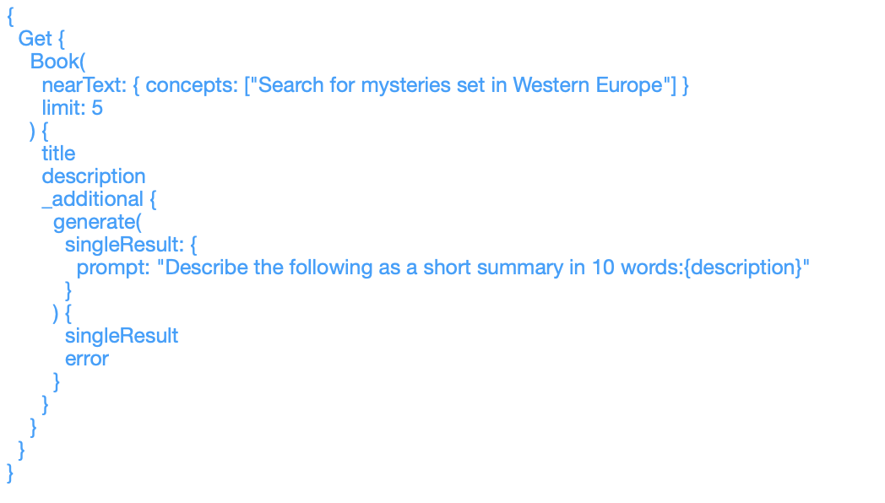
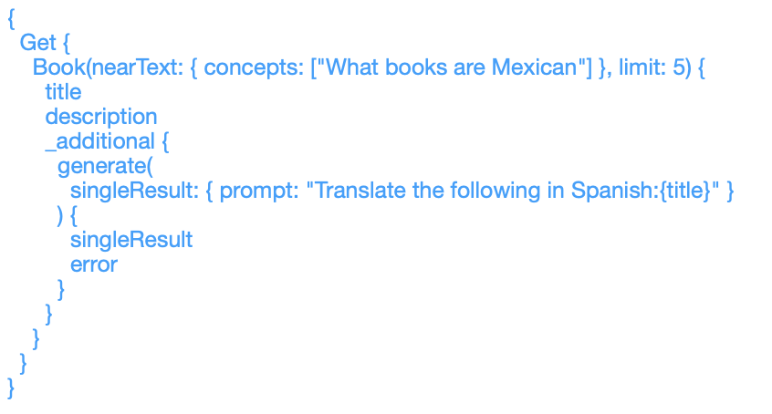
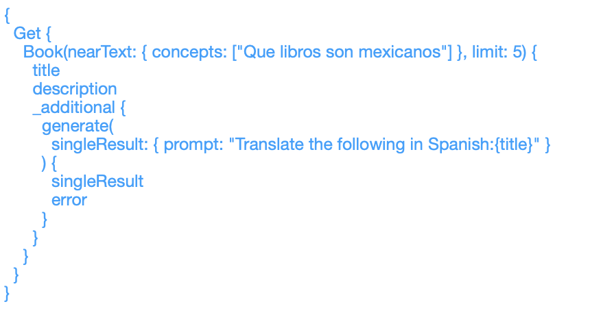

---
title: Weaviate Cloud Queries - A Practical Guide
slug: apple-apps-part-11
authors: [randy, adam]
date: 2025-02-01
tags: [iOS, mobile app development, vector databases]
image: ./img/hero.png

---

**Weaviate Cloud (WCD) Queries: A Practical Guide** 

**Query Prompt Descriptions** 

The following queries prompt types are discussed.

All queries require a Weaviate API key that is already provided.

Depending on the type of query run, an OpenAI and/or Cohere API key may be required (see below).

**Primary:** Fundamental options for querying data. 

- **Basic:** A simple query that retrieves a limited amount of items
- **Third Item:**  Skip to the third item of a query
- **Meta Data:** Properties (eg. ID, creation date, last update date, etc) available that go beyond the original values loaded on to the vector database 

**Reorder:** Rearranging or prioritizing the data. 

- **Move Away:**  Allow users to prioritize similar terms/concepts and deemphasize others. (+Open AI Key)
- **ReRank:** Change the order in which data elements are displayed, perhaps based on specific criteria. (+Open AI Key, Cohere Key)

**Aggregate:** Summarizing count data. 

- **By Category:** Group counts based on specific attributes.
- **Grand Total:** Total count of the entire dataset.

**Single Result:** RAG processing resulting in a single result.

- **Summary:** Summary of a specific query.  (+Open AI Key, Cohere Key)
- **Translate To:** Translate data elements or results into different languages.  (+Open AI Key, Cohere Key)
- **Translate From/To:** Translate data elements or results from different languages to different languages.  (+Open AI Key, Cohere Key)

**Grouped Result:** Grouping or organizing data using RAG

- **Grouped Result:** Perform prompt on all records retrieved from another prompt. (+Open AI Key, Cohere Key)

Primary

**Basic**

The basic building block for creating a query.

Example: Get the first 5 Books and list the title, number of pages and description.

**Third Item**

Query starting from the third record.

Example: Using the Basic Query as a starter, skip the first two books and start from the book that follows. Example: Starting from the 3rd book: list the title, number of pages and description of the next 5.

**Meta Data**

Show information that extends beyond the initial domain data loaded. This is data generated by the system.

Example: Include ID, creation date, last update date.

Reorder

**Move Away**

Allow users to prioritize similar concepts and deemphasize others. Example: Emphasize “war” themes and deemphasize “romance”.

**Rerank**

Change the order in which data elements are displayed based on specific criteria. This is data generated by the system.

Example: The result is reranked to prioritize descriptions that discuss robots.

Aggregate

**By Category**

Group counts based on specific attributes.

Example: Show the number of books for each category.

**Grand Total**

Total count of the entire dataset.

Example: Show the count of all books in the database.

Single Result!

**Summary**

Summary of a specific query.

Example: Summarize in 10 words books with a mystery theme that occur in Western Europe.

**Translate To**

Translate data elements or results into different languages.

Example: Search for Mexican books and translate the title into Spanish.

**Translate From/To**

Translate data elements or results from different languages to different languages. Example: Ask a question in Spanish and translate the title into Spanish.

Grouped Result!

**Grouped Result**

Perform prompt on all records retrieved from another prompt. Example: Search for books about the governments in Europe.  

Summarize what the leaders of the result have in common.

