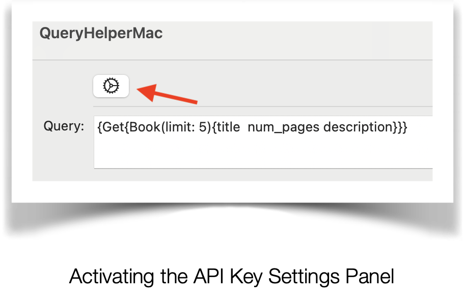
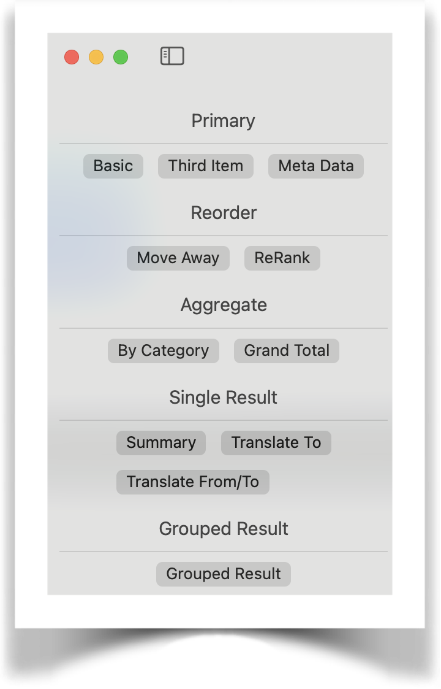

---
title: Weaviate Cloud Queries - A Practical Guide
slug: apple-apps-part-12
authors: [randy, adam]
date: 2025-02-01
tags: [iOS, mobile app development, vector databases]
image: ./img/hero.png

---

**Weaviate Cloud (WCD) Queries: A Practical Guide** 

**Query Helper Application** 

A MacOS application you can use to perform a live test of Weaviate Queries.

Query Helper Application Screen

API Settings


The first order of business is to create the API keys needed to run the application as needed.

API Key Settings Panel

Of the 3 API Keys, the **Weaviate API key is already defined** for you and cannot be changed for this demo app.

An explanation of each key, how it is used, and a link to how to define your own appears below.

- **Weaviate API Key:** Access key to the Weaviate Vector DB that holds the domain data
- **OpenAI API Key:** Access key to OpenAI that Weaviate uses to access OpenAI Large Language Models to query embeddings. Create a key at: <https://openai.com/>
- **Cohere API Key:** Access key to Cohere that Weaviate uses for text embedding, generative AI and reranking. Create a key at: <https://cohere.com>/

Keys can be defined to the application by clicking on the settings icon to bring up the **API Key Settings Panel**.

Activating the API Key Settings Panel

Query Prompt Buttons

Query Prompt Features include:

- **Copy Prompt:** For use in your own apps.  
 
- **Reset Prompt to the Original One Selected:** Reset, if prompt was changed  manually. 
 
- **Search Prompt:** Begin Search using prompt.

Query Prompt

The Query Prompt can be changed manually in the query text box and run against a Weaviate Vector DB giving you the opportunity to experiment with your own ideas.

Query Menu

Preset query templates are accessed through the Query Menu by selecting the button of your choice.

Each template is explained in detail later in this article. 

