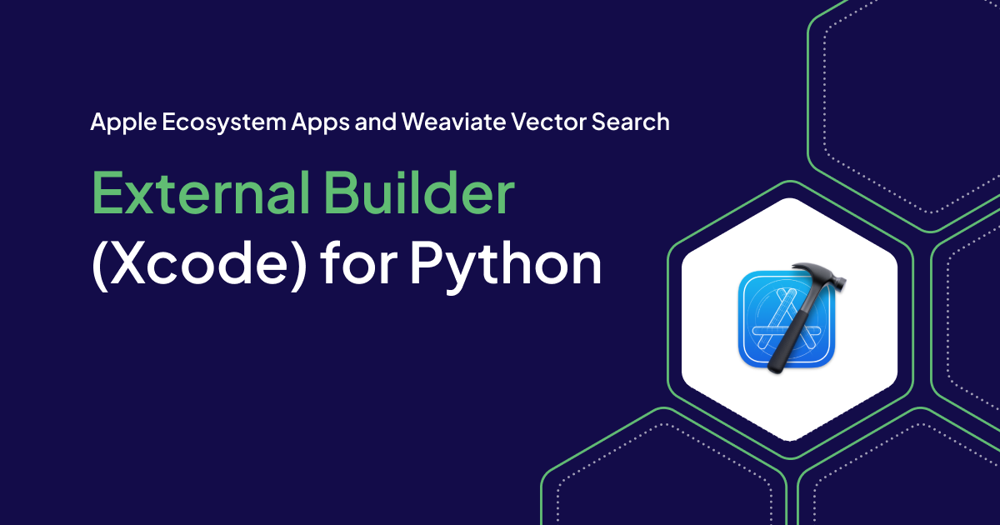

## Overview

Xcode itself isn't built for directly developing and building Python projects. However, you can leverage external builders to integrate Python development into your Xcode workflow.

Using Xcode to run python scripts is an alternative to using a native to python playground like Jupyter while allowing you to use a development tool you are familiar with.

Set up requires using Xcode and the terminal command line.

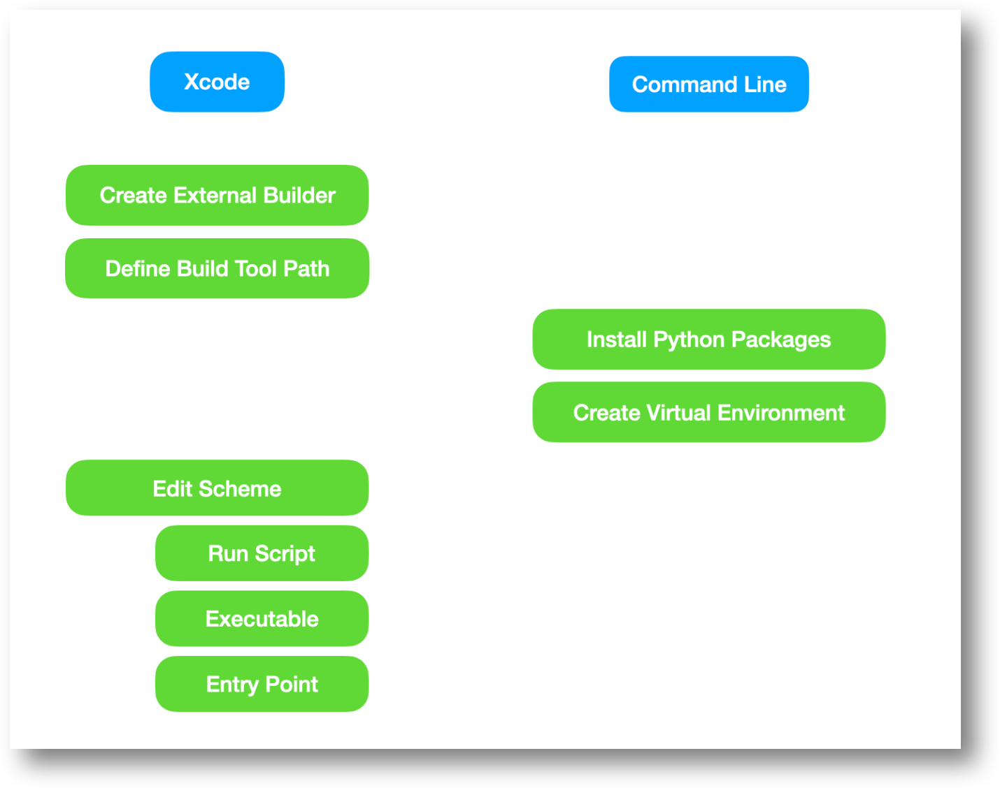


## External Builder

The External Builder is created in Xcode by selecting File>New>Project followed by selecting the External Build System icon in the Other tab.

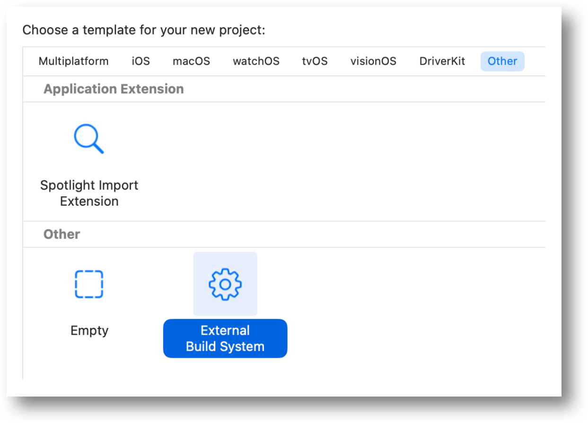

## Define Build Tool Path

The Build Tool parameter defines a path to the python build executable.

Enter a path.


<!--  -->


The build executable is a Python interpreter that runs scripts and imports modules (pre-written Python code) from various libraries.

The path to the build executable can be found by entering which python on the terminal command line while in your project directory

<!--  -->


This path points to an alias .

	/opt/anaconda3/bin/python

The alias points to an executable file.

	/opt/anaconda3/bin/python3.11


Refer to the article **Running Python on your Mac**, for more details, if this sounds confusing.


## Install Python Packages and Setup a Virtual Environment

See the article **Running Python on your Mac** for instructions.

Install Python packages into a `venv` directory within your project to create a virtual environment.

In this example **numpy** and **pandas** are the external packages have been loaded.

Remember: **If you close your terminal window**, you'll need to **reactivate the virtual environment** using the `source venv/bin/activate` command before working on your project again.


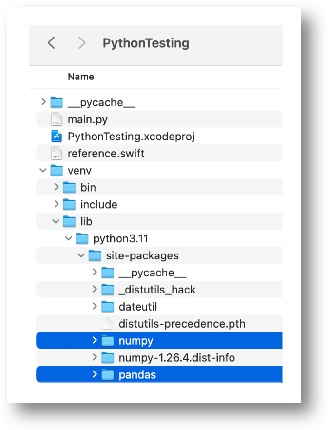


## Edit Scheme

Define a Run Script and Executable in your scheme.

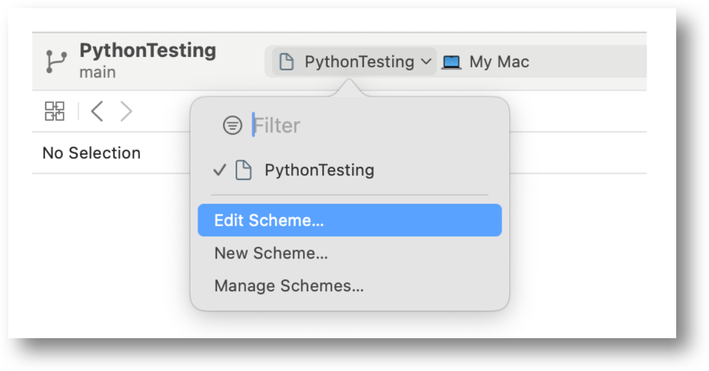

After completing all of the steps that follow, the scheme will look something like this.

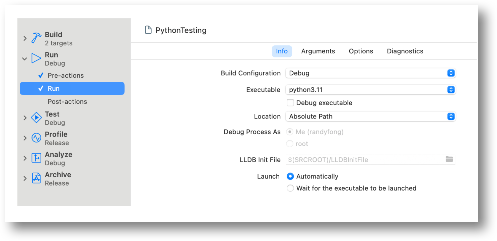

### Run Script (Pre-action)

Enter a run script to give your project **access to the python packages** implemented in the virtual environment.

```
source ~/.bash_profile
workon venv
```

The script is modified through the scheme `Run > Pre-actions`.

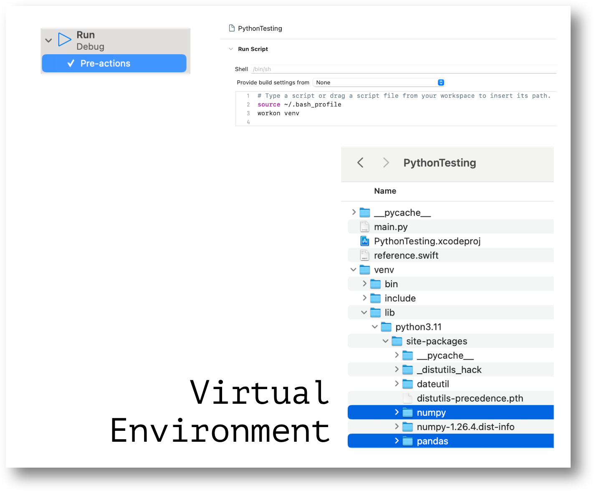


**Executable (Run Info)**

Enter the path to the executable used to run python scripts.

Have the path you already defined for the build tool handy.

In this example it was: `/opt/anaconda3/bin/python3.11`.

The executable parameter is modified through the scheme `Run > Run`.


1. Click on Executable list that is currently set to `None`.

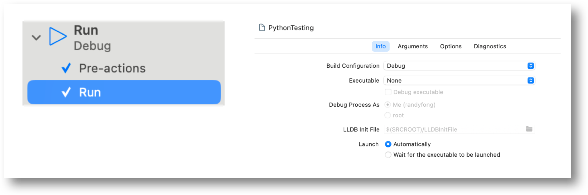


2. Select the Other option.


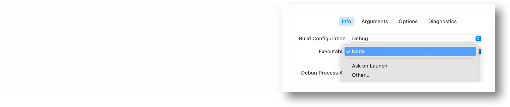

3. **Ignore** the `Choose the executable to launch` directory presented.

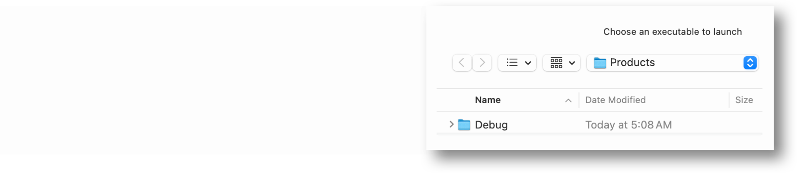


4. Instead choose a directory by entering `Shift + Command + G` and paste the path in the prompt. `Click and select the file` in the Go to section and `press enter`.

    Your **Run Info** has now been defined!


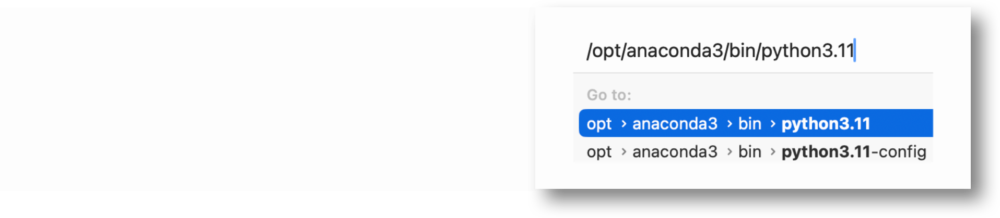


5. Make sure the **Debug executable** is NOT marked as checked.

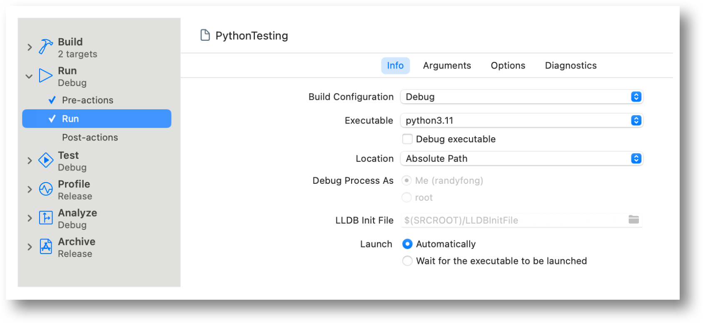

**Entry Point (Run Arguments) Arguments Passed on Launch**

Define the entry point python script.

It is the script to be launched.

In the `Run > Arguments > Arguments Passed On Launch` section

Press the + icon and add the python script file name. For this example enter: `main.py`.

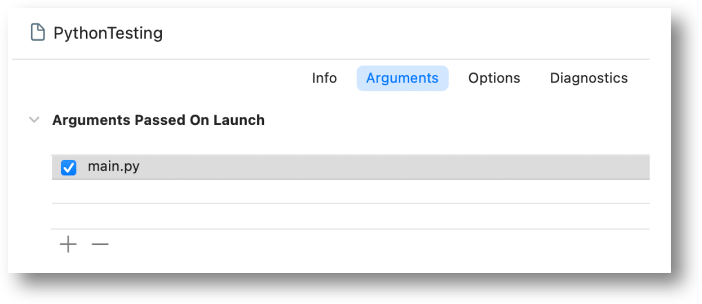

**Entry Point (Run Arguments) Environment Variables - Optional**

Include Environment Variables as needed (if any) by the application.

In the example below, Weaviate and OpenAi parameters are required.

Note: **Environment Variables are not required to run our example app**.

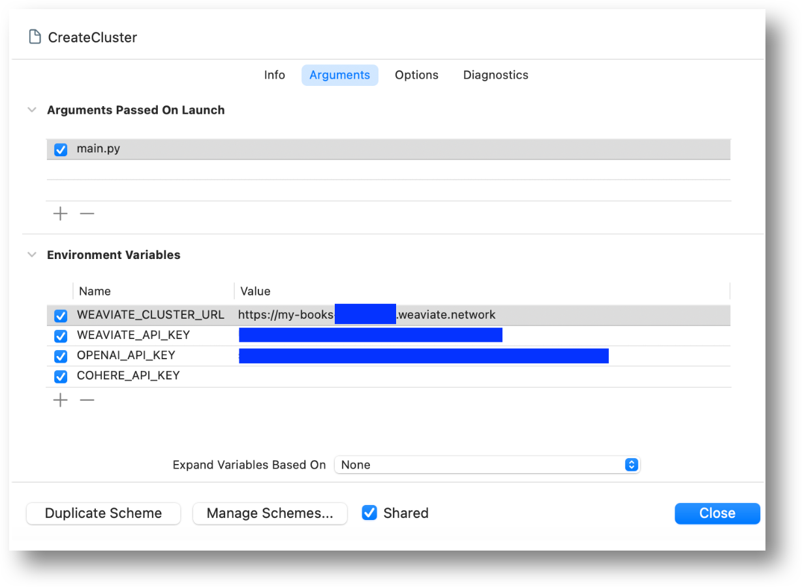

**Run Options (Working Directory)**

Define the working directory in which the python script and other resources related to the application reside.

This is the directory in which the project resides.

`Run > Options  > Working Directory` section

Check the **Use custom working directory** and **click on the arrow** to pop-up a directory for selection.

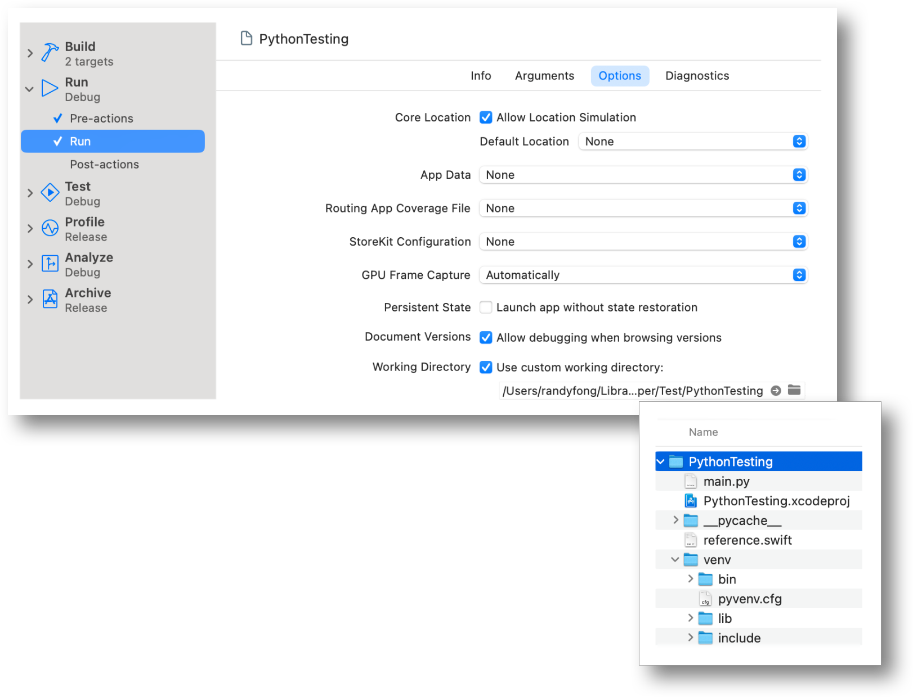

## Run Python Script

Press ▶️ to run the scheme.

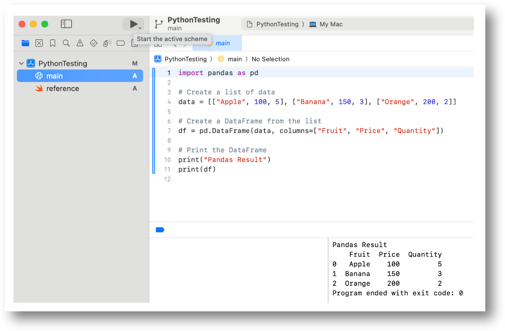


import StayConnected from '/_includes/stay-connected.mdx'

<StayConnected />
