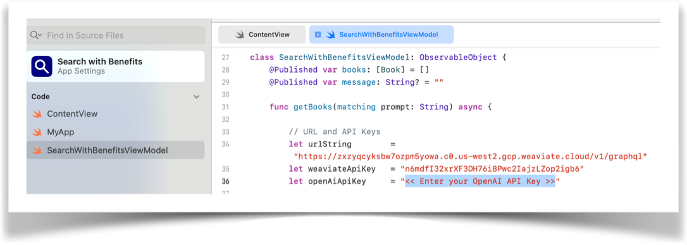
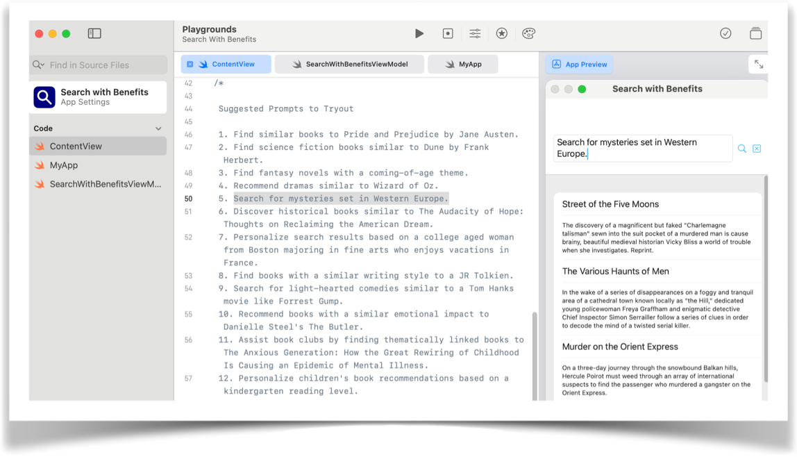
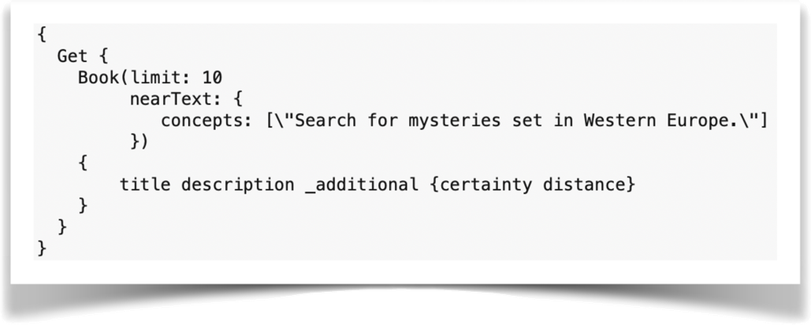
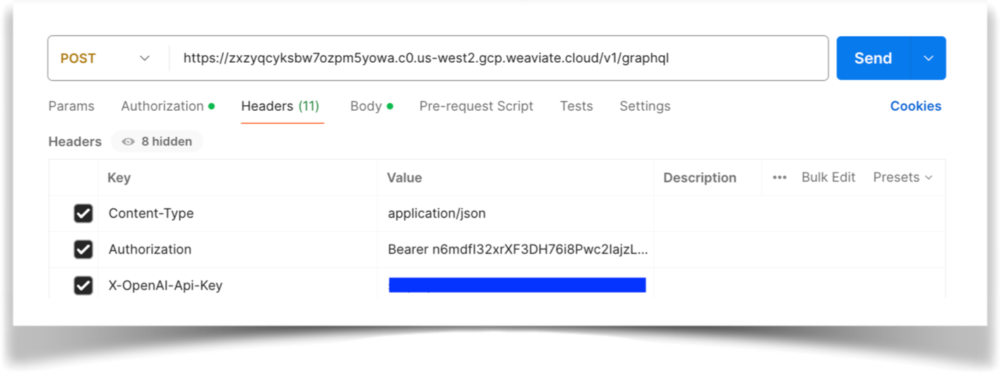
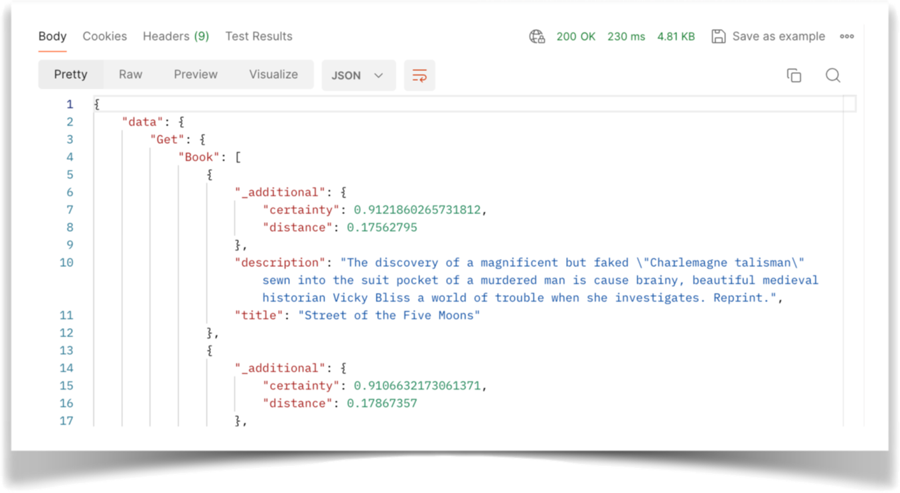

# Overview

Convert your structured data to a Weaviate Vector Database and unlock powerful search features. A vector DB understands the meaning behind your data, enabling you to find similar items and make connections you might have missed with traditional searches.

In this article we will talk about some of these important features.

- This article includes a ready-to-use Swift app and all the code.
- You can run the code in a Swift Playground, which is an interactive learning environment for Swift.
- By running the code in the Playground, you can experiment with Swift and try out different ideas.

# What you need

1. OpenAI API Key
    - https://www.howtogeek.com/885918/how-to-get-an-openai-api-key/

1. Apple’s Playgrounds App
    - https://www.apple.com/sg/swift/playgrounds/

1. Either a Mac or iPad to run the Playgrounds App

Everything else is already included such as the “Search with Benefits” app, Swift Code and a Weaviate Vector Database of Books.

# Search with Benefits

Searching structured data is limited to the exact **matching of keywords** to values within a schema. To access a set of records a language such as SQL needs to be coded by a developer. Each search requires unique code for each type of query.

With Weaviate only one statement is needed. 

Vector search is done by **inferring the meaning** of what you are trying to find and **reasoning what scenarios are similar**.

Let’s compare **Structured Search** and **Vector Search** in more detail.

# Structured Search

Using a conventional search on structured data you are limited to schema and logic constraints.

Exact matches on structured data is required.

In addition, for each type of search a developer needs to provide SQL code to account for each and every scenario.

## Examples

1. Find all books by a specific author:
    
    `author = "J.R.R. Tolkien"`

2. Find books with a title containing a keyword:
    
    `title LIKE "%Pride and Prejudice%"`

3. Find books with descriptions mentioning a specific topic:
    
    `description LIKE "%artificial intelligence%"`

4. Find books with titles starting with a specific letter:
    
    `title LIKE "A%"`

5. Find books with a specific number of words in the title:
    
    `LENGTH(title) = 3`

6. Find all books by an author and sort by title alphabetically:
    
    `author = "Agatha Christie" ORDER BY title ASC`

7. Find books with descriptions longer than a specific word count:
    
    `LENGTH(description) > 500`

8. Find books with a title or description containing a specific phrase:
    
    `(title LIKE "%Lord of the Rings%" OR description LIKE "%Lord of the Rings%")`

9. Find all books except those by a specific author:
    
    `author != "Stephen King"`

10. Find books that haven't been assigned a description yet:
    
    `description IS NULL`

11. Find books with titles shorter than 10 characters:
    
    `LENGTH(title) < 10`

12. Find all books with a specific ID:
    
    `ID = 123`

13. Find a random sample of 10 books:
    
    `RANDOM() LIMIT 10`

14. Find all books with descriptions containing at least two keywords (combine with OR):
    
    `description LIKE "%machine learning%" OR description LIKE "%data science%"`

15. Find all books with descriptions containing keywords but exclude books by  author:
    
    `(description LIKE "%machine learning%" OR description LIKE "%data science%") AND      author != "Ian Goodfellow"`

# Vector Search

With Vector Search you state your meaning in a prompt. Using one reusable statement  (varying only by the prompt entered)  a search will explore a Vector Database and return a set of results.

## Examples

1. Find similar books to Pride and Prejudice by Jane Austen.
1. Find science fiction books similar to Dune by Frank Herbert.
1. Find fantasy novels with a coming-of-age theme.
1. Recommend dramas similar to Wizard of Oz.
1. Search for mysteries set in Western Europe.
1. Discover historical books similar to The Audacity of Hope: Thoughts on Reclaiming the   American Dream.
1. Personalize search results based on a college aged woman from Boston majoring in fine arts who enjoys vacations in France.
1. Find books with a similar writing style to a JR Tolkien.
1. Search for light-hearted comedies similar to a Tom Hanks movie like Forrest Gump.
1. Recommend books with a similar emotional impact to Danielle Steel's The Butler.
1. Assist book clubs by finding thematically linked books to The Anxious Generation: How the Great Rewiring of Childhood Is Causing an Epidemic of Mental Illness.
1. Personalize children's book recommendations based on a kindergarten reading level.

# Running Search with Benefits App

### Open App

Download the app and open it in Swift Playgrounds.

### Enter OpenAI API Key

Open the `SearchWithBenefitsViewModel` swift file and enter your key.

### Run the App

Open the **ContentView** swift file and navigate towards the bottom where there are some suggested prompts. 

Copy one of the prompts onto the search field of the app. 

Click on the magnifying glass icon to perform a search. Or, enter any search prompt you can think of!

Or, before doing the above - run the app by clicking on this button below:

## About the Code

Weaviate related code can be found in the `SearchWithBenefitsViewModel` swift file.

### Weaviate API Connection

**urlString**

The web address (endpoint) used to connect to the Weaviate API.

**weaviateApiKey**

Special code (token) that grants you access.

For this demonstration, the Weaviate DB was already set up for you. 

Leave the predefined values as they are.

We'll cover how to set up your own vector database in detail in future articles.

## Weaviate Query

Search Query Example:

**Input**

	"Search for mysteries set in Western Europe”

**Output**

This query retrieves information about up to 10 mystery novels set in Western Europe. It returns both the title and a brief description of each book.

## Using Postman

import StayConnected from '/_includes/stay-connected.mdx'

<StayConnected />
