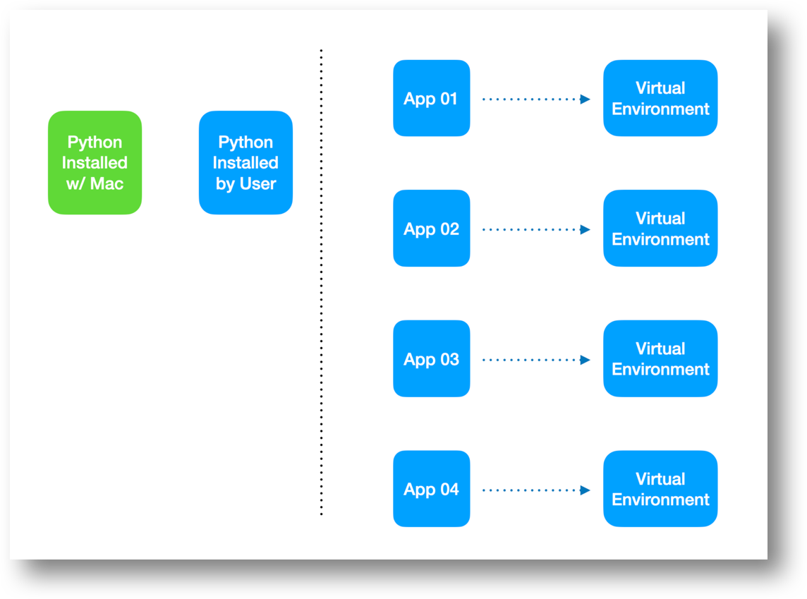
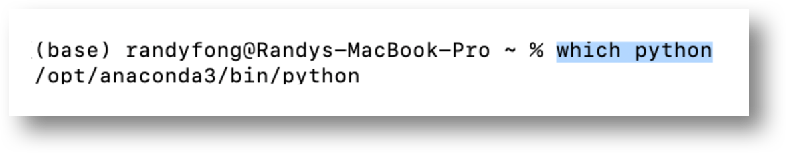
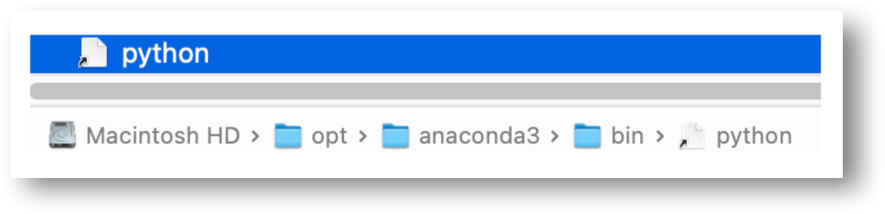
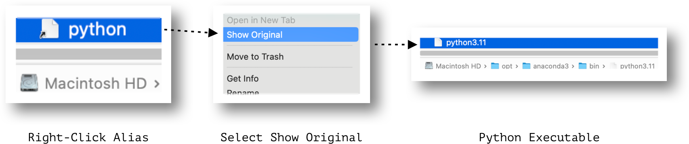
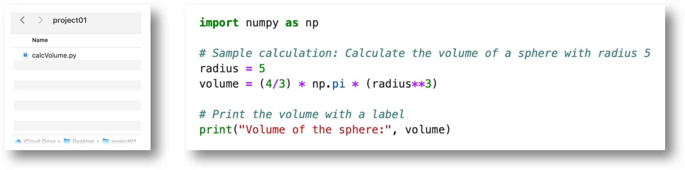
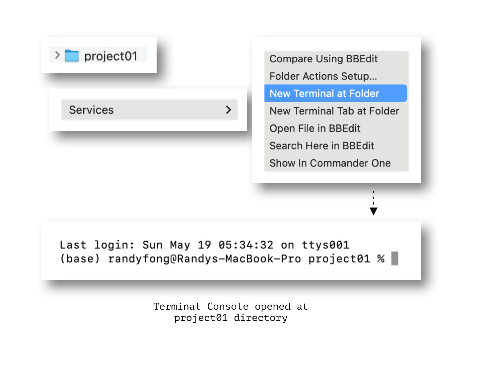
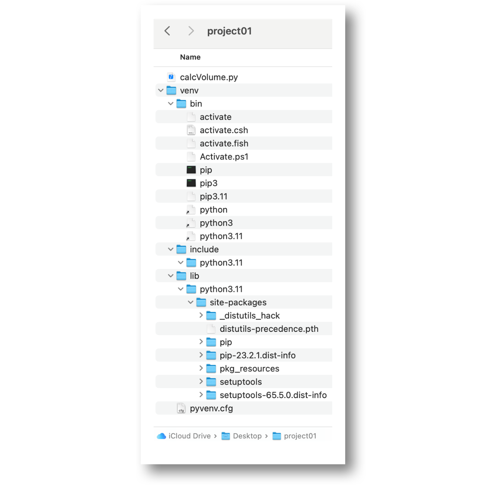
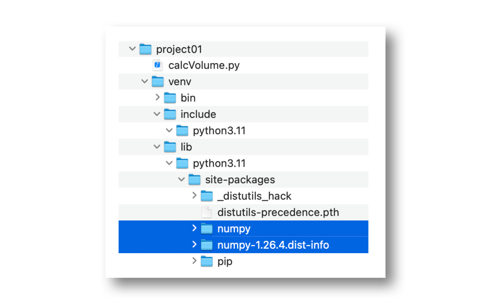
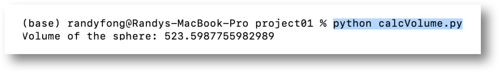

## Overview

Weaviate and other data science frameworks are making Python a powerful tool for data analysis on the Mac. Get ready to use them in your workflow.

## Python Installed with Mac by Apple

Your Mac actually comes with a pre-installed version of Python built-in. This is typically an older version to ensure compatibility with tasks or programs that rely on how Python functioned in earlier macOS versions.

This implementation of Python is maintained by Apple, only.

## Python Installed by User

Before diving into Python frameworks, you'll need to ensure you have a user installed version of Python installed on your Mac. This acts as the foundation for running these powerful tools.

Multiple Installation Options:

There are several ways to get Python up and running on your Mac:

1. Official Python Installer: Download the latest version directly from the [Python website](https://www.python.org/downloads/). This is a straightforward approach.

2. [Anaconda](https://anaconda.cloud/getting-started): This popular distribution includes Python along with a vast collection of scientific computing and data science packages. This method simplifies installation and is recommended. 

3. Homebrew: This package manager allows you to install various software on your Mac, including Python. It offers flexibility for managing multiple Python versions.

## Virtual Environment

Isolating Your Projects with Virtual Environments:

When working on Python projects, each one should have its own virtual environment activated within the project directory. This provides several benefits:

> **Dependency Management**: Virtual environments keep package dependencies for each project separate. This prevents conflicts that might arise if different projects require different versions of the same package. Imagine your project01 using the numpy package for calculations, while another project, project02, might use a different library for a different purpose. Virtual environments ensure each project has the exact versions it needs without affecting others.

> **Organization**: Virtual environments help keep your development environment organized. Packages installed for a specific project are contained within its own virtual environment, making it clear which packages belong to which project.

#### Example: Virtual Environment for project01

Consider having a project01 directory that includes a volume calculator application. You would need to activate a virtual environment within this directory and install a numpy package specifically for this project. This ensures numpy is available for project01 calculations without affecting other projects on your system.

#### Creating a Virtual Environment for Your Project:

Let's walk through setting up a virtual environment for your Python project, assuming you already have user installed version of Python in place. We'll use the project01 directory as an example:

Navigate to the project directory: Open your terminal and use the cd command to switch to the directory containing your project files. For instance, if project01 is on your desktop, you might type... 
    
    cd ~/Desktop/project01.

**Create the virtual environment**:  Use the following command in your terminal, replacing the last venv parameter with your desired virtual environment name:

	python3 -m venv venv

This creates a new directory named venv in your project directory. It contains all the necessary files for a separate Python environment.

**Activate the virtual environment**:  Tell your terminal to use the newly created virtual environment. 

    source venv/bin/activate

Your terminal prompt will likely change to indicate you're now working within the virtual environment.

**Install packages within the environment**:  Now you can install Python packages specifically for your project. For example, to install numpy:

    pip install numpy

This installs numpy within your virtual environment's isolated space, ensuring it doesn't interfere with other Python projects on your system.

Your project is now ready!  You can proceed with your Python development in project01, confident that the environment has the correct numpy version and any other packages you install specifically for this project.

Remember: **If you close your terminal window**, you'll need to **reactivate the virtual environment** using the source venv/bin/activate command before working on your project again.

## Helpful Commands

Checking Your Python Environment:

These commands help you verify your Python setup:

**Version of Python**:

This will display the version of Python currently in use by your terminal. 

On my Mac, it currently shows Python 3.11.7.

        python --version 

**Path to Python Executable**:

This will show the location of the Python executable (via an alias) that your terminal is using. 

        which python

This path points to an alias rather than an executable, the actual path can be found by right clicking on the alias and selecting Show Original.

The output from these commands helps you understand which Python installation your terminal is currently set up to use. This can be important, especially when managing multiple Python versions.

The commands we just reviewed (checking Python version and path) are helpful when we explore using Xcode to run Python scripts in a future article.  Understanding your Python environment is crucial for configuring Xcode to work seamlessly with Python.

#### Example

Here is an example of creating a simple python script and going through the steps of running it on your Mac.

1. Create a Python script in your project directory (project01 in this example)

2. Open a Terminal console using the Project Directory by **right clicking the project in Finder**.

3. Create a Virtual Environment within your Project Directory

        python -m venv venv

4. Activate the Virtual Environment

        source venv/bin/activate

5. Install Python Package(s)

    Install package(s) as needed.

        pip install numpy

5. Run script

        python calcVolume.py

import StayConnected from '/_includes/stay-connected.mdx'

<StayConnected />
