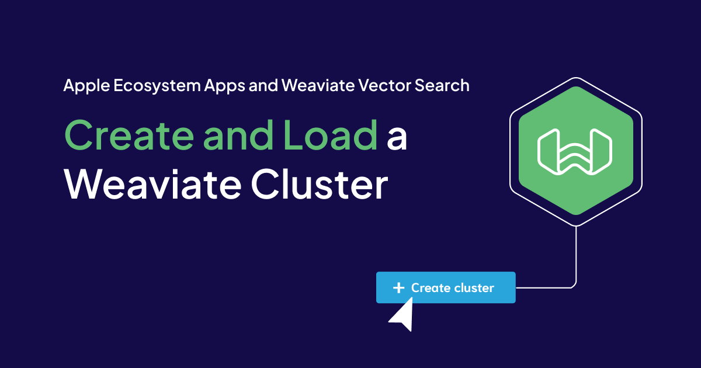

## Overview

In this article we will setup a Weaviate Cluster and load the same books data used in the article [IOS Intro - Search with Benefits](/apple-and-weaviate/apple-apps-part-1).

You can download the resources used in this blog [here](https://github.com/weaviate/BookRecs/blob/main/blog-resources/article05.zip). 

### Quckstart

How to [create a Weaviate account and cluster](https://weaviate.io/developers/wcs/quickstart)

### Running Python on your Mac

How to run [Python applications on a Mac](/apple-and-weaviate/apple-apps-part-3).

### External Builder (Xcode) for Python

Using [Xcode to run Python](/apple-and-weaviate/apple-apps-part-4) applications

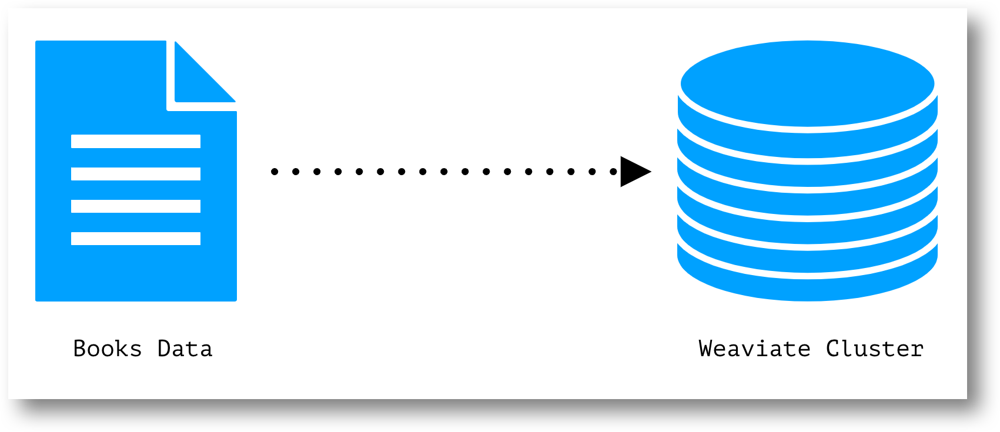

## Create a Cluster

Follow account setup and cluster creation as explained in the **Quickstart Tutorial** and take note of the following.

1. REST Endpoint URL

2. Weaviate API Key
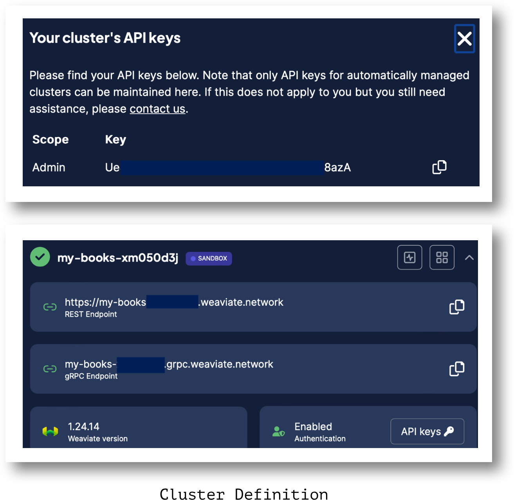

## Create XCode Project

Create an Xcode Project using External Builder as described in **External Builder (Xcode) for Python**.

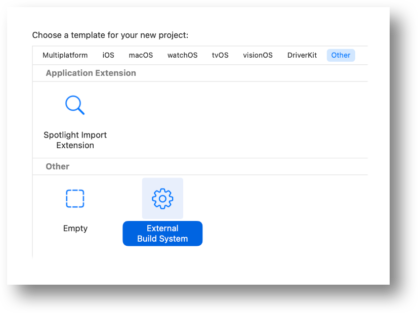

## Install Weaviate Client 

From the root directory of your Xcode Project, install the Weaviate Client.

    pip install -U weaviate-client 

Refer to the section **Install Python Packages and Setup a Virtual Environment** in the article **External Builder (Xcode) for Python** for guidance

## OpenAI Embeddings Access

Create an OpenAI API Key and note the number created.

https://www.howtogeek.com/885918/how-to-get-an-openai-api-key/

OpenAI is needed to translate text to vector embeddings for book data.

As of this article, it will cost less than 10 cents to use this one-time (create vector input to be loaded into the cluster) OpenAI feature.

## Enter Run Arguments

As described in the article External Builder (Xcode) for Python enter the Run Arguments.

The Cohere key can remain blank.

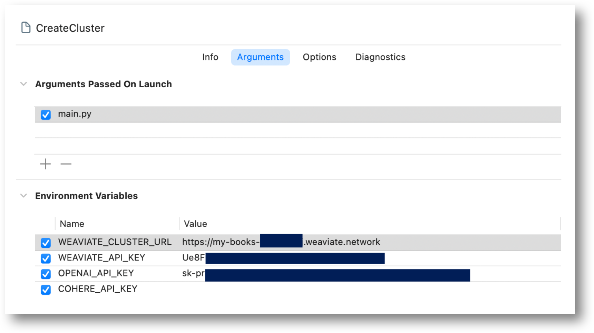

## Support Files

What is included: A  python script **main.py** to define the cluster and load book data, and book data **7k-books-kaggle.csv**.

These files were copied from Adam’s (of Weaviate) GitHub project

The python script was modified slightly for clarity.

https://github.com/weaviate/BookRecs

Copy these files to your Xcode project.

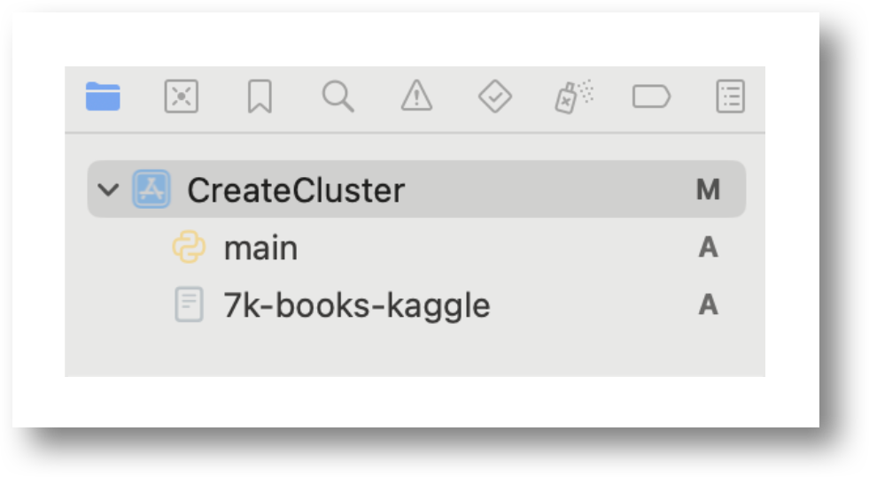

### Book Data

A CSV of approximately 7,000 books.

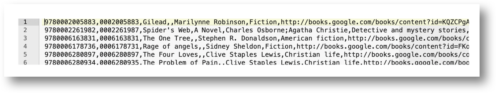

### Python Script to Create and Load Cluster

The **main.py** python script will do the following

Define the schema of a Books Custer
Create vector embeddings of Book Data
Load embeddings into the Books Cluster

Each step is logged in the console.

The longest step to run is the “Load Data” step which may take a couple of minutes.

Don’t forget to make sure that the virtual environment is activated before running.

	source venv/bin/activate

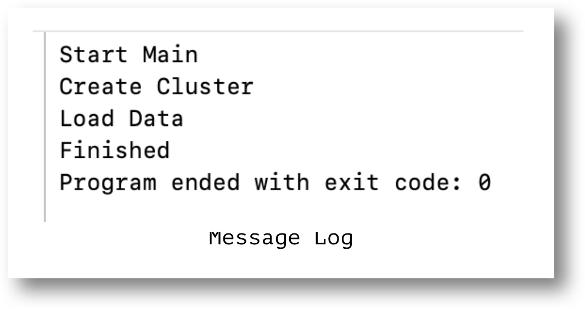

### main.py: Startup

API Keys are specified.

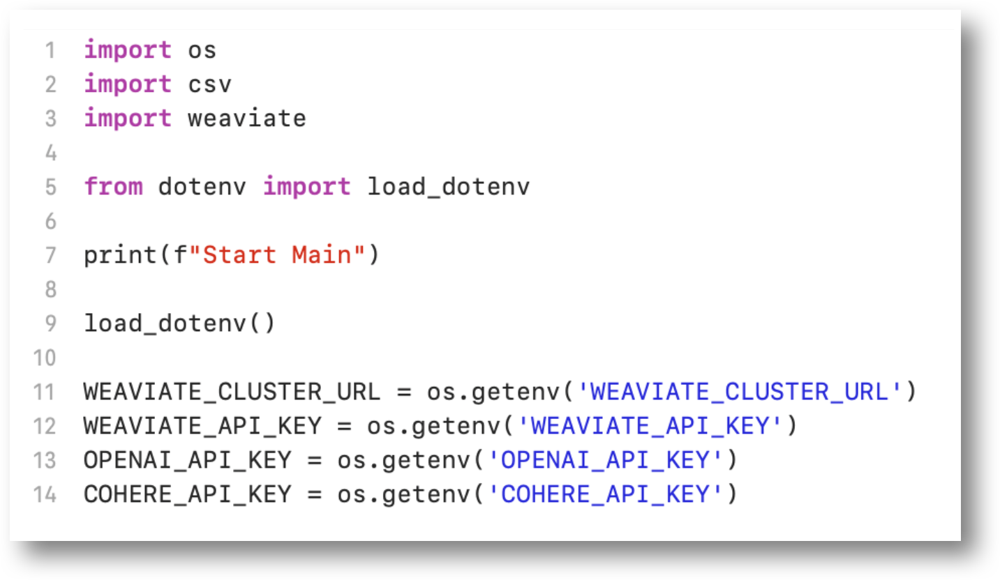

### main.py: Cluster Defined

Defines the Weaviate Books cluster.

The **text2vec-openai** parameter defines a vectorizer to convert text into numerical vectors.

The specific OpenAI model used for embedding is **ADA Version 2**.

https://openai.com/index/new-and-improved-embedding-model

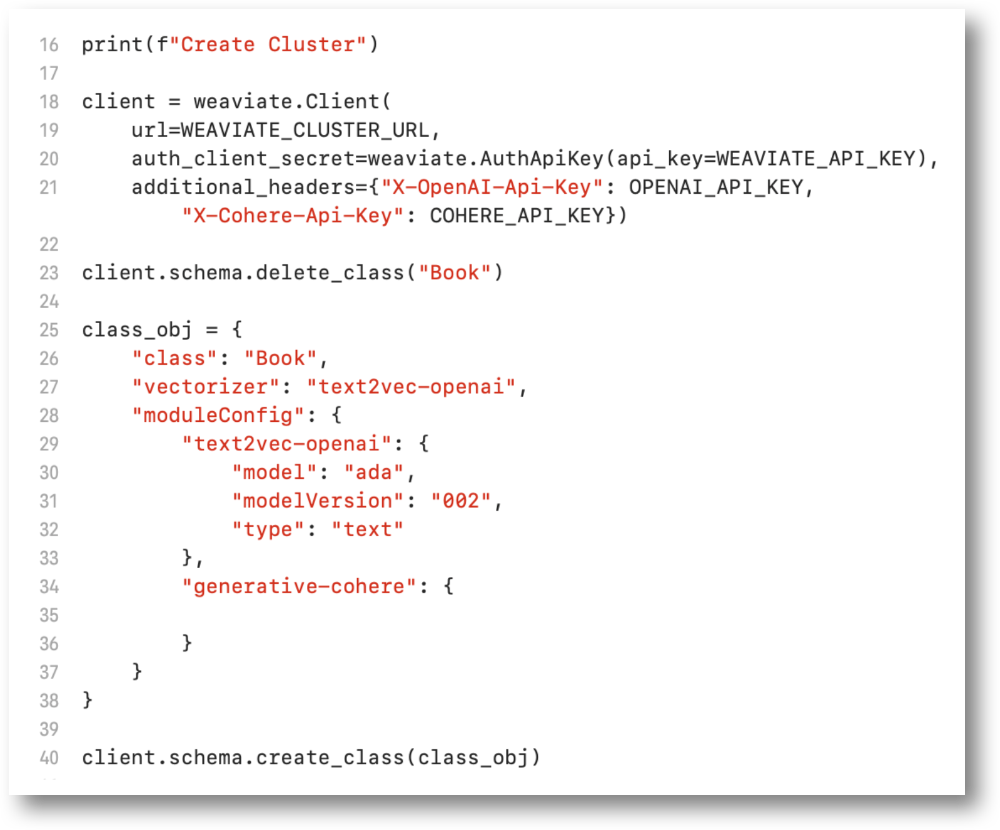

### main.py: Read Book Data

Read the file of Book Data.

Make sure to define your directory path.

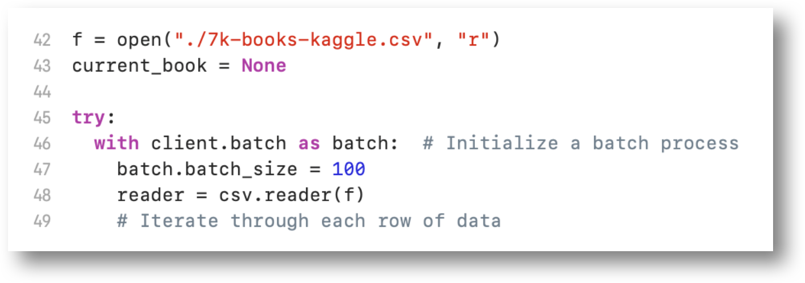

### main.py: Load Data

Properties are mapped from the data file to the Weaviate cluster.

For each book record, text is converted to a vector and loaded into the Weaviate cluster.

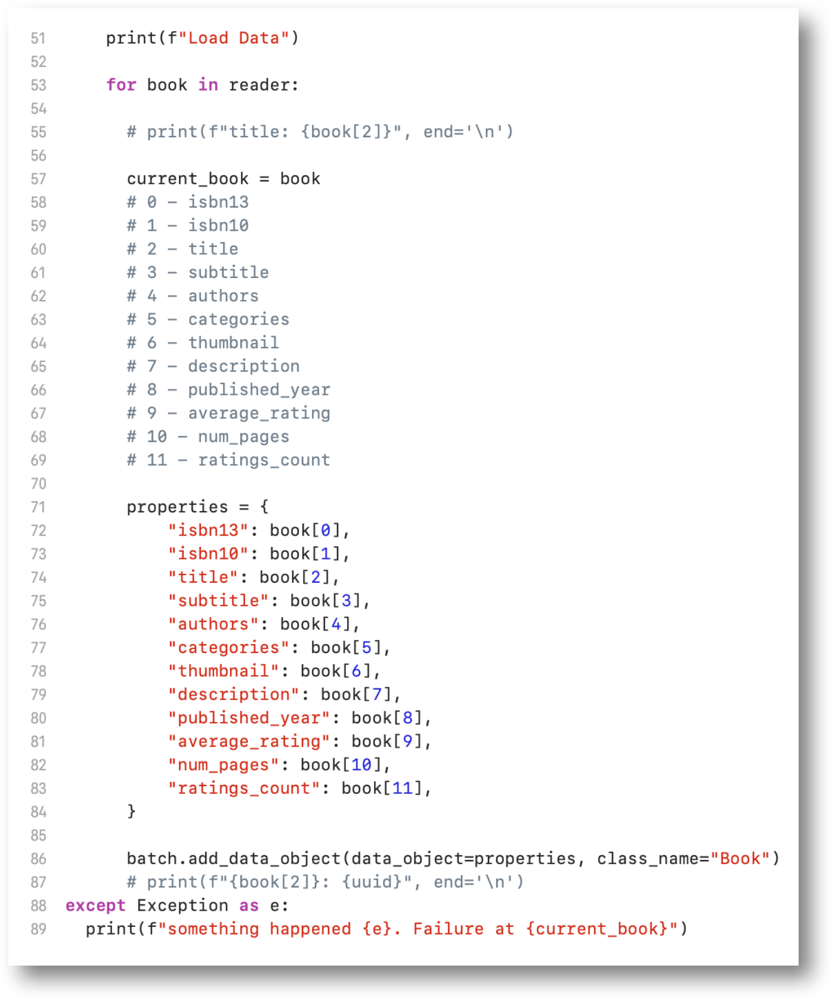

### main.py: Clean-up

Close the book data file and end the script.

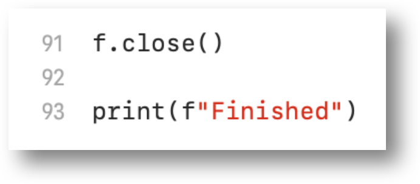

import StayConnected from '/_includes/stay-connected.mdx'

<StayConnected />
