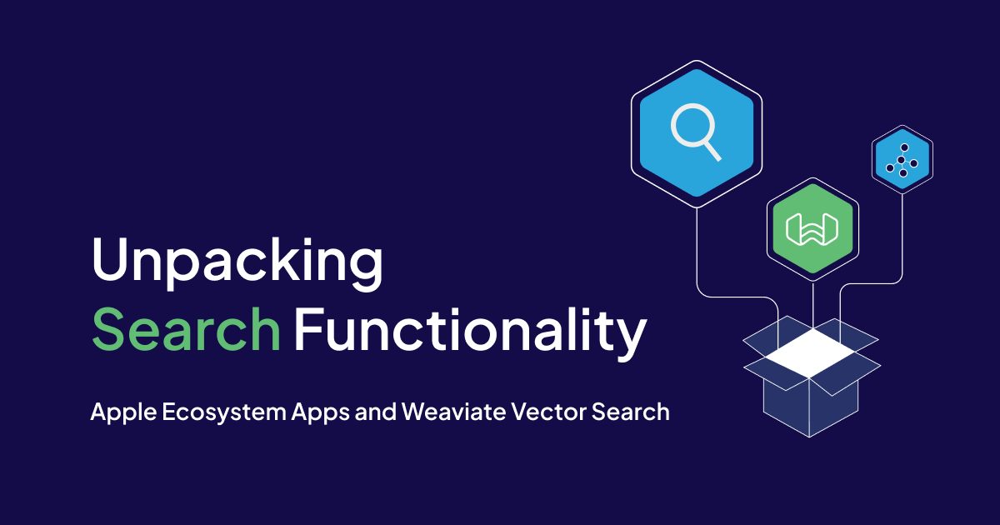

<!-- truncate -->

# Overview

Let's unpack Weaviate's search functionalities.

- Vector (similarity)
- Keyword (exact match)
- Hybrid (mix of vector and keyword)

We will discuss various search methods, from vector similarity for similar searches to keyword-based lookups. We'll even explore how to combine these methods for even more precise results. 

In addition, we will go over features like filters and aggregation to fine-tune your searches and get the most out of your Weaviate data.

Included is a Postman collection that can be run to help you understand each of these concepts. Download that from [here](https://github.com/weaviate/BookRecs/blob/main/blog-resources/postman-weaviate.zip).

# What you need

1. OpenAI API Key

https://www.howtogeek.com/885918/how-to-get-an-openai-api-key/

2. Postman

Download the Mac version or run from the [Postman website](https://www.postman.com/downloads/).

3. A Mac to run the Postman App

A Weaviate Vector Database of Books is already included to run your Postman queries on.

# Search Features

Weaviate offers various search features. 

**Vector search** finds similar items based on vector representations.

**Best Match (BM25)** search takes into account the frequency in which a keyword appears in a text.

**Conditional Filters** look for an exact match for a given property.

**Hybrid search** is a combination of vector and keyword searches.

There are **miscellaneous search features** that can be applied, too.  Such as sorting records and tallying of a count according to a property value grouping.

A Postman query has been created for each of these scenarios for you to try out as shown in the outline on the right.

## Vector Similarity Search

Imagine you have a giant library with books described by numbers instead of words.  A vector similarity search is like a special tool that helps you find books similar to the one you're holding by comparing their numbers. It's faster than reading every book description and works well for things like finding similar images or recommending products.

Let's say you're in the library and love a particular mystery novel. This book can be represented by a vector, a fancy way of saying it's a bunch of numbers that capture information about the book. These numbers might encode things like genre, character count, or how many times certain words appear.

Now, you want to find other similar mystery novels. The library (or the Weaviate platform in this case) uses the same kind of number code (vector) for all the books. The search tool then compares the vector of your favorite book to all the others. Books with similar vectors, meaning their numbers are close together, are likely similar mystery novels you might enjoy. This way, you can find new reads without sifting through every single book description.

https://weaviate.io/developers/weaviate/search/similarity

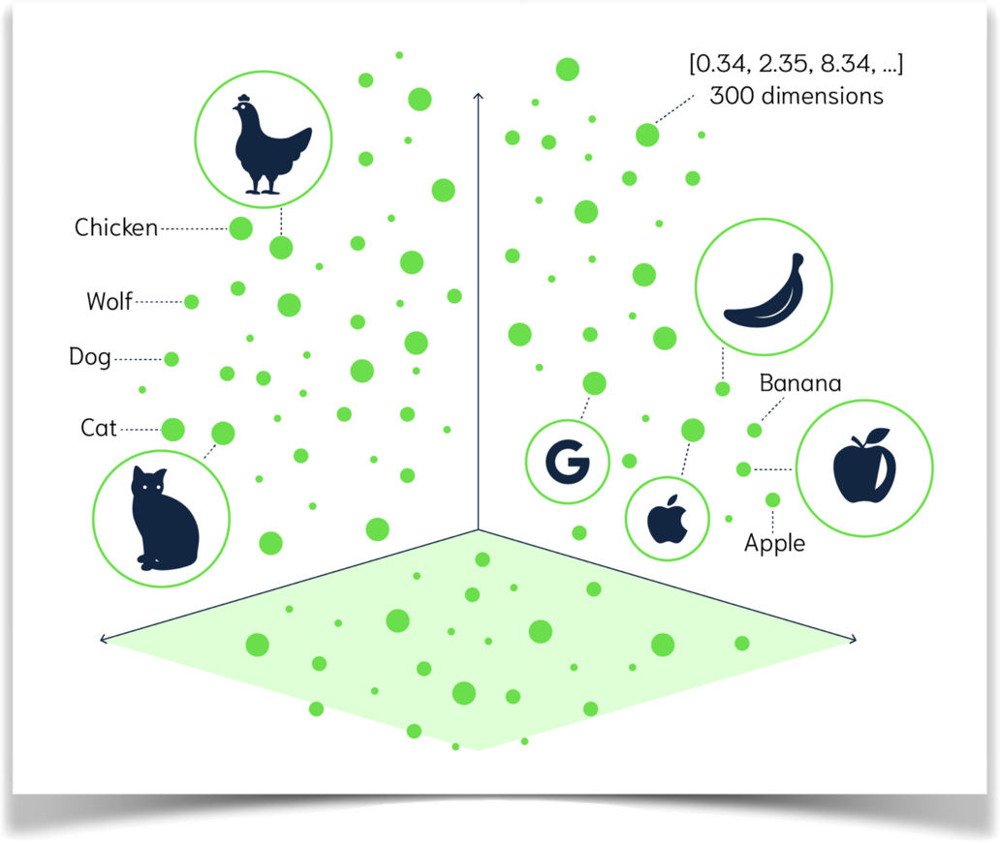

## Best Match (BM25) Search

When a user submits a BM25 query, Weaviate will look for objects that contain the search terms in the text properties of the objects. Then, it will rank the results based on how many times the search terms appear in the text properties of the objects.

https://weaviate.io/developers/weaviate/search/bm25

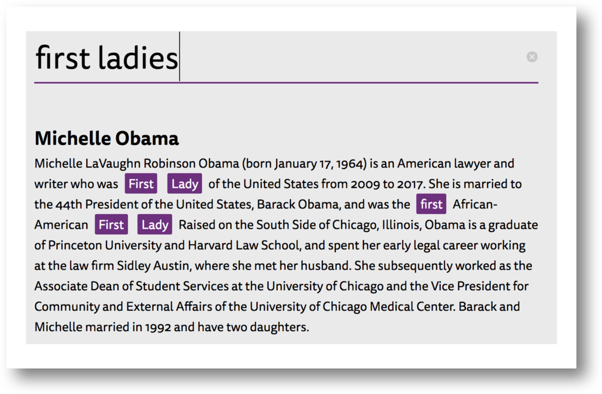

## Conditional Exact Match Filter Search

An exact match search filter consists of one or more conditions, which are combined using the **And** or **Or** operators. Each condition consists of a property path, an operator, and a value.

Another variation of this feature is applying a condition to a list of properties, rather than a single property. This is done through the **ContainsAll** and **ContainsAny** operators.

https://weaviate.io/developers/weaviate/api/graphql/filters

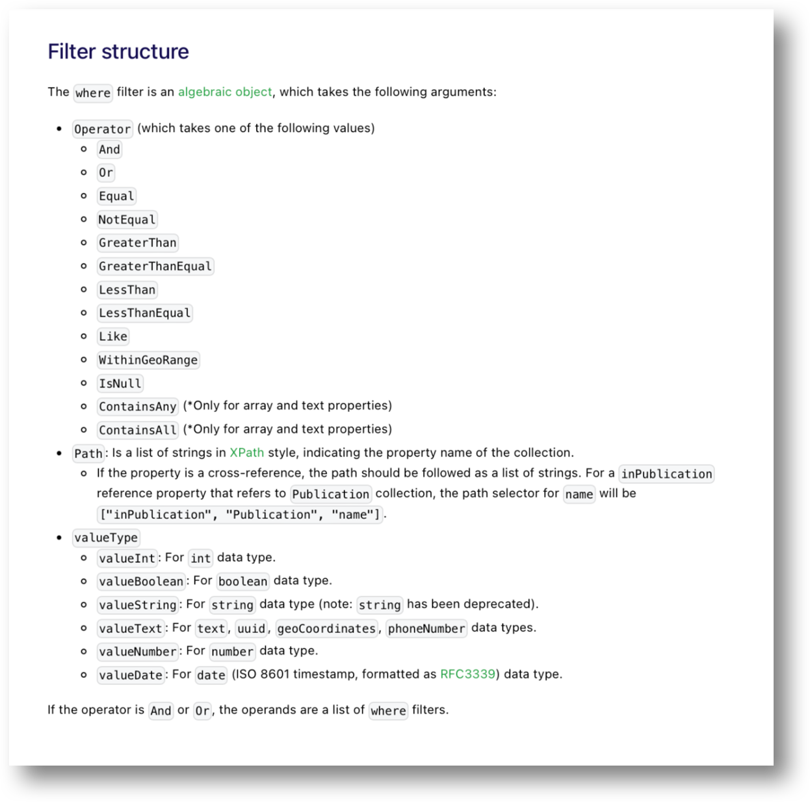

## Hybrid Search

A hybrid search combines two different search techniques: keyword-based search and semantic vector search.

https://weaviate.io/developers/weaviate/search/hybrid

These are the two major concepts.
- **Keyword-based search** is the traditional method used by most search engines. It works by matching keywords in your query to keywords in the documents or data being searched. This can be effective for finding exact matches,but it can also lead to irrelevant results if the query uses different words or phrases than the documents.
- **Semantic search** tries to understand the meaning of your query and the meaning of the documents or data being searched. It does this by using techniques like natural language processing and machine learning. This can help to find more relevant results, even if the query doesn't use the same words or phrases as the documents.

Hybrid search combines the strengths of both of these techniques. It can find exact matches using keyword search, and it can also find relevant results that use different words or phrases using semantic search. This can lead to more accurate and relevant search results overall.

Here are some of the advantages of hybrid search:
- **More relevant** results: Hybrid search can help to surface more relevant results, even if the query doesn't use the same words or phrases as the documents.
- **Improved accuracy**: By combining keyword-based and semantic search, hybrid search can provide more accurate results than either technique alone.
- **Better user experience**: Hybrid search can lead to a better user experience by providing more relevant and accurate results.

Hybrid search is becoming increasingly popular in a variety of applications, including:
- **E-commerce search**: Hybrid search can help shoppers find the products they're looking for, even if they don't know the exact names of the products.
- **Enterprise search**: Hybrid search can help employees find the information they need more quickly and easily.
- **Customer service**: Hybrid search can help customer service representatives find the answers to customer questions more quickly.

##  Miscellaneous

Various scenarios and use cases.
- Sort
- Aggregate Count by Grouping

https://weaviate.io/developers/weaviate/search/aggregate

# Tips on Working with Queries

When constructing queries there are some things to keep in mind.

Formatting queries can can result in frustrating errors when constructing them by hand.

Invisible escape characters and formatting gotchas can ruin what looks to be a syntactically correct query.

## Query Advice

1. Quotation marks (“) need to be proceeded by a backslash (\) when placed within a query parameter.eg. concepts: 

        [\"Search for mysteries set in Western Europe.\”]

2. Use an online formatter such as the GraphQL Formatter to make reading a query easier and to catch syntax issues. Remove any backslashes(“\”) beforehand.

3. Before running a query, line breaks need to be removed.

    The Remove Line Breaks online tool helps resolve this problem.
    
    Removing extraneous spaces are also recommended. Sometimes they include hidden format characters.
    
        eg. ”{Get {Book(limit: 10 nearText: {concepts: [\"Search for mysteries set in Western Europe.\"]} ) {title description _additional {certainty distance}}}}"

4. Don’t create prompts using ONLY stopwords.

    Stopwords are common words like "the", "a", "an", "is", “in", “of”, etc. Search algorithms typically filter out stopwords because they don't provide much meaning in the context of a search.
    
    For example, searching for "the cat" would likely filter out "the" as a stopword and focus on finding results related to "cat".

# Helpful Online Tools

There are a couple of free online formatting tools to help you construct as well as inspect queries.

## GraphQL Formatter

Inspects queries and formats them into a more readable format.

Also checks for GraphQL format completeness.

https://jsonformatter.org/graphql-formatter

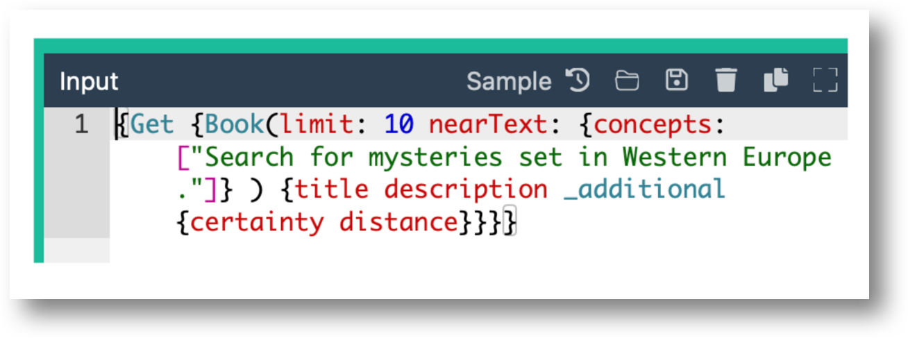
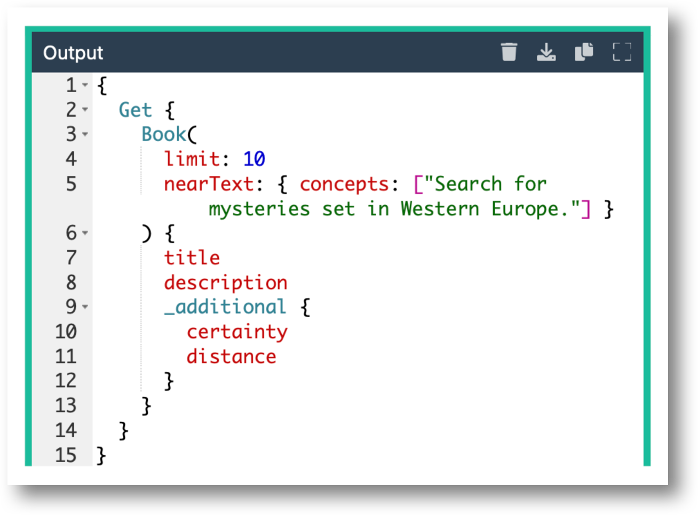

## Remove Line Breaks

Prepares a query to be run by removing line breaks.

https://www.textfixer.com/tools/remove-line-breaks.php

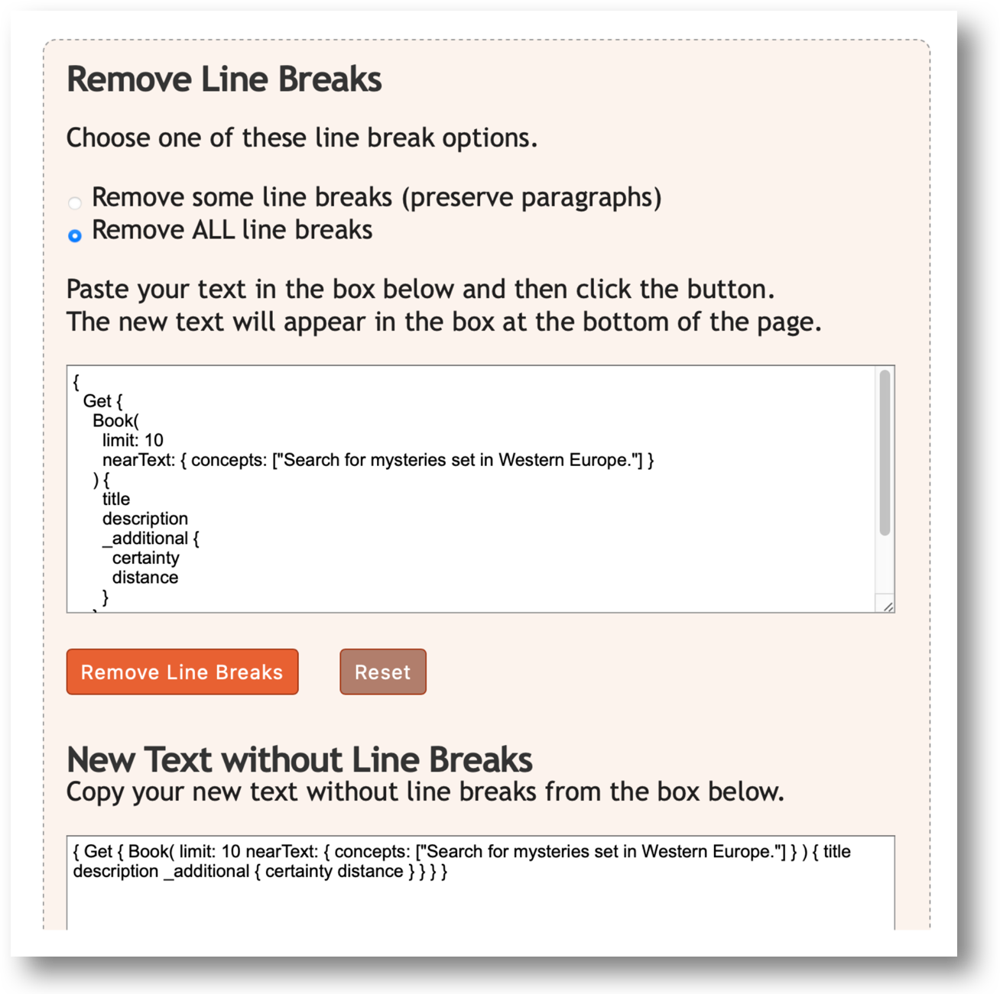

## Postman Examples

Use the included Postman Workspace to run common Weaviate GraphQL queries against a live database.

Only the OpenAi needs to be entered, if using the database in the example.

If you are using you own cluster, both Weaviate parameters need to be entered, also.

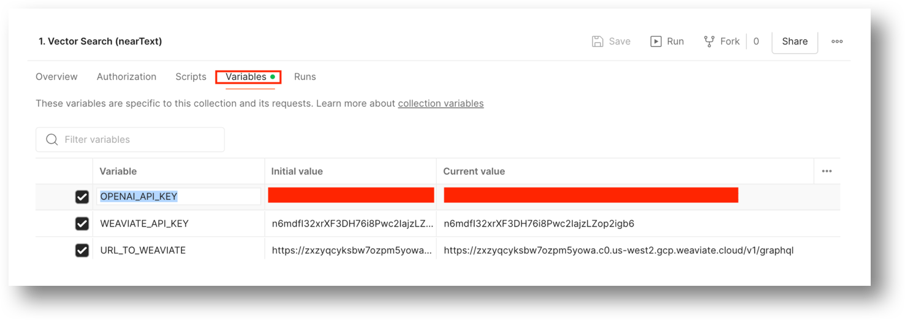

## Weaviate Parameters

From the [Weaviate Cloud Console dashboard](https://console.weaviate.cloud) find the associated parameters for the cluster.

**WEAVIATE_API_KEY**

The cluster API Key.

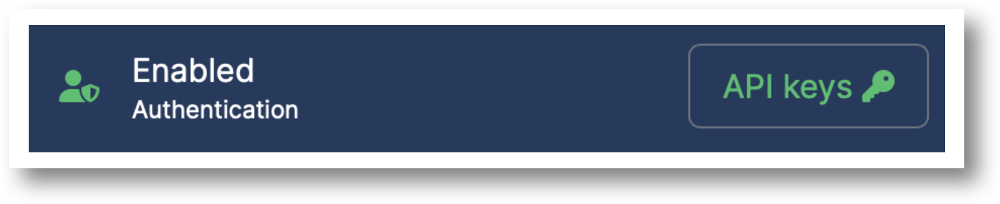
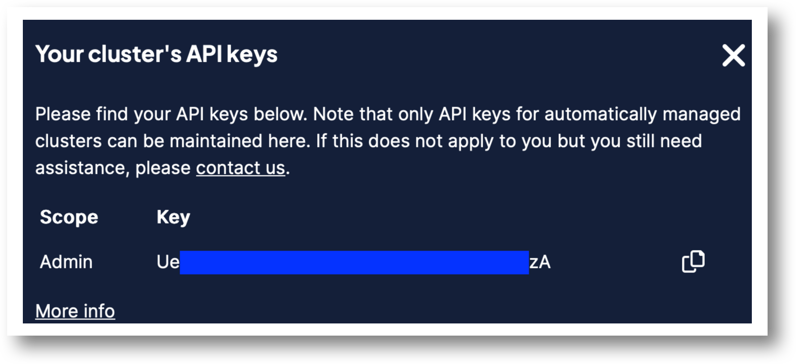

**URL_TO_WEAVIATE**

The Cluster REST endpoint, plus `v1/graphql` added to the endpoint.

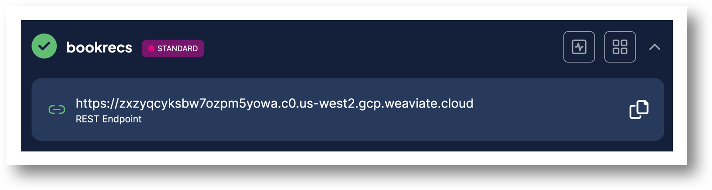

## Enter your Open AI Key

This key is needed to access Open AI to make sense of your prompt.

Here is how you can set one up.

https://www.howtogeek.com/885918/how-to-get-an-openai-api-key/

Enter the key value in the variable section of Postman for your collection.

## Queries

A list of queries are listed to the right.

Each is fully documented and can be run as is after entering your OpenAI Key.

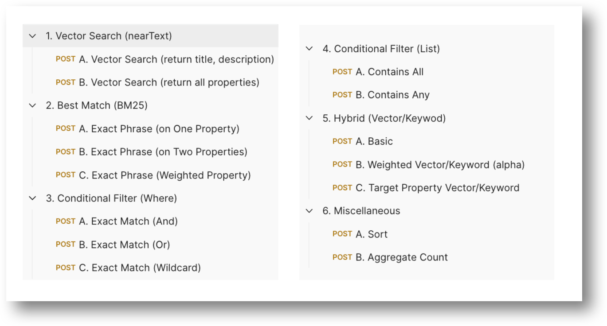

## Query Documentation

Each query includes an explanation of what the high level (numbered 1-5) search feature does as well as a formatted example of the query to read.

A link to the corresponding Weaviate API documentation from which this information is mostly borrowed from is included.

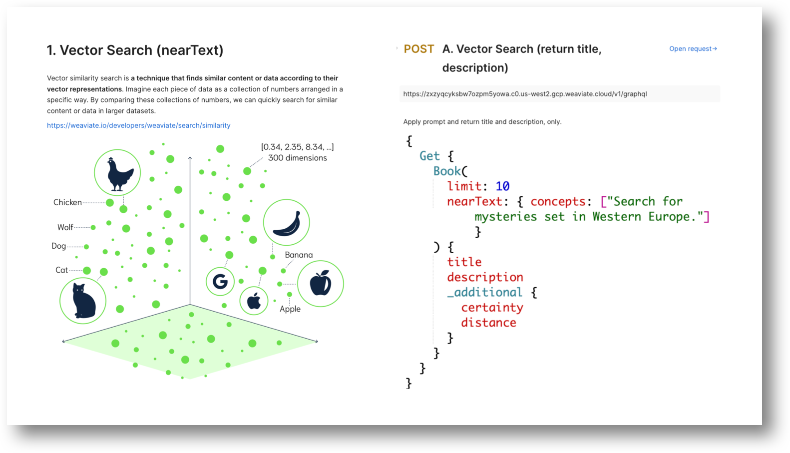

## Postman Query

Each query runs as is.

Don’t forget to enter your OpenAI Key for your collection beforehand!

They also work great as templates should you want to create a query for you own project, too.

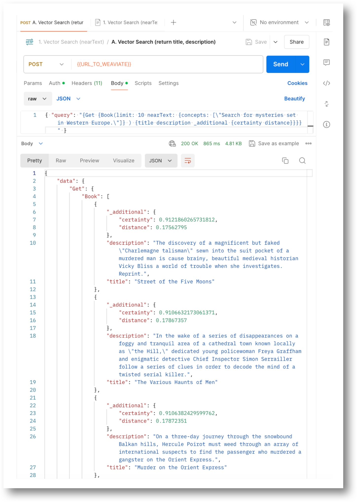

import StayConnected from '/_includes/stay-connected.mdx'

<StayConnected />
