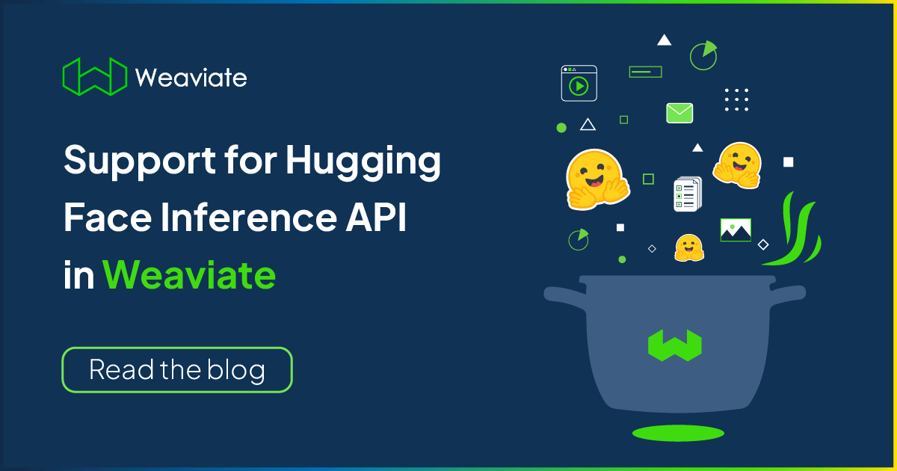
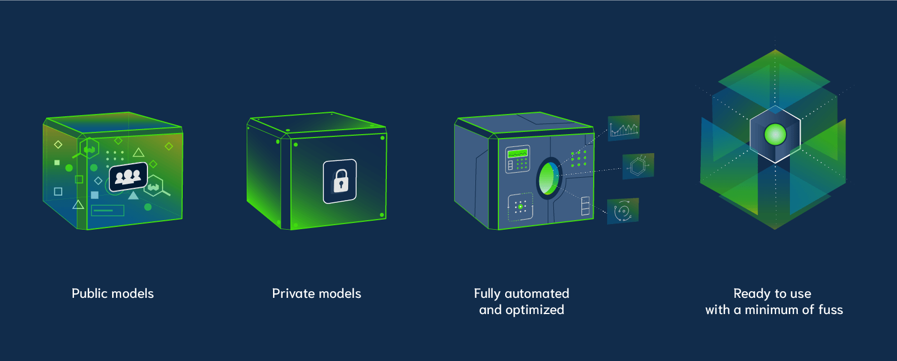
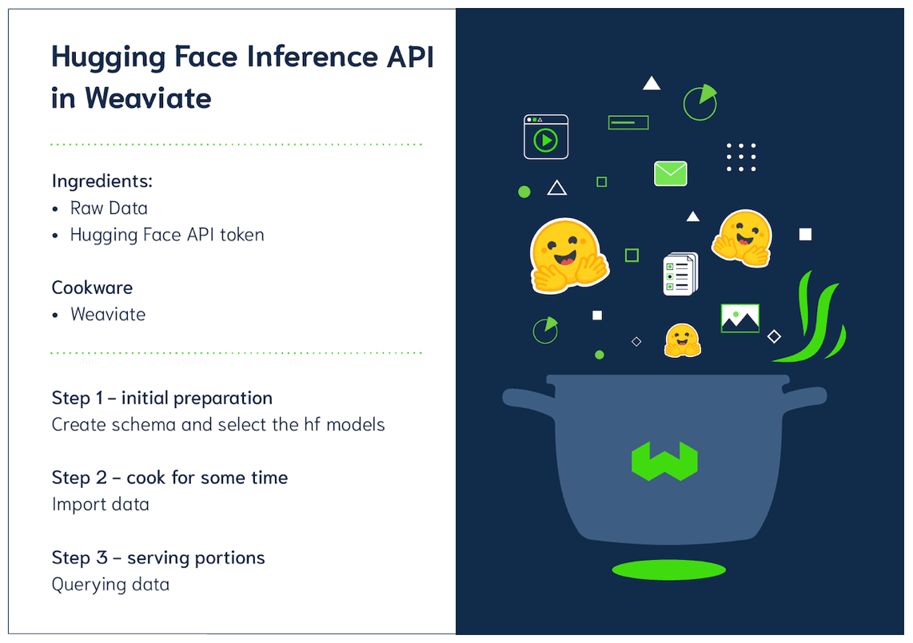

:::caution Outdated content
Published 2022-09-27. Code samples use the pre-v4 Python client. For the current Hugging Face integration setup, see the [model providers reference](https://docs.weaviate.io/weaviate/model-providers).
:::

<!-- truncate -->

Vector databases use Machine Learning models to offer incredible functionality to operate on your data. We are looking at anything from **summarizers** (that can summarize any text into a short) sentence), through **auto-labelers** (that can classify your data tokens), to **transformers** and **vectorizers** (that can convert any data – text, image, audio, etc. – into vectors and use that for context-based queries) and many more use cases.

All of these use cases require `Machine Learning model inference` – a process of running data through an ML model and calculating an output (e.g. take a paragraph, and summarize into to a short sentence) – which is a compute-heavy process.

### The elephant in the room
Running model inference in production is hard.
* It requires expensive specialized hardware.
* You need a lot more computing power during the initial data import.
* Hardware tends to be underutilized once the bulk of the heavy work is done.
* Sharing and prioritizing resources with other teams is hard.

The good news is, there are companies – like Hugging Face, OpenAI, and Cohere – that offer running model inference as a service.

> "Running model inference in production is hard,
let them do it for you."

## Support for Hugging Face Inference API in Weaviate
Starting from Weaviate `v1.15`, Weaviate includes a Hugging Face module, which provides support for Hugging Face Inference straight from the vector database.

The Hugging Face module, allows you to use the [Hugging Face Inference service](https://huggingface.co/inference-api#pricing) with sentence similarity models, to vectorize and query your data, straight from Weaviate. No need to run the Inference API yourself.

> You can choose between `text2vec-huggingface` (Hugging Face) and `text2vec-openai` (OpenAI) modules to delegate your model inference tasks.<br/>
> Both modules are enabled by default in the [Weaviate Cloud](/pricing).

## Overview


The Hugging Face module is quite incredible, for many reasons.

### Public models
You get access to over 1600 pre-trained [sentence similarity models](https://huggingface.co/models?pipeline_tag=sentence-similarity). No need to train your own models, if there is already one that works well for your use case.

In case you struggle with picking the right model, see our blog post on [choosing a sentence transformer from Hugging Face](/blog/how-to-choose-a-sentence-transformer-from-hugging-face).

### Private models
If you have your own models, trained specially for your data, then you can upload them to Hugging Face (as private modules), and use them in Weaviate.

*If you have private models on Hugging Face, you can configure Weaviate to use them — see the [Hugging Face provider docs](https://docs.weaviate.io/weaviate/model-providers/huggingface/embeddings) for the latest authentication and configuration options.*

### Fully automated and optimized
Weaviate manages the whole process for you. From the perspective of writing your code – once you have your schema configuration – you can almost forget that Hugging Face is involved at all.

For example, when you import data into Weaviate, Weaviate will automatically extract the relevant text fields, send them Hugging Face to vectorize, and store the data with the new vectors in the database.

### Ready to use with a minimum of fuss
Every new Weaviate instance created with the [Weaviate Cloud](/pricing) has the Hugging Face module enabled out of the box. You don't need to update any configs or anything, it is there ready and waiting.

On the other hand, to use the Hugging Face module in Weaviate open source (`v1.15` or newer), you only need to set `text2vec-huggingface` as the default vectorizer. Like this:

```yaml
DEFAULT_VECTORIZER_MODULE: text2vec-huggingface
ENABLE_MODULES: text2vec-huggingface
```

## How to get started

:::note
This article is not meant as a hands-on tutorial.
For more detailed instructions please check the [documentation](https://docs.weaviate.io/weaviate/model-providers/huggingface/embeddings).
:::

The overall process to use a Hugging Face module with Weaviate is fairly straightforward.


If this was a cooking class and you were following a recipe.

You would need the following ingredients:
* Raw Data
* Hugging Face API token – which you can request from [their website](https://huggingface.co/settings/tokens)
* A working Weaviate instance with the `text2vec-huggingface` enabled

Then you would follow these steps.

### Step 1 – initial preparation – create schema and select the hf models
Once you have a Weaviate instance up and running.
Define your schema (standard stuff – pick a class name, select properties, and data types). As a part of the schema definition, you also need to provide, which Hugging Face model you want to use for each schema class.


This is done by adding a `moduleConfig` property with the `model` name, to the schema definition, like this:
```javascript
{
    "class": "Notes",
    "moduleConfig": {
        "text2vec-huggingface": {
            "model": "sentence-transformers/all-MiniLM-L6-v2",  # model name
            ...
        }
    },
    "vectorizer": "text2vec-huggingface",  # vectorizer for hugging face
   ...
}
```

*If you are wondering, yes, you can use a different model for each class.*

### Step 2 – cook for some time – import data
Start importing data into Weaviate.

For this, you need your Hugging Face API token, which is used to authorize all calls with 🤗.

Add your token, to a Weaviate client configuration. For example in Python, you do it like this:

```javascript
client = weaviate.Client(
    url='http://localhost:8080',
    additional_headers={
        'X-HuggingFace-Api-Key': 'YOUR-HUGGINGFACE-API-KEY'
    }
)
```
Then import the data the same way as always. And Weaviate will handle all the communication with Hugging Face.

### Step 3 – serving portions – querying data
Once, you imported some or all of the data, you can start running queries.
(yes, you can start querying your database even during the import).

Running queries also requires the same token.
But you can reuse the same client, so you are good to go.

Then, you just run the queries, as per usual:
```javascript
nearText = {
    "concepts": ["How to use Hugging Face modules with Weaviate?"],
    "distance": 0.6,
}

result = (
    client.query
    .get("Notes", [
        "name",
        "comment",
        "_additional {certainty distance} "])
    .with_near_text(nearText)
    .do()
)
```

## Summary
> Now you can use [Hugging Face](https://docs.weaviate.io/weaviate/model-providers/huggingface/embeddings) or [OpenAI](https://docs.weaviate.io/weaviate/model-providers/openai/embeddings) modules in Weaviate to delegate model inference out.

Just pick the model, provide your API key and start working with your data.

Weaviate optimizes the communication process with the Inference API for you, so that you can focus on the challenges and requirements of your applications. No need to run the Inference API yourself.

## What next
Check out the [text2vec-huggingface](https://docs.weaviate.io/weaviate/model-providers/huggingface/embeddings) documentation to learn more about the new module.

import WhatsNext from '/_includes/what-next.mdx';

<WhatsNext />
