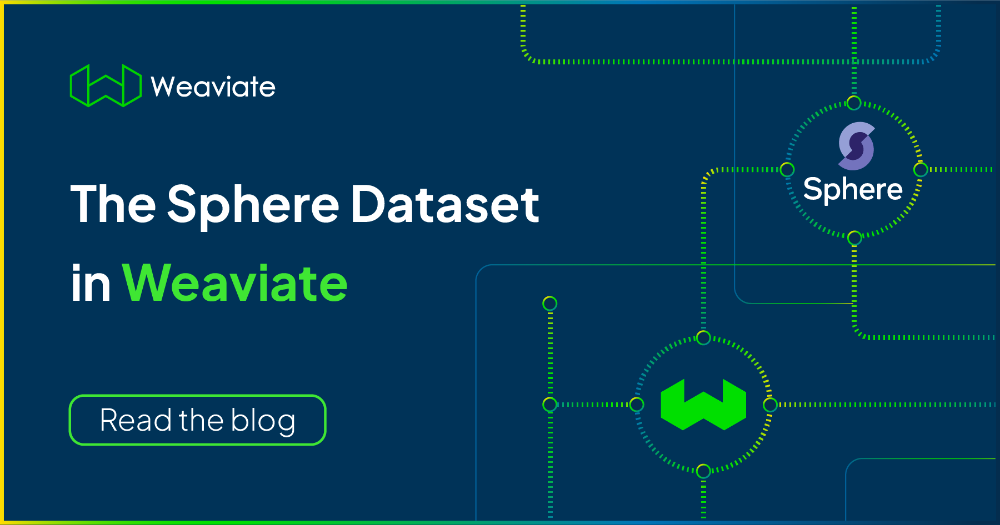
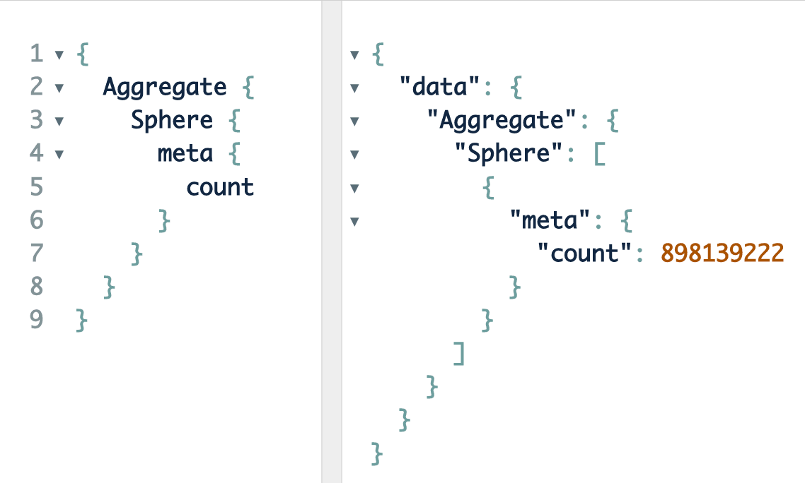

<!-- truncate -->

import FilteredTextBlock from '@site/src/components/Documentation/FilteredTextBlock';
import PyCode from '!!raw-loader!/_includes/code/blog.sphere.endtoend.py';

## What is Sphere?
[Sphere](https://github.com/facebookresearch/sphere) is an open-source dataset recently [released](https://ai.facebook.com/blog/introducing-sphere-meta-ais-web-scale-corpus-for-better-knowledge-intensive-nlp/) by Meta. It is a collection of 134 million documents (broken up into 906 million 100-word snippets). It is one of the largest knowledge bases that can help solve knowledge-intensive natural language tasks such as question-answering, fact-checking, and much more.

Simply stated, Sphere aims to act as a "universal, uncurated and unstructured source of knowledge." This means that the next time you have a question like: "Was McDonald's, the food chain, founded by the same Ol' McDonald who had a farm?" Sphere will have the relevant knowledge to answer your question and point you toward a relevant article. The potential for this large of a dataset is awe-inspiring and the applications one can dream up are limitless - from combating fake news on social media platforms to helping locate your next dream vacation spot.

Additionally, Sphere is ideal for [hybrid vector search](/blog/hybrid-search-explained) at scale since it is one of the few large scale datasets where [vector embeddings](/blog/vector-embeddings-explained) are provided in addition to their corresponding text fields. You can learn more about the model that is used to generate these vectors [here](https://huggingface.co/facebook/dpr-question_encoder-single-nq-base). For all of these reasons we wanted to make this resource as accessible to the community as possible.

## The Challenges of using Sphere

The only limitation of this dataset is how difficult it is to access and use for the average developer. In this regard the enormity of the dataset ends up as a double-edged sword. It is challenging to use Sphere in its current open-source format for anyone other than large industry and academic labs - even for them the UX leaves a lot to be desired.

*Don't believe me?*

Try following the [readme](https://github.com/facebookresearch/sphere) to get Sphere set up and usable on your machine. The first limitation you'll run into is that the smallest open-sourced sparse Sphere indexes file is a whopping 833 Gigabytes in its compressed format. Once you get past that hurdle,  to start using the Sphere dataset for its intended purpose of hybrid search testing and benchmarking, it requires another herculean effort.

## The Sphere Dataset in a Weaviate vector database
In an effort to make this powerful resource accessible to everyone, we are happy to announce that Sphere is now **available** not only in **Weaviate** but also as **JSON** or **Parquet files**. The dataset can be easily imported with Python and Spark! You can import **large vectorized chunks** of Sphere (or the whole thing if you want!) and start searching through it  in just a few lines of code!

The power of the sun in the palm of your hand! *ensues evil maniacal laughter*

import sphereVideo from './img/joke2.mp4';

<video width="100%" autoplay loop controls>
  <source src={sphereVideo} type="video/mp4" />
Your browser does not support the video tag.
</video>


Get it? ... It's a Sphere 🥁ba dum tsss🥁 I'll show myself out…


There are two ways to import the Sphere dataset into a Weaviate [vector database](/blog/what-is-a-vector-database) instance. You can use the Python client (less than 75 lines of code) or the Weaviate Spark connector.

### Importing the Sphere dataset with Python
The setup is quite straightforward, all you need is the [Weaviate Client](https://docs.weaviate.io/weaviate/client-libraries). We provide an example that uses the Python Client and the `dpr-question_encoder-single-nq-base` model (i.e., the module that is used to vectorize objects in Sphere).

We have prepared files ranging from 100K data points all the way up to the entire Sphere dataset, which consists of 899 million lines. You can download them from here:

_NOTE: because of the high volume of downloads, please request access via hello@weaviate.io_

* [100k lines](https://storage.googleapis.com/sphere-demo/sphere.100k.jsonl.tar.gz)
* [1M lines](https://storage.googleapis.com/sphere-demo/sphere.1M.jsonl.tar.gz)
* [10M lines](https://storage.googleapis.com/sphere-demo/sphere.10M.jsonl.tar.gz)
* [100M lines](https://storage.googleapis.com/sphere-demo/sphere.100M.jsonl.tar.gz)
* [899M lines](https://storage.googleapis.com/sphere-demo/sphere.899M.jsonl.tar.gz)

Once you have the dataset file downloaded and unpacked, the next step is to import the dataset into Weaviate with Python:

<FilteredTextBlock
  text={PyCode}
  startMarker="# START SphereEndToEnd"
  endMarker="# END SphereEndToEnd"
  language="py"
/>

*Make sure to update the SPHERE_DATASET property to correctly match your `.jsonl` filename.*

### Importing the Sphere dataset with Spark
If you want to start training large language models (LLMs) for knowledge-intensive tasks on Sphere, then you might want to leverage big data frameworks. This is where Apache Spark enters the picture!

To process Sphere with Spark, you can use [PySpark](https://spark.apache.org/docs/latest/api/python/) and [Weaviate's Python Client](https://docs.weaviate.io/weaviate/client-libraries/python). The setup is slightly more difficult than simply importing the dataset with python; however, once you do have it setup, it is lightning fast! ⚡

You can see the step-by-step instructions detailed in this [tutorial](https://docs.weaviate.io/weaviate/tutorials/spark-connector). The tutorial demonstrates how to get Sphere into a Spark dataframe, import it into Weaviate, and conduct queries. Once you have Sphere imported into your Spark instance you can leverage Spark functionality to start training powerful models. In this particular example we are using the [Weaviate Spark connector](https://github.com/weaviate/weaviate-spark-connector) making it easy to load data from Spark to Weaviate.

We have also prepared two Parquet files one with 1M data points and another with the entire Sphere dataset, which consists of 899 million lines. You can download them into a dataframe as follows:

_NOTE: because of the high volume of downloads, please request access via hello@weaviate.io_

```python
df = spark.read.parquet("gs://sphere-demo/parquet/sphere.1M.parquet")
df = spark.read.parquet("gs://sphere-demo/parquet/sphere.899M.parquet")
```

## Searching through Sphere with Weaviate
Now that the instructions are out of the way let's have some fun and show you the combined power of Sphere on Weaviate! We imported the entire Sphere dataset into Weaviate - yes, all ~899 million objects, see below for proof!



Once the Sphere dataset is in your Weaviate vector database instance we can use it in conjunction with all of the functionality that comes with Weaviate.

Since the primary usage of Sphere is around conducting large scale hybrid search below you can see an example of where we leverage [vector search](/blog/vector-search-explained) to find out what Sphere says is the best food to eat in Italy while simultaneously using conventional word matching to ensure the returned objects are from a credible source, the New York Times in this case.


And that's all folks! Now with the Sphere dataset readily available and easy to import into Weaviate anyone can start to build with this powerful tool in conjunction with the loads of awesome features that we already offer in Weaviate. Happy coding!

For more details behind the Sphere dataset in Weaviate, check out our [continued blog post](/blog/details-behind-the-sphere-dataset-in-weaviate)!

import WhatsNext from '/_includes/what-next.mdx';

<WhatsNext />
