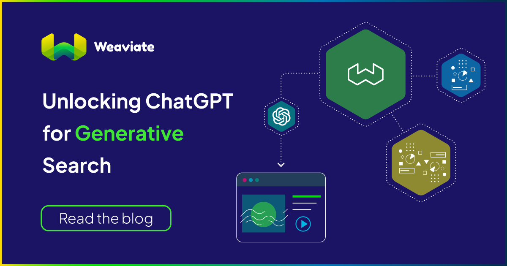
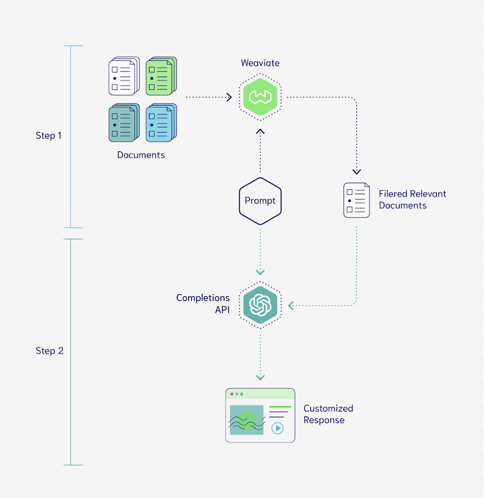

<!-- truncate -->

When OpenAI launched ChatGPT at the end of 2022, more than one million people had tried the model in just a week and that trend has only continued with monthly active users for the chatbot service reaching over 100 Million, quicker than any service before, as reported by [Reuters](https://www.reuters.com/technology/chatgpt-sets-record-fastest-growing-user-base-analyst-note-2023-02-01/) and [Yahoo Finance](https://finance.yahoo.com/news/chatgpt-on-track-to-surpass-100-million-users-faster-than-tiktok-or-instagram-ubs-214423357.html?guccounter=1&guce_referrer=aHR0cHM6Ly93d3cuZ29vZ2xlLmNvbS8&guce_referrer_sig=AQAAAFCTz2vosCcjWFstJGkvduTSNZJrxULx8EHwbTE8mF7EV-hAlWvmMe59ex94LHlkB40zlUMUPshv5Ggq1GxyY9oDQxtoLcc0GV2E-v-0DeGuZi7dtEJT9MZF5NvUe20V64ZCVNziFtJdWUL_AAxMFoCGFxT1duBiaPbfzwkjbyNQ). It wouldn’t be hyperbole to say that NLP and Generative Large Language Models (LLMs) have taken the world by storm.

Though this was not the first AI chatbot that has been released to the public, what really surprised people about this particular service was the breadth and depth of knowledge it had and its ability to articulate that knowledge with human-like responses. Aside from this, the generative aspect of this model is also quite apparent as it can hallucinate situations and dream up vivid details to fill in descriptions when prompted to do so. This gives the chatbot service somewhat of a human-like “creativity” - which is what adds a wow factor to the user experience!

Generative LLMs like ChatGPT's GPT-3 (Chat Generative Pre-trained Transformer) are trained on a huge corpora of open data from the internet - since the majority of general human knowledge is archived and accessible via the Internet, these models have a lot of training material to learn from. This enables them to have a wide breadth of general knowledge about the world and natural language.

## Providing custom context to LLMs

However, for all the well-founded hype and fascination, LLMs do have one shortcoming: once trained, you can only use ChatGPT on the data that it was trained on. When you ask it what today's news is, ChatGPT can't answer that question factually since it hasn’t seen this data during its training process. It might be able to hallucinate an answer using its generative capabilities, however, the answer won’t be grounded in facts.

This point might seem obvious since it doesn’t know what it doesn’t know, however the shortcoming becomes more relevant when you consider this: if you ask ChatGPT for specific information, perhaps company policies that are private and not publicly available on the internet, it cannot produce a factually correct answer either. This is a limitation of the training process and more specifically the data that was unavailable while training. Currently, ChatGPT cannot accurately perform tasks outside the context of information which its training set has provided.

In order to benefit from the capabilities of LLMs like ChatGPT's GPT-3 in real-life use cases, it would be ideal if we could apply its generative power to new or custom data. For example, this would enable a private customized version of ChatGPT that's been trained on your company's internal documents and could act as a human resources chatbot. Wondering what the onboarding process for new employees looks like or how you can sign up for health benefits? You can simply ask your customized ChatGPT! The applications of a customized ChatGPT are limitless and quite exciting! The million-dollar question, then, is how do we achieve such a milestone?

## Generative Search - OpenAI Module for Weaviate
Today we are announcing the release of the `generative-openai` module for Weaviate! This module enables you to leverage the power of ChatGPT's GPT-3 model on your own customized datasets and for specific use cases previously not possible!💥

The `generative-openai` module makes a "custom version of ChatGPT" possible by combining it with Weaviate! By integrating a general purpose LLM with a [vector database](https://weaviate.io/blog/what-is-a-vector-database) like Weaviate, you can utilize the model's power to carry out tasks in the context of your own data housed in Weaviate!

## How the module works
The `generative-openai` module can be used to get GPT-3 to accomplish tasks grounded in the context of knowledge provided by Weaviate search results. The process consists of two steps: first, we use Weaviate to extract context by filtering a subset of your data that has knowledge relevant to a specific prompt. Secondly, we send the prompt as well as the filtered subset of documents from step one directly to the [OpenAI Completion endpoint](https://platform.openai.com/docs/guides/completion) to accomplish the task specified in the prompt.



We’ll provide a guide on how you can set up the module, examples of how you can use the module, as well as show you the nuances of how to prompt GPT-3 to utilize the search results from Weaviate. So without further ado, let's get into it!

## How to use it
The [Generative OpenAI](/developers/weaviate/modules/reader-generator-modules/generative-openai) module is a new feature that can generate responses based on your data. To access this module, you will need to use Weaviate `1.17.3` or a newer version.

### Weaviate Cloud
The `Generative OpenAI` module is enabled by default in the Weaviate Cloud (WCD). If your instance version is on `1.17.3` or newer, then you are good to go.

:::tip Free 14-day sandbox
You can create a free 14-day sandbox on [WCD](https://console.weaviate.cloud) and create a Weaviate instance.
:::

:::note Available modules out of the box
The following modules are enabled by default:
* [text2vec-openai](/developers/weaviate/modules/retriever-vectorizer-modules/text2vec-openai)
* [text2vec-cohere](/developers/weaviate/modules/retriever-vectorizer-modules/text2vec-cohere)
* [text2vec-huggingface](/developers/weaviate/modules/retriever-vectorizer-modules/text2vec-huggingface)
* [generative-openai](/developers/weaviate/modules/reader-generator-modules/generative-openai)
:::

### Local deployment with Docker
To enable the Generative OpenAI module with your local deployment of Weaviate, you need to configure your `Docker Compose` file to enable the `generative-openai` module, alongside any other module you may need.

For example, you can enable `text2vec-openai` (to vectorize your data and run queries) and `generative-openai`, like this:

```
ENABLE_MODULES: 'text2vec-openai,generative-openai'
```

#### Docker Compose
Here is a full example of a `Docker Compose` file - with the `text2vec-openai` and `generative-openai` modules:

```yaml
---
version: '3.4'
services:
  weaviate:
    command:
      - --host
      - 0.0.0.0
      - --port
      - '8080'
      - --scheme
      - http
    image:
      cr.weaviate.io/semitechnologies/weaviate:1.17.3
    ports:
      - 8080:8080
    restart: on-failure:0
    environment:
      QUERY_DEFAULTS_LIMIT: 25
      AUTHENTICATION_ANONYMOUS_ACCESS_ENABLED: 'true'
      PERSISTENCE_DATA_PATH: '/var/lib/weaviate'
      DEFAULT_VECTORIZER_MODULE: 'text2vec-openai'
      ENABLE_MODULES: 'text2vec-openai,generative-openai'
      OPENAI_APIKEY: sk-foobar # this parameter is optional, as you can also provide it at insert/query time
      CLUSTER_HOSTNAME: 'node1'
```
Before running the Docker Compose file, you will need to request an [OpenAI API-key](https://openai.com/api/). You can either input your key in the Docker Compose file in the `OPENAI_APIKEY` parameter, or provide it at insert/query time.

:::note
Notice in `ENABLE_MODULES`, we are enabling two modules. In the above example we are using the `text2vec-openai` vectorization module; however, you can use another module of choice (Cohere or Hugging Face). Check out the [documentation](/developers/weaviate/modules/reader-generator-modules/generative-openai#introduction) to learn more about this.
:::

### Schema configuration
Configuring the generative module per class in the schema is not required. It is already hard-coded into Weaviate.

:::note Available Model
The generative module is using the `text-davinci-003` model.
:::

Here is a schema example using the text2vec-openai vectorizer:
```json
{
  "classes": [
    {
      "class": "Document",
      "description": "A class called document",
      "vectorizer": "text2vec-openai",
      "properties": [
        {
            "name": "content",
            "description": "content that will be vectorized",
            "dataType": ["text"]
        }
      ]
    }
  ]
}
```

### Query example
The module adds a `generate { }` parameter to the `_additional { }` property under the `Get` function.

The `generate { }` parameter has the following arguments:

| Field | Data Type | Description |
| --- | --- | --- |
| `singleResult {prompt}` | string | The generative model makes a generation for each individual search result. |
| `groupedResult {task}` | string | The generative model receives all search results as input. |

Here is an example of a GraphQL query using the `singleResult{ prompt }`. From the `PodClip` class, we want the generative model to answer the question "What is Ref2Vec?" based on the content.

```graphql
{
	Get {
    PodClip (
      hybrid: {
        query: "What is Ref2Vec?"
        alpha: 0.5
      },
      limit: 1
    ){
      content
      _additional {
        generate(
          singleResult: {
            prompt: """
            Question: What is Ref2Vec?
            Please answer the question based on: {content}
            """
      		}
      	){
      		singleResult
      	}
      }
    }
	}
}
```
The response looks like this:

```GraphQL
{
  "data": {
    "Get": {
      "PodClip": [
        {
          "_additional": {
            "generate": {
              "singleResult": "Answer: Ref2Vec is a machine learning algorithm that uses natural language processing to generate vector representations of text references. It is used to create a vector representation of a text reference, which can then be used to compare and analyze the similarity between different references. Ref2Vec can be used to identify similar references, classify references, and generate recommendations."
            }
          },
          "content": "Yeah, certainly. So Ref2Vec Centroid is a new module that we released recently. And the idea of it is that an object which is set to be vectorized, so to speak, by Ref2Vec Centroid, a vector isn't produced by this object itself, but it's produced by like the aggregate of its referenced vectors. So the Ref2Vec module will take an object and then grab the vectors from all of its references, all of its referenced objects. And then we'll compute a centroid with that set of vectors to find something that's similar to all of these things at once. And so the idea is that this is really useful when you want to represent something as an aggregation of other things, right? For example, users based on their likes, right? What can we show to a user that is something that aligns with what their express interests are in Ref2Vec Centroid is something that's perfect for doing something like that. "
        }
      ]
    }
  }
}
```

## Generation prompts
A `prompt` is a common term used to describe the instructions given to the LLM. Crafting the ideal prompt is typically more of an art than a science. It is also typically an iterative process where we begin with a draft of what we want the LLM to do and then tweak the prompt based on what we get back. Prompt tuning is hardly a straightforward task and the term “prompt engineering” has emerged to encapsulate the complexity of this process. To help you get started with prompt engineering Weaviate-augmented LLMs, here are 4 examples of prompt refinement:

* knowledge grounding,
* uncertainty probing,
* citing sources,
* and step-by-step thinking.

### Knowledge grounding
We can specifically prompt LLMs to ground it knowledge source on search results, this way we make sure the generated response is based on our data. For example, we can add `based on the following search results` to a task description. So in total a question answering prompt would become:

```
Please answer this question: {question} based on the following search results: {search_results}.
```

### Uncertainty probing
Prompting LLMs to get the behavior we want is a very exciting emerging area of AI technology. Another prompt that is very important for our use case is for the LLM to explicitly tell us when it doesn’t have enough information. This is also done by adding something like `If you do not have enough information, please output “not enough information”` to the prompt.

### Citing sources
Another useful prompt example is to ask the LLM to cite its sources. For example, when using the `groupedResult` argument in `generate`, the LLM will receive a few search results to base its answer on. We may ask the LLM to either summarize the relevance of each result to the query, or just outright tell us which result was the most influential to the final answer.

### Step-by-step thinking
A few other examples include simply adding `Let’s think step-by-step`, or decomposing the task such as `First generate an action plan and then execute the action plan`.

Prompting is an extremely new area of LLMs and search. As a general prescription, it is recommended to be as descriptive as possible with what you want the LLM to do, as well as to have an iterative mindset of tuning the prompt.


import WhatNext from '/_includes/what-next.mdx'

<WhatNext />
