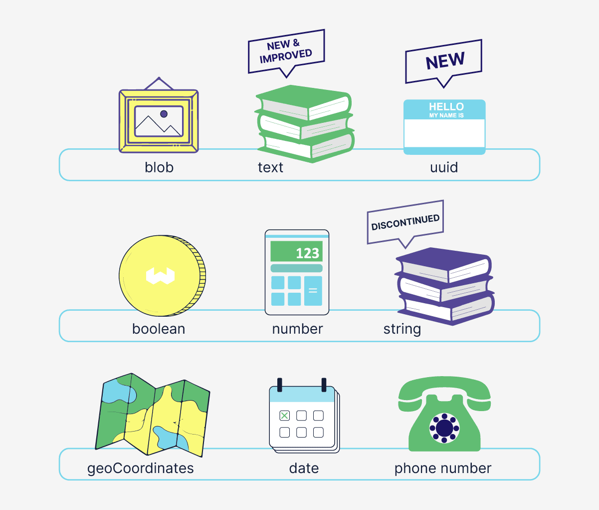
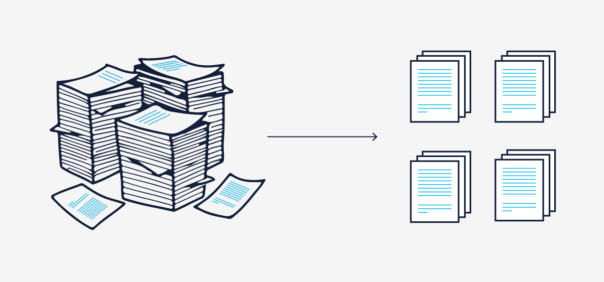
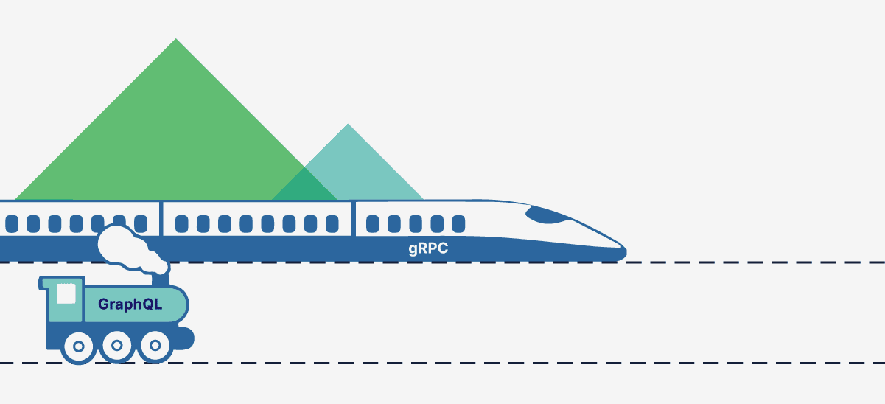

<!-- truncate -->
We are happy to announce the release of Weaviate `1.19`, which brings a set of great features, performance improvements, and fixes.

If you like your content brief and to the point, here is the TL;DR of this release:

1. [New (or improved) Data Types](#new-or-improved-data-types) –
1. [Group by arbitrary property](#group-by-arbitrary-property) –
1. [Generative Cohere Module](#generative-cohere-module) –
1. [Tunable Consistency for Vector Search and GraphQL Get Requests](#tunable-consistency-for-vector-search-and-graphql-get-requests) –
1. [gRPC API support(experimental)](#grpc-api-support-experimental) –
1. [Other Improvements and Bug Fixes](#other-improvements-and-bug-fixes) – fixes and improvements delivered since `1.18`.

Read below to learn more about each of these points in more detail.

## New (or improved) Data Types

## Data type improvements
We've made several enhancements to the way we handle data, including upgrades to the `text` property and the introduction of dedicated `uuid` data types.

### Text / String changes
We have upgraded the `text` property to offer more flexibility in tokenizing textual data for indexing. You can now choose from `word`, `whitespace`, `lowercase`, and `field` tokenization options. To simplify matters, we have deprecated the `string` data type.

The available tokenization options for `text` are:

-   `word` (default): Keep alpha-numeric characters, lowercase them, and split by whitespace. _(Same as the current `text` behavior.)_
-   `whitespace`: Split the text on whitespace. _(Same as `word` on `string` right now.)_
-   `lowercase`: Lowercase the text and split on whitespace. _(New)_
-   `field`: Index the whole field after trimming whitespace characters. _(Same as the current `string` behavior.)_

#### Faster filtering & index changes

We have introduced a roaring bitmap index for `text` properties, which brings the fast filtering capabilities introduced in version `1.18` to text data. Internally, this is implemented using two separate (`filterable` & `searchable`) indexes, which replaces the existing index. You can configure the new `indexFilterable` and `indexSearchable` parameters to determine whether to create the roaring set index and the BM25-suitable Map index, respectively. (Both are enabled by default.)

:::note What happens if indexFilterable is disabled?
The searchable index works also as fallback for text filtering, so filtering is still possible even if indexFilterable will be disabled. The downside, in this scenario is that the performance benefits of using natively roaring set will not be available (so, the exclusive searchable index will work exactly as it works on pre v1.19, and used for both bm25 search and filtering).
:::

  
How will upgrades work?

After upgrading a pre-`v1.19` Weaviate to `v1.19`, `indexFilterable` + `indexSearchable` will be set based on the value of `indexInverted`, meaning `true` -> `true`+`true`, `false` -> `false`+`false`, `null` -> `null`+`null`. (A `null` will use the default, which is to turn it on.)
`indexFilterable` and `indexSearchable` are available for all types of data, although searchable is only relevant for `text`/`text[]`, and in other cases it will be simply ignored.

Since filterable & searchable are separate indexes, filterable does not exist in Weaviate instances upgraded from pre-`v1.19` to `v1.19`. The missing `filterable` index can be created though on startup for all `text/text[]` properties if env variable INDEX_MISSING_TEXT_FILTERABLE_AT_STARTUP is set (to `true`).

While building the `filterable` index, Weaviate will work in readonly mode (similarly to reindexing sets to roaring sets on pre-`v1.18` to `v1.18` migration).

#### Deprecation of `string`

Existing `string` classes can be migrated according to the tokenization rules above during the first startup. If a user specifies `string` for a new class, it will be stored as `text` with `field` tokenization, and a deprecation warning will be shown.

### Dedicated UUID Data Types

We have introduced dedicated `uuid` and `uuid[]` data types, reducing the storage space required by more than half.

`uuid` details:

-   Each `uuid` is a 128-bit (16-byte) number.
-   The filterable index uses roaring bitmaps.
-   Please note that it is currently not possible to aggregate or sort by `uuid` or `uuid[]` types.

## Group by arbitrary property

TODO: WAITING FOR FINAL

## Generative Cohere Module

## Tunable Consistency for Vector Search and GraphQL Get Requests

## gRPC API support (experimental)

## Other Improvements and Bug Fixes

Since Weaviate `1.18`, we have released four patches that include various changes and bug fixes.

### Node Allocation
We’ve introduced a new feature in Weaviate that offers a more efficient approach to node allocation. Rather than randomly selecting a node, Weaviate will now try to select the node with the most available resources. This only applies when creating a new class, rather than when adding more data to an existing single class. The current implementation only considers the disk space. In the future, we can add more data points like memory consumption and others.

This improvement was part of the `1.18.1` release.

### Improved Multi-Class Support
Previously, Weaviate would struggle when adding many “1,000s of” classes. We identified and fixed various issues to fix this. Issues related to many-class can generally be grouped into three distinct areas of concern: 1. Higher than expected memory usage, 2. Cycle spam, 3. Lagging schema deletes. The overview of each section can be found [here](https://github.com/weaviate/weaviate/issues/2785).

### Fixes for BM25
As an ongoing effort to improve BM25, we realized there was an error when calculating the average length of a property. Two issues were found: 1. The component would encounter errors if too many properties were present, 2. It could produce incorrect mean values if properties had a zero-length. To fix this, the property length tracker has been completely replaced. This is a non-breaking change and will seamlessly migrate at startup. This will result in a more accurate BM25 search.

This was part of the [`1.18.1` patch](https://github.com/weaviate/weaviate/releases/tag/v1.18.1) release.

### Release Notes for all Patches
The above features highlighted a few changes that were included in the patch releases. For more details on each release, you can check out the release notes:
* [Release v1.18.1](https://github.com/weaviate/weaviate/releases/tag/v1.18.1)
* [Release v1.18.2](https://github.com/weaviate/weaviate/releases/tag/v1.18.2)
* [Release v1.18.3](https://github.com/weaviate/weaviate/releases/tag/v1.18.2)
* [Release v1.18.4](https://github.com/weaviate/weaviate/releases/tag/v1.18.4)

import WhatNext from '/_includes/what-next.mdx'

<WhatNext />
