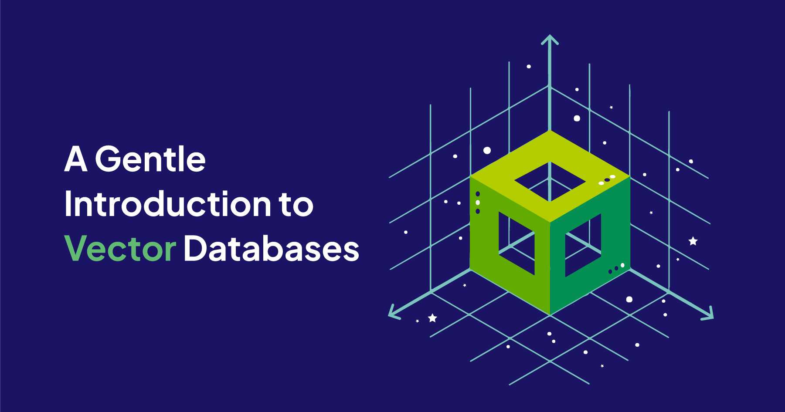
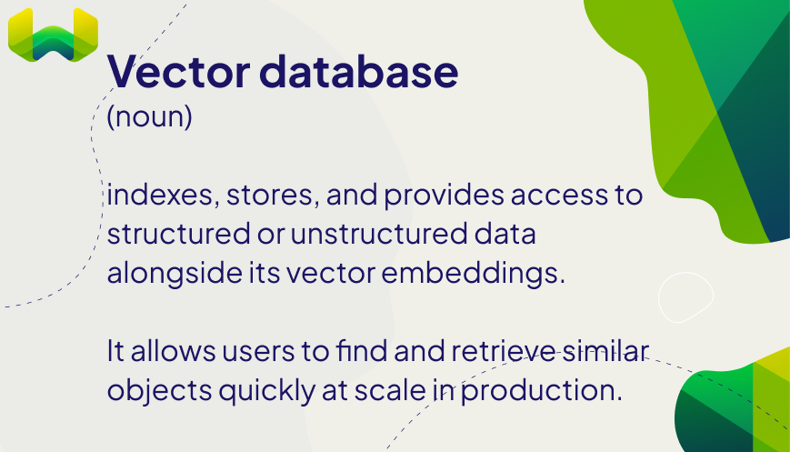
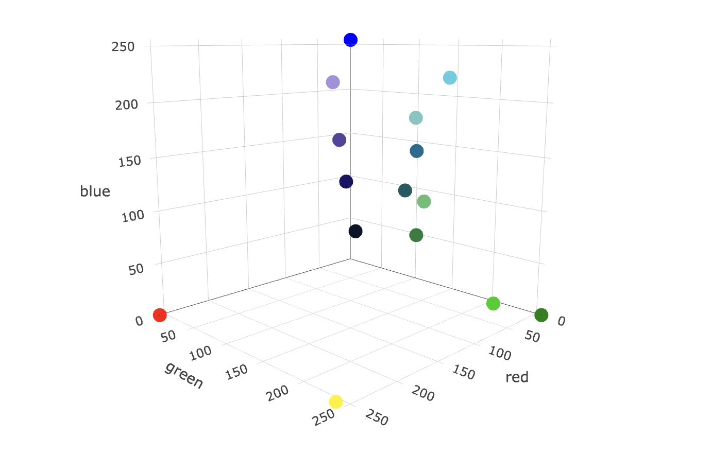
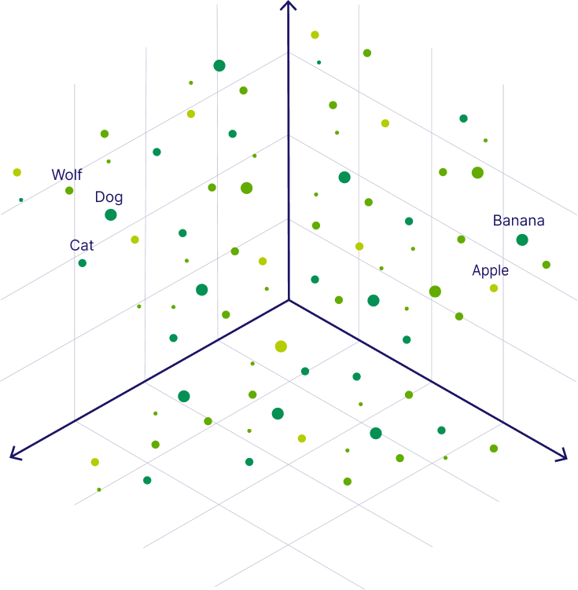
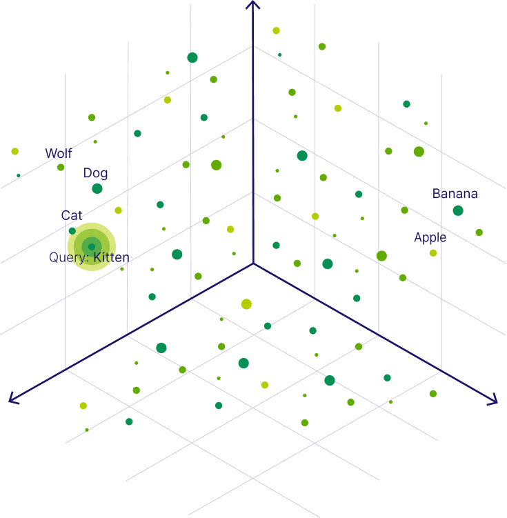
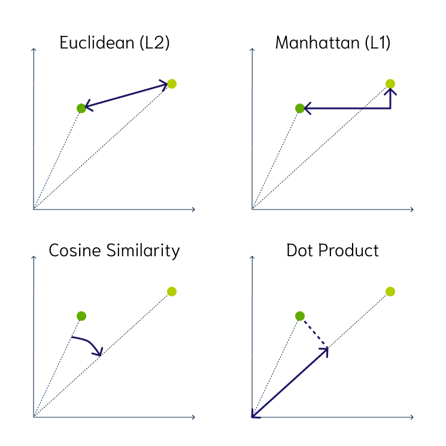
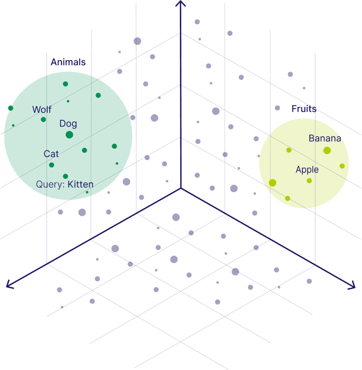
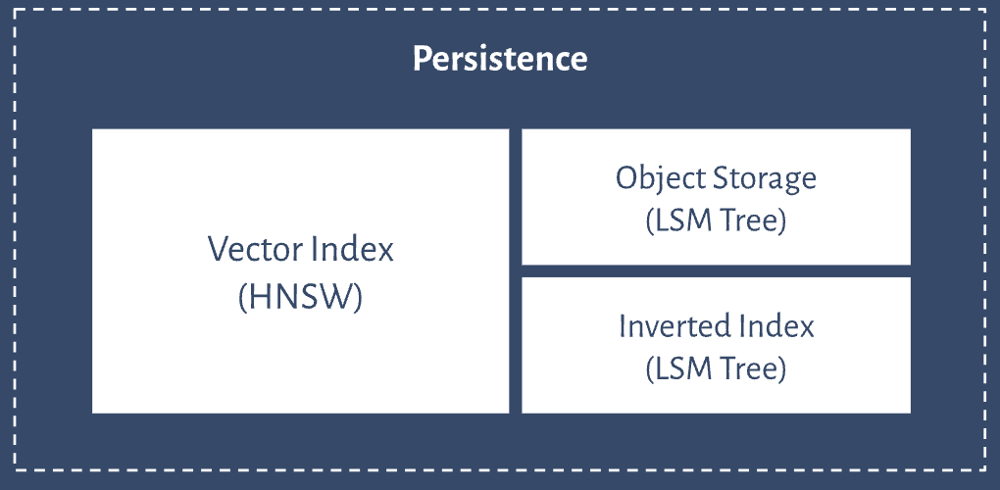
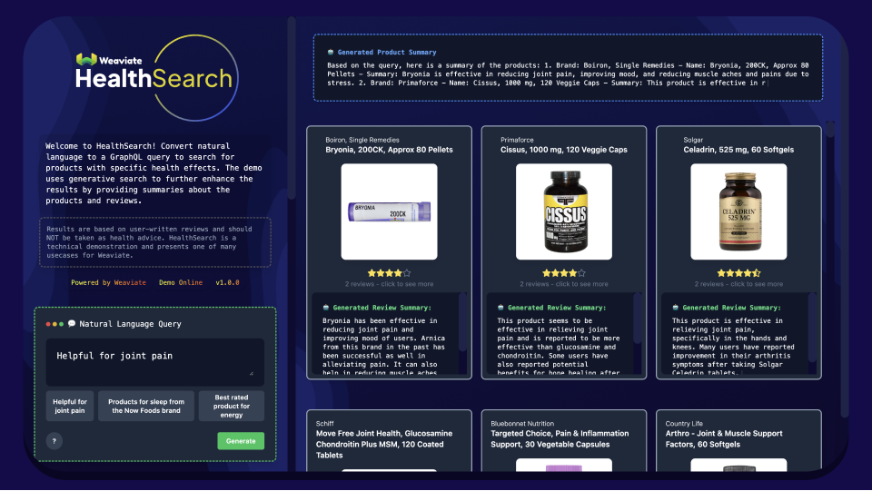
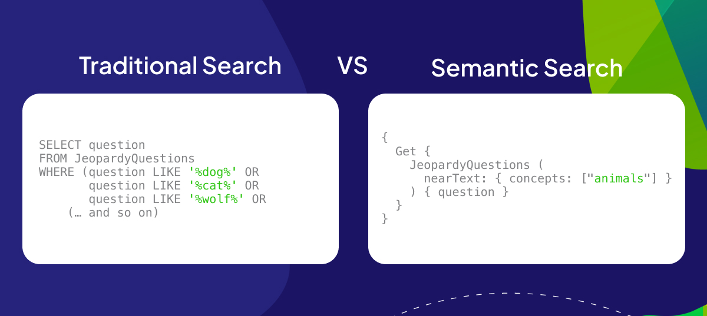

import Tabs from "@theme/Tabs";
import TabItem from "@theme/TabItem";
import FilteredTextBlock from "@site/src/components/Documentation/FilteredTextBlock";
import PyCode from "!!raw-loader!/_includes/code/automated-testing.py";
import TSCode from "!!raw-loader!/_includes/code/automated-testing.ts";

**Last Updated On**: September 7th, 2026

Vector databases have become a core retrieval technology for applications that need to search text, images, audio, video, and other data by meaning or similarity. They are widely used in semantic and hybrid search, recommendations, [**retrieval augmented generation (RAG)**](/blog/introduction-to-rag), and agentic systems that retrieve private or changing knowledge.

The category has also become less clear-cut. Purpose-built vector databases, search engines, and general-purpose SQL and NoSQL databases can all provide vector search. The useful question is no longer simply whether a product can store vectors, but whether its retrieval quality, filtering, latency, scale, security, and operational model fit your application.

This article explains core concepts such as [vector embeddings](/blog/vector-embeddings-explained), [vector search](/blog/vector-search-explained), distance metrics, and [vector indexes](https://docs.weaviate.io/weaviate/config-refs/indexing/vector-index). It then covers architecture, use cases, alternatives, and the questions to ask when choosing a vector database.

## What is a Vector Database?

A vector database is a data system designed to store, index, and query vector embeddings. It retrieves objects whose vectors are closest to a query vector, enabling similarity search over text, images, audio, video, and other data.

Production vector databases typically combine vector search with the original objects or references to them, metadata filters, updates, access controls, replication, and operational tooling. Many also provide keyword and hybrid search. Teams use these capabilities to retrieve context for RAG, power recommendations, and build search experiences that understand meaning rather than relying only on exact terms.

Because of its search capabilities, it is sometimes also called a vector search engine, or an embedding database.

## How Do Vector Databases Work?​

Vector databases retrieve data objects with vector search. Vector search uses vector embeddings, which are machine-understandable formats of human-understandable data objects, such as text documents, images, songs, videos, and so on. Vector databases also use vector indexing to retrieve data objects at scale.

This section introduces these core concepts: how embeddings represent data, how distance metrics compare vectors, and how indexes make retrieval efficient at scale.

### Vector Embeddings​

When you think of data, you might picture neatly organized values in a table. This is structured data. Text, images, audio, video, and other media are often described as unstructured or semi-structured because their meaning is not captured by a fixed set of columns. Traditional keyword and field-based queries remain useful, but they cannot always retrieve these objects according to meaning or similarity.

But innovations in Artificial Intelligence (AI) and Machine Learning (ML) have enabled us to numerically represent unstructured data without losing its semantic meaning in so-called vector embeddings. A vector embedding is just a long list of numbers, each describing a feature of the data object.

An example is how we numerically represent colors [in the RGB system](https://huggingface.co/spaces/jphwang/colorful_vectors), where each number in the vector describes how red, green, or blue a color is. E.g., the following green color can be represented as [6, 205, 0] in the RGB system.

But fitting more complex data, such as words, sentences, or text, into a meaningful series of numbers isn’t trivial. This is where AI models come in: AI models enable us to represent the contextual meaning of, e.g., a word as a vector because they have learned to represent the relationship between different words in a vector space. AI models that can generate embeddings from unstructured data are also called embedding models or vectorizers.
Below, you can see an example of the three-dimensional vector space of the RGB system with a few sample data points (colors).

Different embedding models represent data in different vector spaces, often with hundreds or thousands of dimensions. More dimensions do not automatically mean better retrieval: model quality, training data, domain fit, chunking, and evaluation all matter. In the color example, there are also different ways to represent a color numerically. For example, you can represent the previous green color in the RGB system as [6, 205, 0] or in the CMYK system as [97, 0, 100, 20].

Vectors can only be compared directly when they belong to compatible vector spaces. Use the same embedding model and configuration for the objects and queries within a given vector space. If an application needs different models or modalities, keep them in separate named vector spaces and query the appropriate one—or combine their results deliberately.

Vector embeddings numerically capture the semantic meaning of the objects in relation to other objects. Thus, similar objects are grouped together in the vector space, which means the closer two objects, the more similar they are.

For now, let’s consider a simpler example with numerical representations of words - also called word vectors. In the following image, you can see the words “Wolf” and “Dog” close to each other because dogs are direct descendants of wolves. Close to the dog, you can see the word “Cat,” which is similar to the word “Dog” because both are animals that are also common pets. But further away, on the right-hand side, you can see words that represent fruit, such as “Apple” or “Banana”, which are close to each other but further away from the animal terms.

### Vector Search and Similarity Search

Vector embeddings allow us to retrieve similar objects by searching for vectors that are close to one another. This process is called [vector search](/blog/vector-search-explained) or similarity search. When the vectors represent meaning in text, it often powers a semantic search experience.

Similarly to how we can find similar vectors for the word "Dog", we can find similar vectors to a search query. For example, to find words similar to the word “Kitten”, we can generate a vector embedding for this query term - also called a query vector - and retrieve all its nearest neighbors, such as the word “Cat”, as illustrated below.

### Semantic Search

Semantic search refers to searching based on meaning and intent rather than exact keyword matches. Instead of asking “does this document contain the word cat?”, semantic search asks “is this document about cats?”—even if it never uses that exact word. Because vector embeddings capture contextual relationships (like dog, wolf, and cat being related animals), semantic search can return relevant results across synonyms, paraphrases, and even loosely related concepts.

This makes semantic search especially powerful for modern applications such as LLM RAG pipelines, recommendation systems, and conversational AI, where users often phrase queries imprecisely or in natural language. In practice, semantic search is most commonly implemented using vector search over embeddings, which is why the terms vector search, similarity search, and semantic search are often used interchangeably—even though semantic search describes the user experience, while vector search describes the technical mechanism behind it.

As the concept of semantic search is based on the contextual meaning, it allows for a more human-like search experience by retrieving relevant search results that match the user's intent. This advantage makes vector search important for applications, that are e.g., sensitive to typos or synonyms.

The numerical representation of a data object allows us to apply mathematical operations to them. For example you can calculate the distance between two vector representations to determine their similarity. You can use several similarity measures to calculate the distance between two vectors. E.g., Weaviate supports the following distance metrics:

- **Squared Euclidean or L2-squared distance** calculates the straight-line distance between two vectors. Its range is [0, ∞], where 0 represents identical vectors, and larger values represent increasingly dissimilar vectors.
- **Manhattan or L1 distance** calculates the sum of the lengths of the projections of the line segment between the points onto the coordinate axes. Its range is [0, ∞], where 0 represents identical vectors, and larger values represent increasingly dissimilar vectors.
- **Cosine similarity** calculates the cosine of the angle between two vectors. Weaviate uses the cosine distance for the complement of cosine similarity. Its range is [0, 2], where 0 represents identical vectors, and 2 represents vectors that point in opposite directions.
- **Dot product** calculates the product of the magnitudes of two vectors and the cosine of the angle between them. Its range is [-∞, ∞], where 0 represents orthogonal vectors, and larger values represent increasingly similar vectors. Weaviate uses the negative dot product to keep the intuition that larger values represent increasingly dissimilar vectors.
- **Hamming distance** calculates the number of differences between vectors at each dimension.

The best distance metric depends on the embedding model and whether its vectors are normalized. Follow the model provider’s recommendation, then validate the choice with representative queries and a retrieval evaluation set. Metric choice matters, but the embedding model, data preparation, filters, and reranking strategy can have a larger effect on end-to-end relevance.
To learn more about the different distance metrics, you can continue reading our blog post on [What are Distance Metrics in Vector Search?](/blog/distance-metrics-in-vector-search)

### Vector Indexing for Approximate Nearest Neighbor Approach​

Vector indexing is the process of organizing vector embeddings so that data can be retrieved efficiently.

To find the exact closest items to a query vector, a brute-force k-nearest neighbors (kNN) search compares the query with every candidate. Its work grows with both the number and dimensionality of the vectors, which can become expensive for large datasets or high query volumes.

A more efficient solution is **approximate nearest neighbor (ANN) search**. ANN indexes organize vectors into structures such as graphs, clusters, or compressed partitions so that a query examines promising candidates instead of comparing against every stored vector. This greatly reduces search work, with tunable trade-offs between latency, memory use, build time, and recall.

In the previous example, an ANN index can guide a query for “Kitten” toward a promising region containing related animals without exhaustively scoring every fruit, vehicle, and other unrelated object. The returned neighbors are approximate, so production systems tune the index and measure recall against latency and resource targets.

The example roughly describes graph-based retrieval such as the Hierarchical Navigable Small World (HNSW) algorithm. HNSW remains a common choice for high-recall, low-latency search, but it is not the only option. Weaviate supports [HNSW, flat, dynamic, and HFresh indexes](https://docs.weaviate.io/weaviate/config-refs/indexing/vector-index), allowing teams to choose different memory, scale, and performance trade-offs. More broadly, vector index approaches include:

- Clustering-based index (e.g., [FAISS](https://github.com/facebookresearch/faiss))
- Proximity graph-based index (e.g., [HNSW](https://arxiv.org/abs/1603.09320))
- Tree-based index (e.g., [ANNOY](https://github.com/spotify/annoy))
- Hash-based index (e.g., [LSH](https://en.wikipedia.org/wiki/Locality-sensitive_hashing))
- Compression-based index (e.g., [PQ](https://ieeexplore.ieee.org/document/5432202) or [SCANN](https://ai.googleblog.com/2020/07/announcing-scann-efficient-vector.html))

Index selection is workload-dependent. Consider dataset size, query volume, update rate, filtering patterns, target recall, latency, memory, storage, and build time. Compression methods such as product, scalar, rotational, and binary quantization can reduce memory or storage requirements, typically with a quality or compute trade-off.

Further reading: [Why Is Vector Search So Fast](/blog/vector-search-explained)

## Vector Database Architecture

A production vector database usually coordinates several components: object storage, vector indexes, keyword or inverted indexes, metadata filters, and persistence or replication mechanisms. A query may combine several of these paths—for example, applying a tenant and date filter, running vector and BM25 retrieval, fusing the results, and optionally reranking the candidates.

Below you can see an example of the [Weaviate vector database architecture](https://docs.weaviate.io/weaviate/concepts#weaviate-architecture).

In Weaviate, data is organized into collections and shards that can be distributed and replicated across nodes. Each shard coordinates object, inverted, and vector storage. Features such as multi-tenancy provide isolation between tenants, while replication and backups support production resilience. The exact architecture differs across vector database products, so evaluate operational characteristics alongside benchmark results.

## Vector Database Use Cases

A wide variety of applications use the search capabilities of vector databases. They range from classical ML use cases, such as natural language processing (NLP), computer vision, and recommender systems, to providing long-term memory to LLMs in modern applications.

- **RAG and grounded generation:** Retrieve relevant passages from documents, support tickets, knowledge bases, or other sources and supply them as context to an LLM.
- **Agent retrieval and memory:** Store and retrieve selected interactions, summaries, entities, or reusable knowledge across an agent workflow.
- **Semantic and multimodal search:** Search text, images, audio, or video by meaning and similarity.
- **Recommendations and personalization:** Retrieve items or content similar to a user, product, or interaction history.
- **Anomaly and near-duplicate detection:** Find unusual items or objects that are very close in embedding space.

Search and recommendation are natural vector database use cases because both involve finding objects related to a query, user, or item. For example, an application can retrieve products similar to one a customer is viewing or documents whose meaning matches a natural-language question.

Many generative AI applications use vector retrieval to access information that is private, recent, or too large to place in every prompt. In [retrieval augmented generation (RAG)](/blog/introduction-to-rag), the application retrieves relevant context before generation. Better context can improve answer grounding, but a vector database does not by itself prevent hallucinations; retrieval quality, source quality, prompting, citations, evaluation, and guardrails still matter.

Here is an example [demo](https://github.com/weaviate/healthsearch-demo) called [HealthSearch](https://weaviate.io/blog/healthsearch-demo) of a [Weaviate](https://weaviate.io/) vector database in action together with an LLM showcasing the potential of leveraging user-written reviews and queries to retrieve supplement products based on specific health effects.

## When Do You Need a Vector Database?

A vector database is useful when similarity retrieval is a core part of the product and the system must handle production requirements such as frequent updates, metadata or permission filters, concurrent users, low latency, high availability, or large datasets.

You may not need a separate vector database when the dataset is small and static, search runs offline, or an existing database already meets your relevance and performance requirements. Start with the simplest architecture that satisfies the workload, and validate it using representative data rather than a synthetic benchmark alone.

When evaluating an option, ask:

- Does it produce relevant results on our real queries and data?
- Can it combine vector retrieval with keyword search, filters, and reranking where needed?
- How does recall change as we tune latency, memory, and cost?
- Can it support our update rate, tenant model, access controls, backups, and availability target?
- Can the team observe, operate, and migrate it without creating unnecessary complexity?

## Tool Landscape around Vector Databases​

Vector search is now available across purpose-built vector databases, search platforms, database extensions, and [vector libraries](https://weaviate.io/blog/vector-library-vs-vector-database). The boundaries between these categories are increasingly blurred. Choose based on capabilities and operating requirements rather than the product label alone.

### Vector Database vs. Traditional (Relational) Database​

The main difference between a modern vector and a traditional (relational) database comes from the type of data they were optimized for. While a relational database is designed to store structured data in columns, a vector database is also optimized to store unstructured data (e.g., text, images, or audio) and their vector embeddings.

Because vector and relational databases are optimized for different types of data, they also differ in how data is stored and retrieved. In a relational database, data is stored in columns and retrieved by keyword matches in traditional search. In contrast, vector databases also store the original data's vector embeddings, enabling efficient semantic search. Because vector search can semantically understand your search terms, it doesn't rely on retrieving relevant search results based on exact matches. This makes it robust to synonyms.

For example, imagine you have a database that stores Jeopardy questions, and you want to retrieve all questions that contain an animal. Because search in traditional databases relies on keyword matches, you would have to create a big query that queries all animals (e.g., contains "dog", or contains "cat", or contains "wolf", etc.). With semantic search, you could simply query for the concept of "animals".

Many vector databases store embeddings alongside source objects and metadata. Some, including Weaviate, also support [hybrid search](https://weaviate.io/blog/hybrid-search-explained), which runs vector and keyword retrieval and fuses their results. Hybrid retrieval is often a strong starting point because it combines semantic similarity with exact terms, identifiers, and domain vocabulary.

### Vector Database vs. Vector-Capable Database (SQL and NoSQL)​

Many SQL, NoSQL, and search databases now provide vector data types and ANN indexes. They can be a good fit when vectors must stay close to existing transactional data, governance, and operations. A purpose-built vector database may be preferable when vector and hybrid retrieval are central to the workload or when the application needs specialized indexing, filtering, multi-tenancy, compression, or distributed scaling. Test representative data and queries rather than assuming one category is always faster.

### Vector Database vs. Vector Indexing Library​

[Vector indexing libraries](https://weaviate.io/blog/vector-library-vs-vector-database) provide algorithms and data structures for nearest-neighbor search. Depending on the library, indexes may run in memory or persist to disk, and some support updates. What they generally do not provide as a complete package is database operations such as authorization, replication, backups, multi-tenancy, metadata management, and managed scaling.

Libraries can be a good choice for prototypes, offline pipelines, embedded applications, or teams that want to build their own storage and serving layer. A vector database reduces that engineering work when the application needs a continuously updated, shared production service.

### Vector Database vs. Graph Database​

A graph database stores data in nodes and edges, representing entities and their relationships. It's optimized for querying connections and patterns within the data, making it powerful for network, social, and recommendation systems. A vector database, on the other hand, indexes, stores, and provides access to structured or unstructured data (e.g., text or images) alongside its vector embeddings, which are the data's numerical representation. It allows users to find and retrieve similar objects quickly at scale in production.

### Vector Database vs. Vector Store

“Vector store” is an umbrella term and is also used by AI frameworks for the interface to any vector retrieval backend. “Vector database” usually implies a fuller production data system with persistence, indexing, updates, metadata filtering, security, replication, and scaling. The terms are not standardized, so evaluate the actual feature set rather than relying on the name.

## Vector Database FAQs

This section answers some common questions about vector databases.

### Why do we need vector databases?

Vector databases make similarity retrieval practical when exhaustive comparison is too slow or when an application also needs production capabilities such as filtering, updates, isolation, replication, and access control. They are useful—not universally required—for AI and search systems whose core workload is retrieving related objects from embeddings.

### Why Use a Vector Database?​

Use a vector database when the application must retrieve by semantic or multimodal similarity and needs more than a local index. Common requirements include hybrid search, metadata and permission filters, frequent updates, multiple tenants, high availability, and predictable latency at scale. For smaller or secondary vector workloads, adding vector search to an existing database may be simpler.

### How to use a vector database

A typical workflow is to split source data into useful units, generate embeddings, store each vector with its source content and metadata, build an index, embed the query, retrieve candidates, apply filters, and optionally rerank the results. Measure retrieval quality with representative queries before tuning latency and cost.

### How to choose a vector database

Start with retrieval quality on your own data, then compare latency, throughput, update patterns, filtering, hybrid search, multi-tenancy, security, high availability, backups, observability, deployment model, and total cost. Benchmark at the scale and filter selectivity you expect in production.

### Vector database vs vector store

Vector store is a broad term for a component or interface that stores and retrieves embeddings. Vector database usually describes a production system that adds persistence, indexing, filtering, updates, replication, security, and scaling. Because usage varies, compare features instead of labels.

### Do you need a vector database for RAG?

Not always. Small or static RAG applications can use an in-memory index or vector support in an existing database. A dedicated vector database becomes more valuable when you need frequent updates, metadata and permission filters, multiple tenants, low latency, high availability, or large-scale retrieval.

### Can a traditional database store vectors?

Yes. Many general-purpose databases now offer vector columns and similarity indexes. Keeping vector search in an existing database can simplify operations and consistency. A purpose-built system may offer deeper retrieval features or more predictable performance when vector search is the primary workload.

## Summary​

This article explained that vector databases store, index, and query vector embeddings alongside source data or references to it. Vector databases like [Weaviate](https://weaviate.io/) support efficient similarity search and production retrieval at scale.

We covered their core concepts, such as vector embeddings, and discussed that they enable efficient vector search by leveraging ANN algorithms. Additionally, we explored other vector search tools and discussed the advantages of vector databases over traditional and vector-capable databases and vector libraries.

:::info
If you’re here because of LLM RAG, start with our guide: [Introduction to Retrieval Augmented Generation (RAG)](/blog/introduction-to-rag). If you’re building agents, see: [Context Engineering](/blog/context-engineering).
:::

import WhatNext from "/_includes/what-next.mdx";

<WhatNext />
