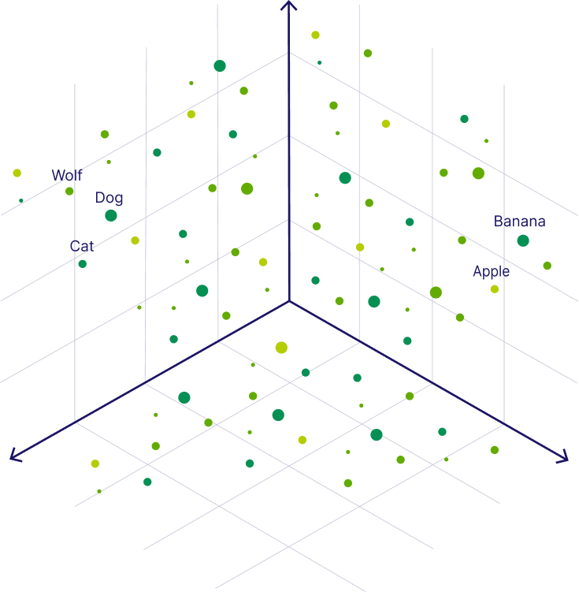

import Tabs from '@theme/Tabs';
import TabItem from '@theme/TabItem';
import FilteredTextBlock from '@site/src/components/Documentation/FilteredTextBlock';
import PyCode from '!!raw-loader!/_includes/code/automated-testing.py';
import TSCode from '!!raw-loader!/_includes/code/automated-testing.ts';

If you have just recently heard the term “vector database” for the first time, you are not alone. Although vector databases have been around for a few years, they’ve just recently drawn the wider developer community’s attention.

The excitement around vector databases - sometimes referred to as AI databases - is closely related to the release of ChatGPT. Since late 2022, the public has started to understand the capabilities of state-of-the-art large language models (LLMs), while developers have realized that vector databases can enhance these models further.

Today, vector databases are most commonly used to power [**LLM RAG**](/blog/introduction-to-rag) (retrieval augmented generation), semantic search, and agentic systems that need fast retrieval over private knowledge. If you’re evaluating tools for “RAG”, “semantic search”, or “agent memory”, you’re often evaluating vector databases—even if the terminology has shifted.

This article will explain some of their core concepts, such as [vector embeddings](/blog/vector-embeddings-explained) and [vector search](/blog/vector-search-explained). Then, we will dive into the technical details of using distance metrics in vector search and how [vector indexes](https://docs.weaviate.io/weaviate/concepts/vector-index) enable efficient retrieval. Once we have a fundamental understanding, we will discuss use cases and the current tool landscape.

## What is a Vector Database?
A vector database stores data (text, images, etc.) alongside vector embeddings and provides fast similarity search (also called vector search or semantic search) at scale using vector indexes like HNSW/ANN. It allows users to find and retrieve similar objects quickly at scale in production.

In practice, teams use vector databases to retrieve the most relevant context for LLM RAG pipelines, recommendations, and semantic search experiences.

Because of its search capabilities, it is sometimes also called a vector search engine, or an embedding database.

## How Do Vector Databases Work?​

Vector databases retrieve data objects with vector search. Vector search uses vector embeddings, which are machine-understandable formats of human-understandable data objects, such as text documents, images, songs, videos, and so on. Vector databases also use vector indexing to retrieve data objects at scale.

This section introduces these core concepts.  We will discuss what vector embeddings are, how they enable similarity search, and how they accelerate it.

### Vector Embeddings​
When you think of data, you probably think of neatly organized numbers in spreadsheets. This type of data is called structured data because it can easily be stored in tabular format. However, roughly 80% of today’s data is said to be unstructured. Examples of unstructured data are images, text (e.g., documents, social media posts, or emails), or time series data (e.g., audio files, sensor data, or video). The problem with this type of data is that it is difficult to store it in an organized way so you can easily find what you are looking for.

But innovations in Artificial Intelligence (AI) and Machine Learning (ML) have enabled us to numerically represent unstructured data without losing its semantic meaning in so-called vector embeddings. A vector embedding is just a long list of numbers, each describing a feature of the data object.

An example is how we numerically represent colors [in the RGB system](https://huggingface.co/spaces/jphwang/colorful_vectors), where each number in the vector describes how red, green, or blue a color is. E.g., the following green color can be represented as [6, 205, 0] in the RGB system.

But fitting more complex data, such as words, sentences, or text, into a meaningful series of numbers isn’t trivial. This is where AI models come in: AI models enable us to represent the contextual meaning of, e.g., a word as a vector because they have learned to represent the relationship between different words in a vector space. AI models that can generate embeddings from unstructured data are also called embedding models or vectorizers.
Below, you can see an example of the three-dimensional vector space of the RGB system with a few sample data points (colors).

Different embedding models represent data in different vector spaces. Vector spaces can differ in the number of dimensions, ranging from tens to thousands, where the precision of the representation increases with increasing dimensions. In the color example, there are also different ways to represent a color numerically. For example, you can represent the previous green color in the RGB system as [6, 205, 0] or in the CMYK system as [97, 0, 100, 20].

This is why it is important to use the same embedding model for all your data to ensure it is in the respective vector space.

Vector embeddings numerically capture the semantic meaning of the objects in relation to other objects. Thus, similar objects are grouped together in the vector space, which means the closer two objects, the more similar they are.

For now, let’s consider a simpler example with numerical representations of words - also called word vectors. In the following image, you can see the words “Wolf” and “Dog” close to each other because dogs are direct descendants of wolves. Close to the dog, you can see the word “Cat,” which is similar to the word “Dog” because both are animals that are also common pets. But further away, on the right-hand side, you can see words that represent fruit, such as “Apple” or “Banana”, which are close to each other but further away from the animal terms.

### Vector Search and Similarity Search
Vector embeddings allow us to find and retrieve similar objects by searching for objects that are close to each other in the vector space. This concept is called [vector search](/blog/vector-search-explained), similarity search, or semantic search database.

Similarly to how we can find similar vectors for the word "Dog", we can find similar vectors to a search query. For example, to find words similar to the word “Kitten”, we can generate a vector embedding for this query term - also called a query vector - and retrieve all its nearest neighbors, such as the word “Cat”, as illustrated below.

### Semantic Search

Semantic search refers to searching based on meaning and intent rather than exact keyword matches. Instead of asking “does this document contain the word cat?”, semantic search asks “is this document about cats?”—even if it never uses that exact word. Because vector embeddings capture contextual relationships (like dog, wolf, and cat being related animals), semantic search can return relevant results across synonyms, paraphrases, and even loosely related concepts.

This makes semantic search especially powerful for modern applications such as LLM RAG pipelines, recommendation systems, and conversational AI, where users often phrase queries imprecisely or in natural language. In practice, semantic search is most commonly implemented using vector search over embeddings, which is why the terms vector search, similarity search, and semantic search are often used interchangeably—even though semantic search describes the user experience, while vector search describes the technical mechanism behind it.

As the concept of semantic search is based on the contextual meaning, it allows for a more human-like search experience by retrieving relevant search results that match the user's intent. This advantage makes vector search important for applications, that are e.g., sensitive to typos or synonyms.

The numerical representation of a data object allows us to apply mathematical operations to them. For example you can calculate the distance between two vector representations to determine their similarity. You can use several similarity measures to calculate the distance between two vectors. E.g., Weaviate supports the following distance metrics:
* **Squared Euclidean or L2-squared distance** calculates the straight-line distance between two vectors. Its range is [0, ∞], where 0 represents identical vectors, and larger values represent increasingly dissimilar vectors.
* **Manhattan or L1 distance** calculates the sum of the lengths of the projections of the line segment between the points onto the coordinate axes. Its range is [0, ∞], where 0 represents identical vectors, and larger values represent increasingly dissimilar vectors.
* **Cosine similarity** calculates the cosine of the angle between two vectors. Weaviate uses the cosine distance for the complement of cosine similarity. Its range is [0, 2], where 0 represents identical vectors, and 2 represents vectors that point in opposite directions.
* **Dot product** calculates the product of the magnitudes of two vectors and the cosine of the angle between them. Its range is [-∞, ∞], where 0 represents orthogonal vectors, and larger values represent increasingly similar vectors. Weaviate uses the negative dot product to keep the intuition that larger values represent increasingly dissimilar vectors.
* **Hamming distance** calculates the number of differences between vectors at each dimension.

As you can see, there are many different similarity measures. As a rule of thumb, select the same metric as the one used to train the ML model. Suppose you are unsure which one was used. In that case, you can usually find this information on the hosting service’s site, e.g., [OpenAI’s ada-002 uses cosine similarity](https://platform.openai.com/docs/guides/embeddings/which-distance-function-should-i-use) or [MiniLM hosted on Hugging Face supports cosine similarity, dot product, and Euclidean distance](https://huggingface.co/sentence-transformers/multi-qa-MiniLM-L6-cos-v1#technical-details).
To learn more about the different distance metrics, you can continue reading our blog post on [What are Distance Metrics in Vector Search?](/blog/distance-metrics-in-vector-search)

### Vector Indexing for Approximate Nearest Neighbor Approach​
Vector indexing is the process of organizing vector embeddings so that data can be retrieved efficiently.

When you want to find the closest items to a given query vector, the brute force approach would be to use the k-Nearest Neighbors (kNN) algorithm. But calculating the similarity between your query vector and every entry in the vector database requires a lot of computational resources, especially if you have large datasets with millions or even billions of data points. This is because the required calculations increase linearly (O(n)) with the dimensionality and the number of data points.

A more efficient solution to find similar objects is to use an **approximate nearest neighbor (ANN) approach**. The underlying idea is to pre-calculate the distances between the vector embeddings. Then you can organize and store similar vectors close to each other (e.g., in clusters or a graph), so that you can later find similar objects faster. This process is called vector indexing. Note that the speed gains are traded in for some accuracy because the ANN approach returns only the approximate results.

In the previous example, one option would be to pre-calculate some clusters, e.g., animals, fruits, and so on. So, when you query the database for "Kitten", you could start your search by only looking at the closest animals and not waste time calculating the distances between all fruits and other non-animal objects. More specifically, the ANN algorithm can help you to start the search in a region near, e.g., four-legged animals. Then, the algorithm would also prevent you from venturing further from relevant results.

The above example roughly describes the Hierarchical Navigable Small World (HNSW) algorithm. It is also the default ANN algorithm in Weaviate. However, there are several ANN algorithms to index the vectors, which can be categorized into the following groups:
* Clustering-based index (e.g., [FAISS](https://github.com/facebookresearch/faiss))
* Proximity graph-based index (e.g., [HNSW](https://arxiv.org/abs/1603.09320))
* Tree-based index (e.g., [ANNOY](https://github.com/spotify/annoy))
* Hash-based index (e.g., [LSH](https://en.wikipedia.org/wiki/Locality-sensitive_hashing))
* Compression-based index (e.g., [PQ](https://ieeexplore.ieee.org/document/5432202) or [SCANN](https://ai.googleblog.com/2020/07/announcing-scann-efficient-vector.html))

Note that indexing enables fast retrieval at query time, but it can take a lot of time to build the index initially.

Further reading: [Why Is Vector Search So Fast](/blog/vector-search-explained)

## Vector Database Architecture

Since vector databases do not only store vector embeddings but also the original data objects, their architecture consists of multiple indices.

Below you can see an example of the [Weaviate vector database architecture](https://docs.weaviate.io/weaviate/concepts#weaviate-architecture).

Users can create any number of indices and each index can contain any number of shards. Shards can be distributed and/or replicated across nodes in the cluster. A shard always contains object, inverted, and vector storage. Vector storage is not affected by LSM segmentation.

## Vector Database Use Cases
A wide variety of applications use the search capabilities of vector databases. They range from classical ML use cases, such as natural language processing (NLP), computer vision, and recommender systems, to providing long-term memory to LLMs in modern applications.

- LLM RAG pipelines: Vector databases retrieve the most relevant chunks of private data (docs, tickets, knowledge bases) to ground LLM answers.
- Agent memory: In agentic systems, the vector database often acts as long-term memory, storing past interactions, summaries, and reusable knowledge for retrieval.
- Semantic search: Applications use embeddings to search by meaning, not keywords—useful for synonyms, typos, and intent-heavy queries.

The **most popular use case of vector databases is naturally for search**. Because a vector search can help find similar objects, it is predestined for applications where you might want to find similar products, movies, books, songs, etc. That’s why they are also **used in recommendation systems** as a restated search task.

With the rise of LLMs, **many modern Generative AI applications use vector databases as an external knowledge source**. You might have already come across the term that they provide LLMs with long-term memory. LLMs are stateless, which means that they immediately forget what you have just discussed if you don’t store this information in, e.g., a vector database and thus provide them with a state. This enables LLMs to hold an actual conversation. Also, you can store additional information in them as part of a[retrieval-augmented generation (RAG)](/blog/introduction-to-rag) pipeline to reduce hallucinations.

Here is an example [demo](https://github.com/weaviate/healthsearch-demo) called [HealthSearch](https://weaviate.io/blog/healthsearch-demo) of a [Weaviate](http://weaviate.io/) vector database in action together with an LLM showcasing the potential of leveraging user-written reviews and queries to retrieve supplement products based on specific health effects.

## Tool Landscape around Vector Databases​
Although vector databases are AI-native and specifically designed to handle vector embeddings and enable efficient vector search, alternatives like [vector libraries](https://weaviate.io/blog/vector-library-vs-vector-database) and vector-capable databases exist as well.

### Vector Database vs. Traditional (Relational) Database​
The main difference between a modern vector and a traditional (relational) database comes from the type of data they were optimized for. While a relational database is designed to store structured data in columns, a vector database is also optimized to store unstructured data (e.g., text, images, or audio) and their vector embeddings.

Because vector and relational databases are optimized for different types of data, they also differ in how data is stored and retrieved. In a relational database, data is stored in columns and retrieved by keyword matches in traditional search. In contrast, vector databases also store the original data's vector embeddings, enabling efficient semantic search. Because vector search can semantically understand your search terms, it doesn't rely on retrieving relevant search results based on exact matches. This  makes it robust to synonyms.

For example, imagine you have a database that stores Jeopardy questions, and you want to retrieve all questions that contain an animal. Because search in traditional databases relies on keyword matches, you would have to create a big query that queries all animals (e.g., contains "dog", or contains "cat", or contains "wolf", etc.). With semantic search, you could simply query for the concept of "animals".

Because most vector databases do not only store vector embeddings but store them together with the original source data, they are not only capable of vector search but also enable traditional keyword search. Some, like Weaviate, even support [hybrid search](https://weaviate.io/blog/hybrid-search-explained) capabilities that combine vector search with keyword search.

### Vector Database vs. Vector-Capable Database (SQL and NoSQL)​
Today, many existing databases have already enabled vector support and vector search. However, they usually don’t index the vector embeddings, which makes the vector search slow. Thus, an advantage of AI-native vector databases over vector-capable databases is their efficiency in vector search due to vector indexing.

### Vector Database vs. Vector Indexing Library​
Similarly to vector databases, [vector libraries](https://weaviate.io/blog/vector-library-vs-vector-database) also enable fast vector search. However, vector libraries only store vector embeddings of data objects, and they store them in in-memory indexes. This results in two key differences:

1. Updatability: The index data is immutable, and thus, no real-time updates are possible.
2. Scalability: Most vector libraries cannot be queried while importing your data, which can be a scalability concern for applications that require importing millions or even billions of objects.

Thus, vector libraries are a great solution for applications with a limited static snapshot of data. However, if your application requires real-time scalable semantic search at the production level, you should consider using a vector database.

### Vector Database vs. Graph Database​
A graph database stores data in nodes and edges, representing entities and their relationships. It's optimized for querying connections and patterns within the data, making it powerful for network, social, and recommendation systems. A vector database, on the other hand, indexes, stores, and provides access to structured or unstructured data (e.g., text or images) alongside its vector embeddings, which are the data's numerical representation. It allows users to find and retrieve similar objects quickly at scale in production.

### Vector Database vs. Vector Store

A vector store is a lighter system or library designed specifically to store and retrieve vector embeddings. It focuses more on managing vectors and supports basic operations like indexing and querying. A vector database, on the other hand, not only stores and retrieves vector embeddings but also offers comprehensive database functionalities such as distributed storage, scaling, security, and support for complex queries.

## Vector Database FAQs

This section answers some common questions about vector databases.

### Why we need vector databases

Vector databases are essential for efficiently managing and searching high-dimensional vector embeddings.  They enable real-time accurate similarity searches, which are critical in the AI-native app stack.

### Why Use a Vector Database?​
Vector databases have become a critical component in the AI-native app stack, particularly for managing the vast amounts of unstructured data that organizations generate, such as images, text, and audio. Unlike traditional databases, which struggle with unstructured data, vector databases efficiently store, search, and analyze this data by leveraging high-dimensional vector representations or embeddings. As semantic search AI applications become more sophisticated, vector databases provide the retrieval layer that powers accurate, context-aware responses.

For example, in recommendation systems or NLP tasks, vector databases enable businesses to unlock valuable insights, leading to more informed decision-making and improved personalization. Furthermore, they enable human-like semantic search capabilities, allowing businesses to find products, content, or information that closely match a user's query. This not only improves user experience and engagement but also drives customer-specific personalization.

Vector databases' scalability and performance are crucial as businesses grow and data volumes increase. These databases are optimized for handling large-scale, high-dimensional vectors, ensuring that data retrieval remains fast and accurate even at scale. This scalability is vital for AI applications that require real-time data processing, such as chatbots, fraud detection, and other interactive AI systems.

Additionally, vector databases integrate seamlessly with existing AI workflows, including LLM orchestration frameworks, embedding model providers, and inference engines. This integration simplifies the deployment and scaling of production-level RAG applications, making it easier for businesses to harness AI's full potential. By providing a specialized infrastructure for storing and retrieving vectors, vector databases reduce the complexity and cost associated with AI development, allowing organizations to focus on innovation and delivering personalized experiences to their customers.

### How to use a vector database

Store vector embeddings in the database, index them for efficient retrieval and perform similarity searches to find the most relevant data points.

### How to choose a vector database
Selection criteria for vector databases are search latency, memory footprint as object count scales up, recall and retrieval relevancy, cost efficiency, and integration capabilities with your existing stack and AI tools, such as language models and embedding models.

### Vector database vs vector store

Many tools call themselves “vector stores”; in practice, developers often mean a production-ready vector database with indexing, scaling, and filters.

## Summary​
This article explained that vector databases are a type of database that indexes, stores, and provides access to structured or unstructured data alongside its vector embeddings. Vector databases like [Weaviate](http://weaviate.io/) allow for efficient similarity search and retrieval of data based on their vector distance or vector similarity at scale.

We covered their core concepts, such as vector embeddings, and discussed that they enable efficient vector search by leveraging ANN algorithms. Additionally, we explored other vector search tools and discussed the advantages of vector databases over traditional and vector-capable databases and vector libraries.

:::info
If you’re here because of LLM RAG, start with our guide: [Introduction to Retrieval Augmented Generation (RAG)](/blog/introduction-to-rag). If you’re building agents, see: [Context Engineering](/blog/context-engineering).
:::

**Last Updated On**: February 6th, 2026

import WhatNext from  '/_includes/what-next.mdx'

<WhatNext />
