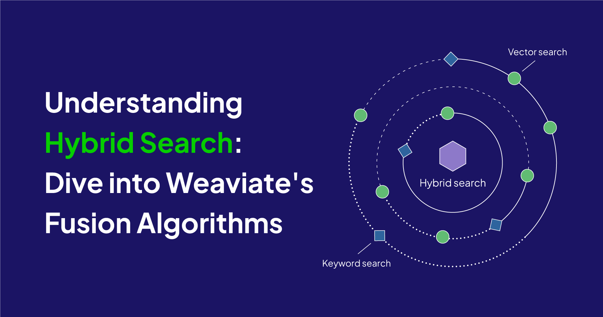
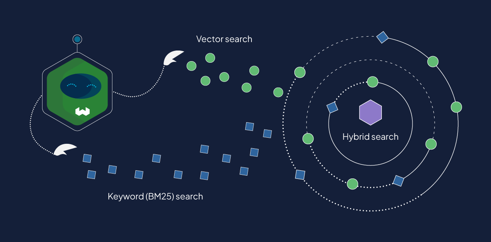

:::info Highlights
- There are two fusion algorithms available in Weaviate: `rankedFusion` and `relativeScoreFusion`.
- `rankedFusion` is the default algorithm.
- `relativeScoreFusion` is the newer algorithm, and likely the better choice for most.
- We would love to get your feedback on hybrid search. Please fill out [this short survey](https://docs.google.com/forms/d/e/1FAIpQLSfxekC2eh5Xkl0iJYEAoOkfhK4FA5AO-Od3KUz4srreOpq00g/viewform?usp=sf_link).
:::

-----

As you might know already, Weaviate can perform many different types of searches, including vector search and keyword search. Vector search is based on similarities of meaning to the input, whereas keyword search is based on how often the input words occur in the results.

Vector and keyword based search each have their strengths and weaknesses that arise from this difference, where vector search is more forgiving semantically and keyword search is more precise. Hybrid search enables a “best-of-both-worlds” type capability using both of these search types.

That probably sounds simple enough. But do you know **how** hybrid search combines these results? And that Weaviate recently added a new algorithm for how this is done?

In this post, we’ll dive into exactly the world of hybrid search to discuss how it works, how results are produced, the algorithms used, and more. So let’s get into it!

:::info
- Vector search and keyword search are also known as dense vector search and sparse vector search respectively.
- Keyword search is also called a BM25 search in Weaviate, as it is based on the [BM25F](https://en.wikipedia.org/wiki/Okapi_BM25) scoring algorithm.
:::

## How does hybrid search work, exactly?



Here is an example of a hybrid search:

```python
response = (
    client.query
    .get("JeopardyQuestion", ["question", "answer"])
    .with_hybrid(query="food", alpha=0.5)
    .with_limit(5)
    .do()
)
```

As mentioned, a hybrid search is really two searches under-the-hood. It performs a vector search (similar to `nearText` or `nearVector` in Weaviate) to find most similar objects to the vector of your query. Meanwhile, it also performs a keyword search, which ranks results based on how often the query terms occur.

In other words, a hybrid search performs both of these searches and combines the results.

import Tabs from '@theme/Tabs';
import TabItem from '@theme/TabItem';

<Tabs groupId="languages">
<TabItem value="vector" label="Vector search">

```python
response = (
    client.query
    .get("JeopardyQuestion", ["question", "answer"])
    .with_near_text({"concepts": ["food"]})
    .with_limit(5)
    .do()
)
```

</TabItem>
<TabItem value="keyword" label="Keyword search">

```python
response = (
    client.query
    .get("JeopardyQuestion", ["question", "answer"])
    .with_bm25(query="food")
    .with_limit(5)
    .do()
)
```

</TabItem>
</Tabs>

Each of these searches will produce results like these:

<Tabs groupId="languages">
<TabItem value="vector" label="Vector search">

```json
{
  "data": {
    "Get": {
      "JeopardyQuestion": [
        {
          "answer": "a closer grocer",
          "question": "A nearer food merchant"
        },
        {
          "answer": "Famine",
          "question": "From the Latin for \"hunger\", it's a period when food is extremely scarce"
        },
        {
          "answer": "Tofu",
          "question": "A popular health food, this soybean curd is used to make a variety of dishes & an ice cream substitute"
        },
        {
          "answer": "gastronomy",
          "question": "This word for the art & science of good eating goes back to Greek for \"belly\""
        },
        {
          "answer": "devour flour",
          "question": "Voraciously eat an \"all-purpose\" baking ingredient"
        }
      ]
    }
  }
}
```

</TabItem>
<TabItem value="keyword" label="Keyword search">

```json
{
  "data": {
    "Get": {
      "JeopardyQuestion": [
        {
          "answer": "food stores (supermarkets)",
          "question": "This type of retail store sells more shampoo & makeup than any other"
        },
        {
          "answer": "cake",
          "question": "Devil's food & angel food are types of this dessert"
        },
        {
          "answer": "a closer grocer",
          "question": "A nearer food merchant"
        },
        {
          "answer": "honey",
          "question": "The primary source of this food is the Apis mellifera"
        },
        {
          "answer": "Giraffe",
          "question": "Acacia leaves are the favorite food of this tallest mammal"
        }
      ]
    }
  }
}

```

</TabItem>
</Tabs>

As you see in the above examples, vector and keyword searches produce results with objects in different order to each other, if not different objects altogether. And if we inspect the results of our equivalent hybrid query, you’ll notice results from both `vector` and `keyword` search results.

```json
{
  "data": {
    "Get": {
      "JeopardyQuestion": [
        {
          "answer": "a closer grocer",
          "question": "A nearer food merchant"
        },
        {
          "answer": "food stores (supermarkets)",
          "question": "This type of retail store sells more shampoo & makeup than any other"
        },
        {
          "answer": "cake",
          "question": "Devil's food & angel food are types of this dessert"
        },
        {
          "answer": "Famine",
          "question": "From the Latin for \"hunger\", it's a period when food is extremely scarce"
        },
        {
          "answer": "Tofu",
          "question": "A popular health food, this soybean curd is used to make a variety of dishes & an ice cream substitute"
        }
      ]
    }
  }
}
```

So, how did they get there?

A short answer is that Weaviate calculates for each object a weighted score, using both result sets. But given that they are two very different search types, how might we combine any numerical outputs from each search? This is not a trivial decision due to the two search types producing different metrics to each other. In some ways, this is where the rubber meets the road, and thus the implementation here is an important part of the hybrid search story.

:::info Weighing scores
Hybrid searches can be ‘weighted’ to give more weight to the vector or keyword search. This is done using the `alpha` parameter. You can read more [here](/developers/weaviate/search/hybrid#weight-keyword-vs-vector-results).
:::.

## Fusion algorithms

Each of the two (vector and keyword) searches returns a set of results with its own scores. These scores are then weighted and handed over to the selected fusion algorithm. A job of the fusion algorithm is to prepare the scores from each search to be compatible with each other, so that they can be added up and presented to the user.

As of `1.20`, there are two algorithms available - one called `rankedFusion` (the current default as of `1.21`) and another called `relativeScoreFusion`.

### rankedFusion

The `rankedFusion` algorithm is the original hybrid fusion algorithm that has been available since the launch of hybrid search in Weaviate.

In this algorithm, each object is scored according to its position in the results for the given search, starting from the highest score for the top-ranked object and decreasing down the order. The total score is calculated by adding these rank-based scores from the vector and keyword searches.

Now, let’s take a look at the newer `relativeScoreFusion` algorithm.

### relativeScoreFusion


The `relativeScoreFusion` algorithm was added in Weaviate version `1.20`.

In contrast  to `rankedFusion`, however, `relativeScoreFusion` derives each objects score by *normalizing* the metrics output by the vector search and keyword search respectively. The highest value becomes 1, the lowest value becomes 0, and others end up in between according to this scale. The total score is thus calculated by a scaled sum of normalized vector similarity and normalized BM25 score.

## Which one to use?

Now that you know more about these two algorithms, you’re probably wondering this key question: which one to use, and when? Generally, we think that `relativeScoreFusion` might be a good choice.

The main reason is that it retains more information from the original searches than `rankedFusion` which only retains the rankings. More concretely, imagine the following scenario comparing the top three results from two different searches.

Let’s say search A produces scores [5, 4.99, 0] and search B produces [5, 0.01, 0]. In `rankedFusion`, searches A and B would be treated similarly, as only their ranks are used to produce hybrid scores.

On the other hand, `relativeScoreFusion`, would treat the second-ranked result very differently in each search. The second-ranked object from search A has a score of `4.99`. This would be normalized to a score only slightly below the top score of `5`. But in search B, the second-ranked object has a score of `0.01`. The relative distance between this score and the top score `5` would be retained here, and functionally this score would be nearly identical to the bottom result for the purposes of the final hybrid score.

As a result, `relativeScoreFusion` is likely to rank the second object in search A higher than in search B.

More generally we believe that the nuances captured in the vector and keyword search metrics are more likely to be reflected in rankings produced by `relativeScoreFusion`.

Here are some additional notes on how we see these two:


### Recall performance / benchmarks

In developing these two algorithms, we carried out some internal benchmarks testing recall on a standard (FIQA) dataset. According to our internal benchmarks, the `relativeScoreFusion` algorithm showed a ~6% improvement in recall over the default `rankedFusion` method.

This is quite a significant improvement. So in the absence of specific characteristics of your dataset or a need to retain backwards compatibility with previous searches, `relativeScoreFusion` might be a good choice.

### Use with AutoCut

In `1.20` we introduced the [AutoCut](/blog/2023-07-11-weaviate-1-20-release/index.mdx#autocut) feature, which can intelligently retrieve groups of objects from a search. AutoCut relies on there being natural “clusters” of results objects by score. Therefore it makes sense to use AutoCut with `relativeScoreFusion`, where the scores retain information from the original vector similarities and BM25 scores as output by the vector and keyword searches.

### Why the default choice?

Given our earlier explanations, you might be wondering why `rankedFusion` is the default algorithm. In fact, currently we believe that `relativeScoreFusion` is more likely to be the better-performing algorithm.

The answer is that `rankedFusion` is the older, reliable choice that has worked quite well. In the meantime, we have been reviewing how `relativeScoreFusion` is received by the community, and making small tweaks like adding [over-search](/developers/weaviate/api/graphql/search-operators#oversearch-with-relativescorefusion) to make it more robust.

So far, the reaction has been positive. But we are still in the evaluation phase, and we would love to get additional feedback from you, our users. We have prepared [this short survey](https://docs.google.com/forms/d/e/1FAIpQLSfxekC2eh5Xkl0iJYEAoOkfhK4FA5AO-Od3KUz4srreOpq00g/viewform?usp=sf_link). We would really appreciate your input. Please let us know what you think!

## Wrap-up

Hybrid search in Weaviate offers a powerful blend of vector and keyword search, using the strengths of both to deliver semantically rich results while respecting precision of keyword searches.

As we've explored, the introduction of `relativeScoreFusion` expands Weaviate’s hybrid search capabilities that began its life with the `rankedFusion` algorithm. We invite you to dive in, experiment with these fusion algorithms, and share your experiences.

### Further resources

- [How-to: Hybrid search](/developers/weaviate/search/hybrid)
- [API References: Hybrid search](/developers/weaviate/api/graphql/search-operators#hybrid)

import WhatNext from '/_includes/what-next.mdx'

<WhatNext />

