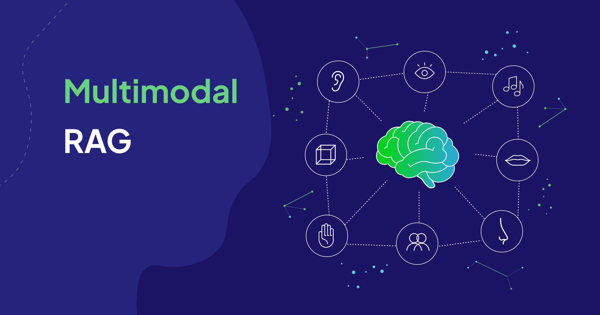
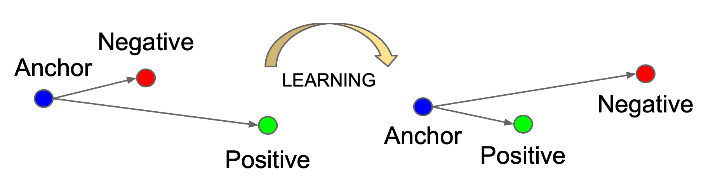
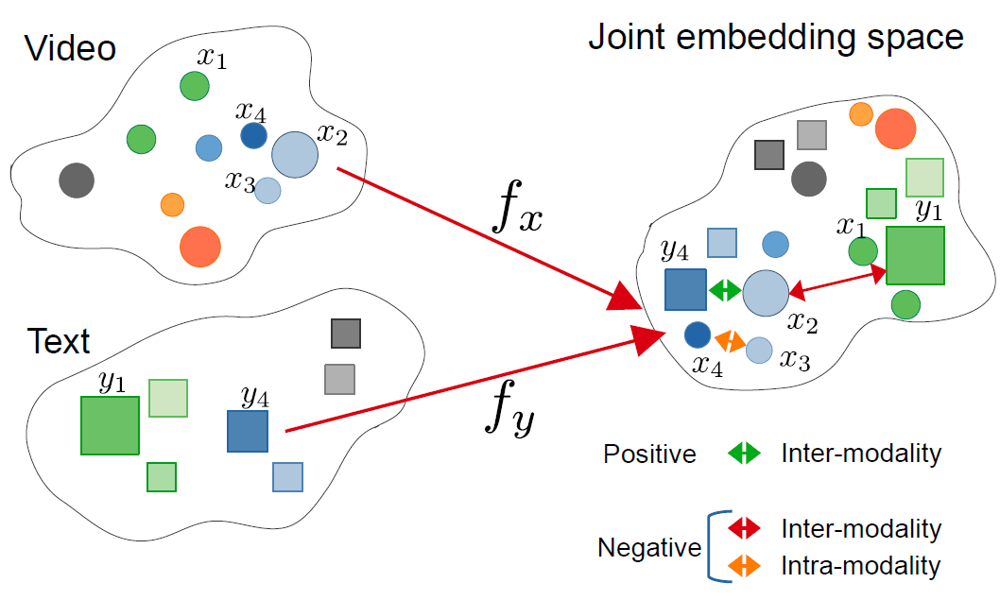
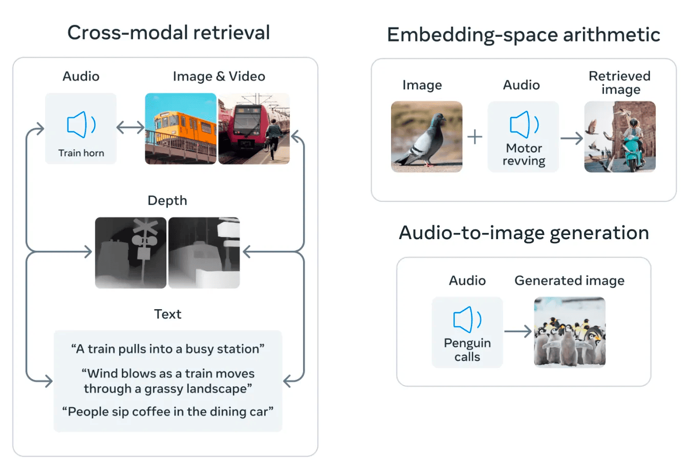

Multimodal Retrieval-Augmented Generation (MM-RAG) extends the capabilities of traditional [Retrieval-Augmented Generation (RAG)](https://weaviate.io/blog/introduction-to-rag) systems from text-only modalities to other modalities, like images, audio, and video. The multimodal aspect refers to both the retrieval pipeline with [multimodal embedding models](https://weaviate.io/blog/multimodal-models) the generation pipeline with multimodal generative models, such as vision language models.

[The average human hears and learns from about 1 billion words in their entire lifetime](https://youtu.be/Ckz8XA2hW84?t=2286). This might be an over-approximation, but it is in the correct ballpark because 1 billion seconds is about 30 years, and we don’t hear more than a few words per second. Accounting for sleeping, eating, and other activities, doing some back-of-the-napkin calculations, we can arrive at the above number.

The issue, however, is that current Large Language Models (LLMs) are trained on trillions of tokens, many orders of magnitude more data than we ever see in our lifetime. Yet they still don’t have as vivid of an understanding of the causal relationships that exist in the world. From this, we can infer that the way humans learn is fundamentally different from how our current state-of-the-art models learn.
Humans have a remarkable ability to learn and build world models through the integration of multiple sensory inputs. Our combination of senses works synergistically to provide us with rich and diverse information about our environment. By combining and interpreting these sensory inputs, we can form a coherent understanding of the world, make predictions, acquire new knowledge, and establish causal relationships very efficiently. Not only do humans capture and use multimodal representations of information, but given a task, we can also incorporate any of these modalities as context to help us guide our answers.

If you’d like to explore this line of thinking further and the potential problems that need to be addressed when getting computers to take advantage of multimodal data, have a look at my previous [blog on multimodal embedding models](https://weaviate.io/blog/multimodal-models).

:::info TLDR
In this post, we’ll touch on:

- **Contrastive Learning:** One particular approach to training multimodal embedding models that can understand images, audio, video, text, and more
- **Any-to-Any Search and Retrieval:** Using multimodal embedding models to perform any-to-any search and scaling these multimodal embeddings into production using [vector databases](https://www.notion.so/blog/what-is-a-vector-database), like Weaviate (w*ith code examples!*)
- **Multimodal Retrieval-Augmented Generation (MM-RAG)**: Augmenting the generation from Large Multimodal Models (LMMs) with multimodal information retrieval of images and more for visual question answering systems.
- **Code Demo of RAG**
:::

## Joint Embedding Space Through Contrastive Learning

One way to train a model that understands multimodal data including images, audio, video, and text is to first train individual models that understand each one of these modalities separately and then unify their representations of data using a process called contrastive training.

Contrastive training unifies the vector space representation of models by pushing conceptually different embeddings from different modalities further apart or pulling similar ones closer together. This is demonstrated in the image below:


*Source: [Schroff et al. 2015](https://arxiv.org/abs/1503.03832)*

This process was carried out in MetaAI’s [ImageBind paper](https://arxiv.org/abs/2305.05665) to unify vector spaces across 6 different modalities, including images, text, audio, and video. To successfully perform contrastive training they used multiple labeled datasets of positive points across multiple modalities and randomly sampled for negative points.

To get a better intuitive understanding of how this process works, imagine you embed the image of a lion into vector space using a vision model. The concept behind this object is similar to the audio of a lion roaring, so the audio object embedding can be used as a positive sample,e and the contrastive loss function works to pull these two points together in embedding space. On the other hand, the embedding of an image of a salad is a negative example and therefore needs to be pushed apart. Have a look at the modification of the above visual to account for cross-modal contrastive training:



*Source: [Zolfaghari et al. 2021](https://lmb.informatik.uni-freiburg.de/Publications/2021/ZB21/)*

If we can continually do this for a large enough dataset of labeled points, then we can tighten the representations of data objects in embedding space and even unify the models of different modalities. Another benefit of ImageBind was the use of frozen image model representations to bind other modalities with cross-modal contrastive loss training. This is why it's called ImageBind. Embeddings that start differently can then be pulled towards the image representations. Thus, all of the similar concepts across modalities can be unified such that a concept across all modalities will have similar vectors - demonstrated in the image below. To learn in more depth about contrastive representation learning, I would recommend this [blog](https://lilianweng.github.io/posts/2021-05-31-contrastive/).


*Shows a unified embedding model that captures meanings from any modality that was fused during the contrastive training step.*

## Any-to-Any Search

Once we have a unified embedding space, we can perform cross-modal object operations such as cross-modal search and retrieval. This means that we can pass in as a query any modality the model understands and use it to perform [vector similarity search](/blog/vector-search-explained) in multimodal embedding space, getting back objects of any other modality that are similar in concept. You can also use this unified embedding space to perform cross-modal embedding arithmetic. For example, you can answer questions like what an image of a pigeon and the audio of a bike revving look like together.

*[Source](https://imagebind.metademolab.com/)*

In [this Jupyter notebook](https://github.com/weaviate-tutorials/multimodal-workshop/blob/main/2-multimodal/1-multimedia-search-complete.ipynb), we show how you can use the `multi2vec-bind` module in Weaviate to use the ImageBind model to add multimedia files to a vector database. Then we can perform any-to-any search over that data. 

You can also use this diagram explaining any-to-any search to get an intuition of how the following code leverages the unified embedding space previously generated to perform the search.


*Any-to-any search: Shows that any of the modalities understood and embedded by the multimodal model can be passed in as a query, and objects of any modality that are conceptually similar can be returned.*

### Step 1: Create a Multimodal Collection

First, you need to create a collection that can hold data in different modalities, such as audio, images, and video.

```python
client.collections.create(
    name="Animals",
    vectorizer_config=wvc.config.Configure.Vectorizer.multi2vec_bind(
        audio_fields=["audio"],
        image_fields=["image"],
        video_fields=["video"],
    )
)
```

### Step 2: Insert Images and Other Media

```python
source = os.listdir("./source/image/")
items = list()
for name in source:
    print(f"Adding {name}")
    path = "./source/image/" + name
    items.append({
        "name": name,
        "path": path,
        "image": toBase64(path),
        "mediaType": "image"
    })
animals = client.collections.get("Animals")
animals.data.insert_many(items)
```

### Step 3: Performing Image Search

```python
response = animals.query.near_image(
    near_image=toBase64("./test/test-cat.jpg"),
    return_properties=['name','path','mediaType'],
    limit=3
)
```

For a more detailed breakdown, refer to the [complete notebook](https://github.com/weaviate-tutorials/multimodal-workshop/blob/main/2-multimodal/1-multimedia-search-complete.ipynb) and [supporting repository](https://github.com/weaviate-tutorials/).

Using a vector database, like Weaviate, to store and perform fast and real-time retrieval of object embeddings allows us to scale the usage of these multimodal models. This allows us to power multimodal search in production and to integrate into our applications the cross-modal operations that we've discussed.

## Multimodal Retrieval-Augmented Generation (MM-RAG)

RAG allows us to pack retrieved documents into a prompt so that a language model can read relevant information before generating a response. This allows us to scale the knowledge of large language models without having to train or fine-tune them every time we have updated information.

By externalizing the knowledge of a model, [RAG can provide](https://cs.stanford.edu/~myasu/blog/racm3/) benefits such as:
- **Scalability**: reducing the model size and training cost, as well as allowing easy expansion of knowledge
- **Accuracy**: grounding the model to facts and reducing hallucinations
- **Controllability**: allowing updating or customizing the knowledge by simply performing CRUD operations in a vector DB
- **Interpretability**: retrieved documents serving as the reference to the source in model predictions

However, the issue with text-only RAG systems is that they only leverage retrieved text source material. This is because most LLMs only understand language, and so any information that's retrieved had to be in text format … until now!

Recently, a group of large generative models, both closed and open source, has emerged that understand both text and images. As a result, we can now support multimodal RAG, where we can retrieve images from our vector database and pass those into the large multimodal model (LMM) to generate with. This simple two-step process, illustrated below, is the main idea behind multimodal RAG.


*Shows the two-step process of MM-RAG, involving retrieval from a multimodal knowledge base and then generation using a large multimodal model by grounding in the retrieved context.*

MM-RAG was [presented earlier this year](https://arxiv.org/abs/2211.12561) by a group at Stanford. They showed a workflow of multimodal models, one that could retrieve and another that could generate both text and images.

They also discussed the advantages of multimodal RAG:

- It significantly outperforms baseline multimodal models such as DALL-E and CM3 on both image and caption generation tasks.
- It requires much less compute while achieving better performance (<30% of DALLE)
- MM-RAG capable models also generate images much more faithful to the retrieved context. This means the quality of the generated images is better and grounded in the retrieved context image.
- Multimodal models are capable of multimodal in-context learning (e.g., image generation from demonstrations). This means that we can feed any demonstration images and text so that the model generates an image that follows the visual characteristics of these in-context examples.


MM-RAG gives us a way to further control the awesome generative power of these new multimodal models to produce more useful results for use in industry.

## Implementing a Multimodal RAG Example in Python

This section demonstrates how you can implement a multimodal RAG system with a multimodal information retrieval system by retrieving from a multimodal collection and then stuffing a `base64` encoded image along with a text prompt to OpenAI's GPT4 vision model. We then take the generated description and pass it into DALL-E-3 to recreate the image from the description.

You can find the full code for this example in [this Jupyter notebook](https://github.com/weaviate-tutorials/multimodal-workshop/blob/main/2-multimodal/2-multimedia-rag.ipynb).

### Retrieve an Object from a Multimodal Collection

```python
def retrieve_image(query):
    response = animals.query.near_text(
        query=query,
        filters=wvc.query.Filter(path="mediaType").equal("image"),
        return_properties=['name','path','mediaType','image'],
        limit = 1,
    )
    result = response.objects[0].properties
    print("Retrieved image object:",json.dumps(result, indent=2))
    return result
response = retrieve_image("dog with a sign")
SOURCE_IMAGE = response['image']
```

**Retrieved Image:**


### Generate a Text Description of the Image

Next, we will generate a text description of the image by using OpenAI's GPT4-V vision language model.

```python
import requests

def generate_description_from_image_gpt4(prompt, image64):
  headers = {
      "Content-Type": "application/json",
      "Authorization": f"Bearer {openai.api_key}"
  }
  payload = {
      "model": "gpt-4-vision-preview",
      "messages": [
        {
          "role": "user",
          "content": [
            {
              "type": "text",
              "text": prompt
            },
            {
              "type": "image_url",
              "image_url": {
                "url": f"data:image/jpeg;base64,{image64}" #base64 encoded image from Weaviate
              }
            }
          ]
        }
      ],
      "max_tokens": 300
  }
  response_oai = requests.post("https://api.openai.com/v1/chat/completions", headers=headers, json=payload)
  result = response_oai.json()['choices'][0]['message']['content']
  print(f"Generated description: {result}")
  return result
GENERATED_DESCRIPTION = generate_description_from_image_gpt4(
    prompt="This is an image of my pet, please give me a cute and vivid description.",
    image64=SOURCE_IMAGE
)
```
</details>

**Generated description:** This adorable image captures a charming French Bulldog sitting obediently against a vibrant red background. The pup's coat is predominantly white with distinctive black patches around the ears and eyes, giving it a look of natural elegance. Its expressive, wide-set eyes gleam with a mix of curiosity and anticipation, while the slight tilt of its head and those perky bat-like ears contribute to an overall image of endearing attentiveness.

The cuteness is amplified by a handwritten sign hung around its neck with the words "FREE KISSES" and a little heart symbol, extending a sweet and whimsical offer to all who come near. The sign, coupled with the dog's innocent gaze, conjures up feelings of warmth and companionship. This tiny ambassador of affection sits proudly, almost as if understanding the joy it brings to those around it. With its compact size and affectionate demeanor, this little canine looks ready to dispense unlimited love and puppy kisses on demand.

### Use Text to Reconstruct the Image from DALL-E-3 (Diffusion Model):

Currently, GPT4-V can't generate images. Therefore, we will use OpenAI's DALL-E-3 model instead:

```python
from openai import OpenAI
def generate_image_dalee3(prompt):
  openai_client = OpenAI()
  response_oai = openai_client.images.generate(
    model="dall-e-3",
    prompt=str(prompt),
    size="1024x1024",
    quality="standard",
    n=1,
  )
  result = response_oai.data[0].url
  print(f"Generated image url: {result}")
  return result
image_url = generate_image_dalee3(GENERATED_DESCRIPTION)
```

</details>

**Generated Image:**

## Recent Advancements in Multimodal RAG

Recent advancements in the retrieval mechanism with multimodal [late-interaction models](https://weaviate.io/blog/late-interaction-overview), such as ColPali, ColQwen, or ColQwen-Omni, as accelerated developments in multimodal RAG systems. In these modern AI systems, PDF documents are treated as multimodal documents that contain texts, images, tables, charts, etc.

For an example implementation, refer to [this notebook showcasing multimodal RAG on PDF documents using ColPali](https://github.com/weaviate/recipes/blob/main/weaviate-features/multi-vector/multi-vector-colipali-rag.ipynb)

## Conclusion
In this blog, we covered how we can extend the concept of RAG to include retrieval from a multimodal knowledge base. We also explained how multimedia can be embedded into a unified vector space and consequently how we can leverage vector databases to power any-to-any search. I hope you found this article useful! I'd love to connect on **X** at [@zainhasan6](https://twitter.com/ZainHasan6)!

import WhatNext from '/_includes/what-next.mdx'

<WhatNext />
