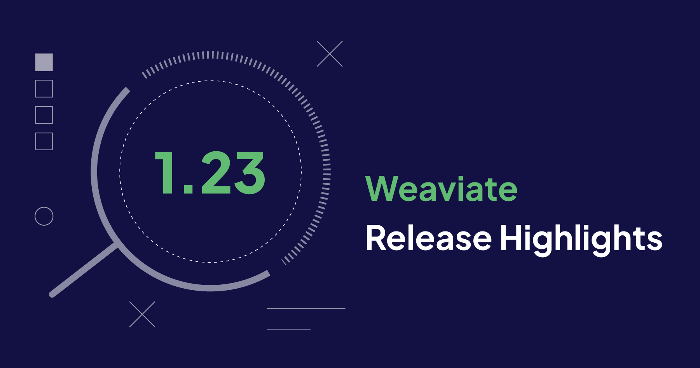
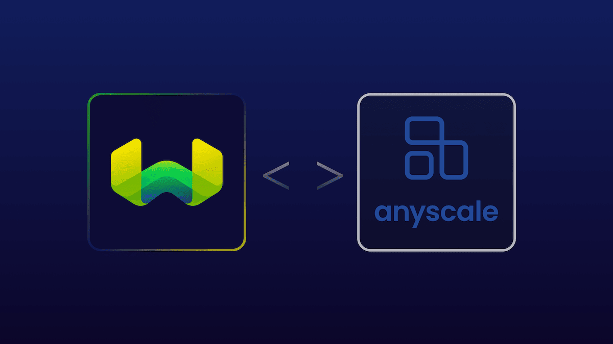

Weaviate `1.23` is here!

Here are the release ⭐️*highlights*⭐️ relating to this release:

<!-- truncate -->
1. **AutoPQ** - Weaviate now automatically triggers the use of Product Quantization (PQ) for vector indexing. This improves the developer experience for switching on PQ. We've also added auto `segment` size setting.
2. **Flat vector index + Binary Quantization** - Weaviate now supports another (`flat`) vector index type, with optional binary quantization. This is particularly useful for multi-tenancy use cases.
3. **OSS LLM support through Anyscale** - Weaviate now supports open-source large language models such as Llama2-70b, CodeLlama-34b or Mistral-7B-Instruct.
4. **Performance improvements** - We improved mean time to recovery (MMTR)) for Weaviate by changing the way shards are loaded. We also added automatic resource limiting to prevent out-of-memory errors.
5. **Minor changes** - The `nodes` endpoint has been updated with a new `minimal` output default for those of you with many shards/tenants.

:::tip Available on WCS
`1.23` is already available on [Weaviate Cloud Services](https://console.weaviate.cloud/) - so try it out!
:::

For more details, keep scrolling ⬇️!

## AutoPQ

Weaviate introduced Product Quantization (PQ) earlier this year. Since then, we've improved how PQ works with your data. In v1.23 we've made it easier to get started. PQ requires a training step. We've heard that the training step was tricky to configure, so we created AutoPQ to take care of the training for you. Just [enable AutoPQ](/developers/weaviate/configuration/pq-compression/#configure-autopq) in your system configuration. Then, any time you enable PQ on a new collection, AutoPQ takes care of training and initializes PQ for you.

We have other improvements too. PQ uses [segments](/developers/weaviate/concepts/vector-index/#what-is-product-quantization) to compress vectors. In this release we have an new algorithm to determine the optimal segment size for your vectors. You can still set the segment size manually, but you shouldn't have to.

Together, AutoPQ and improved segment sizing make using PQ easier than ever.

## Flat vector index + Binary Quantization

Weaviate now supports a new vector index type: `flat`, which is designed to minimize memory footprint for small object sets. This index type is particularly useful for multi-tenancy use cases, where each tenant's collection is relatively small.

## OSS LLM support (`generative-anyscale` module)

## Performance improvements
[Lazy shard loading](/developers/weaviate/concepts/data#lazy-shard-loading) allows you to start working with your data sooner. After a restart, shards load in the background. If the shard you want to query is already loaded, you can get your results right away. If the shard is not loaded yet, Weaviate prioritizes loading that shard and returns a response when it is ready.

## Minor changes

## Summary

That's all from us - we hope you enjoy the new features and improvements in Weaviate `1.23`. This release is already available on [WCS](https://console.weaviate.cloud/). So you can try it out yourself on a free sandbox, or by upgrading!

Thanks for reading, and see you next time 👋!
