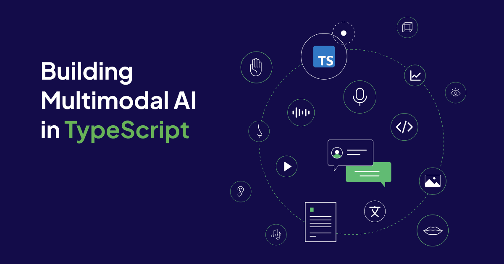
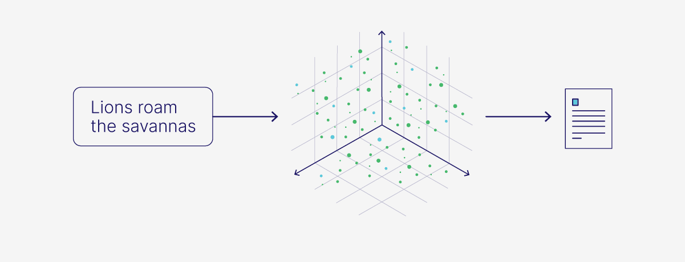
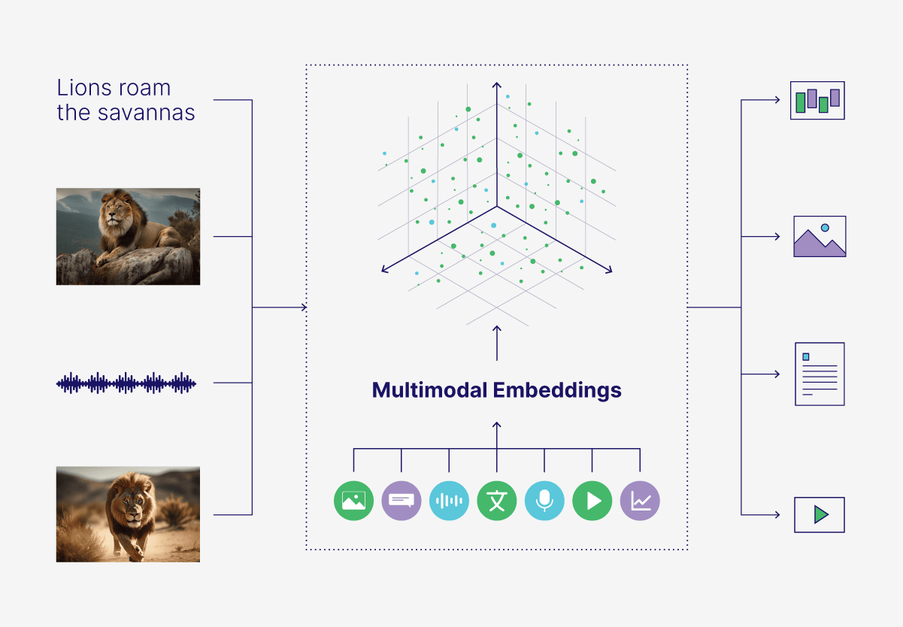

For a lot of people, Multimodal AI and its derivatives are strong contenders for technology of the year. The promises of Multimodal applications of artificial intelligence are exciting and speak to behavioral changes in media consumption and general interaction with the internet. I'm here to show you how you can get a piece of the pie. In this article, we’ll look at how to build Multimodal applications in Typescript and dive into everything that needs to happen in between.


## Modalities 
> A modality is a particular mode in which something exists or is experienced or expressed.

### Single Modality 

Historically, search has been over text, emphasizing the relevance of [keyword search](https://weaviate.io/developers/weaviate/search/bm25). This type of search was focused on matching text search terms to large datasets of text and returning the most relevant. This was the single modality; text search through data and get back text.

Even with the onset of multimedia; images, videos and audio. We leveraged metadata and attached text to these more complex modalities and essentially ran keyword searches. Still a single modality search. 

Early versions of large language models followed suit. With most being single modality models, with a single model inference.




### Multi Modality

In today's world, not only are people optimizing for TikTok searches but the video hosting service is the search engine of choice for a [majority of Gen Z](https://www.campaignasia.com/article/tiktok-trumps-google-as-a-search-engine-research-finds/492905). Multimodality enables search queries with multiple media types over multiple media types. Enabling you to text search over datasets of video or mixed media. 

Mostly enabled by [vector](https://weaviate.io/developers/weaviate/search/similarity) and [hybrid search](https://weaviate.io/developers/weaviate/search/hybrid), Vector databases by design are uniquely adapted to storing, indexing and enabling efficient retrieval for multimodal use cases. On the machine learning model side of things, we’re seeing the rise of multimodal models that can infer numerous modalities. 

This means, we can interact with an LLM via chat and have the LLMs generate text, audio or video. By definition, this would enable interaction with similar models via text or even video.





## Building our own Multimodal Search

Now that we have a better understanding on multi modal search, let’s build a search application with [Weaviate](https://weaviate.io/) and [Next.js](https://nextjs.org/)

Specwise, we want to be able to run text search through image, video and audio data without leveraging the files metadata. 


### Requirements

You need the following to go through with this tutorial. 

- An LTS version of [Node.js](https://nodejs.org/en/blog/release/v20.9.0)
- [Docker](https://www.docker.com/)
- [Git](https://git-scm.com/)

> The project that this tutorial is based on is [available on Github](https://github.com/malgamves/next-multimodal-search-demo) if you’d like to give it a try before going through with the tutorial. 


Create your Next.js application that comes with TypeScript, Tailwind CSS and the App Router with the following command.

```bash
create-next-app <project-name> –ts –tailwind –app 
```

### Getting Weaviate Running
In the newly created folder, create a `docker-compose.yml` and paste the following code in it. 

```yml
version: '3.4'
services:
  weaviate:
    image: semitechnologies/weaviate:1.23.4
    restart: on-failure:0
    ports:
      - "8080:8080"
    environment:
        QUERY_DEFAULTS_LIMIT: 25
        AUTHENTICATION_ANONYMOUS_ACCESS_ENABLED: 'true'
        PERSISTENCE_DATA_PATH: '/var/lib/weaviate'
        DEFAULT_VECTORIZER_MODULE: 'multi2vec-bind'
        ENABLE_MODULES: 'multi2vec-bind'
        BIND_INFERENCE_API: 'http://multi2vec-bind:8080'
        CLUSTER_HOSTNAME: 'node1'
  multi2vec-bind:
    image: semitechnologies/multi2vec-bind:imagebind
    environment:
      ENABLE_CUDA: '0'

```


Then run `docker-compose up -d` in your terminal to start an instance of Weaviate with [ImageBind](https://imagebind.metademolab.com/), our Multimodal model. This also enables us to use the [multi2vec-bind](https://weaviate.io/developers/weaviate/modules/retriever-vectorizer-modules/multi2vec-bind) module, the tool that enables us to store vector embeddings of video, text, audio and image data. 

### Importing Data

Next, we will create a Weavaite collection and import data into it. In your public folder, create three folders called image, audio, video. These will store the media  corresponding to their folder name. You can add your own data or [use the data I added](https://github.com/malgamves/next-multimodal-search-demo/tree/main/public) to build out the original application. 

Install the Weaviate Client and other project dependencies with the following command 
```bash
yarn add weaviate-ts-client use-debounce rimraf 
```

To import data, we need to create a folder called `src` and add do the following

Create a file called `client.ts`, 

```typescript
import weaviate, { WeaviateClient } from 'weaviate-ts-client';

let client: WeaviateClient;

export const getWeaviateClient = () => {
  if (!client) {
    client = weaviate.client({
      scheme: 'http',
      host: 'localhost:8080',
    });
  };
  
  return client;
}

```

This file 


Create a file called `util.ts`, 

```typescript
import {readdirSync, readFileSync, } from 'fs'

export interface FileInfo {
    name: string;
    path: string;
}

export const listFiles = (path: string): FileInfo[] => {
    return readdirSync(path).map((name) => {
        return {
            name: name,
            path: `${path}${name}`,
        }
    });
}

export const getBase64 = (file: string) => {
    return readFileSync(file, { encoding: 'base64' });
}

```

This file 


Create a file called `import.ts`, 

```typescript
import { ObjectsBatcher, WeaviateClient, generateUuid5 } from 'weaviate-ts-client';
import { getWeaviateClient } from './client';
import { FileInfo, getBase64, listFiles } from './util';

const sourceBase = 'public';
const sourceImages = sourceBase + '/image/'
const sourceAudio = sourceBase + '/audio/';
const sourceVideo = sourceBase + '/video/';

const client: WeaviateClient = getWeaviateClient();

export const importMediaFiles = async (collectionName: string) => {
    await insertImages(collectionName);
    await insertAudio(collectionName);
    await insertVideo(collectionName);
}

const insertImages = async (collectionName: string) => {
    let batcher: ObjectsBatcher = client.batch.objectsBatcher();
    let counter = 0;
    const batchSize = 5;

    const files = listFiles(sourceImages);
    console.log(`Importing ${files.length} images.`)

    for (const file of files) {
        const item = {
            name: file.name,
            image: getBase64(file.path),
            media: 'image'
        };
        
        console.log(`Adding [${item.media}]: ${item.name}`);

        batcher = batcher.withObject({
            class: collectionName,
            properties: item,
            id: generateUuid5(file.name)
        });

        if (++counter == batchSize) {
            console.log(`Flushing ${counter} items.`)

            // flush the batch queue
            await batcher.do();
      
            // restart the batch queue
            counter = 0;
            batcher = client.batch.objectsBatcher();
        }
    }

    if (counter > 0) {
        console.log(`Flushing remaining ${counter} item(s).`)
        await batcher.do();
        
    }
}


const insertAudio = async (collectionName: string) => {
    let batcher: ObjectsBatcher = client.batch.objectsBatcher();
    let counter = 0;
    const batchSize = 3;

    const files = listFiles(sourceAudio);
    console.log(`Importing ${files.length} audio files.`)

    for (const file of files) {
        const item = {
            name: file.name,
            audio: getBase64(file.path),
            media: 'audio'
        };

        console.log(`Adding [${item.media}]: ${item.name}`);
        
        batcher = batcher.withObject({
            class: collectionName,
            properties: item,
            id: generateUuid5(file.name)
        });

        if (++counter == batchSize) {
            console.log(`Flushing ${counter} items.`)
            // flush the batch queue
            await batcher.do();
      
            // restart the batch queue
            counter = 0;
            batcher = client.batch.objectsBatcher();
        }
    }

    if (counter > 0) {
        console.log(`Flushing remaining ${counter} item(s).`)
        await batcher.do();
    }
}

const insertVideo = async (collectionName: string) => {
    let batcher: ObjectsBatcher = client.batch.objectsBatcher();
    let counter = 0;
    const batchSize = 1;

    const files = listFiles(sourceVideo);
    console.log(`Importing ${files.length} video files.`)

    for (const file of files) {
        const item = {
            name: file.name,
            video: getBase64(file.path),
            media: 'video'
        };

        console.log(`Adding [${item.media}]: ${item.name}`);
        
        batcher = batcher.withObject({
            class: collectionName,
            properties: item,
            id: generateUuid5(file.name)
        });

        if (++counter == batchSize) {
            console.log(`Flushing ${counter} items.`)
            // flush the batch queue
            await batcher.do();
      
            // restart the batch queue
            counter = 0;
            batcher = client.batch.objectsBatcher();
        }
    }

    if (counter > 0) {
        console.log(`Flushing remaining ${counter} item(s).`)
        await batcher.do();
    }
}

```

This file 

Create a file called `collection.ts`, 

```typescript
import { WeaviateClient } from 'weaviate-ts-client';
import { getWeaviateClient } from './client';

const client: WeaviateClient = getWeaviateClient();

const collectionExists = async (name: string) => {
  return client.schema.exists(name);
}

export const createBindCollection = async (name: string) => {
  if(await collectionExists(name)) {
    console.log(`The collection [${name}] already exists. No need to create it.`);
    return;
  }
  
  console.log(`Creating collection [${name}].`);

  const bindSchema = {
    class: name,
    moduleConfig: {
      'multi2vec-bind': {
        // textFields: ['name'],
        imageFields: ['image'],
        audioFields: ['audio'],
        videoFields: ['video'],
      }
    },
    properties: [
      {
        name: 'name',
        dataType: ['text'],
        moduleConfig: {
          'multi2vec-bind': { skip: true },
        },
      },
      {
        name: 'media',
        dataType: ['text'],
        moduleConfig: {
          'multi2vec-bind': { skip: true },
        },
      },
      {
        name: 'image',
        dataType: ['blob'],
      },
      {
        name: 'audio',
        dataType: ['blob'],
      },
      {
        name: 'video',
        dataType: ['blob'],
      }
    ],
    vectorIndexType: 'hnsw',
    vectorizer: 'multi2vec-bind'
  }
  
  const res = await client
    .schema.classCreator()
    .withClass(bindSchema)
    .do();

  console.log(JSON.stringify(res, null, 2));
}

export const deleteCollection = async (name: string) => {
  console.log(`Deleting collection ${name}...`);
  await client.schema
  .classDeleter()
  .withClassName(name)
  .do();

  console.log(`Deleted collection ${name}.`);
}

```

This file 


Create a file called `index.ts`, 

```typescript
import { createBindCollection, deleteCollection } from './collection';
import { importMediaFiles } from './import';

const collectionName = 'BindExample';

const run = async () => {
  await deleteCollection(collectionName);
  await createBindCollection(collectionName);
  await importMediaFiles(collectionName);
}

run();

```

This file 

Now we have everything we need to import data, 

We need to add scripst to our `package.json`

```js
  …
"scripts": {
    	…
    "preimport": "rimraf ./build && tsc src/*.ts --outDir build",
    "import": "npm run preimport && node build/index.js"
      …
  },
  …
```


We can now run 

```bash
yarn run import 
```

### Building Search Functionality


Now we need to create a couple of components that will go in our web application.

Create a file called search.tsx and paste the following code in it.

```typescript 
'use client'

import { useSearchParams, usePathname, useRouter } from "next/navigation"
import { useDebouncedCallback } from "use-debounce"

export default function Search({ placeholder }: { placeholder: string }) {
    const searchParams = useSearchParams()
    const pathname = usePathname()
    const { replace } = useRouter()

    const handleSearch = useDebouncedCallback((term: string) => {
        const params = new URLSearchParams(searchParams.toString())
        if (term) {
            params.set("search", term)
        } else {
            params.delete("search")
        }
        replace(pathname + "?" + params)
    }, 300);
    return (
        <div className="pt-20">
            <div className="relative">
                <label htmlFor="search" className="sr-only"> Search </label>
                <input
                    type="search"
                    id="search"
                    placeholder={placeholder}
                    onChange={(e) => handleSearch(e.target.value)}
                    defaultValue={searchParams.get("search")?.toString()}
                    className="w-[400px] h-12 rounded-md bg-gray-200 p-2 shadow-sm sm:text-sm"
                />
            </div>
        </div>
    )
}

```


Optionally, you can import the footer and search components, we don’t really need them for the app but they make the app look nicer! 


In the app folder, paste the following code in page.tsx, 

```typescript
import Footer from '@/components/footer';
import Search from '../components/search'
import Link from 'next/link'

import weaviate, {
  WeaviateClient,
  WeaviateObject,
} from "weaviate-ts-client";
import Navigation from '@/components/navigation';

const client: WeaviateClient = weaviate.client({
  scheme: 'http',
  host: 'localhost:8080',
});


export default async function Home({
  searchParams
}: {
  searchParams?: {
    search?: string;
  }
}) {
  const search = searchParams?.search || "";
  const data = await searchDB(search);


  return (
    <html lang="en">
      <body>
        <div className="fixed h-screen w-full bg-gradient-to-br from-lime-100 via-teal-50 to-amber-100" />
        
        <Navigation /> 

        <main className="flex min-h-screen w-full flex-col items-center justify-center py-32">

          <Search placeholder="Search for a word" />

          <div className="relative flex grid grid-cols-1 gap-4 lg:grid-cols-4 lg:gap-8 p-20">

            {data.map((result: WeaviateObject) => (
              <div key={result?._additional.id} className="">

                <div className="h-40 w-50">
                  <p className=" w-16 h-6 mt-2 ml-2 block text-center whitespace-nowrap items-center justify-center rounded-lg translate-y-8 transform  bg-white px-2.5 py-0.5 text-sm text-black">
                    {result.media}
                  </p>

                  {result?.media == 'image' &&
                    
                  }

                  {result?.media == 'audio' &&
                    <audio controls src={
                      '/' + result.media + '/' + result.name
                    } className='block object-none w-full h-full rounded-lg'>
                      Your browser does not support the audio element.
                    </audio>

                  }

                  {result.media == 'video' &&
                    <video controls src={
                      '/' + result.media + '/' + result.name
                    } className='block object-none w-full h-full rounded-lg'>
                      Your browser does not support the video element.
                    </video>

                  }

                </div>

              </div>
            ))}
          </div>
        </main>
        <Footer />
      </body>
    </html>
  )
}


async function searchDB(search: string) {

  const res = await client.graphql
    .get()
    .withClassName("BindExample")
    .withFields("media name _additional{ certainty id }")
    .withNearText({ concepts: [`${search}`] })
    .withLimit(8)
    .do();

  return res.data.Get.BindExample;
}

```

In our `searchDB()`, do this  

Then you should see this 


## Conclusion

We just saw how to leverage a Multimodal AI model to power our MultiModal search in Typescript with Next.js. A lot is happening in the space and this only just scratches the surface of Multimodal use cases. One could take this a step further and enable search via image, video or audio uploads. Another avenue worth expoloring is generative multimodal models to either enhance results or interact with existing datasets. If this is something you find interesting or would love to continue a conversation on, find me online as [malgamves](https://malgamves.dev).


import WhatNext from '/_includes/what-next.mdx'

<WhatNext />
