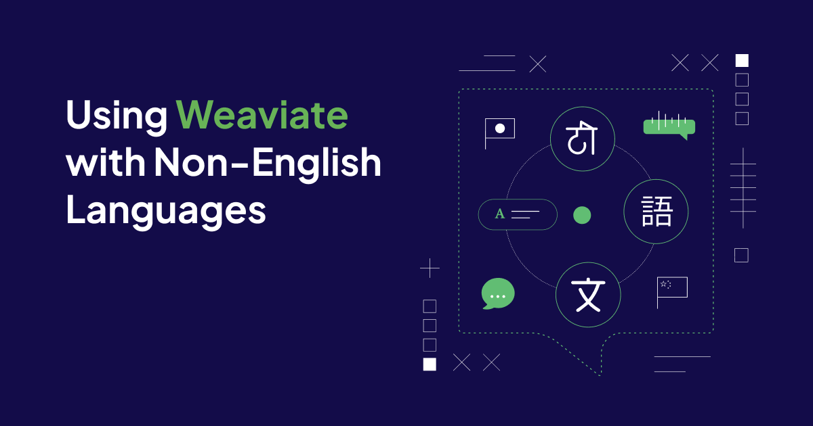
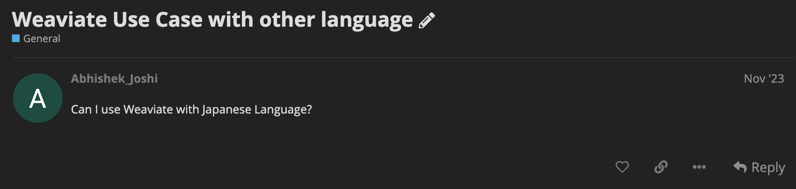

Recently, many embedding models and large language models (LLMs) have shown great benefits, especially in English-centric contexts. As English is the [most spoken language in the world](https://www.statista.com/statistics/266808/the-most-spoken-languages-worldwide/), many language models excel in English. However, as semantic search and Generative AI applications need to be able to handle languages other than English, many language models with multilingual capabilities have already been released.
This blog is inspired by [a recent question in our forum asking if you can use Weaviate with the Japanese language](https://forum.weaviate.io/t/weaviate-use-case-with-other-language/899).



Generally speaking: Yes, using a Weaviate [vector database](https://weaviate.io/blog/what-is-a-vector-database) for semantic and generative search in non-English languages is possible if the embedding models and LLMs used support your language of choice.

This blog explores how you can use Weaviate in your search and generative AI applications with non-English languages. Specifically, this blog discusses the challenges of non-English languages, such as the necessity of capable language models and the intricacies of languages that cannot be ASCII encoded, such as Chinese, Hindi, or Japanese. Finally, it discusses the current limitations of Weaviate when using non-English languages.

## Challenges of Using Weaviate with Non-English Languages

Different languages, such as vocabulary, grammar, and alphabets, differ in many aspects. These differences result in two key challenges when working with non-English languages in search or generative AI applications.

### Language models

Whether you are using English or any other language, you need to make sure the embedding model and LLM you are using support your specific language. For example, [`text2vec-cohere`’s `embed-multilingual-v3.0`](https://weaviate.io/blog/cohere-multilingual-with-weaviate) or `text2vec-openai`’s `text-embedding-ada-002` both support multiple languages. Make sure to check the chosen [vectorizer module’s](https://weaviate.io/developers/weaviate/modules/retriever-vectorizer-modules) documentation to ensure the embedding model supports your language of choice. The same applies to the [generator modules](https://weaviate.io/developers/weaviate/modules/reader-generator-modules).

### Character encoding

Different languages can use different alphabets, which are represented differently in computer science. The Standard ASCII format can represent the English alphabet, which encodes 128 specified characters within one byte. However, you will require the Unicode encoding standard to represent alphabets with a wider variety of characters.

Unicode is a widely used encoding standard representing characters in so-called code points. You might have already seen a string like the following before:

```python
'\u8da3\u5473\u306f\u91ce\u7403\u3067\u3059\u3002'
```

This is a sequence of escaped Unicode characters and can be easily converted to human-readable Japanese characters (”趣味は野球です。”, which means “My hobby is baseball.”).

## How to use Weaviate with Non-English Languages

This section uses our standard [Quickstart](https://weaviate.io/developers/weaviate/quickstart) tutorial to showcase a simple semantic search query on Japanese text data instead of English. The sample data points are taken from the [forum question](https://forum.weaviate.io/t/weaviate-use-case-with-other-language/899). You can find the related Notebook in [our GitHub repository](https://github.com/weaviate/recipes/blob/main/data-with-vectors/vector_search_japanese.ipynb).

### Step 1: Create a Weaviate database and install a client library[](https://weaviate.io/developers/weaviate/quickstart#step-1-create-a-weaviate-database)

The first couple of steps are exactly the same for any language. 

First, you need to create a Weaviate instance to work with. For testing purposes, we recommend creating a free cloud sandbox instance on [Weaviate Cloud Services (WCS)](https://console.weaviate.cloud/) by following the [WCS quickstart](https://weaviate.io/developers/wcs/quickstart) instructions. 

Next, you need to install your preferred [Weaviate client](https://weaviate.io/developers/weaviate/client-libraries) to work with your preferred programming language.

```powershell
pip install "weaviate-client==3.*"
```

### Step 2: Connect to Weaviate and define a data collection

To connect to your Weaviate instance, you need the URL and API key for your Weaviate instance (get it from WCS `Details` tab). Also, you will need the API key for the inferencing services you are going to use. As discussed in "Language models," make sure your model supports the language you intend to use. In this case, OpenAI’s `text-embedding-ada-002` model supports Japanese.

Run the following example code to connect to Weaviate. You can re-use the resulting `client` object in the following steps.

```python
import weaviate
import json
import os

client = weaviate.Client(
    url = os.environ["WEAVIATE_URL"],
    auth_client_secret=weaviate.AuthApiKey(api_key=os.environ["WEAVIATE_API_KEY"]),
    additional_headers = {
        "X-OpenAI-Api-Key": os.environ["OPENAI_API_KEY"]
    }
)
```

Next, we define a data collection to store objects in. The following schema configures a class object with the name `MyCollection` and a vectorizer module `text2vec-openai`, which configures OpenAI’s `text-embedding-ada-002` model by default. Additionally, the schema defines one text property `content`. Finally, you can use this schema to create the class.

```python
schema = {
    "class": "MyCollection",
    "vectorizer": "text2vec-openai",
    "moduleConfig": {
        "text2vec-openai": {},
    },
    "properties" : [
        {
            "name" : "content",
            "dataType" : ["text"],
        }
    ]
}

client.schema.create_class(schema)
```

### Step 3: Add data objects in Japanese[](https://weaviate.io/developers/weaviate/quickstart#step-5-add-objects)

You can now add objects to Weaviate. The defined `vectorizer` automatically creates a vector embedding for each object during import. The following code loads the sample data and individually adds the data objects to the target class (`MyCollection`).

```python

data = [
    "私の名前は鈴木(Suzuki)です。趣味は野球です。", # My name is Suzuki. My hobby is baseball.
    "私の名前は佐藤(Sato)です。趣味はサッカーです。", # My name is Sato. My hobby is soccer.
    "私の名前は田中(Tanaka)です。趣味はテニスです。" # My name is Tanaka. My hobby is tennis.
]

client.batch.configure(batch_size=10)  # Configure batch

# Batch import all objects
# (Yes, batch import is an overkill for 3 objects, but it is recommended for large volumes of data)
with client.batch as batch:
    for item in data:
        properties = {
         "content": item
        }

        # the call that performs data insert
        batch.add_data_object(
            class_name="MyCollection",
            data_object=properties,
        )
```

### Step 4: Semantic search query[](https://weaviate.io/developers/weaviate/quickstart#step-6-queries)

Finally, you can run a simple semantic search query on your Weaviate instance. In this case, a `nearText` search looks for objects in Weaviate with vectors most similar to those for the given input text. Run the following code to search for objects whose vectors are most similar to that of バトミントン(badminton).

```python
response = (
    client.query
    .get("MyCollection", ["content"])
    .with_near_text({"concepts": ["バトミントン"]})
    .with_limit(2)
    .do()
)

print(json.dumps(response, indent=4, ensure_ascii=False))
```

If you have set [`ensure_ascii=False`](https://docs.python.org/3/library/json.html) in your `json.dumps()` function when printing the response, you should see results like this:

```json
{
    "data": {
        "Get": {
            "MyCollection": [
                {
                    "content": "私の名前は鈴木(Suzuki)です。趣味は野球です。"
                },
                {
                    "content": "私の名前は田中(Tanaka)です。趣味はテニスです。"
                }
            ]
        }
    }
}
```

The response includes a list of objects whose vectors are most similar to the word バトミントン. 

Note that if you don’t set `ensure_ascii=False`, the default will be `ensure_ascii=True` and thus, you will see the results in escaped Unicode:

```json
{
    "data": {
        "Get": {
            "MyCollection": [
                {
                    "content": "\u79c1\u306e\u540d\u524d\u306f\u9234\u6728(Suzuki)\u3067\u3059\u3002\u8da3\u5473\u306f\u91ce\u7403\u3067\u3059\u3002"
                },
                {
                    "content": "\u79c1\u306e\u540d\u524d\u306f\u7530\u4e2d(Tanaka)\u3067\u3059\u3002\u8da3\u5473\u306f\u30c6\u30cb\u30b9\u3067\u3059\u3002"
                }
            ]
        }
    }
}
```

To explore different queries, such as semantic search with filters or generative search, check out the related [Jupyter Notebook on GitHub](https://github.com/weaviate/recipes/blob/main/data-with-vectors/vector_search_japanese.ipynb).

# Current Limitations of Using Weaviate with Non-English Languages

As you saw, you can use the Weaviate vector database for semantic and generative search applications in non-English languages. However, we currently don’t have any official support/policy for non-English languages, which leads to some limitations.

This limitation mainly affects [Weaviate’s keyword-based search functionality BM25](https://weaviate.io/developers/weaviate/search/bm25), as we currently only have the standard English tokenizer. This means the BM25 search will return an error for most non-English languages, especially ones requiring Unicode encoding.

This limitation also affects [Weaviate’s hybrid search functionality](https://weaviate.io/developers/weaviate/search/hybrid). While you can conduct hybrid search queries without getting an error, all hybrid search queries with an `alpha != 0` will return the same results as pure semantic search. Hybrid search with an `alpha = 0` (pure keyword-based search) will return an empty result list.

As you can see, Weaviate currently doesn’t cover full support for non-English languages. However, we would love to support other languages in the future. Currently, we are experimenting with implementing [tokenisers for Japanese and Chinese](https://github.com/weaviate/weaviate/pull/4028/files/b7b60b32662209e9ce58dd4d32e29ed919f5590b#). Please contact us on [Slack](https://weaviate.io/slack) if you are interested in contributing to adding non-English language support.

## Summary

This blog showcased that you can use Weaviate for semantic and generative searches with non-English languages, such as Japanese, in your search and generative AI applications. To enable this functionality, you need to consider the following two points:

- Ensure your embedding model (and LLM for generative searches) supports the chosen language.
- Ensure to convert the escaped Unicode characters to human-readable characters by adding `ensure_ascii=False` to the `json.dumps()` function when printing the responses.

You can jump in and explore different queries with the related [Jupyter Notebook on GitHub](https://github.com/weaviate/recipes/blob/main/data-with-vectors/vector_search_japanese.ipynb).

Please contact us on [Slack](https://weaviate.io/slack) if you are interested in contributing to adding non-English language support.

import WhatNext from '/_includes/what-next.mdx'

<WhatNext />
