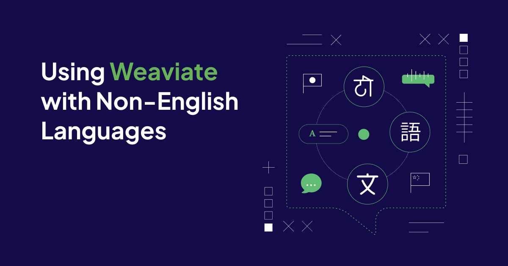
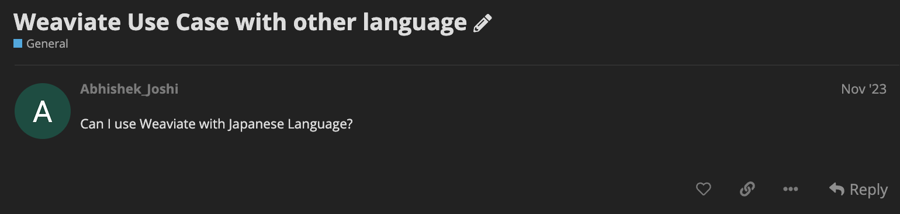

Recently, many embedding models and large language models (LLMs) have shown great benefits, especially in English-centric contexts. As English is the [most spoken language in the world](https://www.statista.com/statistics/266808/the-most-spoken-languages-worldwide/), many language models excel in English. However, as semantic search and Generative AI applications need to be able to handle languages other than English, many language models with multilingual capabilities have already been released.
This blog is inspired by [a recent question in our forum asking if you can use Weaviate with the Japanese language](https://forum.weaviate.io/t/weaviate-use-case-with-other-language/899).



Generally speaking: Yes, using a Weaviate [vector database](https://weaviate.io/blog/what-is-a-vector-database) for semantic and generative search in non-English languages is possible if the embedding models and LLMs used support your language of choice.

This blog explores how you can use Weaviate in your search and generative AI applications with non-English languages. Specifically, this blog discusses the challenges of non-English languages, such as the necessity of capable language models and the intricacies of languages that cannot be ASCII encoded, such as Chinese, Hindi, or Japanese. Finally, it discusses the current limitations of Weaviate when using non-English languages.

## Challenges of Using Weaviate with Non-English Languages

Different languages, such as vocabulary, grammar, and alphabets, differ in many aspects. These differences result in two key challenges when working with non-English languages in search or generative AI applications.

### Language models

Whether you are using English or any other language, you need to make sure the embedding model and LLM you are using support your specific language. For example, `text2vec-cohere`'s `embed-multilingual-v3.0` and `text2vec-openai`'s `text-embedding-3-large` both support a broad set of languages. Check the chosen [vectorizer module's](https://docs.weaviate.io/weaviate/model-providers) documentation to ensure the embedding model supports your language. The same applies to the [generator integrations](https://docs.weaviate.io/weaviate/model-providers).

### Character encoding

Different languages can use different alphabets, which are represented differently in computer science. The Standard ASCII format can represent the English alphabet, which encodes 128 specified characters within one byte. However, you will require the Unicode encoding standard to represent alphabets with a wider variety of characters.

Unicode is a widely used encoding standard representing characters in so-called code points. You might have already seen a string like the following before:

```python
'\u8da3\u5473\u306f\u91ce\u7403\u3067\u3059\u3002'
```

This is a sequence of escaped Unicode characters and can be easily converted to human-readable Japanese characters (”趣味は野球です。”, which means “My hobby is baseball.”).

## How to use Weaviate with Non-English Languages

This section uses our standard [Quickstart](https://docs.weaviate.io/weaviate/quickstart) tutorial to showcase a simple semantic search query on Japanese text data instead of English. The sample data points are taken from the [forum question](https://forum.weaviate.io/t/weaviate-use-case-with-other-language/899). You can find the related Notebook in [our GitHub repository](https://github.com/weaviate/recipes/blob/main/weaviate-features/search-with-vectors-or-multi-lingual/vector_search_japanese.ipynb).

### Step 1: Create a Weaviate database and install a client library

The first couple of steps are exactly the same for any language.

First, you need to create a Weaviate instance to work with. For testing purposes, we recommend creating a free cloud sandbox instance on [Weaviate Cloud](https://console.weaviate.cloud/) by following the [Weaviate Cloud quickstart](https://docs.weaviate.io/wcs/quickstart) instructions.

Next, you need to install your preferred [Weaviate client](https://docs.weaviate.io/weaviate/client-libraries) to work with your preferred programming language.

```bash
pip install -U weaviate-client
```

### Step 2: Connect to Weaviate and define a data collection

To connect to your Weaviate instance, you need the URL and API key for your Weaviate instance (in the Weaviate Cloud `Details` tab). Also, you will need the API key for the inferencing services you are going to use. As discussed in "Language models," make sure your model supports the language you intend to use. In this case, OpenAI’s `text-embedding-3-large` model supports Japanese.

Run the following example code to connect to Weaviate. You can re-use the resulting `client` object in the following steps.

```python
import os
import weaviate
from weaviate.classes.init import Auth
from weaviate.classes.config import Configure, Property, DataType

client = weaviate.connect_to_weaviate_cloud(
    cluster_url=os.environ["WEAVIATE_URL"],
    auth_credentials=Auth.api_key(os.environ["WEAVIATE_API_KEY"]),
    headers={"X-OpenAI-Api-Key": os.environ["OPENAI_API_KEY"]},
)
```

Next, we define a data collection to store objects in. The following schema configures a class object with the name `MyCollection` and a vectorizer module `text2vec-openai`, which configures OpenAI’s `text-embedding-3-large` model by default. Additionally, the schema defines one text property `content`. Finally, you can use this schema to create the class.

```python
client.collections.create(
    name="MyCollection",
    vector_config=Configure.Vectors.text2vec_openai(model="text-embedding-3-large"),
    properties=[Property(name="content", data_type=DataType.TEXT)],
)
```

### Step 3: Add data objects in Japanese

Now add objects to Weaviate. The vectorizer automatically generates embeddings during import.

```python
data = [
    "私の名前は鈴木(Suzuki)です。趣味は野球です。",   # My name is Suzuki. My hobby is baseball.
    "私の名前は佐藤(Sato)です。趣味はサッカーです。",   # My name is Sato. My hobby is soccer.
    "私の名前は田中(Tanaka)です。趣味はテニスです。",  # My name is Tanaka. My hobby is tennis.
]

collection = client.collections.use("MyCollection")

with collection.batch.dynamic() as batch:
    for item in data:
        batch.add_object(properties={"content": item})
```

### Step 4: Semantic search query

Run a `near_text` query — it finds objects whose vectors are most similar to the query string. Here, we search for objects most similar to バトミントン (badminton).

```python
response = collection.query.near_text(query="バトミントン", limit=2)

for obj in response.objects:
    print(obj.properties["content"])
```

You should see the two Japanese objects whose content is most semantically related to badminton:

```text
私の名前は鈴木(Suzuki)です。趣味は野球です。
私の名前は田中(Tanaka)です。趣味はテニスです。
```

The first object is about baseball (野球), the second about tennis (テニス) — both racquet/ball sports closer to badminton than soccer. Working with Japanese text directly avoids the escaped-Unicode form you'd see if you passed the response through `json.dumps()` with `ensure_ascii=True`.

To explore other queries — filters, generative search, hybrid — see the [companion Jupyter Notebook](https://github.com/weaviate/recipes/blob/main/weaviate-features/search-with-vectors-or-multi-lingual/vector_search_japanese.ipynb).

## Enabling BM25 and hybrid search for non-English languages

The example above uses pure vector search, which is language-agnostic. BM25 keyword search and hybrid search both depend on tokenization — and Weaviate's default `word` tokenizer is built for whitespace-delimited Latin scripts. For Japanese, Chinese, Korean, and other languages without whitespace tokens, you tell Weaviate which tokenizer to use *per property*.

Weaviate ships [language-specific tokenizers](https://docs.weaviate.io/weaviate/config-refs/collections#language-specific-tokenization) for the cases where the default falls down:

- **`gse`** and **`gse_ch`** — Japanese / Chinese, dictionary-based
- **`kagome_ja`** — Japanese, morphological
- **`kagome_kr`** — Korean
- **`trigram`** — 3-character n-grams; works as a fallback for any script

Pick the tokenizer at the property level when you create the collection. Here's the same `MyCollection` reconfigured to support BM25 on Japanese text using `kagome_ja`:

```python
from weaviate.classes.config import Configure, Property, DataType, Tokenization

client.collections.create(
    name="MyCollection",
    vector_config=Configure.Vectors.text2vec_openai(model="text-embedding-3-large"),
    properties=[
        Property(
            name="content",
            data_type=DataType.TEXT,
            tokenization=Tokenization.KAGOME_JA,
        ),
    ],
)
```

The `kagome_ja` and `kagome_kr` tokenizers are opt-in: enable them on the server by setting the corresponding environment variables (`ENABLE_TOKENIZER_KAGOME_JA=true`, `ENABLE_TOKENIZER_KAGOME_KR=true`) on your Weaviate instance. The `gse`/`gse_ch`/`trigram` tokenizers work the same way — set `tokenization=Tokenization.GSE` (or `TRIGRAM`) on the property.

With a Japanese-aware tokenizer in place, both BM25 and hybrid search work as expected on Japanese text:

```python
collection = client.collections.use("MyCollection")

# Pure keyword (BM25) — now produces real matches on Japanese content
bm25 = collection.query.bm25(query="野球", limit=2)

# Hybrid — combines vector + BM25 with the alpha you choose
hybrid = collection.query.hybrid(query="バトミントン", alpha=0.5, limit=2)
```

For a deeper dive into tokenization choices, accent folding, custom stopword presets, and the `/v1/tokenize` inspection endpoint, see [Text analysis for hybrid search](/blog/tokenization-text-analysis-weaviate).

## Summary

This blog showcased that you can use Weaviate for semantic and generative searches with non-English languages, such as Japanese, in your search and generative AI applications. To enable this functionality, you need to consider the following two points:

- Ensure your embedding model (and LLM for generative searches) supports the chosen language.
- For BM25 and hybrid search over non-Latin scripts, set a language-specific tokenizer (`kagome_ja`, `gse`, `trigram`, etc.) on the relevant property. See [Text analysis for hybrid search](/blog/tokenization-text-analysis-weaviate) for details.

You can jump in and explore different queries with the related [Jupyter Notebook on GitHub](https://github.com/weaviate/recipes/blob/main/weaviate-features/search-with-vectors-or-multi-lingual/vector_search_japanese.ipynb).


import WhatNext from '/_includes/what-next.mdx'

<WhatNext />
