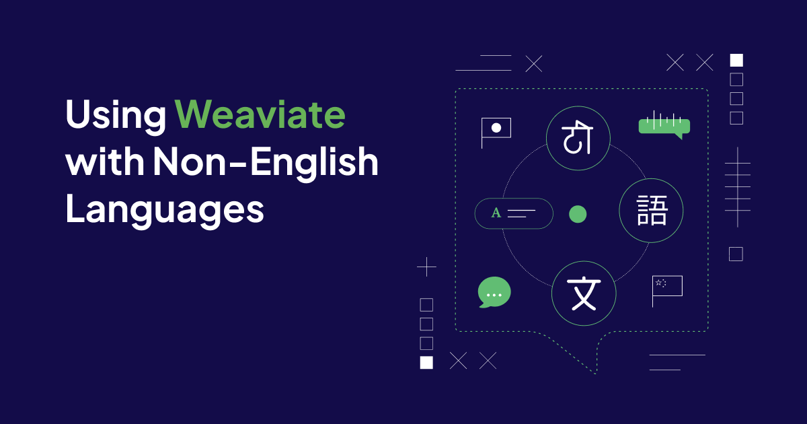
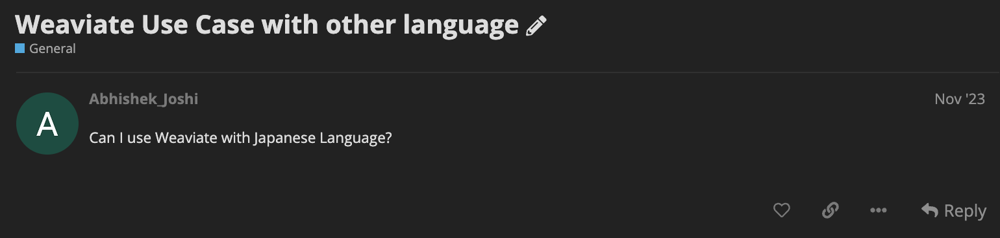

:::note Post updated
When this post was published in January 2024, Weaviate shipped only an English tokenizer, so keyword search on Japanese, Chinese, and Korean text did not work. That limitation is gone. Weaviate now ships language-specific tokenizers, and BM25 and hybrid search work on those languages. The original "Current Limitations" section has been replaced by [Enabling BM25 and Hybrid Search for Non-English Languages](#enabling-bm25-and-hybrid-search-for-non-english-languages), and the code samples have been migrated from the v3 Python client to v4.
:::

Recently, many embedding models and large language models (LLMs) have shown great benefits, especially in English-centric contexts. As English is the [most spoken language in the world](https://www.statista.com/statistics/266808/the-most-spoken-languages-worldwide/), many language models excel in English. However, as semantic search and Generative AI applications need to be able to handle languages other than English, many language models with multilingual capabilities have already been released.
This blog is inspired by [a recent question in our forum asking if you can use Weaviate with the Japanese language](https://forum.weaviate.io/t/weaviate-use-case-with-other-language/899).



Generally speaking: Yes, using a Weaviate [vector database](https://weaviate.io/blog/what-is-a-vector-database) for semantic and generative search in non-English languages is possible if the embedding models and LLMs used support your language of choice.

This blog explores how you can use Weaviate in your search and generative AI applications with non-English languages. Specifically, this blog discusses the challenges of non-English languages, such as the necessity of capable language models and the intricacies of languages that cannot be ASCII encoded, such as Chinese, Hindi, or Japanese. Finally, it shows how to enable BM25 and hybrid search on languages that do not separate words with spaces.

## Challenges of Using Weaviate with Non-English Languages

Different languages, such as vocabulary, grammar, and alphabets, differ in many aspects. These differences result in two key challenges when working with non-English languages in search or generative AI applications.

### Language models

Whether you are using English or any other language, you need to make sure the embedding model and LLM you are using support your specific language. For example, [`text2vec-cohere`'s `embed-multilingual-v3.0`](/blog/cohere-multilingual-with-weaviate) and `text2vec-openai`'s `text-embedding-3-large` both support a broad set of languages. Check the chosen [vectorizer module's](https://docs.weaviate.io/weaviate/model-providers) documentation to ensure the embedding model supports your language. The same applies to the [generator integrations](https://docs.weaviate.io/weaviate/model-providers).

### Character encoding

Different languages can use different alphabets, which are represented differently in computer science. The Standard ASCII format can represent the English alphabet, which encodes 128 specified characters within one byte. However, you will require the Unicode encoding standard to represent alphabets with a wider variety of characters.

Unicode is a widely used encoding standard representing characters in so-called code points. You might have already seen a string like the following before:

```python
'\u8da3\u5473\u306f\u91ce\u7403\u3067\u3059\u3002'
```

This is a sequence of escaped Unicode characters and can be easily converted to human-readable Japanese characters (”趣味は野球です。”, which means “My hobby is baseball.”).

## How to use Weaviate with Non-English Languages

This section uses our standard [Quickstart](https://docs.weaviate.io/weaviate/quickstart) tutorial to showcase a simple semantic search query on Japanese text data instead of English. The sample data points are taken from the [forum question](https://forum.weaviate.io/t/weaviate-use-case-with-other-language/899). You can find the related Notebook in [our GitHub repository](https://github.com/weaviate/recipes/blob/main/weaviate-features/search-with-vectors-or-multi-lingual/vector_search_japanese.ipynb).

### Step 1: Create a Weaviate database and install a client library

The first couple of steps are exactly the same for any language.

First, you need to create a Weaviate instance to work with. For testing purposes, we recommend creating a free cloud sandbox instance on [Weaviate Cloud](https://console.weaviate.cloud/) by following the [Weaviate Cloud quickstart](https://docs.weaviate.io/wcs/quickstart) instructions.

Next, you need to install your preferred [Weaviate client](https://docs.weaviate.io/weaviate/client-libraries) to work with your preferred programming language.

```bash
pip install -U weaviate-client
```

### Step 2: Connect to Weaviate and define a data collection

To connect to your Weaviate instance, you need the URL and API key for your Weaviate instance (in the Weaviate Cloud `Details` tab). Also, you will need the API key for the inferencing services you are going to use. As discussed in "Language models," make sure your model supports the language you intend to use. In this case, OpenAI’s `text-embedding-3-large` model supports Japanese.

Run the following example code to connect to Weaviate. You can re-use the resulting `client` object in the following steps.

```python
import os
import weaviate
from weaviate.classes.init import Auth
from weaviate.classes.config import Configure, Property, DataType

client = weaviate.connect_to_weaviate_cloud(
    cluster_url=os.environ["WEAVIATE_URL"],
    auth_credentials=Auth.api_key(os.environ["WEAVIATE_API_KEY"]),
    headers={"X-OpenAI-Api-Key": os.environ["OPENAI_API_KEY"]},
)
```

Next, we define a data collection to store objects in. The following definition creates a collection named `MyCollection` with the `text2vec-openai` vectorizer, which uses OpenAI’s `text-embedding-3-small` model by default. Here we select the larger `text-embedding-3-large` explicitly. The definition also declares one text property, `content`.

```python
client.collections.create(
    name="MyCollection",
    vector_config=Configure.Vectors.text2vec_openai(model="text-embedding-3-large"),
    properties=[Property(name="content", data_type=DataType.TEXT)],
)
```

### Step 3: Add data objects in Japanese

Now add objects to Weaviate. The vectorizer automatically generates embeddings during import.

```python
data = [
    "私の名前は鈴木(Suzuki)です。趣味は野球です。",   # My name is Suzuki. My hobby is baseball.
    "私の名前は佐藤(Sato)です。趣味はサッカーです。",   # My name is Sato. My hobby is soccer.
    "私の名前は田中(Tanaka)です。趣味はテニスです。",  # My name is Tanaka. My hobby is tennis.
]

collection = client.collections.use("MyCollection")

# Yes, a batch import is overkill for 3 objects, but it is what you want for large volumes of data.
collection.data.ingest([{"content": item} for item in data])
```

:::note Requires Weaviate 1.36+ and Python client 4.20+
`data.ingest()` uses server-side batching: the server tells the client how fast to send data, so you never have to tune a batch size yourself. On older versions, use `collection.batch.fixed_size(batch_size=200)` instead.
:::

### Step 4: Semantic search query

Run a `near_text` query. It finds objects whose vectors are most similar to the query string. Here, we search for objects most similar to バトミントン (badminton).

This is also where character encoding starts to matter. `json.dumps()` escapes non-ASCII characters unless you tell it not to, so pass `ensure_ascii=False` when you print the response:

```python
import json

response = collection.query.near_text(query="バトミントン", limit=2)

for obj in response.objects:
    print(json.dumps(obj.properties, indent=2, ensure_ascii=False))
```

You should see the two Japanese objects whose content is most semantically related to badminton:

```json
{
  "content": "私の名前は鈴木(Suzuki)です。趣味は野球です。"
}
{
  "content": "私の名前は田中(Tanaka)です。趣味はテニスです。"
}
```

The first object is about baseball (野球), the second about tennis (テニス), both closer to badminton than soccer is.

Note what happens if you leave `ensure_ascii` at its default of `True`. The same two objects come back, but Python prints them as escaped Unicode code points, which is unreadable during debugging:

```json
{
  "content": "\u79c1\u306e\u540d\u524d\u306f\u9234\u6728(Suzuki)\u3067\u3059\u3002\u8da3\u5473\u306f\u91ce\u7403\u3067\u3059\u3002"
}
{
  "content": "\u79c1\u306e\u540d\u524d\u306f\u7530\u4e2d(Tanaka)\u3067\u3059\u3002\u8da3\u5473\u306f\u30c6\u30cb\u30b9\u3067\u3059\u3002"
}
```

The stored data is identical in both cases. Only the printed representation changes.

To explore other queries, such as filters, generative search, and hybrid, see the [companion Jupyter Notebook](https://github.com/weaviate/recipes/blob/main/weaviate-features/search-with-vectors-or-multi-lingual/vector_search_japanese.ipynb).

## Enabling BM25 and Hybrid Search for Non-English Languages

The example above uses pure vector search, which is language-agnostic. BM25 keyword search and hybrid search are not: both depend on tokenization, the step that chops a string into the individual terms the keyword index scores.

Weaviate's default tokenizer is `word`. It splits on every character that is not a letter or a number, then lowercases what is left. You can watch it work with the `/v1/tokenize` endpoint, which runs a tokenizer over arbitrary text without touching your schema.

:::note
`/v1/tokenize` is a preview feature added in Weaviate `v1.37`, and the API may still change. The `word` tokenizer itself has not changed, so what you see below is also what older versions were doing. You just could not inspect it this easily.
:::

On English, `word` does the obvious thing:

```bash
curl -X POST http://localhost:8080/v1/tokenize \
  -H "Content-Type: application/json" \
  -d '{"text": "The quick brown fox, jumps!", "tokenization": "word"}'
```

```json
{"indexed": ["the", "quick", "brown", "fox", "jumps"], "query": ["quick", "brown", "fox", "jumps"]}
```

Five clean terms. (`indexed` is what gets written to the index, `query` is what a search for the same string looks for. They differ here only because "the" is a stopword at query time.)

Now run the same tokenizer over one of our Japanese sentences:

```bash
curl -X POST http://localhost:8080/v1/tokenize \
  -H "Content-Type: application/json" \
  -d '{"text": "私の名前は鈴木(Suzuki)です。趣味は野球です。", "tokenization": "word"}'
```

```json
{"indexed": ["私の名前は鈴木", "suzuki", "です", "趣味は野球です"], "query": ["私の名前は鈴木", "suzuki", "です", "趣味は野球です"]}
```

Kana and kanji are letters as far as Unicode is concerned, so `word` finds almost nothing to split on. The only breaks it can make are at the parentheses and the two full stops. The clause `趣味は野球です` ("my hobby is baseball") comes out as one token. A BM25 search for 野球 (baseball) looks for a token equal to 野球, and no such token exists in the index, so it matches nothing. That is the mechanism behind every "keyword search doesn't work in Japanese" report.

The fix is to tell Weaviate which tokenizer to use, *per property*.

Weaviate ships [language-specific tokenizers](https://docs.weaviate.io/weaviate/config-refs/collections#language-specific-tokenization) for the cases where the default falls down:

- **`gse`** and **`gse_ch`**: Japanese and Chinese, dictionary-based
- **`kagome_ja`**: Japanese, morphological
- **`kagome_kr`**: Korean
- **`trigram`**: 3-character n-grams, which works as a fallback for any script

Pick the tokenizer at the property level when you create the collection. Here's the same `MyCollection` reconfigured to support BM25 on Japanese text using `kagome_ja`:

```python
from weaviate.classes.config import Configure, Property, DataType, Tokenization

client.collections.create(
    name="MyCollection",
    vector_config=Configure.Vectors.text2vec_openai(model="text-embedding-3-large"),
    properties=[
        Property(
            name="content",
            data_type=DataType.TEXT,
            tokenization=Tokenization.KAGOME_JA,
        ),
    ],
)
```

The `gse`, `gse_ch`, `kagome_ja`, and `kagome_kr` tokenizers are opt-in: each must be enabled on the server with its own environment variable (`ENABLE_TOKENIZER_GSE`, `ENABLE_TOKENIZER_GSE_CH`, `ENABLE_TOKENIZER_KAGOME_JA`, or `ENABLE_TOKENIZER_KAGOME_KR`) before the matching `Tokenization.*` value can be used on a property. `trigram` is built in. It needs no environment variable, so you can set `tokenization=Tokenization.TRIGRAM` on any instance.

With a Japanese-aware tokenizer in place, both BM25 and hybrid search work as expected on Japanese text:

```python
collection = client.collections.use("MyCollection")

# Pure keyword (BM25). Now produces real matches on Japanese content.
bm25 = collection.query.bm25(query="野球", limit=2)

# Hybrid combines vector and BM25 with the alpha you choose.
hybrid = collection.query.hybrid(query="バトミントン", alpha=0.5, limit=2)
```

For a deeper dive into tokenization choices, accent folding, custom stopword presets, and the `/v1/tokenize` inspection endpoint, see [Text analysis for hybrid search](/blog/tokenization-text-analysis-weaviate).

## Summary

This blog showcased that you can use Weaviate for semantic and generative searches with non-English languages, such as Japanese, in your search and generative AI applications. To enable this functionality, you need to consider the following three points:

- Ensure your embedding model (and LLM for generative searches) supports the chosen language.
- Convert escaped Unicode characters back to human-readable characters by adding `ensure_ascii=False` to the `json.dumps()` call when you print responses.
- For BM25 and hybrid search over non-Latin scripts, set a language-specific tokenizer (`kagome_ja`, `gse`, `trigram`, etc.) on the relevant property. See [Text analysis for hybrid search](/blog/tokenization-text-analysis-weaviate) for details.

You can jump in and explore different queries with the related [Jupyter Notebook on GitHub](https://github.com/weaviate/recipes/blob/main/weaviate-features/search-with-vectors-or-multi-lingual/vector_search_japanese.ipynb).


import WhatNext from '/_includes/what-next.mdx'

<WhatNext />
