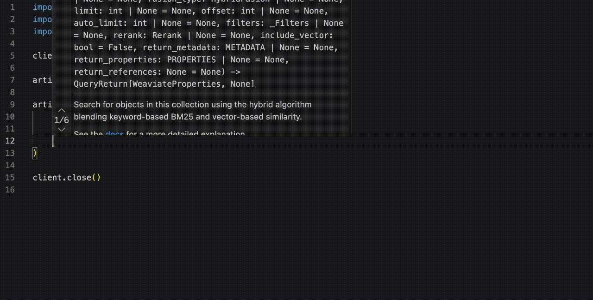

import Tabs from '@theme/Tabs';
import TabItem from '@theme/TabItem';
import FilteredTextBlock from '@site/src/components/Documentation/FilteredTextBlock';
import PythonCode from '!!raw-loader!/_includes/code/client-libraries/python_v4.py';
import ManageCollectionsCode from '!!raw-loader!/_includes/code/howto/manage-data.collections.py';


The `v4` release of the Weaviate Python client library has landed 🎉🥳. This is a major update, as reflected by the bump in the major version number. If you're keen to use it, just `pip` install it with:

```bash
pip install -U weaviate-client
```

But if you're curious about what's new, read on - there's a lot that we are excited about!

## Key ideas

The `v4` client does things a little differently than the `v3` client. Two of the key ideas where it differs are:

- Collection-based interactions, and
- Default property returns to queries.

Take this query, for example:

<FilteredTextBlock
    text={PythonCode}
    startMarker="# START HybridQueryExample"
    endMarker="# END HybridQueryExample"
    language="py"
/>

Here, you'll notice that the query:
- is performed on a collection (`questions`), not the `client` itself, and
- does not specify any properties to return.

This is because the `v4` client is collection-based, and will return all properties (except `blob`s) by default. We think this makes the code more concise, and easier to use.

### IDE assistance / autocomplete

And writing the queries is now also much easier, with more IDE assistance and autocomplete. For example, here's a query that uses the `Filter` class:



Notice all the nice autocomplete suggestions as we type! This extends to a great majority of operations, from collection creation to object insertion to query building.

### Speed improvements

:::caution TODO
Some speed comparison for query and insert and mention GRPC (and keep any details for later). Dirk to help w/ numbers.
:::

### Typing & type safety

Provision of these classes also means that the client is able to provide far more type hints, proving higher type safety.

For example, the `like` method in our `Filter` class example above helpfully tells you to insert the argument as a `str`. But we were to use a `within_geo_range` method, it would tell us to use a coordinate as a `GeoCoordinate` instance, and a distance as a `float`.

This helps you to write the correct code, and also helps you to catch errors early.

#### Submodules

For discoverability, the classes are arranged into submodules like this.

| Module                      | Description                         |
|-----------------------------|-------------------------------------|
| `weaviate.classes.config`   | Collection creation / modification  |
| `weaviate.classes.data`     | CUD operations                      |
| `weaviate.classes.query`    | query/search operations             |
| `weaviate.classes.generic`  | generics                            |
| `weaviate.classes.init`     | initialization                      |
| `weaviate.classes.tenants`  | tenants                             |
| `weaviate.classes.batch`    | batch operations                    |

You can import the whole `classes` module, or just the classes you need.


## Practical examples

Here are some practical examples. You'll find plenty of them throughout our site documentation - here, we present a few commonly used operations, with notes as required.

### `v4` vs `v3` API

import CollectionsV4 from '!!raw-loader!/_includes/code/howto/manage-data.collections.py';
import CollectionsV3 from '!!raw-loader!/_includes/code/howto/manage-data.collections-v3.py';

Here is an example that really captures the difference between the `v4` and `v3` APIs. Look at the difference in the code required to create a collection with properties.

<Tabs groupId="languages">
  <TabItem value="py" label="Python (v4)">
    <FilteredTextBlock
      text={CollectionsV4}
      startMarker="# START CreateCollectionWithProperties"
      endMarker="# END CreateCollectionWithProperties"
      language="python"
    />
  </TabItem>
  <TabItem value="py3" label="Python (v3)">
    <FilteredTextBlock
      text={CollectionsV3}
      startMarker="# START CreateCollectionWithProperties"
      endMarker="# END CreateCollectionWithProperties"
      language="python"
    />
  </TabItem>
</Tabs>

The `v3` client API uses an untyped dictionary to specify the collection definition. It's efficient, but not very robust, and not particularly easy to use.

On the other hand, the `v4` client API provides plenty of help through type hints and autocomplete suggestions as you navigate to the `.create` method, and use classes such as `Property` and `DataType`. It's also more robust, and easier to use.

### Connections

The `v4` client provide a set of helper functions, for connecting to Weaviate through its various deployment methods.

Direct instantiation with full control over the parameters is also possible, too. And, if you need an instance of the `v3` style client, you can still use it.

<Tabs groupId="languages">
    <TabItem value="wcs" label="WCS">
        <FilteredTextBlock
            text={PythonCode}
            startMarker="# WCSInstantiation"
            endMarker="# END WCSInstantiation"
            language="py"
        />
    </TabItem>
    <TabItem value="local" label="Local">
        <FilteredTextBlock
            text={PythonCode}
            startMarker="# LocalInstantiationBasic"
            endMarker="# END LocalInstantiationBasic"
            language="py"
        />
    </TabItem>
    <TabItem value="embedded" label="Embedded">
        <FilteredTextBlock
            text={PythonCode}
            startMarker="# EmbeddedInstantiationBasic"
            endMarker="# END EmbeddedInstantiationBasic"
            language="py"
        />
    </TabItem>
    <TabItem value="direct" label="Direct instantiation">
        <FilteredTextBlock
            text={PythonCode}
            startMarker="# DirectInstantiationFull"
            endMarker="# END DirectInstantiationFull"
            language="py"
        />
    </TabItem>
    <TabItem value="v3" label="V3 API">
        <FilteredTextBlock
            text={PythonCode}
            startMarker="# InstantiationV3API"
            endMarker="# END InstantiationV3API"
            language="py"
        />
    </TabItem>
</Tabs>

Just remember that with the new `WeaviateClient` instances (i.e. `v4` API), you'll have to close the connection when you're done with it. This is still not necessary with the `v3` API.

<FilteredTextBlock
    text={PythonCode}
    startMarker="# TryFinallyExample"
    endMarker="# END TryFinallyExample"
    language="py"
/>

### Batch operations

The new client provides a set of methods to configure batching. These methods help you to control the batching behavior - including a handy `rate_limit()` method to avoid going past any third-party API rate limits.

| Method | Description | When to use |
| :-- | :-- | :-- |
| `dynamic` | The batch size is dynamically calculated by Weaviate. | Recommended starting point. |
| `fixed_size` | The batch size is fixed to a size specified by a user. | When you want to control the batch size. |
| `rate_limit` | The number of objects sent to Weaviate is rate limited (specified as n_objects per minute). | When you want to avoid hitting third-party vectorization API rate limits. |

<Tabs groupId="languages">
    <TabItem value="wcs" label="Dynamic">
        <FilteredTextBlock
            text={PythonCode}
            startMarker="# START BatchDynamic"
            endMarker="# END BatchDynamic"
            language="py"
        />
    </TabItem>
    <TabItem value="local" label="Fixed size">
        <FilteredTextBlock
            text={PythonCode}
            startMarker="# START BatchFixedSize"
            endMarker="# END BatchFixedSize"
            language="py"
        />
    </TabItem>
    <TabItem value="embedded" label="Rate limit">
        <FilteredTextBlock
            text={PythonCode}
            startMarker="# START BatchRateLimit"
            endMarker="# END BatchRateLimit"
            language="py"
        />
    </TabItem>
</Tabs>

There's also single insertion methods, of course. And to that, we've added a `insert_many` method which is a convenience method for inserting a list of objects.

<Tabs groupId="languages">
    <TabItem value="batching" label="Batch">
        <FilteredTextBlock
            text={PythonCode}
            startMarker="# START BatchBasic"
            endMarker="# END BatchBasic"
            language="py"
        />
        <i>Generally recommended for any multi-object operations.</i>
    </TabItem>
    <TabItem value="insert_many" label="Insert many">
        <FilteredTextBlock
            text={PythonCode}
            startMarker="# START InsertManyBasic"
            endMarker="# END InsertManyBasic"
            language="py"
        />
        <i>If you just have a list of objects to insert.</i>
    </TabItem>
    <TabItem value="insert" label="Single insert">
        <FilteredTextBlock
            text={PythonCode}
            startMarker="# START CreateObjectExample"
            endMarker="# END CreateObjectExample"
            language="py"
        />
        <i>For single-insertions; not for bulk operations.</i>
    </TabItem>
</Tabs>

### Query

Queries are available for each collection through the `query` submodule. You can use different methods such as `hybrid`, `near_text` and so on for searches. When it comes to performing RAG queries, switch to the `generate` submodule, and provide any additional parameters as required for the prompts!

This makes it easy to switch between the different query types, and also makes it easy to discover the different query types available.

<Tabs groupId="languages">
    <TabItem value="hybrid" label="Hybrid">
        <FilteredTextBlock
            text={PythonCode}
            startMarker="# START HybridQueryExample"
            endMarker="# END HybridQueryExample"
            language="py"
        />
        <p><small>The search query returns a parsed response, with the <code>.objects</code> property containing the retrieved Weaviate objects.</small></p>
    </TabItem>
    <TabItem value="neartext" label="NearText">
        <FilteredTextBlock
            text={PythonCode}
            startMarker="# START NearTextQueryExample"
            endMarker="# END NearTextQueryExample"
            language="py"
        />
        <p><small>The search query returns a parsed response, with the <code>.objects</code> property containing the retrieved Weaviate objects.</small></p>
    </TabItem>
    <TabItem value="rag" label="NearText + RAG">
        <FilteredTextBlock
            text={PythonCode}
            startMarker="# START NearTextGenerateExample"
            endMarker="# END NearTextGenerateExample"
            language="py"
        />
        <p><small>The RAG query is very similar to the equivalent search query, but using methods in the <code>generate</code> submodule.</small></p>
    </TabItem>
    <TabItem value="filter" label="Aggregate + Filter">
        <FilteredTextBlock
            text={PythonCode}
            startMarker="# START AggregateCountExample"
            endMarker="# END AggregateCountExample"
            language="py"
        />
        <p><small>This example retrieves a count of objects that match the filter criteria.</small></p><br/>
    </TabItem>
</Tabs>

#### Responses

As mentioned before, the default behavior now is to return all properties (except `blob`s) by default, as well as object uuids.

For less-often used attributes such as cross-references, metadata (previously under `_additional`) and vectors must be requested specifically. This is done through the `return_references`, `return_metadata` and `include_vector` parameters.

Responses from Weaviate are now parsed into instances of custom classes. For example, each query response will have a list of objects in the `objects` attribute, and each object will have a set of attributes itself. Responses for RAG queries will include a `generated` attribute at the top level for `grouped_task` query, and each object will also have a `generated` attribute for `single_prompt` queries.

### Iterator

The client includes an iterator to make convenient use of the `cursor` API. This is useful for retrieving large numbers of objects, such as when manually exporting or migrating a collection.

<Tabs groupId="languages">
    <TabItem value="basic" label="Default">
        <FilteredTextBlock
            text={PythonCode}
            startMarker="# IteratorBasic"
            endMarker="# END IteratorBasic"
            language="py"
        />
    </TabItem>
    <TabItem value="oneprop" label="Selected properties">
        <FilteredTextBlock
            text={PythonCode}
            startMarker="# IteratorAnswerOnly"
            endMarker="# END IteratorAnswerOnly"
            language="py"
        />
    </TabItem>
    <TabItem value="meta" label="Metadata Only">
        <FilteredTextBlock
            text={PythonCode}
            startMarker="# IteratorMetadataOnly"
            endMarker="# END IteratorMetadataOnly"
            language="py"
        />
    </TabItem>
</Tabs>

## How to get started

:::caution TODO
- Installation
- Where to find useful docs
    - V4 client page
    - Code snippets (howtos etc.)
:::


import WhatNext from '/_includes/what-next.mdx'

<WhatNext />
