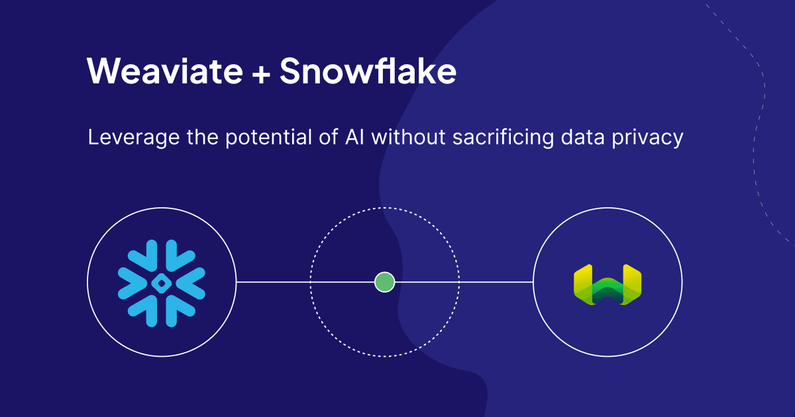

:::tip
You can follow along the demo on the [Weaviate SPCS Repo](https://github.com/Snowflake-Labs/sfguide-getting-started-weaviate-on-spcs/).
:::

As described in my colleague Connor Shorten’s [blog post](/blog/generative-feedback-loops-with-llms), a Generative Feedback Loop is the idea of using a Large Language Model (LLM) to generate data, then using that data to drive a semantic search. This is an incredibly powerful use case that can enable a whole new kind of search experience. By providing data to an LLM, you have an opportunity to enrich, enhance or even summarize it which can enable new opportunities to search through your data and provide better search results.

In a recent [blog post](https://medium.com/@iamleonie/recreating-amazons-new-generative-ai-feature-product-review-summaries-50640e40872a) from another colleague, Leonie Monigatti shows an example of doing this by summarizing user reviews for products, then using the summaries as a way to give users the highlights from a lot of review information. Amazon has recently started doing this for certain products, which helps users reduce time spent reading several reviews before making a decision.  

In this blog, we are going to take Leonie’s example a step further and use the reviews to also generate a product name, description, and features. Then, we are going to load these new products and information into Weaviate to drive three types of searches: 

* **Keyword** search on product metadata (features)
* **Semantic** search on product descriptions 
* **Hybrid** search based on the product experience

This allows users to look for products that **feel** a certain way.  

For example, let’s say a user is trying to find an “easy to learn instrument.”

This type of search is semantic, contains keywords, and is looking for a type of experience.  We may not get information such as feelings or experience from a product description, but we may be able to get it from a product review.

Once this generated data is loaded into Weaviate, we can support this type of search using our hybrid search feature which combines the best results from both a semantic search and a keyword search.

## The Challenge
As I started to create this demo, Weaviate’s CEO Bob van Luijt approached me with additional criteria:
* Data must start in Snowflake
* No data leaves Snowflake 
* Use Mistral as the LLM (Large Language Model) to generate the data

Challenge accepted!

This type of implementation can be achieved using open-source software like [Weaviate](https://weaviate.io/), [Ollama](https://ollama.ai/), and [Mistral](https://mistral.ai/).  Ollama is an open-source LLM manager that allows you to easily [run LLM models](https://ollama.ai/library) on a local server. I will use this and the [Mistral 0.2](https://ollama.ai/library/mistral) model running on Ollama to generate the product data. 

Weaviate is an AI-native [open-source vector database](https://weaviate.io/blog/what-is-a-vector-database) that excels at searching through data semantically and also has the hybrid search capabilities I need for this use case. Weaviate is also where I work as a Solutions Engineer! 

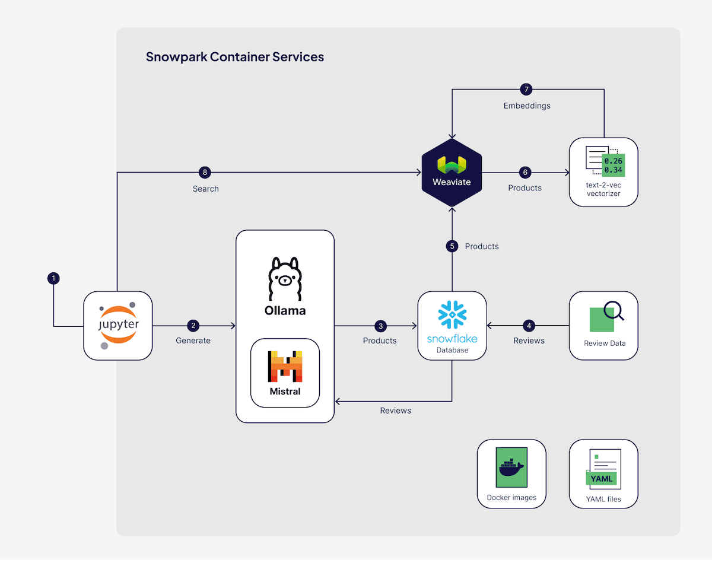

With these technologies we can create Docker images and deploy them directly to [Snowpark Container Services (SPCS)](https://www.snowflake.com/blog/snowpark-container-services-deploy-genai-full-stack-apps/), which extends [Snowflake’s](https://www.snowflake.com/en/) processing engine to deploy containerized software and applications in Snowflake-managed infrastructure. From there we have a direct path to our source data, and nothing ever leaves the network, which is a huge advantage for anyone dealing with private or sensitive data.

## Implementing a Generative Feedback Loop with Weaviate

### Step 1: Loading Data

I started off by downloading the same [dataset](https://www.kaggle.com/datasets/eswarchandt/amazon-music-reviews) that Leonie used from Kaggle:

Once downloaded on my local drive I then needed to get this data into Snowflake. This involved creating tables, staging the data, formatting the files, then finally inserting the data into the newly created table. You can use the guide **guides/weaviate-generative-feedback-loop.md** in the provided repo for all the exact steps required.

```sql
----------PUT FILE INTO STAGE ------------
PUT file:///Users/jonathantuite/Documents/SnowflakeBlog/Data/Musical_instruments_reviews.csv @REVIEW_DATA overwrite=true;


------------COPY DATA INTO SNOWFLAKE TABLES------------
COPY INTO PRODUCT_REVIEWS FROM @REVIEW_DATA FILE_FORMAT = (format_name = 'my_csv_format' , error_on_column_count_mismatch=false)
 pattern = '.*Musical_instruments_reviews.csv.gz' on_error = 'skip_file';
 ```

This data only includes reviews and has no product information except the ASIN, a unique identifier that Amazon uses for each product.

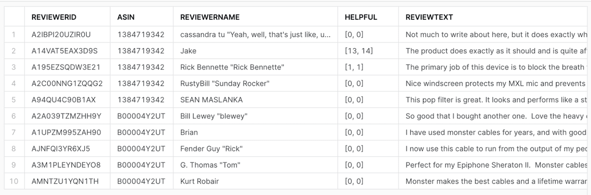

Now that my data is available in Snowflake I need to start creating Docker images locally that I can upload to SPCS. In the repository for this blog, I have included the commands you will need to create the docker images for Weaviate, a text2vec vectorizer module, Jupyter Notebooks, and Ollama.  

I am using the [text2vec](/developers/weaviate/modules/retriever-vectorizer-modules/text2vec-transformers) module to create the embeddings Weaviate will use, and using [Ollama](https://ollama.ai/) to host our Mistral model locally. 

The goal is to send data from Snowflake, to Mistral, back to Snowflake, then to Weaviate.  Weaviate will automatically vectorize the data using the text2vec vectorizer, then we are ready to start searching!

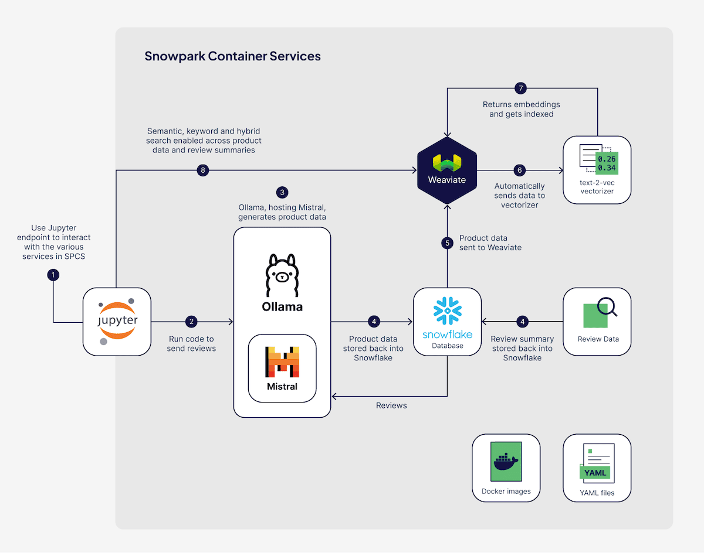

For this demo I am using Ollama to host the LLM model, so I used their Docker image to generate one for Snowflake to use.  The included Dockerfile is all you need to build the image, but you can checkout the Ollama repo [here](https://github.com/ollama/ollama).

### Step 2: Create Docker Images

Building the Ollama image is pretty easy with the included Dockerfile:

```bash
docker build --rm --no-cache --platform linux/amd64 -t ollama ./images/ollama
```

This Dockerfile will not only install and run Ollama, but will also download and load the Mistral model.  If you want to use a different model, you can change the Dockerfile to load any model that Ollama supports.

Once I had the Ollama image, I created images for Jupyter, Weaviate, and the text2vec module.

I tagged the images, then uploaded them to the image repository in SPCS. 

:::caution
Remember to login to Docker in SPCS before attempting to push it
:::

```bash
docker tag ollama <SNOW_ORG-SNOW_ACCOUNT>.registry.snowflakecomputing.com/weaviate_demo/public/weaviate_repo/ollama
docker push <SNOW_ORG-SNOW_ACCOUNT>.registry.snowflakecomputing.com/weaviate_demo/public/weaviate_repo/ollama
```

Once all 4 of the Docker Images were created, tagged, and uploaded, I was ready to start generating product data.

First, I need to upload the **spec.yaml** files to the file stage in Snowflake.  This spec file will be used by SPCS to define how to start the service up, and how the service should run.

:::note
If you are doing this several times, like I did, make sure to include those extra parameters “overwrite=true” to overwrite the file.  Otherwise you may end up wondering why your changes are not carrying over.
:::

```sql
PUT file:///YOUR/PATH/specs/ollama.yaml @yaml_stage overwrite=true auto_compress=false overwrite=true;
```

### Step 3:  Start Services
#### Create Compute Pool

Once the files were uploaded I created compute pools for all the services.  For example:

```sql
USE ROLE SYSADMIN;
CREATE COMPUTE POOL OLLAMA_POOL
 MIN_NODES = 1
 MAX_NODES = 1
 INSTANCE_FAMILY = GPU_NV_M;
```

#### GPUs
In this example, I am using a Medium NVIDIA GPU class instance for the Ollama compute pool, a small GPU instance for the vectorizer, and two small CPU instances for Weaviate and Jupyter to run on.  

Ollama has the flexibility to be able to handle both CPU and GPU instances, but GPUs are best for an LLM or vectorizer. For a list of available instance types you can spin up in SPCS, check out [this page](https://docs.snowflake.com/en/sql-reference/sql/create-compute-pool).

Note that there are two settings in the Ollama YAML file are are needed to take advantage of the GPUs:

```sql
ENABLE_CUDA: 1
NVIDIA_VISIBLE_DEVICES : all
```

#### External Access Policy
As of Feb 5th, 2024 you also need to add an [external access policy](https://docs.snowflake.com/en/developer-guide/external-network-access/external-network-access-overview) (EAP) to SPCS so you can access the Jupyter service from outside of Snowflake.  To do that, I created the policy, then attached it to the service.

```sql
-- External Access Integration
USE ROLE ACCOUNTADMIN;
USE DATABASE WEAVIATE_DEMO;
USE SCHEMA PUBLIC;
CREATE NETWORK RULE allow_all_rule
 TYPE = 'HOST_PORT'
 MODE= 'EGRESS'
 VALUE_LIST = ('0.0.0.0:443','0.0.0.0:80');


CREATE EXTERNAL ACCESS INTEGRATION allow_all_eai
 ALLOWED_NETWORK_RULES=(allow_all_rule)
 ENABLED=TRUE;


GRANT USAGE ON INTEGRATION allow_all_eai TO ROLE SYSADMIN;
```
:::note
Make sure to wait for the compute pool to be in “Idle” state before creating the service.  You can see the state with the following command:
```
DESCRIBE COMPUTE POOL JUPYTER_POOL;
```
:::

#### Create Services
Once the compute pool is in an Idle state, I was able to spin up the service with the following command, using the external access integration I setup:

```sql
CREATE SERVICE JUPYTER
 IN COMPUTE POOL JUPYTER_COMPUTE_POOL
 FROM @YAML_STAGE
 SPEC='jupyter.yaml'
 MIN_INSTANCES=1
 MAX_INSTANCES=1
 EXTERNAL_ACCESS_INTEGRATIONS=(ALLOW_ALL_EAI);
````

You can check the status of the services by running:

```
show services;
```

Once the Jupyter service was up and running, I needed to grant permission to it for my role. That way, I can login to the front-end of Jupyter Notebooks.  Since none of the other services will be accessed outside of Snowflake, I only needed it for the Jupyter service.

```
GRANT USAGE ON SERVICE JUPYTER TO ROLE WEAVIATE_ROLE;
```

### Step 4: Generate Product Data with Mistral
Next, I needed to access the Jupyter Notebooks endpoint.  You can find your endpoint by running this command:

```sql
SHOW ENDPOINTS IN SERVICE JUPYTER;
```

This showed me the endpoint for Jupyter that I can use to access it.  I grabbed the URL for the Jupyter endpoint and pasted it into my browser. 

Using the Snowflake Login I set up earlier, I logged into the Jupyter Notebooks interface.  It should load a file browser like in the screenshot below:

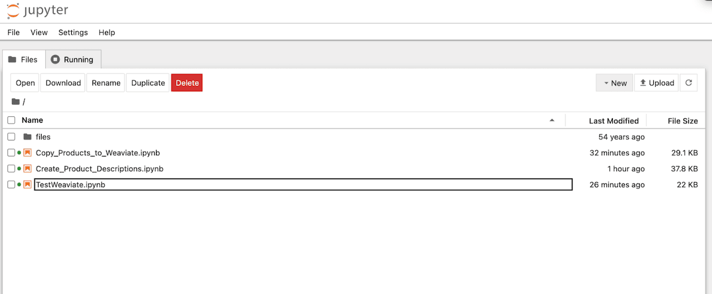

I then  loaded the provided notebook: `Create_Product_Descriptions.ipynb`.

The first few steps installs the libraries needed and creates the connection into Snowflake.

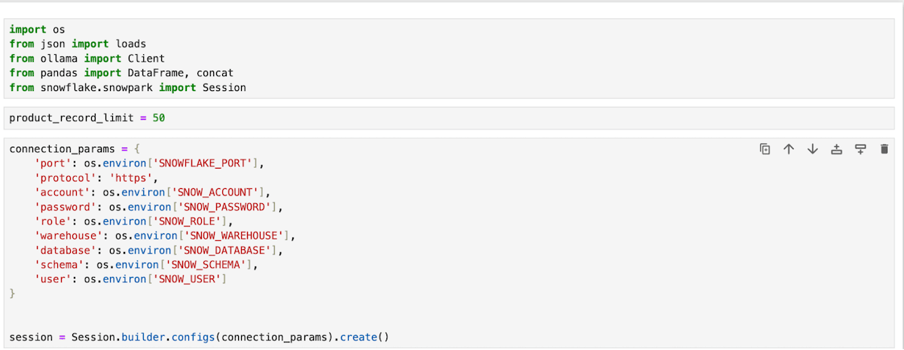

Then I loaded all the review data by using a distinct list of 50 ASINs (Note: you can adjust this higher for more data).  For each ASIN I created a prompt using the latest  20 reviews with SQL. 

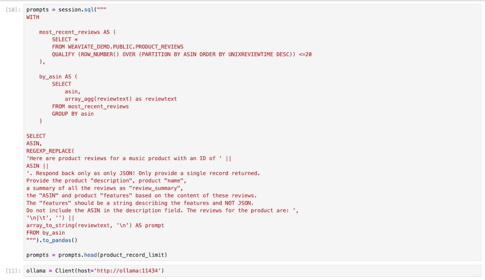

Once I created the prompts, I needed to send them each to the local Mistral model and ask it to respond back with JSON that I could use to insert back into Snowflake.

:::note
You should see the message `Done!` if everything went well. Sometimes the LLM provides additional fields that we didn’t ask for, or objects instead of strings, but that’s okay – we can remove it before we send it to Snowflake.
:::

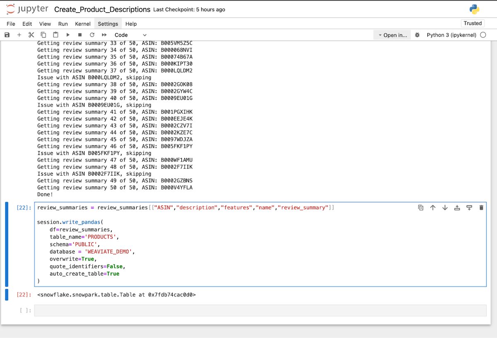

Back in Snowflake I checked the table to make sure all the data made it over.  

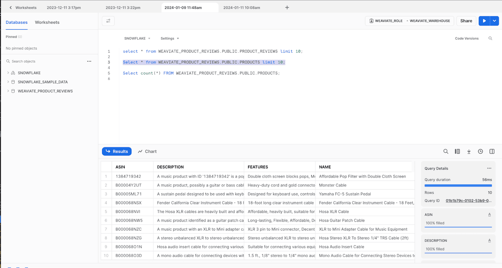

### Step 5: Send Product Data to Weaviate

Now that I have confirmed I have all the new data in Snowflake, I can spin down the resources for Ollama.

```sql
DROP SERVICE OLLAMA;
DROP COMPUTE POOL OLLAMA_POOL;
```

Back in Jupyter, open the file `Copy_Products_to_Weaviate.ipynb` notebook.

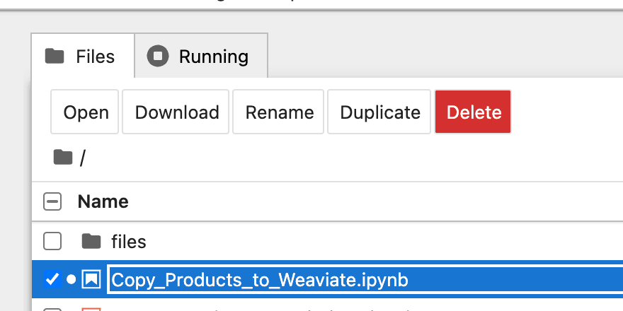

Run through the notebook and it will copy the newly generated data over to Weaviate.  Since Weaviate is set up to automatically use the Text2Vec vectorizer module, the data gets automatically vectorized as it lands in Weaviate.

### Step 6: Search

Finally, I ran through some queries on the data to test out Weaviate’s semantic and hybrid search capabilities. With this data, I can now search for experiences, feelings, keywords, or product names of the music-related products.
  
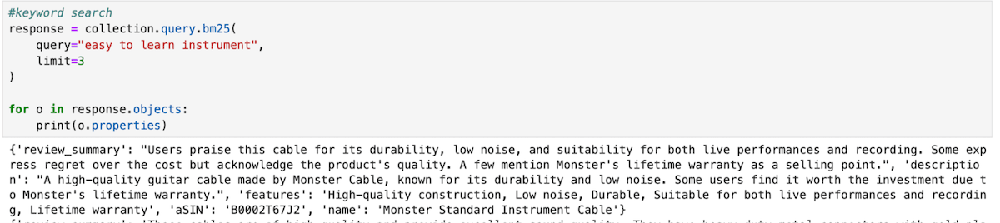
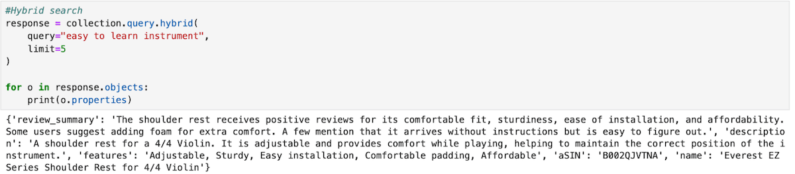

If you have made it this far, then you should be very proud of yourself because you have now successfully done the following:
1. Loaded Product Review data into Snowflake
2. Deployed Weaviate, Ollama, and a vectorizer within SPCS
3. Created product metadata using the latest Mistral model
4. Loaded a new product table into Weaviate
5. Performed semantic and hybrid searches using Weaviate
6. Kept all data within Snowflake

**Congratulations** on creating such a powerful Generative Feedback Loop!

## Additional Notes
### Persistence
This took me about 2-3 hours to complete end-to-end after I had all the steps and files figured out. Once I was finished, I dropped all the services and compute pools, then I recreated the Weaviate service again. Because we stored all the data on Snowflake stage-mounted volumes, and that mount persists to S3, all the data that I inserted into Weaviate remained and once the service was back up I could query the data again. This gives Weaviate a lot of resilience when deploying to Snowflake using SPCS.

### Costs
The costs to spin up my own private LLM, vectorizer endpoint, and Weaviate within SPCS was pretty surprisingly affordable considering two of these services are running on GPUs. For the entire day of testing and troubleshooting, I used about $55 in credits, so I would expect someone could run through these steps for the first time for less than $30 as long as you turned off the services when you were finished. To learn more about the SPCS instance families, check out their documentation [here](https://docs.snowflake.com/en/sql-reference/sql/create-compute-pool).

## Summary
By utilizing open-source software, such as [**Weaviate**](https://weaviate.io/) and [**Ollama**](https://ollama.ai/) within SPCS, I was able to generate data I did not previously have (Products), and using that data, I created a unique search experience for users.  Taking advantage of Hybrid Search capabilities of Weaviate, users can now search for metadata about products, or search for an experience they are looking for; Creating a highly optimized semantic search experience.  This is incredibly powerful for any ecomm site with a large product catalog that wants to create a more natural search experience.  

Using these steps, you can do all of this while keeping your **private or sensitive data right where it is**, and never have it leave the [Snowflake](https://www.snowflake.com/) network.

I hope you found this blog useful!  Feel free to leave a comment or feedback and let me know how you plan to use this in your organization.


import WhatNext from '/_includes/what-next.mdx'

<WhatNext />
