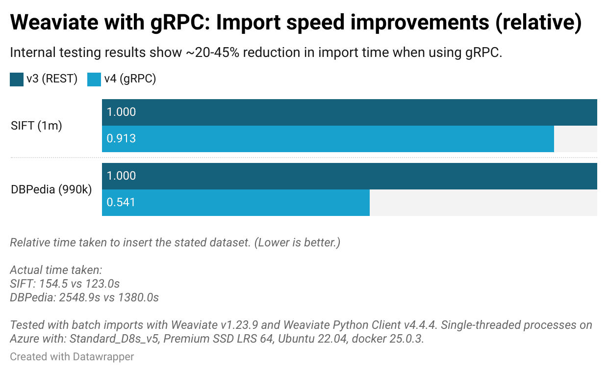

Speed is good.

Let’s face it - we’ve all been frustrated by slow services or apps. So we appreciate how important speed is for an infrastructure product like Weaviate, which is used to power amazing services and apps. And that’s why over the last few months, we’ve been developing a gRPC API and integrating it into our solutions, starting with the Python client library.

These are big changes, but we're confident the benefits are worth it. For one, the latest Weaviate solutions are simply much faster than our pre-gRPC solutions, which were using REST + GraphQL. Take a look at these results (lighter bars: gRPC, darker bars: REST + GraphQL):


The chart really speaks for itself (although - we’ll expand on that and more below). And since these changes are under the hood, you won’t even really see which calls use gRPC, vs those that use REST or REST+GraphQL. It will simply be a function of using a client and server pair that relies on gRPC.

But many of you are probably curious to dig deeper. You’re probably looking to learn about how it all works, what you need to do to make sure to take advantage of it, and how much benefit you’ll gain from it all. If you are one of those people, read on, and let us tell you why we are so excited about these changes.

## What is gRPC?

[gRPC](https://grpc.io/docs/what-is-grpc/) is an open source framework that is often adopted for building APIs because of its flexibility and speed over alternatives like REST.

gRPC was initially developed by Google for working with microservices, but it is now open source and maintained by [Cloud Native Computing Foundation](https://www.cncf.io/). Thus, gRPC is yet another open source project that works as a key part of the network infrastructure ecosystem.

<details>
  <summary>What is an RPC?</summary>

An RPC, or “remote procedure call”, can be used to remotely execute a function or procedure on a device from another device. ([Read more](https://en.wikipedia.org/wiki/Remote_procedure_call))

</details>

## Why use gRPC?

gRPC uses HTTP/2 and Protocol Buffers under the hood. For Weaviate, these attributes provide many advantages, such as faster serialization, lower latency, and the ability to stream data. All of these attributes add up to two key advantages, which are faster speeds, and more robust, maintainable code.

### Speed

We at Weaviate love many things about GraphQL. But one big downside of using GraphQL relates to its payloads. One challenge is marshaling data to JSON, and another is transmitting large payloads (for both requests and responses). These challenges are largely reduced by adopting gRPC.

Firstly, gRPC uses Protocol Buffers (protobufs) to define data structures like the one shown below to produce binary payloads instead of JSON. Because these definitions are used to build the payload, and the payload is in binary, each payload is smaller, and faster to build.

```protobuf
message GenerativeSearch {
  string single_response_prompt = 1;
  string grouped_response_task = 2;
  repeated string grouped_properties = 3;
}
```

Additionally, gRPC uses HTTP/2 under the hood, which is faster than the existing REST API’s HTTP/1.1 due to its support for concurrent requests and lower overhead.

These add up to big speed and reliability advantages for the [gRPC API in Weaviate](/developers/weaviate/api/grpc) in comparison to the current GraphQL + REST solution.

### Type safety

Another benefit of gRPC is its enhanced type safety, achieved through the explicit definition of data structures and types in protobufs. This approach significantly reduces common challenges encountered when working with GraphQL and JSON, such as ambiguity in data types and difficulties in ensuring readability.

In the context of JSON and GraphQL, determining the correct data type for numbers (e.g., distinguishing between integers and floating-point numbers) or interpreting empty properties can be problematic. In Weaviate, this can lead to [AutoSchema](https://weaviate.io/developers/weaviate/config-refs/schema#auto-schema) inferring inappropriate data types, potentially leading to data integrity issues.

Moreover, parsing complex and deeply nested JSON responses, or crafting intricate GraphQL queries, can degrade the developer experience and elevate the risk of errors. This is also partly due to having to conform to the structure of the GraphQL schema. This has been a challenge for certain tasks, such as implementing GroupBy queries and responses in Weaviate.

gRPC addresses these issues head-on by facilitating the customization of data structures for both requests and responses. Its reliance on strictly defined data types streamlines parsing processes and boosts reliability.

In essence, gRPC's mitigation of the common pitfalls associated with GraphQL and JSON—coupled with its flexibility in adapting data structures—translates to improved code readability and a more seamless development experience. Ultimately, we believe that these advantages will contribute to the creation of more robust and reliable products for you.

## Quantifying gRPC-driven Weaviate performance improvements

We’ve said that the gRPC solution improves speed. But how much faster is it, exactly? Let’s take a look at two key scenarios - data ingestion and query throughput.

<details>
  <summary>Test set-up</summary>

The tests were carried out using two pre-vectorized (sift1m and DBPedia) datasets, with Weaviate version `1.23.9` and Weaviate Python Client version `4.4.4`. The `sift1m` dataset includes 128-dimensional vectors and the `DBPedia` dataset includes 1536-dimensional vectors.
<br/>

We used an Azure virtual machine configured as follows: Standard_D8s_v5, Premium SSD LRS 64, Ubuntu 22.04, docker 25.0.3. The test processes were single-threaded.
<br/>

You can find the [test code here](https://github.com/weaviate/weaviate-python-client/blob/main/profiling/test_import_and_query.py) including links to the datasets, and instructions to run the tests yourself.

</details>

### Data ingestion

Let’s begin with improvements to the data ingestion time. The following chart shows relative improvements in time taken to insert ~1M objects, using two different datasets.



The gRPC-based data imports show significant reductions in time taken over the REST-based alternatives for both datasets. The `DBPedia` import time in particular is almost halved from over 42 minutes to around 23 minutes, as it includes larger payloads (longer vectors than the `sift` dataset).

This improvement will scale as the dataset size grows, too. At this rate, inserting a hundred million objects - a relatively common number - would be faster by over 32 hours!

That's certainly nothing to sneeze at. And that's not all - the improvements extend to the database in operation too.

### Queries

Query throughput is central to databases' operation. And the improvements here are certainly very meaningful. The following chart shows rates of queries that can be served in each given scenario using gRPC and REST+GraphQL.


The chart shows that each query takes 40-70% less time to return results when using gRPC in comparison to results with REST + GraphQL. This results in a significant, over 2.6x, improvement in how many queries can be served.

<details>
  <summary>Explain these results</summary>

Query throughput is usually measured in queries per second (QPS). The chart shows query throughput values based on averages of 10,000 queries.
<br/>

The different settings relate to a [vector index (HNSW) parameter](https://weaviate.io/developers/weaviate/concepts/vector-index#what-is-hierarchical-navigable-small-world-hnsw) `ef`.

This parameter sets the size of the dynamic candidate list used in the HNSW search algorithm, and drives the speed and accuracy trade-off. In this test, it will impact the ANN-search portion of each query. Regardless, you can see that even at high `ef` numbers the gRPC-driven improvements are significant.

</details>

As you can see, the performance improvements are significant for both data ingestion and query throughput. And we hope that by now you’re yelling into the screen for us to just tell you how to use it! So, here goes:

## How to take advantage of gRPC in Weaviate

From your perspective, taking advantage of the new gRPC API involves making sure the right sockets can be created and using the client/server solution that supports it.

### Step 1: Open Port for gRPC messages

First of all, the appropriate port must be open to allow gRPC messages through. Weaviate still uses REST endpoints for various functions, and gRPC traffic is sent through a separate socket than its REST traffic. Typically, the server port is 50051, although it can vary. [Weaviate Cloud Services](https://console.weaviate.cloud), for example, uses port 443 with a different URL to provide two distinct sockets for gRPC and REST traffic.

<details>
  <summary>For Docker users</summary>

If you are using Docker to instantiate Weaviate, check that the gRPC traffic is forwarded appropriately, for example as shown below.

```yaml
---
version: '3.4'
services:
  weaviate:
    # ...
    ports:
    - 8080:8080
    - 50051:50051
    # Note the port mapping above for port 50051
    # Remainder of `docker-compose.yml` not shown
...
```

</details>

### Step 2: Weaviate & client library with gRPC support

Next, you need a version of Weaviate that supports gRPC (minimum `v1.23.7`), and a matching client version. The reason is that gRPC requires matching server and client protobuf files for calls, messages and so on. As a result, any updates must be coupled server-side and client-side.

As a rule of thumb, we recommend that you use the latest pair of server/client versions. By building with the latest versions of Weaviate server and client, you will automatically get the performance improvements.

Currently, the Python client is the only one to take full advantage of the gRPC API. But, we have additional client support in the works. Our JavaScript/TypeScript client is being developed for a major update, and others will also follow.

We’ll have more on these topics in the future 😉.

:::tip Check out the latest Python client library
By the way - if you’ve missed it, the new `v4` client library is a [major update](https://weaviate.io/blog/py-client-v4-release). Not just for its gRPC use, but also the hugely improved Python API. So if you have an existing codebase, the speed will be another incentive to [migrate it to the latest client](/developers/weaviate/client-libraries/python/v3_v4_migration), along with the improved client API and support for the shiny new features.
:::

## What about the GraphQL API?

As we’ve said before, we are fans of GraphQL. And we are cognizant that many of you are, too. And our client libraries still extensively rely on the GraphQL API. So, there are no plans to deprecate the existing GraphQL API at this point.

But for all the reasons stated above, we are migrating our clients to use gRPC under the hood over time. So, over time, your preferred Weaviate client will use less and less of the GraphQL API.

## Conclusions

The integration of gRPC into Weaviate marks a significant milestone in our quest to offer the fastest, most reliable, and robust infrastructure for powering services and applications.

The move towards gRPC represents a major leap forward in improving data ingestion rates and query throughput for Weaviate users. As we continue to refine our technology stack, we encourage you to leverage these advancements, ensuring that your projects benefit from the highest levels of efficiency and reliability. We look forward to seeing the incredible services and applications you will power with Weaviate, now turbocharged with gRPC.


import WhatNext from '/_includes/what-next.mdx'

<WhatNext />
