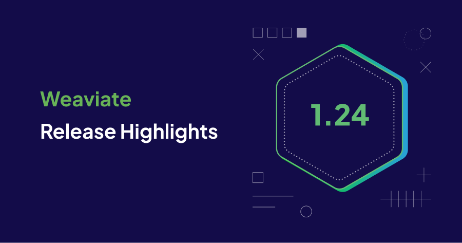
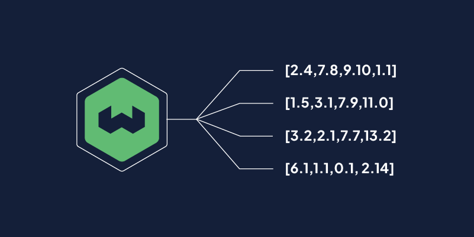

Weaviate `1.24` is here!

Here are the release ⭐️*highlights*⭐️!



1. **Named vectors.** A single object can have multiple vectors. Create vectors for properties, use different vectorization models, and apply different metrics to fine tune interactions with your data.
1. **Simplified Docker configuration.** A new Docker image that needs no configuration. 
1. **Backend Improvements.** 
1. **Python client update.**  support and new features.

## Named vectors



Named vectors make your collections richer and more versatile.
 
Starting in 1.24.0, collections can have multiple, named vectors. Each vector is independent. Each vector has its own index, its own compression, and its own vectorizer. This means you can create vectors for properties, use different vectorization models, and apply different metrics to fine tune interactions with your data.

In earlier versions, objects in you collections were limited to one vector. Now, you can vectorize meta data like titles and descriptions so they are available for vector search. You can group store that are logically related, like a music video and a lyric sheet, in the same object. You don't have to create [cross-references](/developers/weaviate/manage-data/cross-references.mdx) or manage shared metadata, a single object in a collection can have multiple, named vectors.

You do not have to use multiple vectors in your collections, but if you do, you need to adjust your queries to specify which vector you want to use. 

For details, see [Named vectors](./_core-1-24-include.mdx).

## Simplified Docker configuration

Starting in v1.24.0, there is a new Docker image that runs using common default values. This image lets you start development and exploration quickly. Just enter a simple command line:

```bash
 docker run -p 8080:8080 semitechnologies/weaviate:1.24.0
```

 Alternatively, you can always edit the `docker-compose.yml` file to customize your instance.

For details, see [Docker configuration](./developers/weaviate/installation/docker-compose.md)

### Backend improvements

Binary quantization (BQ) compression is available for the `flat` index type to speed up vector search.


## CCC


## Python client beta update

The Weaviate Pyth
* Read more about the `Python` client `v4` [here](/developers/weaviate/client-libraries/python).


## Performance improvements

* fadsf

* dfdasf

## Minor changes

adfd 

## Summary

That's all from us - we hope you enjoy the new features and improvements in Weaviate `1.23`. This release is already available on [WCS](https://console.weaviate.cloud/). So you can try it out yourself on a free sandbox, or by upgrading!

Thanks for reading, and see you next time 👋!
