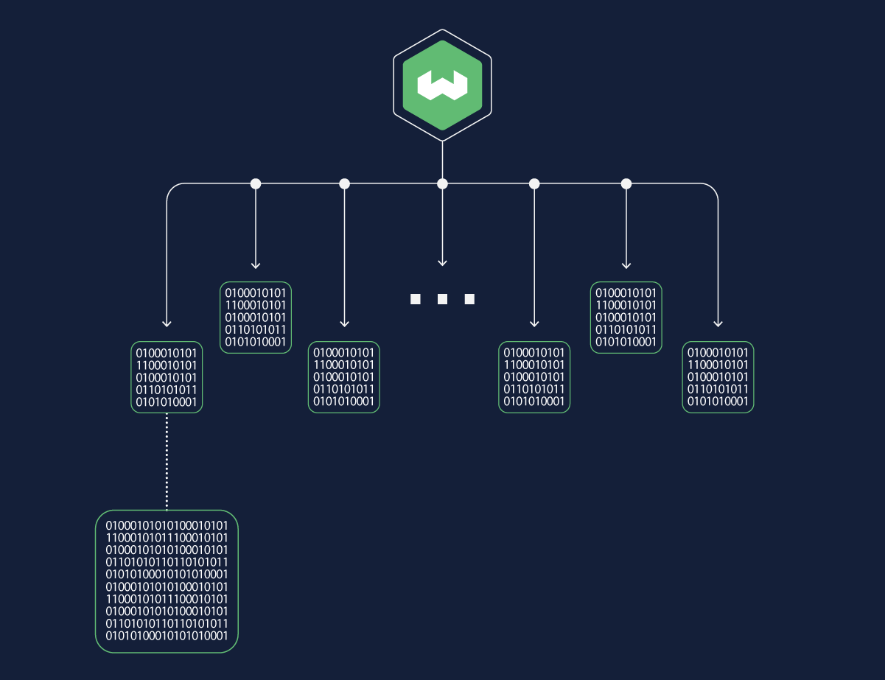

Weaviate `1.24` is here!

Here are the release ⭐️*highlights*⭐️!


- [**Named vectors.**](/blog/weaviate-1-24-release#named-vectors) A single object can have multiple vectors. Create vectors for properties, use different vectorization models, and apply different metrics to fine tune interactions with your data.
- [**HNSW and binary quantization (BQ)**](/blog/weaviate-1-24-release#hnsw-and-binary-quantization) HNSW indexes and BQ combine for serious compression and blazing speed.
- [**Simplified Docker configuration.**](/blog/weaviate-1-24-release#simplified-docker-configuration) A new Docker image that needs no configuration. 
- [**Backend improvements.**](/blog/weaviate-1-24-release#backend-improvements) Numerous improvements to make updates, imports, and deletions faster.  
- [**Python client update.**](/blog/weaviate-1-24-release#python-client)  General availability, support for all the latest features.

## Named vectors


Named vectors make your collections richer and more versatile.
 
Starting in 1.24.0, collections can have multiple, named vectors. Each vector is independent. Each vector has its own index, its own compression, and its own vectorizer. This means you can create vectors for properties, use different vectorization models, and apply different metrics to fine tune interactions with your data.

In earlier versions, objects in you collections were limited to one vector. Now, you can vectorize meta data like titles and descriptions so they are available for vector search. You can group store that are logically related, like a music video and a lyric sheet, in the same object. You don't have to create [cross-references](/developers/weaviate/manage-data/cross-references) or manage shared metadata, a single object in a collection can have multiple, named vectors.

You do not have to use multiple vectors in your collections, but if you do, you need to adjust your queries to specify which vector you want to use. 

For details, see [Named vectors](/developers/weaviate/config-refs/schema/multi-vector).

## HNSW and binary quantization 



Weaviate expands binary quantization (BQ) in 1.24 so we can be faster, more memory efficient, and more cost-effective for our users. Now you can use BQ vector compression with HNSW indexes.

BQ compresses vector representations while preserving essential information. Vector directionality is encoded as a single bit per dimension, which significantly reduces storage requirements. Uncompressed, Weaviate uses a `float32` for each dimension. As a result, BQ provides a compression factor of 32x - reducing storage from 32 bits per dimension to 1 bit per dimension.

Comparing BQ compressed vectors is fast. To calculate the distance between to vectors, compare their dimensional agreement. For instance, two vectors encoded as [1,1,0,1,0,1,0,1] and [1,1,0,0,1,1,0,1] have a distance of 2. The bitwise comparison ensures optimal resource utilization without compromising accuracy. 

Efficient BQ processing compliments our HNSW index to enable mind dizzyingly fast vector search and throughput!

Let’s talk numbers! You might know from our v1.23 release that combining a [flat index](/developers/weaviate/concepts/vector-index#flat-index) with BQ enables real-time search capabilities. In the 768d vector case, brute forcing 1 million vectors takes about 23 milliseconds. Even in the worst case (4608d vectors), a brute force search takes approximately 90 milliseconds.

A flat index and BQ is fast. But consider a HNSW index and BQ. Together they enable vector search capabilities that reach nearly 10,000 queries per second at 85% recall!

For more details, keep an eye out for an upcoming blog post with all the nitty-gritty details of how HNSW+BQ compares to other index and compression algorithms!

## Simplified Docker configuration

Starting in v1.24.0, there is a new Docker image that runs using common default values. This image lets you start development and exploration quickly. Just enter a simple command line:

```bash
 docker run -p 8080:8080 semitechnologies/weaviate:1.24.0
```

Alternatively, you can edit the `docker-compose.yml` file to customize your instance.

For details, see [Docker configuration](/developers/weaviate/installation/docker-compose)

## Backend improvements

Weaviate is a robust platform that handles many kinds of workloads. This release brings major improvements for imports, updates, and deletions. You don't have to do anything to enable these fixes, but you may notice improved upload times, especially if you make frequent changes to your collections.

## Python client

The new Weaviate [Python client v4](./developers/weaviate/client-libraries/python) is available. The latest release adds support for named vectors and brings numerous other updates. If you have feedback on the new client, please let us know. 

- To learn more about the new client, read the [client release blog post](../2024-02-01-py-client-v4-release/index.mdx). 
- To learn how to upgrade your code, see the [v3 to v4 migration guide](/developers/weaviate/client-libraries/python/v3_v4_migration).

## Summary

Enjoy the new features and improvements in Weaviate `1.24`. This release is available as a docker image and on [WCS](https://console.weaviate.cloud/). Try it out in a free, WCS sandbox, or download a copy and try it out locally.

Thanks for reading, see you next time 👋!
