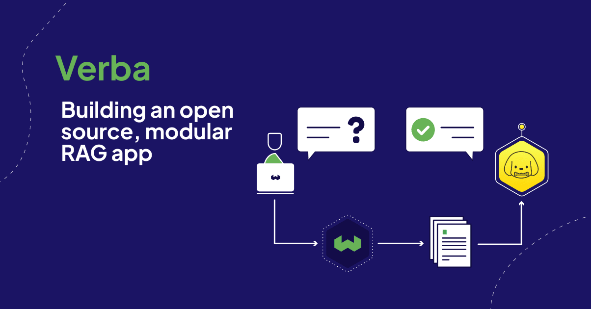

<!-- truncate -->

import example from './img/example.mp4';
import chunks from './img/chunks.mp4';
import ingestion from './img/ingestion.mp4';

Have you ever wished that you could ask a question and get a personalized, relevant answer without having to dig through pages of search results? That's exactly what Retrieval Augmented Generation (RAG) lets you do. RAG applications search for relevant sources and create a personalized answer, using provided data sources instead of the general knowledge Large Language Models (LLMs) are trained on.

But as cool as RAG is, creating a functional application can be overwhelming. There's a lot to learn about implementation, from choosing the right AI models for the use case to organizing your data to get the answers you need. While there are tools like [LangChain](https://weaviate.io/blog/combining-langchain-and-weaviate) and [LlamaIndex](https://weaviate.io/blog/llamaindex-and-weaviate) that make designing a prototype easier, there hasn’t been a simple, ready-to-use open source RAG tool that anyone can pick up and use, with no tech expertise required.

That's why we created [Verba, the Golden RAGtriever](https://verba.weaviate.io/). We wanted to make it easy for anyone to get into RAG, without all the hassle of setting things up or understanding the tech behind it. With Verba, you can jump right in and start using your own data to get personalized answers. However, the modular architecture also allows for customization of each part of the pipeline if you needed to adjust the system to further support different use cases.

We have lots of resources already about Verba, including:

- ⚙️ The open source GitHub repository: [https://github.com/weaviate/verba](https://github.com/weaviate/verba)
- 💻 A live demo ingested with Weaviate data, to answer your Weaviate-related questions: [https://verba.weaviate.io](https://verba.weaviate.io)
- 📹 An in-depth video of how to use Verba with your own data: [https://youtu.be/IiNDCPwmqF8](https://youtu.be/IiNDCPwmqF8?feature=shared)

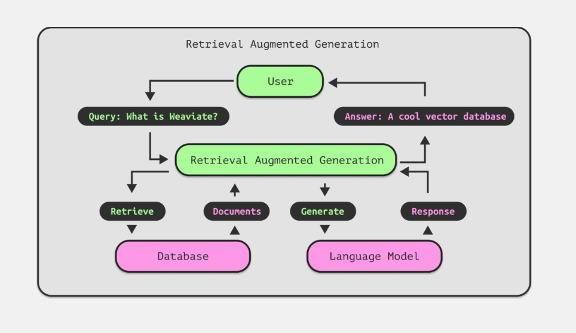

## What is Retrieval Augmented Generation (RAG)?

Retrieval Augmented Generation (RAG) is an advanced method to enhance traditional search techniques by using a Large Language Model (LLM) to help identify and summarize answers. Instead of having to manually comb through documents to find an answer, a RAG system allows you to retrieve relevant sources and return a response in natural, conversational language.

[Vector databases](https://weaviate.io/blog/what-is-a-vector-database) like Weaviate are popular for RAG systems because their enhanced search features like vector or hybrid search allow for quick document retrieval and easy integration with LLMs and other AI tools. Accurate and fast searches allow for the correct information to be included in the answer to the query, which makes the data search system a super important part of a RAG application.

But why not just use a conversational AI agent like ChatGPT for everything?

Although LLM chat systems, like ChatGPT, are great for some tasks, there are several known limitations, including:

- Responding with false or made-up information if it doesn’t know the answer.
- Giving out-of-date information, or unspecific responses.
- Unclarity on where the answer is coming from, possibly getting information from non-credible sources.
- Misunderstanding the terminology or meaning of the users query because of the wide scope of the training data.

This is where RAG can take things to the next level, especially with an application like Verba. If Verba doesn't have the context necessary to answer the query, it'll will tell you it can’t find the relevant response in the data. You have full control over what it knows, and you can also see the sources that the response was based on, so you know where its answers are coming from.

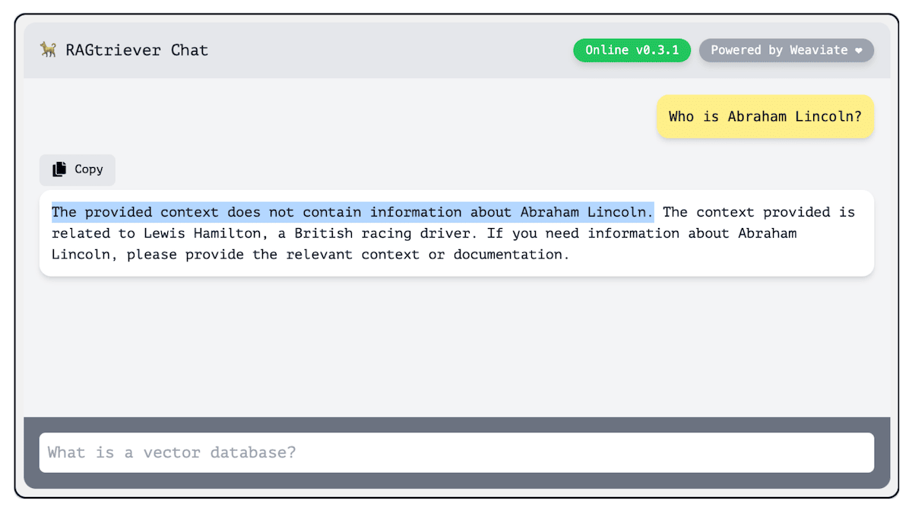

## How do we best interact with AI?

Making an app that's easy for everyone to use is a challenge, especially when it comes to the UI – the part of the app where users interact with the system. The big question is, how can AI technology be made accessible to everyone without requiring an understanding of the complex processes occurring in the background?

Since RAG operates on a question-and-answer system, using a chat interface seems like the most natural choice. Users are familiar with the structure of sending a message and getting a reply. That's one reason tools like ChatGPT have become so popular and user-friendly – they stick to this simple, conversational approach. Despite chatbots sometimes having a bad reputation for being clunky or unhelpful, the advancements in LLMs have really turned things around, making chatbots much more reliable and useful.

<figure>
  <video width="100%" autoplay loop muted controls>
    <source src={example} type="video/mp4" />
    Your browser does not support the video tag.
  </video>
  <figcaption>Ask questions in the chat interface</figcaption>
</figure>

We then need to guide users through their search journey, or at least offer them tools to navigate it easily. Providing examples of search queries or prompts can be a great way to introduce users to the app and help them get started. That's why we incorporated autocompletion in Verba to help users formulate their questions and add a familiar touch to the search experience, like in e-commerce sites or Google. Thanks to Weaviate's fast [keyword search capabilities](https://weaviate.io/developers/weaviate/search/bm25), integrating this [autocompletion feature](https://github.com/weaviate/Verba/blob/main/goldenverba/verba_manager.py#L429) into Verba was a straightforward process, allowing us to offer autocompletion right from the start.

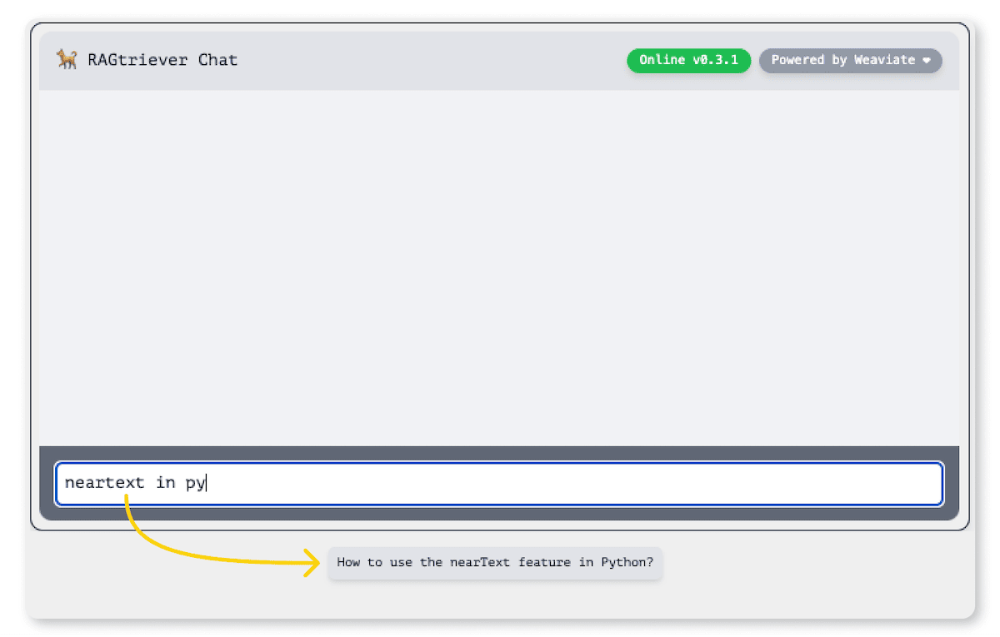

One of the standout features of RAG is it’s ability to directly indicate the sources it used to compile answers. In Verba, we've made it a point to display the specific segments (or chunks) that contributed to an answer and highlight the exact paragraph used. Beyond that, users have the option to view the entire document directly in the UI for a more comprehensive understanding, or trace documents back to the original source.

This means that users can independently verify the credibility of the responses generated and gather more related information if needed. By making the source information easily accessible within the UI, we’re able to demystify the process of question answering, allowing users deeper insight into how responses are formulated and ensuring transparent communication and information reliability.

<figure>
  <video width="100%" autoplay loop muted controls>
    <source src={chunks} type="video/mp4" />
    Your browser does not support the video tag.
  </video>
  <figcaption>
    See sources directly in the UI with highlighted chunks
  </figcaption>
</figure>

Keeping with the theme of making an accessible open source RAG app to people without a technical background, we needed to create a user-friendly experience to add (ingest) data into the system. The goal was to avoid requiring users to run complex ingestion scripts. Instead, Verba has a straightforward web interface where users can upload their data directly, bypassing any need for scripting.

This was one of the areas in which the balance between having sensible defaults and allowing for a fully customizable app was really important. While a lot of users prefer not to delve into the intricacies of parameter tuning and want an out-of-the-box solution, many use cases require some level of customizability, and having default options that can be easily adjusted was a large underlying design strategy of Verba. This balance ensures that the application is accessible and manageable for everyone, regardless of their technical expertise, making the overall experience more inclusive.

<figure>
  <video width="100%" autoplay loop muted controls>
    <source src={ingestion} type="video/mp4" />
    Your browser does not support the video tag.
  </video>
  <figcaption>Upload documents directly into the web interface</figcaption>
</figure>

In Verba, users also have the ability to easily manage their data after ingestion in a dedicated space within the interface. They can view everything they've uploaded and delete any documents that are no longer relevant. This full range of data management capabilities, often referred to as [CRUD (Create, Read, Update, Delete) functionality](https://weaviate.io/developers/weaviate/manage-data), are super important for question-answer systems, where users need to ensure that they have the updated, correct context to provide the right responses. With the simple page holding all controls for data modification, users maintain control over their data at all times.

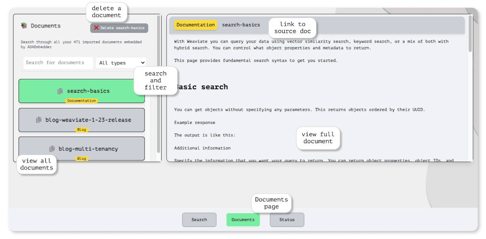

We know how important it is for users to quickly check if everything's running smoothly when using an app. Questions like "Is the app working right now?", "Which features can I use?", or "Are we using the latest version?" often are some of the most asked, and sometimes overlooked when building out an interface. That's why we've created a special Status Page.

This page is a one-stop spot where you can see if the app is up and running, check out which features are turned on, and get updates on any new versions or settings. It's all about making things clear and simple so that the app can work without any guesswork.

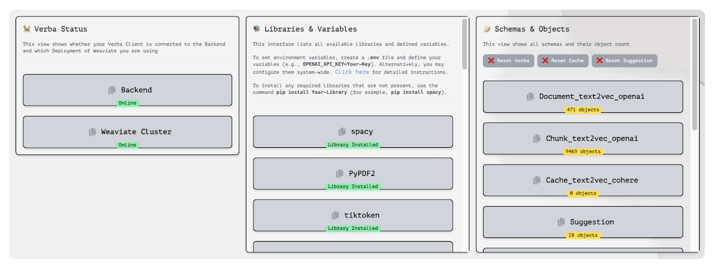

## Creating a Modular RAG architecture

Taking a closer look behind the scenes at Verba, we aimed to make it both fully customizable and adaptable, but also easy to use out-of-the-box. With new advancements in RAG and AI happening almost every day, it was important for us to design Verba so it could grow and easily incorporate new discoveries and different use cases. That's why we broke down the RAG process into several separate, modular steps. This approach makes it simpler to keep the system up to date, add new features like integrations with other AI libraries, and allow users to tailor it to their own needs. It's all about giving users a powerful tool that's not just useful now but will continue to be valuable as technology evolves.

The architecture of Verba is designed around five key steps, each customizable and controllable to suit different needs:

1. `ReaderManager` : Readers receive a list of strings, which can either be a list of paths, urls, or text. They output a list of Verba Documents.
2. `ChunkerManager` : Chunkers receive a list of documents and chunk every individual document text into smaller pieces. It saves them within the document object and returns the list of modified documents.
3. `EmbeddingManager` : Embedders receive a list of documents and embed them into Weaviate. They are also used to retrieve chunks and documents from Weaviate.
4. `RetrieveManager` : Retreivers communicate with the Embedder to retrieve chunks and apply custom logic. They return a list of chunks.
5. `GenerationManager` : Generators use a list of chunks and a query to generate an answer. It returns a string as the answer.

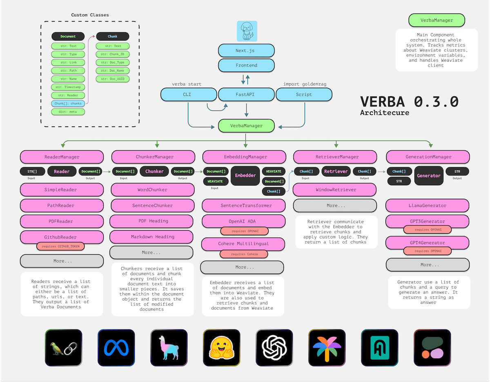

### Reader Manager: Data ingestion

Let's break it down, starting with the ingestion process. This step is all about handling various types of data, from plain text files and PDFs to Excel sheets and beyond. The goal here is to convert these different formats into a unified structure for further processing. This stage, focused on data engineering, is often the most time-consuming part of building a system like this. This is one of the advantages of using an app like Verba, where the heavy lifting of managing data pipelines is already taken care of.

For each type of data, we create a specific [Reader component](https://github.com/weaviate/Verba/tree/main/goldenverba/components/reader). This could be a component for reading plain text files, PDFs, Excel files, etc. Users have the flexibility to add new readers as their needs evolve, ensuring that Verba can handle a wide array of data formats. These readers are then organized and controlled by a central management structure, which oversees their operation.

This modular approach extends to the other components or steps of Verba. Each step involves specialized components managed by a central authority that oversees controls and options. This structure ensures that Verba remains adaptable and efficient, capable of evolving with users' needs and the latest advancements in data processing and retrieval.

### Chunker Manager: Breaking data up

After we've formatted the data into a consistent format, the next step is to break it down into smaller chunks using the [Chunking component](https://github.com/weaviate/Verba/tree/main/goldenverba/components/chunking).

Why not just use the entire documents?

When people turn to RAG for help, they're typically on the hunt for specific bits of knowledge rather than the right document as a whole. By adding entire documents into the mix, we're also increasing the number of words or tokens that the LLM needs to sift through. The more tokens and the broader the range of topics in a single request, the tougher it becomes for the LLM to pinpoint accurate results. By dividing documents into smaller sections, or chunks, Weaviate helps us zero in on the relevant passages. This not only cuts down on the total number of tokens but also boosts the chances of those passages being exactly what we're looking for.

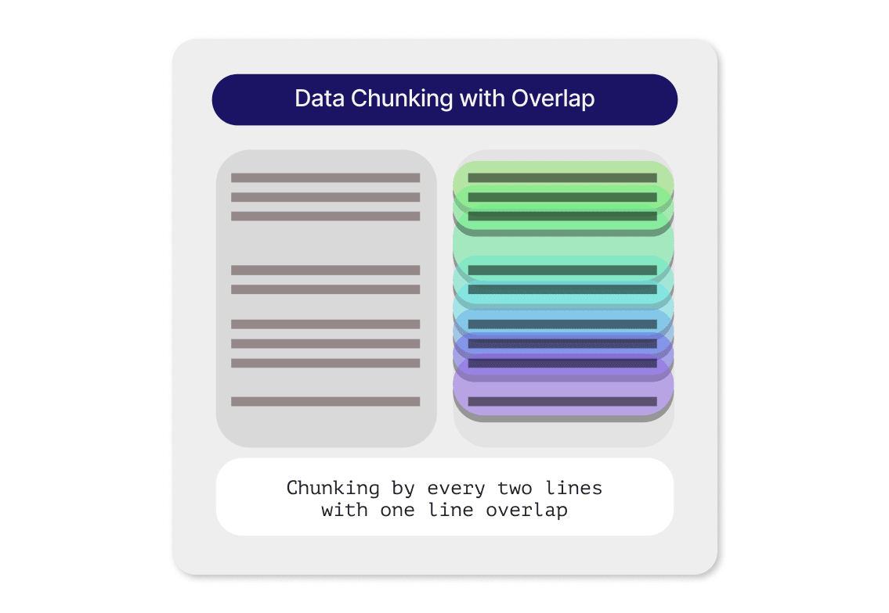

There's a growing list of ways to chunk data, with each strategy bringing something unique to the table. In Verba, you can add a new Chunker Component tailored to your preferred chunking technique. Let's take a moment to talk about a commonly used default option: the overlap chunker. The gist of it is pretty straightforward—we divide the document into sections that slightly overlap with each other. This bit of overlap brings the chunks closer together in the vector space, which not only enhances the search process but also ensures that we don't lose critical interrelated information at the edges of each chunk.

### Embedding Manager: Vectorizing data

After breaking the documents into smaller chunks, these pieces are then uploaded into Weaviate using the [Embedding component](https://github.com/weaviate/Verba/tree/main/goldenverba/components/embedding). Users can then choose from various embedding models to process their data. Whether it's [OpenAI](https://weaviate.io/developers/weaviate/modules/retriever-vectorizer-modules/text2vec-openai), [Cohere](https://weaviate.io/developers/weaviate/modules/retriever-vectorizer-modules/text2vec-cohere), [HuggingFace](https://weaviate.io/developers/weaviate/modules/retriever-vectorizer-modules/text2vec-huggingface), Ollama, or any other provider, Verba and Weaviate support them immediately. This flexibility lets users pick the model that best fits the needs or preferences of their specific use case.

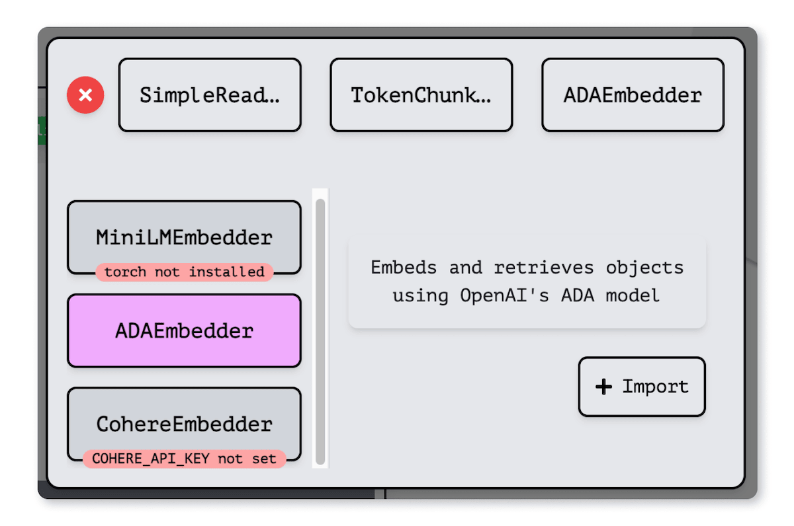

Both the document's title and the chunked content are transformed into [vector embeddings](https://weaviate.io/blog/vector-embeddings-explained). This process isn't just about changing the format; it's about capturing the deep meaning, the semantic context, and how these chunks relate to each other. By vectorizing the documents, the system can then quickly and accurately pinpoint the most relevant information based on the context and relationships encoded in those embeddings.

### Retrieve Manager: Finding the context

After preparing and organizing the data, the final two architectural steps focus on how we retrieve information from the data store. The [Retriever component](https://github.com/weaviate/Verba/tree/main/goldenverba/components/retriever) retrieves the relevant context using an advanced search technique called [hybrid search](https://weaviate.io/blog/hybrid-search-explained). This approach combines the best of both worlds: traditional keyword search and vector search. When the query requests something specific, like "healthy chocolate cake," it not only looks for matches with the exact words "chocolate" and "cake", but also understands the meaning behind the query. It can find recipes that are "low sugar," matching the semantic idea of "healthy."

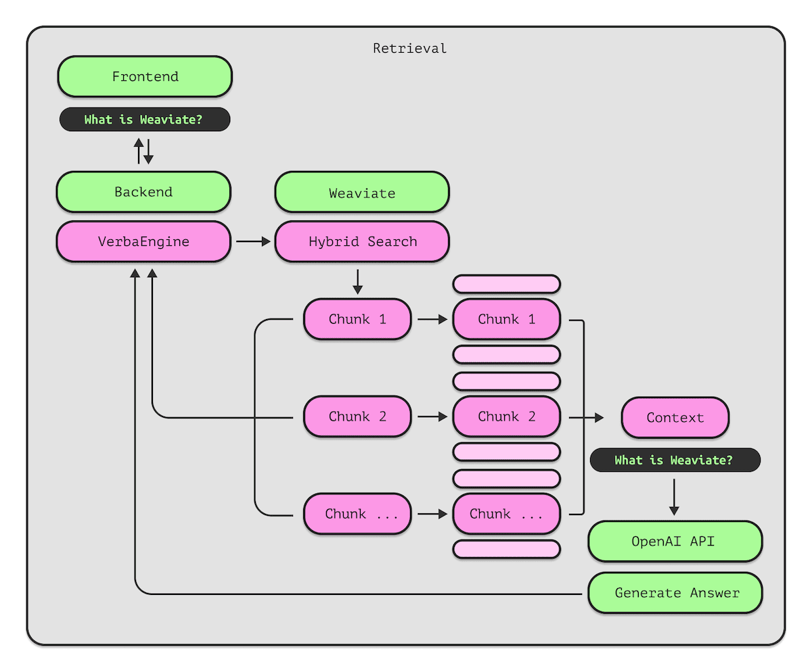

Weaviate is quite versatile, offering various search methods, including traditional [keyword search](https://weaviate.io/developers/weaviate/search/bm25), [vector search](https://weaviate.io/developers/weaviate/search/similarity), [hybrid search](https://weaviate.io/developers/weaviate/search/hybrid), and even [generative search](https://weaviate.io/developers/weaviate/search/generative). This variety allows users to tailor the search process to different use cases. A standout Weaviate feature we also use in Verba is called [autocut](https://weaviate.io/developers/weaviate/api/graphql/additional-operators#autocut). This smart tool automatically determines the number of results to return from the Weaviate database based on their relevance to the query. If there's a significant drop in similarity between results, `autocut` will trim the list, ensuring that the LLM gets just the right amount of information to generate accurate answers.

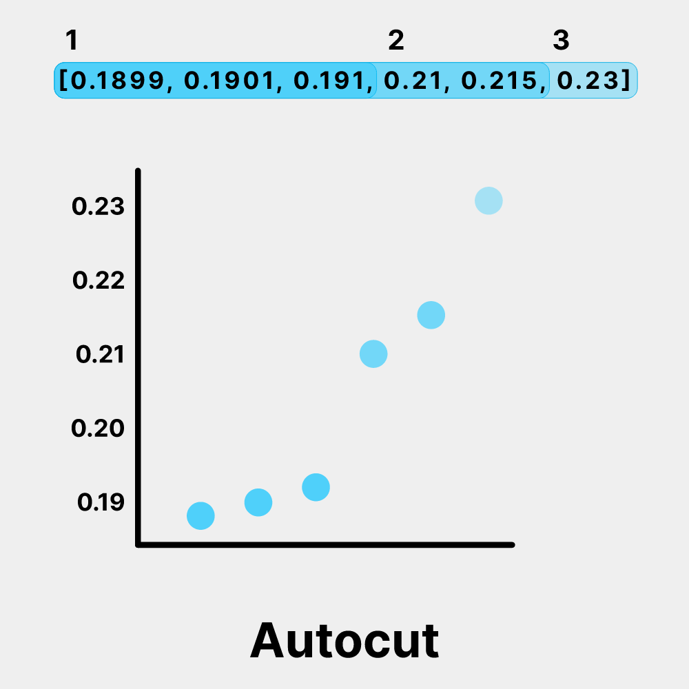

### Generation Manager: Writing the answer

The final step in the RAG pipeline generates the answer to the user’s query in the [Generation component](https://github.com/weaviate/Verba/tree/main/goldenverba/components/generation). This is where the system takes the query and the relevant context retrieved from Weaviate and passes it to a Large Language Model to craft a response. At this stage, users can choose which LLM provider they prefer, along with any specific settings or options that the provider offers.

Once the answer is ready, it's sent to the chat interface to display to the user. But we don't stop there. Along with the answer, we also show the pieces of information (chunks) that were used to generate it, complete with their relevance scores. This is done to provide transparency, showing users the final answer and exactly what sources it came from.

We've taken a detailed look at Verba's architecture, which is designed to be flexible while maintaining good default solutions. This adaptability is really made possible by Weaviate’s own design. In addition to providing customizable options across searching techniques, Weaviate also has a number of deployment options, including running it [locally](https://weaviate.io/developers/weaviate/installation/embedded), [through Docker](https://weaviate.io/developers/weaviate/installation/docker-compose), across various cloud platforms, marketplaces, or even via [Weaviate Cloud Services (WCS)](https://weaviate.io/developers/weaviate/installation/weaviate-cloud-services).

## Getting started with Verba

[Getting started with Verba](https://github.com/weaviate/Verba/tree/main?tab=readme-ov-file#-getting-started-with-verba) is straightforward; you can install it with a simple **`pip install goldenverba`** command. By default, Verba runs Weaviate locally, which means you can get up and running without any complex database setup or the usual headaches. Verba is also designed to work seamlessly for users who prefer or require a managed instance, meaning you can switch to a cluster with just a few configuration adjustments.

The guiding principles behind building Verba were clear: make the setup process simple, ensure the application is easy to understand and use, and allow users to expand on the basic functionality for their specific use case. By designing a modular, open source RAG architecture and a web UI with all the controls, we aimed to create a user-friendly experiences that allows anyone to have access to advanced retrieval augmented generation and get started using AI native technology.

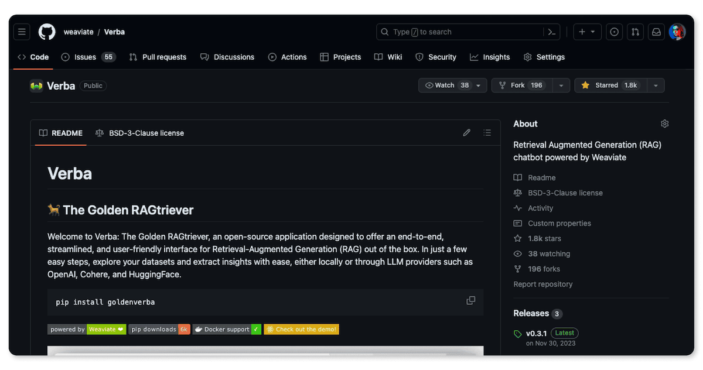

## Future of Verba

Verba has truly hit a milestone with over 1800 stars on GitHub, a testament to the power of open source collaboration. [Making Verba open source](https://github.com/weaviate/Verba/) was a deliberate choice, aimed at broadening access to different RAG techniques and showcasing the capabilities of Weaviate. The journey doesn't end here, though. While Verba has already made significant strides, there's a roadmap full of enhancements and tons of good ideas from the team and the community.

We’re looking into adding Weaviate's [multi-tenancy capability](https://weaviate.io/blog/multi-tenancy-vector-search), which supports isolated data environments, into Verba for a multi-user setup. It would allow a more enterprise-focused solution for security and data isolation, especially with additions like local LLMs like Ollama for embedding and generation.

We’re super thankful for the team and community for all the support and excitement around Verba, and can’t wait to see what improvements the future holds!

import WhatsNext from '/_includes/what-next.mdx';

<WhatsNext />
