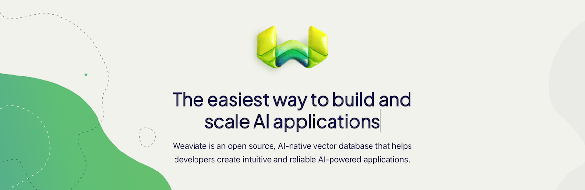

# Enterprise Use Cases for Weaviate

<!-- truncate -->

import verba_overview_video from './img/verba_overview_video.mp4';
import ragsend from './img/ragsend.mp4';
import generative_feedback_loops from './img/generative_feedback_loops.mp4';

The world was taken by storm by OpenAI ChatGPT in November of 2022. The interesting thing about this is that the technology that powers ChatGPT and related language models has actually been around for some time before then and was originally discussed in [this scientific paper](https://arxiv.org/abs/1706.03762v1), released by Google, in 2017. It was also around this time that we, at Weaviate, began exploring the representations of data in different formats that carried semantic meaning to these transformer models, as described by Google’s paper. If you check out the [Weaviate GitHub repository](https://github.com/weaviate/), you’ll see that we began leveraging semantic relationships of vector embeddings as early as the publication of “Attention is All You Need” from Google. In 2019, SeMi Technologies was born, later renamed to Weaviate, and since then we’ve been building and iterating on a highly performant, open source, AI Native vector database that’s closely coupled with language models of your choosing.

The debut of ChatGPT kicked off a wave of innovation that has led nearly every industry to consider how they can extract value from these LLMs by integrating Generative AI use cases and features into their business offerings. We’ve had the privilege to be building these AI Native applications, RAG services, search and recommendation systems, and so much more with so many happy customers. 

:::note Event
Event: If you happen to be in San Francisco on March 21st, 2024, you should consider coming to our event called “[AI in Prod](https://events.weaviate.io/ai-in-prod-sf-24?hs_preview=fyTFtKzn-157102494551)”, where Etienne Dilocker, CTO and Co-Founder of Weaviate discusses some of our learnings, but also hear from our customers about how they’re using Weaviate in production.
:::

In this blog post, we’re going to explore enterprise use cases that you can build into your business offerings today and identify how you can measure the impact of your GenAI features in your business too.

## What is Generative AI and Why Do I need A Vector Database?

Generative AI is no longer as new as it was a year ago, since the inception of ChatGPT, so many business leaders and developers have been thinking about how to use generative AI effectively. With the increased developer mindshare going into generative AI, the number of tools are also increasing as well. It’s through the deep integration of these tools with Weaviate that allow for the flexibility for businesses to build in the use cases that fit their needs.

Let’s first talk about some of the technology that makes generative AI possible.

At the most fundamental level, generative AI, as we know it today, is a prediction algorithm. Predictions by these algorithms are made possible by training over a large… massive corpus of data and allows a deep learning neural network to build out weights that represent the probabilistic nature of the data. Once the model is trained with all the weights, you can pass in new data for the model to make an inference over. In the inference process, the model returns the next most probabilistic output from the model, then feeds back all the original prompt as well as the output back into the model for the next inference until there is a STOP indicator sent back from the model. This informs us that the inference is complete for the original prompt. After we do this training process over massive amounts of text, “a model” is produced which is capable of generating new text based on the next most probable word to be chosen, we call these models, “large language models”. 

The model is deep learning neural network with many layers and weights distributed across the entire network representing the probablistic nature of your dataset. 

Through this simple input output system, we can leverage these foundational large language models to generate new content based on natural language prompts. And because they contain massive amounts of data, we don’t necessarily have to train custom neural networks to leverage their capabilities in real world business use cases. Beyond incredible innovation in drug discovery and chip design, these systems allow for the complete automation, or human in the loop based systems, to augment business to consumer experiences or increase enterprise output.

### Vector Databases

Vector databases are a fairly new class of database that is specifically designed to store and look up vector embeddings. A vector embedding is a numerical representation of some unit of data that has semantic meanings relative to the weights of the language model.

These numerical representations are usually presented as an array of numbers and can have various sizes, or dimensions. As they are effectively a vector in N-dimensional space, we can place them into vector space and clustered vectors naturally have higher similarities to one another. As a result, we can write clever algorithms over this vector space to look up vectors that are closely connected, we call these vector search algorithms. This is distinctly different from a traditional database because the lookups are only capable of finding data in neatly structured entities. 

At Weaviate, we’ve implemented a custom [HNSW](https://weaviate.io/developers/weaviate/concepts/vector-index#what-is-hierarchical-navigable-small-world-hnsw) [indexing](https://weaviate.io/developers/weaviate/concepts/vector-index) algorithm to allow for highly performant querying over your dataset which enables all sorts of business use cases at scale.

## Features for Enterprise

A good vector database is one that is highly flexible and fits your needs. One that allows you to remain in control of your data at all times and gives you the control to do what you want with that data, such as store it in your own virtual private cloud when you have stricter compliance concerns.

Weaviate has way too many features and capabilities to describe in a single blog post, but here are some of the most relevant ones for enterprise use cases.

### Search

Weaviate’s core competency can be boiled down to search. 

We enable highly relevant search in all use cases. As mentioned previously we support [vector search](https://weaviate.io/developers/weaviate/search/similarity), which allows for semantic relevance retrieval. We support text based search to “near text concepts”. These near text concepts are calculated by semantic relevance based on the embedding model weights. We also support image based search to find objects with the nearest vector to an image. 

In other use cases, we’ve found that [keyword search](https://weaviate.io/developers/weaviate/search/bm25) is more important for some applications. "BM25 (Best match 25)" or "sparse vector" search, returns objects that have the highest BM25F scores. 

Vector Search and Keyword Search each have their advantages, but often times, the results from vector search or keyword search are too restrictive and the optimal set of results are somewhere in-between. This is why we also have [hybrid search](https://weaviate.io/developers/weaviate/search/hybrid) which combines results of a vector search and a keyword (BM25F) search. You can set the [weights](https://weaviate.io/developers/weaviate/search/hybrid#balance-keyword-and-vector-search) or the [ranking method](https://weaviate.io/developers/weaviate/search/hybrid#change-the-ranking-method).

Another format of search built right into Weaviate couples the language model right into your search queries. This allows you to build in more constrained prompts to ensure the language model makes inferences based on the datasets provided further reducing hallucination. We call this [generative search](https://weaviate.io/developers/weaviate/search/generative). Generative search is the foundation to building RAG applications with Weaviate. We’ll go further into detail about RAG later in this blog post.

### Named Vectors

Search is a core competency, but Weaviate offers features that help you build more fine grained search controls as well. One of these features is multiple vectors, or [named vectors](https://weaviate.io/developers/weaviate/config-refs/schema/multi-vector), for a single collection. A named vector is independent and has its own index from other vectors on the collection. It has it’s own compression and can be configured with its own vectorizer. The advantage of using named vectors, beyond being able to query within constrained vector spaces is that you also have different metrics to the same object creating more “dimensions” for which it can be described or queried.

### Multi Tenancy

[Multi tenancy](https://weaviate.io/developers/weaviate/manage-data/multi-tenancy) isolates data in individual tenants to avoid cross querying of search results. Each tenant is a separate shard in Weaviate, giving you high guarantees of isolation between data.

This feature is ideal if you have different customers where each wants to load data into your enterprise application, but don’t want cross pollination of results between those tenants. The Weaviate multi tenancy scales to millions of tenants.

If you’d like to learn more about our multi tenancy implementation, [read this blog post](https://weaviate.io/blog/multi-tenancy-vector-search) by our CTO, Etienne Dilocker. 

### Data Privacy and Compliance

Of course, with any enterprise tool, compliance and data privacy are top of mind for any product adoption. As an open source vector database, we support many deployment models from being self-hostable in your own infrastructure using docker or kubernetes, to being deployed into your own VPC in AWS or GCP via the marketplaces, or if you’re compliance requirements allows it, you can also deploy on Weaviate Cloud Services which will reduce your overhead of managing your Weaviate clusters as well.

You can learn more about our security standards [here](https://weaviate.io/security).

## Application of GenAI and Weaviate in Business Use Cases

Enough with features, what are some applications of Weaviate and GenAI in the enterprise? 

Across many of our customers, there are a few common architectural patterns in the applications they are building. All of them revolve around applying some search query over the dataset to retrieve relevant data, then utilizing a language model to generate some natural language with that data. The output can be applied to various use cases in business operations across many different industries. 

### Chatbots

One of the most common tools we’ve seen generative AI applied to are chatbots. This is a natural extension of language models as they behave as text inference tools. By using Weaviate along side your large language model, you can create a chatbot that is knowledgeable about your data and provide relevant responses to your users.

<figure>
  <video width="100%" autoplay loop muted controls>
    <source src={verba_overview_video} type="video/mp4" />
    Your browser does not support the video tag.
  </video>
  <figcaption>Asking questions to Verba, the Golden RAGtriever</figcaption>
</figure>

This is [Verba](https://verba.weaviate.io). Our open source first party RAG example which demonstrates some of the best practices around chunking, prompting, and modularity. We released Verba about half a year ago and in just a few short months, it’s gained massive traction and has pulled together nearly 2000 stars on GitHub. Many developers have cloned Verba, running Weaviate locally in their own environments, and loaded their own datasets which range from the entire Lord of the Ring series to enterprise data as well. 

Verba can be an excellent starting point to building and customizing your own RAG application. If you’d like to clone it, you can find it on [GitHub](https://github.com/weaviate/verba). Additionally, we have a blog post that goes into detail about [building modular RAG applications](https://weaviate.io/blog/verba-open-source-rag-app), and dives deep into some of the design choices of Verba.

Chatbots are an easy tool to help reduce costs on your business operations. By augmenting existing human support, you can tangibly measure a reduction in time spent handling customer support requests. There are many ways to implement this, from putting a chatbot as the first line of response, with human follow up when necessary. In this model, there’s an easy metric to measure success by evaluating the number of customer support queries that are handled entirely by the bot, and the reduction in load placed onto the support team. Over time, this metric should be analyzed, and improvements should be applied to the chatbot to ensure continued reduction in operational costs.

### Analytics Driven Automated Marketing

Having access to data and being able to make business decisions from that data has been the pinnacle of value in the information era

The idea that data is the new oil is one concept that has taken the industry by storm and massive data analytics tools have come to market as a result, including Snowflake, BigQuery, DataBricks and the likes. The way this data is made available today allows for larger business decisions to be made, but applying them on a granular level at scale can increase overall adoption by your prospects to help push the needle further. Using Weaviate, you can understand semantic meaning behind that dataset on an individual and create tailored messaging to users who are most likely to convert.

This is RAG Send for Hotel Marketing. It allows you to generate emails using a variety of tools such as Resend for emailing. As this is a fictitious demo, we use Dagster for data orchestration and the creation of fictitious hotels with stable diffusion hosted on Replicate.

<figure>
  <video width="100%" autoplay loop muted controls>
    <source src={ragsend} type="video/mp4" />
    Your browser does not support the video tag.
  </video>
  <figcaption>Generate marketing emails</figcaption>
</figure>

RAG Send for Hotel Marketing can generate automated marketing emails based on the analytics of a user’s past interactions with the hotel datasets available on your platform.

This is yet another form of RAG, just applied to a marketing use case. 

### GFL - Generative Feedback Loops

Generative feedback loops are a newer application of Weaviate where you leverage the output of the language model and apply search over that output along with the existing dataset. This can be used to create customized formats of the original data relevant to specific users, or classes of users.

An example implementation of this can be seen in RAG Send for Hotel Marketing as well. A generative feedback loop first leverages RAG or generative search in order to yield a set of results based on some analytics and usually the prompt contains some relevant data for your specific user and their past behaviors.

From there, you embed the the LLM output back into the vector database to apply search over it again, and this query could contain questions that the prior generation will have some insight over.

If you’d like to learn more about this, we’ve authored [a blog post](https://weaviate.io/blog/generative-feedback-loops-with-llms) about how you could leverage generative feedback loops to create targeted ads.

<figure>
  <video width="100%" autoplay loop muted controls>
    <source src={generative_feedback_loops} type="video/mp4" />
    Your browser does not support the video tag.
  </video>
  <figcaption>Apply a generative feedback loop to Weaviate</figcaption>
</figure>

### Ecommerce Recommendations and Multi Modal Search

Within ecommerce, the applications of vector database can be used to create recommendation systems, image search systems, and general search systems. A combination of these can allow your customers to find products more easily or be referred to products that your vector search results can surface.

An increasing number of larger ecommerce companies are starting to expand their offerings with Weaviate vector search. We’ve got a [case study](https://weaviate.io/blog/moonsift-story) with a beautiful implementation of Weaviate with Moonsift as well as an on-demand webinar you can get after reading this blog post as well!

## The Future of GenAI Applications in the Enterprise

It’s an exciting time here at Weaviate especially seeing the breadth of applications that customers are leveraging our capabilities for. The applications and use cases discussed in this blog post are some of the more prevalent ones, but the tools and applications developers are building with Weaviate are increasing every day. You can be certain that Weaviate is building cutting edge features and taking you into the next era of technology and integration of AI into your applications. 

There are tons of ways to get started with Weaviate if you’re looking to build generative AI features into your application. We’re on many of the major cloud provider marketplaces ([GCP](https://weaviate.io/developers/weaviate/installation/gc-marketplace) and [AWS](https://weaviate.io/developers/weaviate/installation/aws-marketplace)) or you can get started with Weaviate for free using a sandbox in [Weaviate Cloud Services](https://console.weaviate.cloud) or deploy our open source database locally with docker. 

If you have any questions, don’t hesitate to reach out to us on our [public slack community](https://weaviate.io/slack)!

import WhatsNext from '/_includes/what-next.mdx';

<WhatsNext />