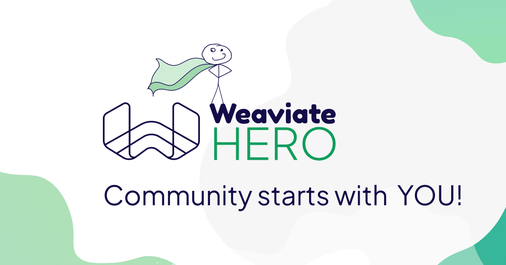
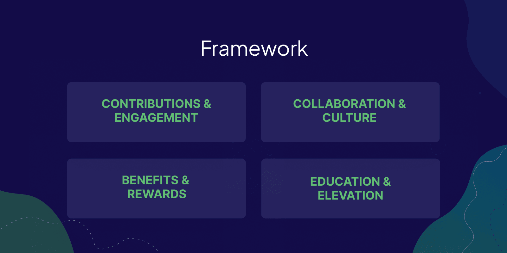

<!-- truncate -->

# The Weaviate Hero - Community Starts with YOU

We’re excited to share the details of our newly launched Weaviate Hero Program! Let’s use this opportunity to shed some light on Weaviate's core Community values, what our Weaviate Hero program is all about, why we launched it, what it takes to become a Weaviate Hero, and why we purposely spell Community with a capital C.

## Community on the Fast Track

With the rise of LLMs and Generative AI last year, Weaviate’s Community grew exponentially. This is amazing and an essential aspect for us as an open-source technology company.

Today, we have more than 25K members in our Community, and we are still growing rapidly.

Our Community is active across the web and in real life. We see engagement in channels like LinkedIn, Twitter, Github, Slack, Discourse, and StackOverflow, as well as at conferences, meetups, and hackathons. In all places community members:

- discuss the most recent developments in Open Source and AI
- share their knowledge on how to build amazing AI-native applications with Weaviate
- ask questions about best practices and insights
- collaborate and network to accelerate their learning and support each other for success
- contribute to our open-source projects to drive innovation and improvements, and to solve issues and challenges

## Community with a Capital C

Growing a community and engaging on different levels is one part of the picture. What strikes us most is something else - the underlying culture. We describe the Weaviate Community with three simple but powerful words:

**Kind - Open - Inclusive**

These words represent the core values of our Community. They are reflected in many different actions and signals:

- **Open:** People actively share questions, knowledge, and feedback within more than 200 messages per week inside our open [Slack community](https://weaviate.io/slack),  [discourse forum](https://forum.weaviate.io), or [GitHub](https://github.com/weaviate) repositories
- **Kind:** Community members genuinely support and help each other to succeed and grow. Each week, there are more than 350 comments, replies, or answers across our channels, and this does not include 1:1 messages
- **Inclusive**: People come from across all parts of the world, from very different backgrounds, companies, and industries. Still, they are respectful of each other, kind, and inclusive. This shows in an overall response rate of 70%, a positive sentiment in 80% of all communication, and of course, in many messages and feedback we get.

An inherent aspect of communities - that is of utter importance to be aware of - is that community is never just something disjunct from your company, your employees, your culture, or your values - it always starts inside: inside the company, inside its teams and employees and inside each individual that is part of a community. Everyone at Weaviate understands the importance of our Community and is an integral part of it.

This is why we write **Community with a capital C**.  - Our Community members matter, and the way we engage and collaborate with our Community and its members is fundamental for our success.

We feel genuine gratitude for the vibrant and kind way our Community members engage with each other. We strive to embrace and celebrate people who actively share their knowledge, act as role models for others, and support other members in learning, growing, and thriving.

## The Spark of Weaviate Hero

The Story around the origins of our Weaviate Hero Program is actually quite a Fun Fact - at least to me.

Ever since I started my journey in DevRel & Community, I have been a strong believer in the fact that Community is strongly connected to the culture and perception of a company. When joining Weaviate, I mentioned that the heart of Community lies inside the company. Therefore, it’s a nice coincidence that the fundamental idea for our Weaviate Hero Program comes from our internal culture.

During our town hall meetings, Weaviate employees, aka Weaviators, get the chance to give shout-outs to another employee who supported them in succeeding on their tasks, learning something new, growing their knowledge and skills, or lifting them up when needed. Our people and culture team opens up this part of our town hall meetings by asking, “Who is your Weaviate Hero” —> this is how the name for our Champions Program was set.

With the Weaviate Hero Program coming to life, we want to expand this internal initiative and also give kudos to people in our Community who help other members learn, grow, and thrive by sharing their knowledge, providing feedback, collaborating, and leading by example.

## The Weaviate Hero Program - in a Nutshell

The Weaviate Hero Program was brought to life to appreciate, recognize & celebrate members of our Community who contribute and engage in ways that:

> *“Make our Community a great and safe place where people can learn, make friends, and grow. A place for giving and receiving.”*

Community members who ultimately develop and share practices that help others in the group thrive. With this global program, we enable members to accelerate their knowledge, skills, and growth in the areas of Vector Databases, Search, and AI-native applications and become thought leaders through their activities and initiatives across the Weaviate Ecosystem.

## Being a Weaviate Hero - Our Framework

Everyone can be a hero - if they choose to be one. But what does it take to be a Weaviate Hero?

To make this program transparent and coherent across all areas of our Community, it is based on four core pillars. Some aspects of the framework might be obvious; others might be new to you. We will look into these pillars a little closer in this section.

### Contributions & Engagement

Weaviate Heroes are passionate about Weaviate. They build AI-native applications and contribute back to our community and product roadmap in a true open-source manner. Members of the Weaviate Hero program share their ideas, thoughts, and feedback to improve Weaviate through GitHub, Slack, or direct conversations with our engineers. 

They engage in early access initiatives and share their knowledge and experience in various ways, like answering Questions in our Open Slack Community, the Weaviate Forum, or Stack Overflow, joining our Podcasts or live streams, publishing blog posts, or attending community and in-person events.

The content varies from deeply technical to use-case driven and aims to support others on their journey of building amazing AI-native applications with Weaviate.

### Collaboration & Culture

As you probably grasped from the first parts of this post, culture plays a crucial role at Weaviate - inside the company and in our Community. So, it doesn’t come as a surprise that Weaviate Heroes are true role models for being **kind**, **open**, and **inclusive**.

They are always keen to build valuable relationships and collaborate across the community to support and learn from other members and share their own expertise. Through their inspiring behavior, they play an integral part in fostering innovation and growing Weaviate’s Community in many aspects.

All in all, Weaviate Heroes help us make our Community a great and safe place for EVERYONE.

### Benefits & Rewards

A fundamental basis of any champions program is to show appreciation and gratitude and reward and value outstanding behavior and contributions. This is also true for the Weaviate Hero Program.

Next to having dedicated and special merchandising - just like our Weaviate Heroes - we also reward individual contributors.

During the 12-month membership, there will be special initiatives and incentives that can include (but are not limited to):

- participating in Weaviate-owned and sponsored events
- dedicated communication channels
- providing enablement material (like books, workshops, courses, etc)
- Meet & Greets with Weaviate employees
- Credits

This is only a small excerpt of possibilities - our primary goal is to reward activities and provide value to our Weaviate Heroes - and that can vary from person to person or change over time due to the nature of a fast-moving ecosystem. Hence, these benefits and rewards can be different each time and will be evaluated on an individual level.

### Education & Elevation

Celebrating and rewarding contributions of all kinds is only the first step to appreciating and valuing the time and effort community members invest into enabling and helping others be successful. The second step is to enable, educate, and elevate Weaviate Heroes themselves. 

Dedicated content and materials that can help better understand core - and advanced - concepts around various interesting topics.

Roundtables, expert talks, or workshops give them a chance to meet other experts, ask questions, engage in discussions, and collaborate with each other to create new ideas and innovations.

Early Access Programs or involving them in roadmap discussions allow for an enhanced feedback cycle during development as well as giving Weaviate Heroes a better understanding of the decisions being made around product, development and roadmap.

## Welcome our first Weaviate Heroes

Our Weaviate Hero Program only exists because we already have many great people in our community who support each other, contribute in different ways and share their knowledge with the community. Today, we want to introduce you to our first three official Weaviate Heroes.

### Ron Parker

Ron is an exceptional, humble, and supportive person, and his journey through tech is quite fascinating. Ron grew up as a child of the 1960s with a love of science fiction and fantasy. 
It was his fascination with Star Trek that led him into the world of computer technology. In 1980, Ron started his own business, Software Creations, and began developing and marketing his first software packages (still distributed by postal mail on floppy disks).

Needless to say, Ron has been witness to the entire modern Information Revolution: From the bulletin board services to the Internet, from MS DOS to MS Windows, from command line interfaces to GUI point and click, from shoebox-sized cellular telephones to smartphones. 

Ron says:

> *“I’ve seen it all. But, I’ve always been a passenger, in the back seat, along for the ride.
If you can’t tell already, I’m an old man. However, when OpenAI announced their Artificial Intelligence models in late 2022, I was filled once again with the fascination and passion of my youth. I had to be a part of this new revolution, but this time I wanted to be in the front seat. I did it once, I could do it again.”*

Ron is very passionate about supporting community members, as this is precisely how he grows stronger in his knowledge and learns new things. Remembering how difficult it was when he had questions that he couldn’t get answered, he hopes he can inspire others to both grow and lend a hand to their fellow developer when they can. 
Reach out to Ron in our [Slack Community](https://weaviate.slack.com/team/U04TUKD2RK7) or on [LinkedIn](https://www.linkedin.com/in/ron-parker-scbbs/)

### Patrice Bourgougnon

Patrice is the lead developer of [wpsolr.com](http://wpsolr.com/), a WordPress and WooCommerce search engine plugin.

 After meeting Weaviate in its early days, he began his journey bringing vector search and integration to e-commerce and blogging.

Patrice is super passionate about connecting with the community and collaborating to make search easier than ever.

<code>

</code>

> *I  love building scalable search solutions for businesses of all sizes, including small businesses, as long as they use WordPress.*

If you have any questions about integrating Weaviate's semantic search capabilities into WordPress, or would like to see realistic demos, please do not hesitate to contact Patrice.

You find Patrice in our [Weaviate Community Slack](https://weaviate.slack.com/team/U02CQ2T48BC) or on [LinkedIn](https://www.linkedin.com/in/patrice-bourgougnon-46a2b71b3/).

### Travis Rehl

Travis is a technologist and product leader at [Innovative Solutions](https://innovativesol.com/), who has worked with AWS for over 10 years. As an entrepreneur who has built, grown, and sold cloud-first companies, Travis sees how developing in the cloud impacts the business and competitiveness of customers. Leading the Product and Services team at Innovative, Travis is an advocate for GenAI-enabled solutions and speaks on industry trends and challenges in this space.

When we asked Travis what inspires him the most, his answer was, 

> *“Trying new things when everyone rolls their eyes or says it's not possible. The challenge of the unknown can be incredibly alluring and its what drives me to get out of my comfort zone.”*

Travis received his B.S. in Information Management and Technology from Syracuse University and resides near the Innovative headquarters in Rochester, NY; where he lives with his wife and two children.

If you are interested or have questions on topics like Product growth hacking, GenAI/ML, Channel and B2B technologies, Cloud Computing trends, or also enjoy Competitive FPS games (Apex Legends) - reach out to Travis in our [Community Slack](https://weaviate.slack.com/team/U059QN8UMJR) or on [LinkedIn](https://linkedin.com/in/travis-rehl-tech).

## Engage and become a Weaviate Hero

Take a look, and follow along on our [Weaviate Hero Website](/community).

Are you as excited about the Weaviate Hero Program as we are? Did our heroes inspire you, and would you like to become a Weaviate Hero yourself?

As a first step, start engaging in our open source community by collaborating with other community members in our [forum.weaviate.io](http://forum.weaviate.io), inside our [open Weaviate Slack Community](http://weaviate.io/slack), with content on our  [blog](https://weaviate.io/blog) (or your own) or via social media. **EVERYONE** can become a hero!  

If you are already highly engaged with the Weaviate Community, share our core values, and like the idea of the Weaviate Hero program, you can [apply here to become a Weaviate Hero.](https://forms.gle/ENEGVmGQF2Tjvnze8)

import WhatsNext from '/_includes/what-next.mdx';

<WhatsNext />
