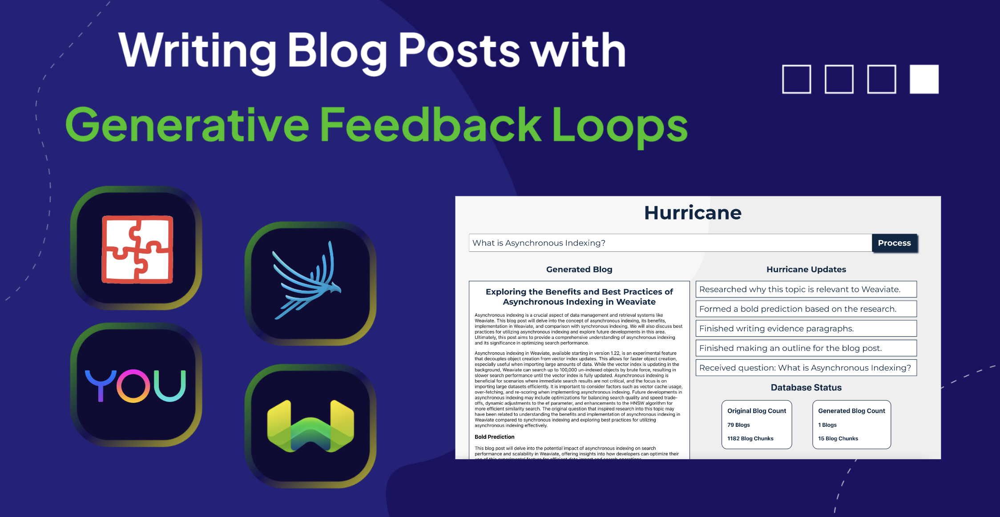

import demo from './img/Hurricane-Demo.mp4';
import phoenix from './img/Phoenix-Demo.mp4';

Back in May 2023, we published an initial vision for [Generative Feedback Loops](/blog/generative-feedback-loops-with-llms), which we have defined to describe saving the outputs of generative AI systems back into databases for future use. We have since extended our experiments from AirBnB listings to [Amazon products](https://medium.com/@iamleonie/recreating-amazons-new-generative-ai-feature-product-review-summaries-50640e40872a), even running every component of a Generative Feedback Loop within [Snowpark Container Services](/blog/generative-feedback-loop-with-weaviate-and-spcs#implementing-a-generative-feedback-loop-with-weaviate). Both of these applications illustrate the ability of generative AI to enhance our data. With the emergence of DSPy, we are now entering a new era of control with generative AI systems and are able to create even more compelling examples of Generative Feedback Loops.

When we initially published our predictions for Generative Feedback Loops, we presented Ben Thompson’s [Aggregation Theory](https://stratechery.com/2015/aggregation-theory/) to describe some of the impacts of this technology. Aggregation Theory describes how “companies that win the user experience can generate a virtuous cycle where their ownership of consumers/users attracts suppliers which improves the user experience”. We concluded that “LLMs present the opportunity to expedite the virtuous cycle Aggregation Theory describes by commoditizing the human effort traditionally required to deliver great user experiences”.

At Weaviate, we are committed to delivering a great user experience to our developers. One of our main efforts to support this has been to author blog posts that clarify key concepts and help developers build with Weaviate. This article will walk you through a new addition to our [`weaviate-tutorials`](https://github.com/weaviate-tutorials) collection, [`Hurricane`](https://github.com/weaviate-tutorials/Hurricane). Inspired by Stanford’s [STORM](https://arxiv.org/abs/2402.14207), Hurricane leverages technologies from Arize, DSPy, OpenAI, Weaviate, and You to author new Weaviate blog posts and feed these generated blogs back into Weaviate. Hurricane lightens the human effort required to deliver a great user experience for blog reading, tailored to a Weaviate developer’s particular interests and questions.

This article contains two key sections:
1. [Hurricane Code Explained](#part-1-hurricane-code-explained)
2. [Optimizing Hurricane](#part-2-hurricane-optimization)

## Part 1: Hurricane Code Explained

Inspired by Erika’s initial experiments [writing blog posts with DSPy](https://www.youtube.com/watch?v=ickqCzFxWj0) and Stanford’s STORM, we began to understand that we could build completely new types of generative AI applications with DSPy. As demonstrated in massively popular AI products such as ChatGPT, Perplexity, Le Chat, and Weaviate’s [Verba](https://github.com/weaviate/Verba), putting User Interface design at the heart of development dramatically facilitates adoption of new technologies. The Hurricane front-end user story is illustrated below:

<figure>
  <video width="100%" autoplay loop muted controls>
    <source src={demo} type="video/mp4" />
    Your browser does not support the video tag.
  </video>
  <figcaption>A walkthrough of the Hurricane user story</figcaption>
</figure>

- A user enters the question they want to write a blog post about.
- Hurricane acknowledges the request and streams its progress while writing.
- Hurricane returns a blog post to the user and updates the counter of AI-generated blog posts in Weaviate.

As illuminated by [Arize Phoenix](https://docs.arize.com/phoenix), running Hurricane with GPT-3.5-Turbo takes about 45 seconds to convert a question into a blog post. This presents a significant challenge for user experience design. We thus believe that intermediate progress streaming or, “thoughts” if you prefer that abstraction, will help keep users engaged during long running processes. There are several user experience features we have seen released with ChatGPT that we believe should be celebrated and integrated into future system design: `Stop Generating`, `Edit Past Messages`, and `Conversation History`. These interactions help humans achieve what they want with AI systems. Generative Feedback Loops offer a major opportunity to enhance these user experiences, and we are just scratching the surface with the design of Hurricane.

We will now switch gears into the backend of Hurricane and how we orchestrated processing with our DSPy program. Beginning with the program and signature design, the DSPy Programming Model provides a brilliant developer experience for defining prompts and their respective input and output fields. DSPy further interfaces these programs with next generation optimizers, which we will discuss later in the article. The DSPy Programming Model consists of Signatures that define the task instructions and input and output fields, as well as Modules that implement Signatures and how they exchange messages between each other. Hurricane is composed of 5 signatures: Question2BlogOutline, Topic2Pargraph, BoldPrediction, WeaviateRelevance, and TitleAndTakeaways. Signatures also greatly facilitate the organization of codebases with prompts, illustrated [here in `hurricane_signatures.py`](https://github.com/weaviate-tutorials/Hurricane/blob/main/hurricane_signatures.py).

```python
class Question2BlogOutline(dspy.Signature):
    """Your task is to write a Weaviate blog post that will help answer the given question.\nPlease use the contexts from a web search and published Weaviate blog posts to evaluate the structure of the blog post."""
    
    question = dspy.InputField()
    blog_context = dspy.InputField()
    web_context = dspy.InputField()
    blog_outline = dspy.OutputField(desc="A list of topics the blog will cover. IMPORTANT!! This must follow a comma separated list of values!")
    introduction_paragraph = dspy.OutputField(desc="An introduction overview of the blog post that previews the topics and presents the question the blog post seeks to answer.")
```

```python
class Topic2Paragraph(dspy.Signature):
    """Please write a paragraph that explains a topic based on contexts from a web search and blog posts from an authoritative source. You are also given the original question that inspired research into this topic, please try to connect your review of the topic to the original question."""
    
    topic = dspy.InputField(desc="A topic to write a paragraph about based on the information in the contexts.")
    original_question = dspy.InputField(desc="The original question that inspired research into this topic.")
    web_contexts = dspy.InputField(desc="contains relevant information about the topic from a web search.")
    blog_contexts = dspy.InputField(desc="contains relevant information about the topic from the published Weaviate blogs.")
    paragraph = dspy.OutputField()
```

```python
class BoldPrediction(dspy.Signature):
    """Please review this blog post and propose a bold prediction about it's content."""
    
    blog = dspy.InputField()
    bold_prediction = dspy.OutputField(desc="A bold prediction about it's content.")
```

```python
class WeaviateRelevance(dspy.Signature):
    """Please review this blog post and describe why its content and the claims it's making are relevant for the development of the Weaviate Vector Database. You are given additional contexts describing what Weaviate is and some aspects of its technology."""

    blog_contexts = dspy.InputField(desc="Content describing what Weaviate is")
    blog_post = dspy.InputField()
    weaviate_relevance = dspy.OutputField()
```

```python
class TitleAndTakeaways(dspy.Signature):
    """Write a title and key takeaways for a blog post given the blog post and the original question it sought to answer as input and a bold prediction the author discovered after conducting initial research on the topic."""
    
    blog = dspy.InputField()
    original_question = dspy.InputField()
    title = dspy.OutputField()
    key_takeaways = dspy.OutputField(desc="Key takeaways from the article. IMPORTANT!! This must follow a comma separated list of values!")
```

We can then connect how these Signatures process inputs by defining the DSPy program, `Hurricane`.  Similar to previous waves of automation, the latest advances in Artificial Intelligence allow humans to abstract our thinking into the high-level structure of what we are trying to achieve and leave the painstaking details to automated systems. Rather than focus on particular details of the content of a blog post, we instead think about how the structure of a blog post writing task should be. In Hurricane, we decompose the blog writing task into (1) researching and writing an outline, (2) researching and writing further about each topic in the outline, (3) forming a bold prediction about the future based on the writing so far, (4) writing about why this topic is relevant to Weaviate, and finally, (5) writing a title and key takeaways from the blog post. The following image visualizes how the components connect together and which parts of the computation can be parallelized.


The code for connecting these components in DSPy looks like this:

```python
import dspy
from hurricane_signatures import Question2BlogOutline, Topic2Paragraph, BoldPrediction, WeaviateRelevance, TitleAndTakeaways
from utils import format_weaviate_and_you_contexts
from utils import format_blog_draft, format_blog_post, BlogPost

class Hurricane(dspy.Module):
    def __init__(self, you_rm):
        # 5 LLM Layers (Question2BlogOutline, Topic2Paragraph, BoldPrediction, WeaviateRelevance, TitleAndTakeaways)
        # 2 Retrieval Engines (Weaviate and You)
        # Weaviate is configured with dspy.settings.configure(rm=weaviate_rm)
        
        self.question_to_blog_outline = dspy.ChainOfThought(Question2BlogOutline)
        self.topic_to_paragraph = dspy.ChainOfThought(Topic2Paragraph)
        self.bold_prediction = dspy.ChainOfThought(BoldPrediction)
        self.weaviate_relevance = dspy.ChainOfThought(WeaviateRelevance)
        self.title_and_key_takeaways = dspy.ChainOfThought(TitleAndTakeaways)
        self.you_rm = you_rm

    def forward(self, question):
        blog_container = BlogPost()
        blog_contexts = dspy.Retrieve(k=5)(question).passages
        web_contexts = self.you_rm(question)
        blog_contexts, web_contexts = format_weaviate_and_you_contexts(blog_contexts, web_contexts)
        question_to_blog_outline_outputs = self.question_to_blog_outline(question=question, blog_context=blog_contexts, web_context=web_contexts)
        blog_container.outline = question_to_blog_outline_outputs.blog_outline
        parsed_blog_outline = blog_container.outline.split(",")
        blog_container.introduction_paragraph = question_to_blog_outline_outputs.introduction_paragraph
        for topic in parsed_blog_outline:
            blog_contexts = dspy.Retrieve(k=5)(topic).passages
            web_contexts = self.you_rm(topic)
            blog_contexts, web_contexts = format_weaviate_and_you_contexts(blog_contexts, web_contexts)
            blog_container.evidence_paragraphs.append(self.topic_to_paragraph(topic=topic, original_question=question, web_contexts=web_contexts, blog_contexts=blog_contexts).paragraph)
        blog = format_blog_draft(blog_container)
        blog_container.bold_prediction = self.bold_prediction(blog=blog).bold_prediction
        blog_contexts = dspy.Retrieve(k=8)("What technology does Weaviate build?").passages
        blog_contexts = "".join(blog_contexts)
        blog_container.weaviate_relevance = self.weaviate_relevance(blog_contexts=blog_contexts, blog_post=blog).weaviate_relevance
        title_and_takeaways = self.title_and_key_takeaways(blog=blog, original_question=question)
        blog_container.title = title_and_takeaways.title
        blog_container.takeaways = title_and_takeaways.key_takeaways
        
        final_blog = format_blog_post(blog_container)
        return dspy.Prediction(blog=final_blog)
```

We use this program structure for compilation, but at inference time we separate each component into its own API. This can be done by loading the program state into each component as follows:

```python
compiled_hurricane = Hurricane(you_rm)
compiled_hurricane.load("compiled_hurricane.json")
question_to_blog_outline = compiled_hurricane.question_to_blog_outline
topic_to_paragraph = compiled_hurricane.topic_to_paragraph
bold_prediction = compiled_hurricane.bold_prediction
weaviate_relevance = compiled_hurricane.weaviate_relevance
title_and_key_takeaways = compiled_hurricane.title_and_key_takeaways
```

Before transitioning back into the web application code, we would like to highlight [Self-Discover](https://arxiv.org/pdf/2402.03620.pdf) for LLM program design. It remains an open question of how much **human** program design will be needed. For example, prompting Claude 3 with the following prompt results in a very similar program architecture to what we have shown above. In a similar spirit to [Gorilla LLMs](https://weaviate.io/blog/weaviate-gorilla-part-1), we can also give the LLM background information about DSPy python syntax, and it will generate an executable program.


> Can you please help me break a task into subtasks? 
> The task is to take a question and write a blog post that answers it, provides more background information about the 
> topic, looks for nuances about the topic such as unanswered questions or bold predictions, and connects the relevance 
> of the topic to the Weaviate Vector Database. Please format each sub-task as a `Signature` that contains a task 
> description and input and output fields. Please describe how each sub-task processes outputs from the previous sub-task
> and where sub-tasks can be parallelized in the `Module`.

### Stateful AI

Returning to our web application, one of the most interesting questions surrounding DSPy and LLM programming is: How to serve DSPy programs in Production? As widespread adoption of Retrieval-Augmented Generation was beginning, Weaviate Co-Founder Bob van Luijt explained Weaviate’s mission to help developers build **Stateful AI** [[1](https://twitter.com/bobvanluijt/status/1695078287046005082), [2](https://www.youtube.com/watch?v=TXMUXeml9JY)]. In client-server software design, state management involves maintaining and synchronizing the application’s data across the server and clients. The server typically handles central state, such as application or session data, as well as resources that are shared among multiple clients, such as caches, message queues, or file storage. Clients interact with the central state by sending requests to the server, which then processes the requests, updates the central state if necessary, and sends responses back to the clients.

To facilitate state management in LLM applications, Weaviate has developed [`generative-search`](https://weaviate.io/developers/weaviate/search/generative) featuring integrations with Cohere, Google, Mistral, OpenAI, Bedrock, and Anyscale. Generative Search couples retrieval and inference management into a single API orchestrated on the server. We are currently researching further ways to improve this product and help developers manage state in their LLM applications. Hurricane currently uses a Generative Feedback Loop consisting of a sequence of client-server calls, persisting state by inserting data into Weaviate and accessing it with a session id. A single LLM call, where we send a prompt and receive text is **stateless**, but when we extend the LLM call with data from retrieval or a previous call to an LLM, such as the handoff from `Question2BlogOutline` to `Topic2Paragraph`, the call is now **stateful**. 

Stateful processing is orchestrated in Hurricane as follows:

1. When the submit button is clicked, we send a request to the server and create a new instance of a `Blog` object in Weaviate, returning the UUID to serve as a session id and provide key-value lookups for the intermediate state of Hurricane's processing.

```javascript
Const handleClick = async () => {
	Try {
		setThoughts(prevThoughts => ["Received question: " + String(inputValue)]);
		const createSessionResponse = await axios.post('http://localhost:8000/create-session');
        const sessionId = String(createSessionResponse.data.session_id); 
	} catch (error) {
		console.error(‘Error’:, error);
	}
}
```

2. We then process the question with 5 APIs: `/question-to-blog`, `/topic-to-paragraph`, `/bold-prediction`, `/weaviate-relevance`, and `/finish-blog`. Each endpoint uses Weaviate to save and load the intermediate state by providing the `sessionId`, for example:

```python
@app.post("/weaviate-relevance")
async def weaviate_relevance_generator(request: SessionRequest):
    sessionId = request.sessionId
    weaviate_gfl_client = weaviate.connect_to_local()
    weaviate_blog_collection = weaviate_gfl_client.collections.get("Blog")
    # load state into a BlogPost to format_blog_draft
    blog_container = BlogPost()
    saved_blog_properties = weaviate_blog_collection.query.fetch_object_by_id(sessionId)
    # dump state into a Pydantic model
    for key in saved_blog_properties.properties:
        setattr(blog_container, key, saved_blog_properties.properties[key])
    blog = format_blog_draft(blog_container)
    blog_contexts = dspy.Retrieve(k=5)("What technology does Weaviate build?").passages
    blog_contexts = "".join(blog_contexts)
    weaviate_relevance_response = weaviate_relevance(blog_contexts=blog_contexts, blog_post=blog).weaviate_relevance
    # Save State
    weaviate_blog_collection.data.update(
        uuid=sessionId,
        properties={
            "weaviate_relevance": weaviate_relevance_response
        }
    )
    thoughts = "Researched why this topic is relevant to Weaviate."
    return {"thoughts": thoughts}
```

Note, we also use a Pydantic model for blog posts which we use to format the intermediate state into a blog draft for certain inputs as well as for returning the final result to a JavaScript component. Pydantic is a library in Python that provides access to strictly typed objects such as a `struct` in Golang.

```python
from pydantic import BaseModel

class BlogPost(BaseModel):
    question: Optional[str] = None
    title: Optional[str] = None
    introduction_paragraph: Optional[str] = None
    outline: Optional[str] = None
    evidence_paragraphs: Optional[List[str]] = []
    bold_prediction: Optional[str] = None
    weaviate_relevance: Optional[str] = None
    takeaways: Optional[List[str]] = []

```

3. We load the final state from Weaviate, pass it into the Pydantic model and send this to the front-end to render with a `Blogpost.js` template:

```javascript
// BlogPost.js
import React from 'react';

const BlogPost = ({ blogPost }) => {
  if (!blogPost) {
    return null;
  }

  return (
    <div class = "blogstyling">
      {blogPost.title && <h1>{blogPost.title}</h1>}
      {blogPost.introduction_paragraph && <p>{blogPost.introduction_paragraph}</p>}
      {blogPost.evidence_paragraphs && blogPost.evidence_paragraphs.length > 0 && (
        <div>
          {blogPost.evidence_paragraphs.map((paragraph, index) => (
            <p key={index}>{paragraph}</p>
          ))}
        </div>
      )}
      {blogPost.bold_prediction && (
        <div>
          <h3>Bold Prediction</h3>
          <p>{blogPost.bold_prediction}</p>
        </div>
      )}
      {blogPost.weaviate_relevance && (
        <div>
          <h3>Relevance to Weaviate</h3>
          <p>{blogPost.weaviate_relevance}</p>
        </div>
      )}
      {blogPost.takeaways && blogPost.takeaways.length > 0 && (
        <div>
          <h3>Takeaways from {blogPost.title}:</h3>
          <ul>
            {blogPost.takeaways.map((takeaway, index) => (
              <li key={index}>{takeaway}</li>
            ))}
          </ul>
        </div>
      )}
    </div>
  );
};

export default BlogPost;
```

We believe there are many more opportunities to microservice architecture design with DSPy programs. For example, as a next step we can parallelize the 5 calls to `Topic2Paragraph` because they do not depend on each other. We would then wait to synchronize the evidence paragraphs into a blog draft, and then move on to parallelizing `BoldPrediction` and `WeaviateRelevance`. There are many interesting works in this domain, we highly recommend interested readers to check out [ALTO](https://arxiv.org/pdf/2403.04311.pdf), from Santhanam et al. Shown below, ALTO further pushes the cutting edge of LLM program design by integrating streamed structured output parsing to further speed up parallel processing. This topic was also heavily discussed in our [Weaviate podcast with Jason Liu](https://www.youtube.com/watch?v=higlHgYDc5E).


An example from [`ALTO`](https://arxiv.org/pdf/2403.04311.pdf), image taken from Santhanam et al. 2024.


There are many other cases where we may want to split up the components of a DSPy program into multiple APIs. For example, during optimization, we could have an 8-layer program we wish to optimize packaged in one container, and then a 3-layer metric program or 7-layer MIPRO optimizer in other containers. This improves throughput and resource allocation at scale. As we have shown with Weaviate’s Generative Feedback Loops, this also helps tremendously with saving intermediate state for future use, or in case the program crashes and needs to pick up where it left off. Imagining very complex systems, we may also reuse parts of the program with conditional routing. Further, we may imagine a future of systems that consist jointly of LLMs behind closed APIs, and self-hosted models. This could facilitate processing parts of the program containing sensitive information on-prem, as well as cost efficiency when serving smaller fine-tuned models for a particular task. We encourage interested readers to check out the Weaviate module system to gain a better sense of what to expect in the upcoming few months from the Weaviate development team. We are super excited about [new decoupling improvements to our `generative-search` APIs](https://github.com/weaviate/weaviate/issues/3364) that will in the meantime facilitate easy model switching, but in the long run make Weaviate more modular for all sorts of LLM processing from RAG to Generative Feedback Loops and [Compound AI Systems](https://bair.berkeley.edu/blog/2024/02/18/compound-ai-systems/).

## Part 2: Hurricane Optimization

Hopefully you are already impressed with the DSPy programming model and are excited to use this framework to write task descriptions, define the inputs and outputs to LLM calls, and orchestrate the system logic in the `forward` pass of the program. However, the new opportunities with DSPy does not stop there, in fact, we are only scratching the surface! On the backend of DSPy, we have a completely new paradigm of optimizers, also referred to as teleprompters or compilers. The DSPy optimizers use novel algorithms to find the optimal task description, input-output examples for either few-shot in-context learning, or fine-tuning with gradient descent, and with the emergence of Self-Discover, [perhaps the structure of the program itself](https://twitter.com/ecardenas300/status/1769396057002082410).

DSPy has recently unveiled two new optimizers, COPRO and [MIPRO](https://twitter.com/kristahopsalong/status/1766166198079889737). One of the opportunities that drew us the most to this project was to better understand how these new optimizers work with multi-layer programs. In this article, we used a pipeline of COPRO instruction optimization to BootstrapFewShot example sourcing.

COPRO is a super fascinating optimizer for task instructions, reminiscent of [Google DeepMind’s Promptbreeder](https://arxiv.org/pdf/2309.16797.pdf). COPRO begins by proposing alternate ways of phrasing a task. For example, we begin by prompting an LLM with `Your task is to write an optimized description of a task`, and it may convert “please rerank these documents according to their relevance to a query” into “optimize and reorganize a collection of documents by arranging them in order of their significance and applicability in response to a specific search query”.

COPRO then evaluates the performance of each of these rewritten descriptions and uses a fascinating crossover step common to evolutionary optimization algorithms to write new candidates. COPRO takes as input the `breadth` hyperparameter of descriptions and their respective performances and uses this information to propose further re-written descriptions. This continues for the `depth` hyperparameter number of iterations. Applying COPRO to Hurricane results in the following transformations of the initial to optimized prompts.

| Signature          | Initial Prompt                                                                                                                                                                                                                                                    | COPRO Optimized Prompt |
|--------------------|-------------------------------------------------------------------------------------------------------------------------------------------------------------------------------------------------------------------------------------------------------------------|-------------------------------------------------------------------------------------------------------------------------------------------------------------------------------------------------------------------------------------------------------------------------------------------------------------------------------------------------------------------------------------------------------------------------------------------------------------------|
| Blog2Outline       | Your task is to write a Weaviate blog post that will help answer the given question. Please use the contexts from a web search and published Weaviate blog posts to evaluate the structure of the blog post. | Start by conducting thorough research on the question provided to gather relevant information from reputable sources. Analyze the structure and language used in previous Weaviate blog posts to maintain consistency. Consider including visuals like images or graphs to enhance the content. |                                                                                                                                                                                                                                                                                                                                                                                                                                                                   |
| Topic2Paragraph    | Please write a paragraph that explains a topic based on contexts from a web search and blog posts from an authoritative source. You are also given the original question that inspired research into this topic, please try to connect your review of the topic to the original question. | Research, merge insights, analyze various case studies, and summarize information to elucidate the specific context surrounding the subject matter of interest. Make sure to reference reputable sources for your conclusions and attempt to related your comprehensive analysis back to the initial inquiry that sparked your investigation. |
| BoldPrediction     | Please review this blog post and propose a bold prediction about its content. | Analyzing the article, make relevant connections to current trends and propose an innovative forecast about its subject matter. |                                                                               |
| WeaviateRelevance  | Please review this blog post and describe why it’s content and the claims it’s making are relevant for the development of the Weaviate Vector Database. You are given additional contexts describing what Weaviate is and some aspects of its technology.    | Please review this blog post and describe why it’s content and the claims it’s making are relevant for the development of the Weaviate Vector Database. You are given additional contexts describing what Weaviate is and some aspects of its technology. |
| TitleAndTakeaways  | Write a title and key takeaways for a blog post given the blog post and the original question it sought to answer as input and a bold prediction the author discovered after conducting initial research on the topic.               | Provide a concise summary of the blog post based on the original question and main findings, followed by highlighting a bold prediction based on initial research. |


We then stack these new signatures with the `BootstrapFewShot` compiler that runs traces through the program with the new signatures, providing input-output examples to better control the system. In our experiments, we bootstrap 2 examples for each of the 5 components of Hurricane.

Graduating from COPRO, the DSPy team has recently unveiled their latest and greatest optimizer, [MIPRO](https://twitter.com/kristahopsalong/status/1766166198079889737). MIPRO, short for “Multi-prompt Instruction Proposal Optimizer”, extends automated prompt optimization by adding a dataset summarizer and bayesian optimization of proposed instructions and examples. We found massive value from Arize Phoenix in understanding the compilation process. Optimizers like COPRO and MIPRO make several calls to LLMs to optimize LLMs, and Phoenix tracing is super insightful for keeping track of what’s going on!

Hopefully that gives you a good initial sense of how these optimizers work. A deeper dive is a bit out of scope for this blog post. If interested in discussing these things further, we highly recommend joining the [DSPy discord](https://discord.gg/zqcyX9TN4Q)!

Once we have a compiled program, the following short code snippet illustrates how to save and load a compiled DSPy program:

```python
compiled_hurricane.save(“compiled_hurricane.json”)
hurricane = Hurricane()
hurricane.load(“complied_hurricane.json”)
```

### DSPyOps

DevOps is one of the most wide ranging roles in software engineering teams that requires a range of expertise from production log monitoring to continuous integration and deployment of new software, and many more. Because AI-Native applications have caused a massive shift in software design, MLOps has emerged to describe DevOps challenges unique to Machine Learning systems. MLOps encompasses many areas of engineering and research from experiment tracking and hyperparameter tuning to continual training, model versioning, data drift detection, and more. With the rise of LLMs, MLOps has been somewhat replaced with LLMOps, with nearly all of the same concepts making the transition, but with a lot of the emphasis on continual training replaced with input-output logging and retrieval monitoring.

We believe DSPy is game changing enough to warrant the next adoption of the Ops nomenclature, DSPyOps. The key evolution from LLMOps being that we return the emphasis of continual training and model versioning from MLOps. However, similarly to LLMOps, DSPyOps also shares a massive emphasis on logging and call monitoring.

One of the most powerful tools we have seen for LLM- and now, DSPy- Ops has been Arize AI, further offering an open-source product called `Phoenix`. We have found Phoenix to be a tremendous help for building with DSPy. Phoenix logs calls to LLMs as JSONs, letting you inspect inputs and outputs. Phoenix further wraps traces in their program structure, letting you inspect each intermediate input and output of the Hurricane program in calls to `Hurricane.forward()`. Phoenix logs the latency of each call, further summarizing the results into P50 and P99 latencies!

<figure>
  <video width="100%" autoplay loop muted controls>
    <source src={phoenix} type="video/mp4" />
    Your browser does not support the video tag.
  </video>
  <figcaption>DSPy program logging with Arize Phoenix</figcaption>
</figure>

As discussed earlier, this could be enormously insightful for finding where the bottlenecks are in DSPy programs consisting of multiple LLMs, programs, and layers within each program!

Tracking the progress of Generative Feedback Loops is very similar to a lot of the work Weaviate has done on monitoring imports to Weaviate or moving data between clusters. Our integrations and partnerships with Prometheus metrics, Grafana dashboards, and Datadog, let us understand how much memory Weaviate is using, the time to import individual objects or batches of objects, as well as query latencies. As Generative Feedback Loops populate the data inside of Weaviate, we will need to employ the same tools for monitoring and observability. To learn more about Weaviate and Datadog, sign up for this [webinar](https://www.datadoghq.com/partner/weaviate-q1/?utm_source=partner&utm_medium=organic-email&utm_term=p&utm_campaign=webinar-202403weaviate) with Erika Cardenas!

Finally, DSPyOps is indeed different from most of the recent discussion around LLMOps because we add an optimization component. The questions then become: How to monitor performance and re-run optimization? Which optimization to continually run? We believe the [MIPRO](https://twitter.com/kristahopsalong/status/1766166198079889737) optimizer’s integration of dataset analysis will be massive for combating potential dataset or distribution shifts, aiding in the continual learning problem. Further, another outstanding question is: How to update a DSPy program in production? As shown earlier, we can update a DSPy program by loading in compiled parameters sent to the system as a JSON file. This should work great for systems that call black-box LLM APIs, but updating self-hosted fine-tuned LLMs will require deeper insight.

## Concluding thoughts

Hopefully this example of writing blog posts with generative AI has further inspired the possibilities of Generative Feedback Loops! This describes feeding the data produced from generative AI systems back into databases for future use. Generative Feedback Loops can enhance the blog post experience in several ways from generating new posts as we have explored, to proposing edits of existing posts, or writing meta analyses of what the posts have covered, and more.

We believe the next step in Generative Feedback Loops for blog post writing will be to equip Hurricane with intrinsic motivation. Currently Hurricane will only write a blog post if a human spins up the app and enters a question or topic. However, Hurricane could be prompted with the context of existing blog posts and questions such as “What questions or topics does this blog post further inspire your interest in?”. The blog posts we have currently written average about 15 500 token chunks per blog post. Imagine we write 100 synthetic blog posts, we now have 1,500 chunks in our Vector Database. By connecting this data with additional processing such as meta-analyses, perhaps writing code or additional documentation will result in an explosion in the dataset size of most generative AI applications.

However, Hurricane is not quite ready to realize this potential. The cost of generating blog posts with high capacity models such as GPT-4 is currently too high. We thus believe efficiency optimizations such as employing the DSPy compilers to tune Mistral 7B, or fine-tune Gemma 2B, will be extremely valuable and take us to a future where everyone has millions, and maybe even eventually billions, of data objects for their applications.

Hurricane is just the beginning. As we continue to develop and refine these techniques, we envision a future where Generative Feedback Loops can autonomously create vast amounts of helpful content, adapted to the specific needs and interests of each person. By feeding this generated content back into the system, we can create an ever-growing knowledge base that is continuously updated and refined. Realizing this vision will require ongoing research and development in areas like prompt engineering, model optimization, and user experience design. It will also require careful consideration of cost efficiency, data quality, and ethical content generation.

import WhatsNext from '/_includes/what-next.mdx';

<WhatsNext />
