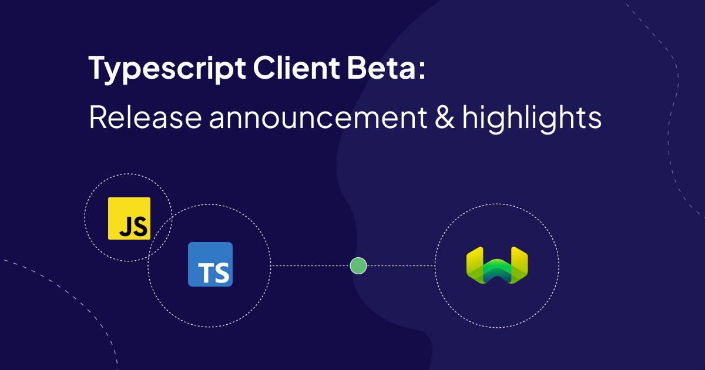

:::info TL;DR

We've released a beta version of our new Typescript client. It's available for you to try out [on npm](https://www.npmjs.com/package/weaviate-client) under the new name: `weaviate-client`. We’d also love any feedback you can share on the client and your experience using it. Please open an issue on the [clients GitHub repository](https://github.com/weaviate/typescript-client/tree/collections/main). Besides the package name change we’ve made a lot of changes that mirror our client refresh in Python to bring the two closer to each other. We have better Typescript support, a collections-first approach, and performance improvements.

<br/>

You can try it here - [Experimental clients](/developers/weaviate/client-libraries/typescript).

:::

## Introduction

With first hand developer experience in mind, we’re committed to making sure that the client libraries we provide are true to the optimum developer experience of each community. We got a lot of feedback on things we could do better in our Typescript client and we’re thrilled to share this beta version with you.

We recently released an update to our [Python client](https://weaviate.io/blog/collections-python-client-preview). With Typescript being the second most popular language choice for developers we felt it only fair to bring the enhancements from the Python client to the Typescript ecosystem.

We shared a few messages and have tested the client internally and we’re finally ready to have the wider community try out the new client and the API it offers. 

:::info Try the new Typescript client
If you're keen to try it, please head over to our [Experimental clients](/developers/weaviate/client-libraries/typescript) page. There, you'll find the installation, usage and feedback instructions.
:::

Let's dive into the inspiration and core concepts behind this innovation.

:::note 'Collection' vs 'Class' nomenclature
Going forward, to bring consistency to all our clients, we will use the term `collection` instead of `class` to refer to the sets of objects to be stored in Weaviate. This is to avoid confusion with the generic word `class` in object-oriented programming.
:::

## Key changes


> **Highlights: Strong typing through custom TS types, focus on individual collections for interaction**

There are two key changes to the way the `collections` client works in comparison to the existing TS client (let's call this the `Classic` client). They relate to the object typing and the way you interact with the data.

| **Aspect** | **`Classic` Client** | **`Collections` Client** |
| --- | --- | --- |
| **Object Typing** | Primarily relied on untyped objects and deep data structures. | Utilizes strong typing through custom TS types and user-defined generics. |
| **Unit of Interaction** | Interacts with the entire database. | Focuses on individual collections for interaction. |

Let's look at each of these in more detail.

### Better Type Support 

As with previous clients, we're enabling both Javascript and Typescript Developers with this client. Written in Typescript you have the benefits of strong typing out of the box. However, we have methods types available for Javascript developers as well. This makes for a better more intuitive experience in your IDE and beyond. This means you do not have to remember the exact API parameter names, as the IDE will show you the available options. This can be a hurdle when you are working with less often-used options, trying new APIs or when you are new to Weaviate.

import codeCompletionImgUrl from './img/code-completion.gif';


Types are introduced for the data objects as well at creation time, as well as when retrieving them from the database. This means that you can access the properties of the data object directly.

So syntax that is currently like this:

:::note Classic client syntax
```typescript
response.data?.Get?.Article?.[0].title  // Get the `title` property of the first object
response.data?.Get?.Article?.[0]['_additional']?.id  // Get the ID of the first object
response.data?.Get?.Article?.[0]['_additional']?.generate?.singleResult  // Get the generated text from a `singlePrompt` request
response.data?.Get?.Article?.[0]['_additional']?.generate.groupedResult  // Get the generated text from a `groupedTask` request
response.data?.Get?.Article?.[0]['_additional']?.creationTimeUnix // Get the timestamp when the object was created
```
Look at all those `?` operators and the necessary `['_additional']` index due to the `_` in the key name!

:::

Becomes:

:::info `Collections` client syntax

```typescript
response.objects[0].properties.title  // Get the `title` property of the first object
response.objects[0].uuid  // Get the ID of the first object
response.objects[0].generated  // Get the generated text from a `singlePrompt` request
response.generated  // Get the generated text from a `groupedTask` request
response.metadata?.creationTime // Get the creation time as a native JS Date value
```

:::

We think that these changes will reduce errors, increase productivity, and make the code easier to read and understand.


### Separated Node and Web Versions

For a long time, we've used a single client to intereact with Weaviate from both the Web and Node.js. This made sense in the world of REST and GraphQL, which are both HTTP/1.1 protocols, but with the advent of gRPC into Weaviate since `1.24`, we now have the HTTP/2 protocol to contend with. As it transpires, gRPC and HTTP/2 don't play nicely with browsers so we've chosen to break up the new TypeScript client into Node and Web versions.

During this open community-driven beta, you'll only have access to the Node version that can be accessed from `weaviate-client`:
```typescript
import weaviate from 'weaviate-client';
```
How we incorporate the browser version will be understood better during the open beta as we develop the capability. Until then, you can only use the beta in a Node environment.

The intention is to provide dedicated bundles optimized for each environment. The web bundle focuses on providing an easy to use API for browser/frontend applications using only REST and GraphQL endpoints. While the Node.js bundle leverages Node.js specific capabilities for building server applications, APIs and CLIs, with the full gRPC functionality available.

This change is to encourage safer access and best practices as people interact with thier Weaviate instances.

:::note What you can do now using the Node bundle
All CRUD (Create, Read, Update and Delete) operations powered by gRPC and REST.
:::

:::note What you will be able to do using the Web bundle
Only Read operations powered by GraphQL.
:::


### Collections-first approach

The other big change is that the `collections` client focuses on individual collections for interaction.

This means that you will no longer need to specify the collection name in every request. Instead, you will create an object for each collection that you want to interact with, and then use that object for all subsequent requests.

For example, take the following syntax for performing a simple request to retrieve a few objects from the database:

:::note Classic Typescript syntax

```typescript
const response = await client.graphql
  .get()
  .withClassName('Article')
  .withLimit(2)
  .withFields('title body url')
  .do();
```

:::

Becomes:

:::info `Collections` client syntax

```typescript
const articles = client.collection.get('Article');
const response = articles.query.fetchObjects({
  limit: 2,
  returnProperties: ['title','body','url']
});
```

:::

You'll see that a search is now a method that originates from the collection object.

We have observed that in most cases, you will be working with a single collection at a time. So, we think that this change will improve your efficiency and make the code more readable.

This is the same for all searches, retrieval augmented generations, and data operations such as insertion, deletion, and updating. You can access these methods through submodules like:

```typescript
articles.data  // For data operations
articles.query  // For searches
articles.generate  // For retrieval augmented generations
articles.aggregate  // For aggregating results
```

We think that these changes will make the code more readable and intuitive.

## Quality-of-life improvements


> **Highlights: Simplified methods, easier defaults, batch import error handling**

As well as making these big philosophical changes, we've also made a number of quality-of-life improvements to the API.

### Simplified methods

Standalone methods with parameters now replace the builder pattern (`.with` methods) for queries. So what used to be a chain of methods like this:

:::note Classic client syntax

```typescript
generatePrompt = 'Convert this quiz question: {question} and answer: {answer} into a trivia tweet.';

result = await client.graphql
  .get()
  .withClassName('JeopardyQuestion')
  .withGenerate({
    singlePrompt: generatePrompt,
  })
  .withNearText({
    concepts: ['World history'],
  })
  .withFields('round')
  .withLimit(2)
  .do();
```

:::

Becomes:

:::info `Collections` client syntax

```typescript
const generatePrompt = `Convert this quiz question: {question} and answer: {answer} into a trivia tweet.`;

const myCollection = client.collections.get('JeopardyQuestion');
const result = await myCollection.generate.nearText(['World history'], {
  singlePrompt: generatePrompt
}, {
  limit: 2,
  returnProperties: ['round'],
})
```

:::

### Property/metadata return defaults

You might have noticed that above examples do not specify properties to be returned!

We have changed the default behavior to return all non-reference properties, e.g. `text` and `object` types, and the IDs of the objects. We think this will make it easier to get started, and for production use-cases where you want to optimize the response size, you can still specify the properties you want to return.

To request additional metadata and any cross-references, you can use the `returnMetadata` and `returnReferences` options to each of the search queries.

### Batch import typing

Batch object, now called `insertMany()`, also gets a refresh with the introduction of a `DataObject` class. This class is used to define the properties of the object to be inserted, and is then passed to the `insertMany()` method.


```typescript
import weaviate, { generateUuid5, DataObject } from 'weaviate-client';

// highlight-start
const articlesData: DataObject[] = dataSource.map((row) => {
  return {
    properties: {
      title: row.title,
      body: row.body,
    },
    vector: vectors[i],
    uuid: generateUuid5(row.title), 
  }
});
// highlight-end

const articles = client.collections.get('Articles');
const response = await articles.data.insertMany(articlesData);
console.log(response);
```

This allows your imports to be fully type checked by the TS compiler without fear of developer error!

Oh, and if you don't need to manually specify an object ID or a vector, you can just pass in a list of dictionaries!

```typescript
import weaviate, { generateUuid5, DataObject } from 'weaviate-client/node'

// highlight-start
const articlesData: DataObject[] = dataSource.map((row) => {
  return {
    title: row.title,
    body: row.body,
  };
});
// highlight-end

const articles = client.collections.get('Articles');
const response = await articles.data.insertMany(articlesData);
console.log(response);
```

### Batch import error handling

Another big improvement is how we handle errors during batch data import. Many of you let us know that you would like to get more information around any errors at a macro and micro level. So, we've added a couple of features to help with this.

One is the introduction of an `Error` class that will be returned amongst the successful ID response. Here's one that we triggered by supplying an incorrect datatype:

```typescript
Error(message="invalid text property 'url' on class 'TestArticle': not a string, but float64", code=None, original_uuid=None)
```

The other is that the overall response object will indicate whether there were any errors (`hasErrors` Boolean), and where they occurred (`errors` dictionary).

### `Collection`-level iterator

The `cursor` API has been a popular tool for iterating through an entire collection, for example to create manual backups or retrieving the entire set of IDs.

We've simplified the API here with a more intuitive iterator, so the syntax to extract all objects from a collection is now as simple as:

```typescript
const articles = client.collections.get('Article')
const allArticlesIDs = articles.iterator().map((article) => article.id)
```

You can also choose what properties/metadata to return, although all properties are returned by default!

```typescript
const articles = client.collections.get('Article')
const allArticlesTitles = articles.iterator({ returnProperties: ['title'] }).map((article) => article.title)
```

## Performance improvements


> **Highlights: Up to 60-80% faster imports, 3-4x faster queries**

While a big part of this `collections` client release has been about improving the developer experience, there has been some significant performance improvements as well.

Under the hood, we expand on Weaviate's gRPC [(what is it?)](https://grpc.io/) capabilities that has been ongoing since [`v1.19` release](/blog/weaviate-1-19-release#grpc-api-support-experimental).

The short story is that your query performance and import performance will be significantly improved.

### Import speeds

We've internally seen that batch data import with new client using gRPC achieves a 60-80% speedup compared to the current client. For production use cases involving tens or hundreds of millions of objects, this can mean significant reduction in the hours spent getting your database ready.

### Query speeds

But that's not all. Even a query will execute much faster when using gRPC in comparison with GraphQL. We've seen that a small query executes 3-4 times faster(!) which is no small feat.

### How was this achieved?

These speed-ups come from two benefits of using gRPC, which is a binary protocol. This means that one, the data is sent in a compact binary format, rather than as text, which reduces the volume of data to be sent. The other factor is that to send data as text, it needs to be processed into JSON format which is a computationally expensive process. With gRPC, the data is sent in a binary format, which is much faster to process at both the sender and receiver ends.

We won't get into the details of gRPC here, but if you are interested, you can read more about it [here](https://grpc.io/docs/what-is-grpc/introduction/). We will also be writing more about it in the future.

## Object typing in focus

TypeScript is a fully-featured strongly-typed language that comes with a plethora of features for the manipulation of user-defined types. This has allowed us to design and create an API where your specific types can merge with our general Weaviate types to enhance user experience and developer efficieny. Even when writing some of the tests, the IDE auto-completion and static type checking provided by the API have been immensely helpful!

> **Highlights: User-defined generics, strong typing in collections API, retrieval augmented generation, ...**

We've mentioned object typing a few times already, but let's take a closer look at a few more concrete examples. Here you can see the new syntax for collection definition, queries and retrieval augmented generation, as well as types for each of these tasks.

All the types of the API are exported from the root file. So, when it comes to using any generic, you can access them all like so:
```typescript
import weaviate, { Collection } from 'weaviate-client';

const collection: Collection = client.collections.get('MyCollection');
```

You might think that exporting all the types from a single location is cumbersome. However, due to modern IDE auto-completion, all you need to do is enter the first few letters of the type into the IDE and it will prompt you to import it from where it lives! However, you will also be able to inspect some web-hosted documentation of the typing system soon!

### Providing your own Generics

So, let's get into it! Providing your own generics is as simple as this:
```typescript
import weaviate from 'weaviate-client';

type Article = {
  title: string;
  body: string;
  wordcount: number;
}

const collection = client.collections.get<Article>('Article');
```

Then, when you query for your articles like so:
```typescript
const res = await collection.query.fetchObjects();
```
then you can manipulate the objects and their properties like so:
```typescript
res.objects.forEach((obj) => {
  const title = obj.title; // has type 'string'
  const wordcount = obj.wordcount; // has type 'number'
  const compilerError = title / wordcount // string / number not allowed by TS!
})
```

When you insert objects into your collection, you get compile-time checks too!
```typescript
await collection.insert({
  title: 'TS is awesome!',
  wordcount: 9001
})
// compiler error since 'body' field is missing in '.insert'
// but is not optional in 'Article' type!
```

There's much more the typing system than just this and it will take you much development to discover it all! Stay tuned for a future blogpost where we dive into the generics system in much more depth showing all the areas where it works to improve the Developer Experience!


### Collection Definition
For many (including us), the collection definition step required multiples visit to the documentation. This was unsurprising, given that it required writing out a complex and deeply nested object that had very little type-hinting owing to the dependence on the auto-generated OpenAPI swagger types, which are not particularly instructive!
:::note Classic client syntax
```python
const classObj = {
  'class': 'Article',
  vectorizer: 'text2vec-openai',
  vectorIndexConfig: {
    distance: 'cosine',
  },
  moduleConfig: {
    'generative-openai': {}
  },
  properties: [
    {
      name: 'title',
      dataType: ['text']
    },
    # ...
    {
      name: 'url',
      dataType: ['text'],
      tokenization: 'field',
      moduleConfig: {
        'text2vec-openai': {
          skip: true
        },
      }
    },
  ],
};
client.schema
  .classCreator()
  .withClass(classObj)
  .do();
```
:::
Well, no more! Now, every field is strongly typed relevant to its allowed values, with your IDE guiding the way, and we are introducing a [factory class](https://en.wikipedia.org/wiki/Factory_method_pattern) so that you don't need to remember specific objects and their schemas.

:::info `Collections` client syntax
```typescript
client.collections.create({
  name: 'Article',
  vectorizerConfig: weaviate.configure.vectorizer.text2vecOpenai(),
  vectorIndexConfig: weaviate.configure.vectorIndex.hnsw({
    distanceMetric: weaviate.configure.vectorDistances.COSINE
  }),
  generative_config: weaviate.configure.generative.openai(),
  properties: [
    {
      name: 'title',
      dataType: weaviate.configure.dataType.TEXT,
      tokenization: weaviate.configure.tokenization.FIELD
    },
    # ...
    {
      name: 'url',
      dataType: 'text',
      tokenization: 'word',
      skipVectorization: true,
    },
  ]
})
```
:::

### Retrieval Augmented Generation

As you saw briefly earlier, we have a `.generate` submodule for retrieval augmented generation.

The structure of these mirror those of the queries, with additional parameters added for the generation task. For example, this query:
```typescript
const response = questions.query.nearText(['the space race'], {
  limit: 2,
})
```
Can be converted to a retrieval augmented generation task by switching the submodule to `.generate` and providing the required `GenerateOptions` as the second parameter to the method:
```typescript
// highlight-start
const response = questions.generate.nearText(['the space race'], {
  groupedTask: 'Write a haiku about these facts!' 
}, {
// highlight-end
  limit: 2,
})
```

## Resources and Links

At the moment we have documented the use of the client across these sections of our documentation:

- [Introduction](https://weaviate.io/developers/weaviate/introduction) 
- [Quickstart](https://weaviate.io/developers/weaviate/quickstart) 
- [Start Guides](https://weaviate.io/developers/weaviate/starter-guides) 
- [How-to: Search](https://weaviate.io/developers/weaviate/search) 
- [How-to: Manage Data](https://weaviate.io/developers/weaviate/manage-data) 

If there's a section you'd like added, or see something weird in the documentation, reach out! 

As a bonus, we have a bunch of really useful recipes in our [recipes-ts](https://github.com/weaviate/recipes-ts/tree/main) repository. They're meant to cover most Weaviate usecases. You can use them to see how the new cleint fits into your workflow. 

## Time to build!


All these changes are very exciting for us and we’re really eager to have you try them out and see what you build. 

We have our [Experimental clients](/developers/weaviate/client-libraries/typescript) page detailing all the setup and use instructions for the new client. If there’s something missing, let us know by opening an issue on the Weaviate documentation repo. We’d also love any feedback you might have on the client added as issues to the client repo.

Let us know what you think and happy building!

As always, you can catch us on [Slack](https://weaviate.io/slack) or [Twitter](https://twitter.com/weaviate_io), or [on the community forum](https://forum.weaviate.io) to tell us what you think.
