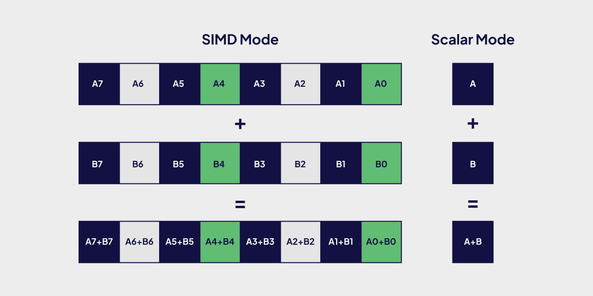

**Overview of Key Sections:**
- [**Vector Distance Calculations**](/blog/intel#vector-distance-calculations) Different vector distance metrics popularly used in Weaviate.
- [**Implementations of Distance Calculations in Weaviate**](/blog/intel#vector-distance-implementations) Improvements under the hood for implementation of Dot product and L2 distance metrics.
- [**Intel’s 5th Gen Intel Xeon Processor, Emerald Rapids**](/blog/intel#enter-intel-emerald-rapids)  More on Intel's new 5th Gen Xeon processor.
- [**Benchmarking Performance**](/blog/intel#lets-talk-numbers) Performance numbers on microbenchmarks along with 


What’s the most important calculation a vector database needs to do over and over again? What simple operation does it spend the majority of its time performing?

If you guessed **vector distance calculations** … BINGO! 🎉

While vector databases use many techniques and algorithms to improve performance (including locality graphs, quantization, hash based approaches), at the end of the day, efficient distance calculations between high-dimensional vectors is a requirement for a good vector database. In fact, when profiling Weaviate indexed using HNSW, we find that 40%-60% of the CPU time is spent doing vector distance calculations.

So when someone tells us that they can make this quintessential process *much faster* they have our full undivided attention! If you want to learn how to leverage algorithmic and hardware optimizations to make vector search 40% faster keep reading!

In this post we’ll do a technical deep dive into different implementations for vector distance calculations and optimizations enabled by Intel’s new 5th Gen Xeon Processor - Emerald Rapids, parallelization techniques using SIMD with the Intel AVX-256 and Intel AVX-512 instruction sets, loop unrolling and compiler optimizations by transpiling C to Go assembly. We explain how we attained a **~40% QPS speed up at 90% Recall** in Weaviate running on Intel’s new Xeon Processor, Emerald Rapids.

## Vector Distance Calculations

Vector databases use vector representations generated from machine learning models to capture the meaning of data. The fact that these vectors are numerical representations of data objects allows us to apply mathematical operations to them, such as calculating the distance between two vector representations to determine their similarity.

To calculate the distance between two vectors, you can use several similarity measures, detailed below:


As you can see, there are many different similarity measures - cosine, dot product or euclidean (also know as L2) are the most commonly used in practice. To learn more about the different distance metrics, you can continue reading our blog post on [What are Distance Metrics in Vector Search?](/blog/distance-metrics-in-vector-search/)

When a vector database needs to retrieve semantically similar objects it has to calculate one of these distance metrics to assess how close a query point is to candidate points in the database. In fact, this vector distance calculation needs to be conducted when you build the index as well as anytime you perform any CRUD operation.

The runtime complexity for these vector distance operations scales linearly with the dimensionality of the vector. Typically vector dimensionality tends to be anywhere from 256 to 4096 in practice - this number is trending upwards over time - which means that distance calculations are also taking longer to perform.

This being the case, we need to ensure that this operation is done as fast and efficiently as possible, whether through leveraging hardware or software efficiencies.

Let’s take a look at how these calculations can be implemented, for simplicity's sake we will consider the dot product only.

## Vector Distance Implementations

### Naive Go Implementation

The simplest way to implement the dot product in Go is to loop over the vector dimensions one at a time and sum the product of the vectors. This is quite slow for higher dimensionality but it works well for low dimensional vectors.

```Go
func dotProduct(a, b []float32) float32 {

    var result float32

    for i := 0; i < len(a); i++ {

        result += a[i] * b[i]

    }
    return result
}
```

### Introduction to SIMD

SIMD, which stands for Single Instruction, Multiple Data, is a parallel processing technique that allows a single instruction to operate on multiple data elements simultaneously. This approach is commonly used to improve the performance of various algorithms, including those involving vector and matrix operations.

In the context of vector distance calculations, SIMD instructions can be used to calculate distances between vectors more efficiently. By grouping the dimensions of the vectors into smaller chunks (e.g., 128-bit or 256-bit registers), SIMD instructions can perform the same operation on multiple dimensions in parallel, chunk by chunk. This parallel processing capability can lead to significant performance improvements when dealing with high-dimensional data.





Intel CPUs feature support for advanced SIMD instruction sets, with notable examples being AVX-256 and AVX-512. AVX-256 enables the simultaneous processing of 8 32-bit floating-point numbers (8 dimensions), while AVX-512 doubles this capability to 16 dimensions.

Weaviate uses  Go assembly to generate SIMD instructions. In doing this we give up code readability for performance and so we reserve this technique for distance functions alone where every ounce of performance is needed.

Rather than writing Go assembly directly, we write the code in C and then use the [Go goat library](https://github.com/gorse-io/goat) which uses Clang/LLVM to generate the final Go assembly. This compiler optimization further improves performance.

Below is an example implementation for dot product operation using SIMD AVX-512 intrinsics carried out for vector dimensions greater than 128:

```Go
if (n >= 128) {

    __m512 acc = _mm512_setzero_ps();

    while (n >= 128) {
      
        __m512 a_vec, b_vec;
        for (int i = 0; i < 8; ++i) {

            a_vec = _mm512_loadu_ps(a + i * 16);
            b_vec = _mm512_loadu_ps(b + i * 16);

            acc = _mm512_fmadd_ps(a_vec, b_vec, acc);
        }
        n -= 16;
        a += 16;
        b += 16;
    }
}
```

### Loop Unrolling

We further improve the above implementation by using a technique called loop unrolling. In a simple implementation where data dependencies exist between loop iterations, such as those involving variables like 'i' and 'sum', each iteration must wait for the previous one to complete. Loop unrolling addresses this issue by rewriting the loop to allow more high-latency instructions, like multiplication, to execute concurrently. Moreover, it spreads out the fixed loop costs, such as increment and comparison operations, across multiple operations, thereby enhancing overall CPU efficiency.

### Using both AVX-256 and AVX-512

While AVX-256 and AVX-512 significantly enhance computational throughput, it's important to note that there are trade-offs. Creating, loading, and reducing registers associated with these instruction sets come at a computational cost, making them less suitable for low-dimensional data processing tasks.

A key difference in our current approach is a hybrid instruction usage strategy tailored to the dimensionality of the vectors being processed. Through our testing, we determined that the optimal performance of AVX-256 and AVX-512 is achieved when processing dimensions above 8 - which is why we fall back to the naive implementation mentioned above for these lower dimensionality use cases. When dealing with dimensions ranging from 8 to 128, we found that using AVX-256 instructions with loop unrolling yields the most favorable results.

In the past, we conducted experiments with AVX-512 to assess its performance potential. However, the results didn’t show a significant increase in performance, particularly on older Intel processors. This lack of notable improvement could be due to thermal and power constraints in these older processor architectures. Such constraints could lead to [reductions in CPU frequency](https://lemire.me/blog/2018/09/07/avx-512-when-and-how-to-use-these-new-instructions/), limiting the capacity of AVX-512 instructions to deliver enhanced performance under these conditions. As a result, previously we only used AVX-256.

This has significantly changed with the newer Sapphire and Emerald Rapids architectures where we have switched to using AVX-512  instructions to achieve further efficiencies for higher dimensional vectors.

:::tip Bob van Luijt, Cofounder and CEO – Weaviate
"Inference requires significant computing power, making it crucial to utilize the Intel next-generation Xeon platform for incredible performance gains. We are thrilled about our partnership with Intel and the opportunity to offer these advantages to our customers quickly through our cloud partnerships"
:::

## Enter Intel Emerald Rapids

Thanks to the Intel Disruptor Initiative, we recently had the opportunity to preview Intel's latest innovation, the 5th Gen Xeon Scalable server processors based on the Intel 7 node - Emerald Rapids. This new architecture introduces a fifth turbo level, enabling workloads with high AVX-512 utilization to achieve higher frequencies. This provides large benefits to AVX-512 performance, delivering up to a remarkable 10x increase in performance when enabled.

:::tip Arijit Bandyopadhyay, CTO – Enterprise Analytics and AI, Head of Strategy – Cloud & Enterprise CSV Group at Intel
"Weaviate’s collaboration with Intel Disruptor Program has been defining new ground for Generative AI in the industry. Weaviate’s product offerings on the latest Intel Technologies provides the best Gen AI solutions for enterprises, paving the way for greater ROI and faster Time to Market."
:::


## Let’s Talk Numbers!

To benchmark the improvements we opted to conduct a performance evaluation of Weaviate using Intel’s Emerald Rapids 5th Gen Xeon Processor, simulating real-world usage scenarios. Initially, we devised a Go micro benchmark to compare the performance of the two instruction sets across L2 and dot product distance metrics. The results, depicted in the graphs below, provide valuable insights into the relative efficiencies of AVX-256 and AVX-512 instructions.


<figure>
  
  <figcaption>Figure 1: Improvements in vector distance operations performed using 1536 dimensional vectors.</figcaption>
</figure>


As you can see above we get some pretty remarkable speedups for single distance calculations. For dot product operations at 1536 dimensions, AVX-512 is 28.6 times faster than pure Go and 6 times faster than AVX-256. Whereas for L2 distance measurements at 1536 dimensions, AVX-512 is 19 times faster than pure Go and 5.6 times faster than AVX-256.

Subsequently, we conducted ANN benchmarks utilizing two different datasets DBPedia embedded using OpenAI `text-embedding-ada-002` model (1536 dimensions), and Meta’s 768 dimension [Sphere dataset](/blog/sphere-dataset-in-weaviate), aiming to gauge the practical implications of these instructions on real-world tasks. As seen in the graphs the benchmark results showed notable performance improvements, further validating the advantages of AVX-512 over AVX-256 in Emerald Rapids.

<figure>
  
  <figcaption>Figure 2: Intel Emerald Rapids 5th Gen Xeon ANN performance on DBPedia ada-002 embeddings.</figcaption>
</figure>

<figure>
  
  <figcaption>Figure 3: Intel Emerald Rapids 5th Gen Xeon ANN performance on Sphere embeddings.</figcaption>
</figure>

Here on the sphere-1 million dataset when searched using dot products we see a remarkable 42% improvement in Weaviate queries per second(QPS) @ 90% Recall, while on the dbpedia-500k dataset when searched using L2 distance we see a 40% improvement in QPS @ 90% Recall!

Furthermore, our assessment revealed a 16% enhanced AVX-512 performance in Intel’s 4th Gen Xeon Processor, Sapphire Rapids compared to AVX-256. As a result, we made the strategic decision to enable the latest Intel Xeon Gen Processors, both Emerald Rapids and Sapphire Rapids, to leverage AVX-512 instructions starting from Weaviate version 1.24.2. This proactive measure ensures that users can harness the full potential of their hardware, now and in the future.

import WhatsNext from '/_includes/what-next.mdx';

<WhatsNext />
