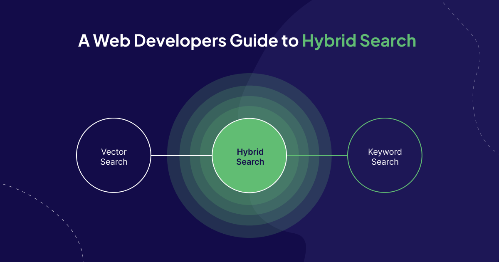
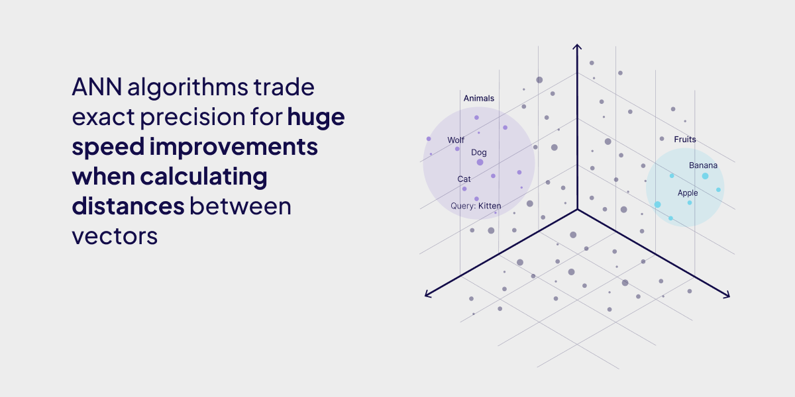
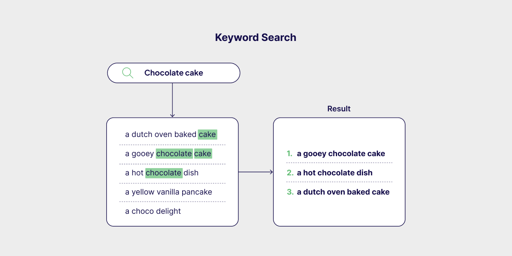
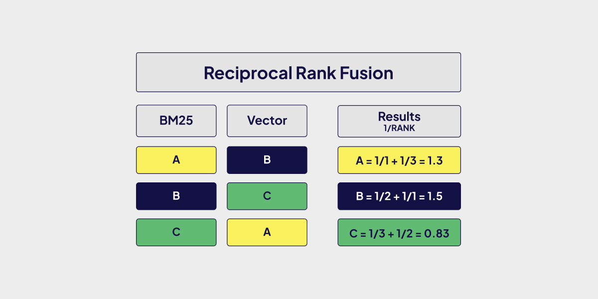
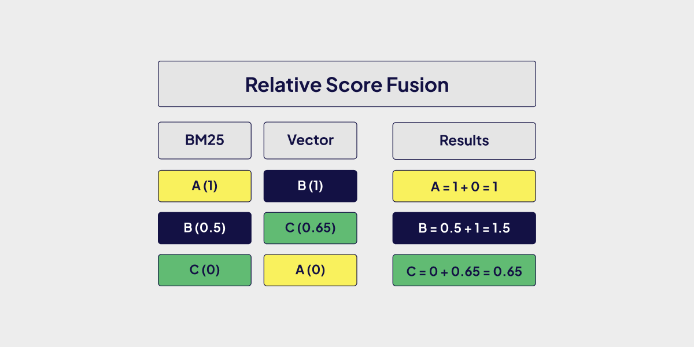
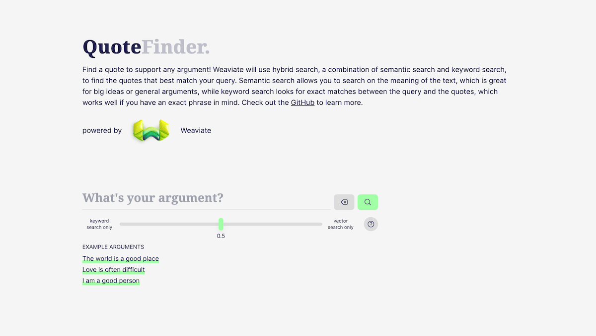

:::info

This tutorial is built with Next.js and Weaviate. It uses a beta version of the v3 TypeScript Client. Find out more about the new client here - [Experimental clients](/developers/weaviate/client-libraries/typescript/typescript-v3).

:::

When the question of search arises, two popular techniques take up most of the conversation: vector search and keyword search. But which should you use? Sometimes, the answer is both, which luckily for us happens to be hybrid search - the best of both worlds!
In this article, we’ll get into the technology that powers hybrid search, learn how to use it in Weaviate and build a Next.js Application powered by hybrid search in Weaviate.

## How does Hybrid Search work?

To understand hybrid search, we first need to understand the two technologies that power it - vector search and keyword search.

### Vector Search

Vector search, also known as semantic search, uses machine learning to grasp text context, not just keywords. It converts text to numerical vectors, finding matches based on conceptual similarity for accurate, relevant search results. Behind the scenes, it uses approximate nearest neighbors (ANN) algorithms to calculate the approximate nearest neighbors to a query, as opposed to kNN algorithms, which calculate the true nearest neighbors.



### Keyword Search

Keyword search finds objects with an exact match between the terms in the query and the documents. Weaviate uses the BM25/F function to calculate the relevancy of a document to a query, which uses both the term frequency, how often a word appears in a document, and inverse document frequency, how many documents that word occurs in.



### The Best of Both Worlds

Hybrid search in Weaviate combines keyword (BM25) and vector search to leverage both exact term matching and semantic context. With either the `rankedFusion` or `relativeScoreFusion` fusion algorithms, we merge the results from both keyword search and the vector search.

A code snippet of hybrid search in JavaScript will look something like this.

```typescript
const myCollection = client.collections.get('JeopardyQuestion');

const result = await myCollection.query.hybrid('food', {
  limit: 2,
  returnProperties: ['question', 'answer'],
});

console.log(JSON.stringify(result.objects, null, 2));
```

## Optimizing your Hybrid Search

With Weaviates hybrid search, we have two ways to adjust the hybrid search algorithm. We can adjust the weights by tweaking our search alpha or changing our ranking algorithm.

### Changing alpha

Think of alpha as a measure of how much your hybrid search should lean towards either vector search or keyword search where an alpha of 1 is a pure vector search, and an alpha of 0 is a pure keyword search. It is 0.75 by default.

The code snippet below demonstrates how to change the alpha of your hybrid search in JavaScript.

```typescript
const myCollection = client.collections.get('JeopardyQuestion');

const result = await myCollection.query.hybrid('food', {
  // highlight-start
  alpha: 0.75,
  // highlight-end
});

console.log(JSON.stringify(result, null, 2));
```

### Changing ranking algorithm

Here is where it gets fun! Weaviate supports two fusion algorithms as of Weaviate v1.20 i.e. `rankedFusion` and `relativeScoreFusion`.

**Ranked Fusion**

In a nutshell, **Ranked Fusion** (the original hybrid search algorithm in Weaviate) assigns each object a score based on its position in the search results (in descending order), with the total score derived from the sum of these rank-based scores across both vector and keyword searches.



**Relative Score Fusion**

**Relative Score Fusion** on the other hand normalizes the output of the vector and keyword searches so that the highest value becomes 1 and the lowest 0 and everything in between is scaled to match. The total score is then the sum of the normalized individual search scores. This lets us maintain the relevance given by the original keyword/vector search algorithms, while still being able to compare the results and fuse them. As relativeScoreFusion is the newer algorithm, it might be the better choice for most use cases.



The code snippet below demonstrates how to change the ranking algorithm of your hybrid search in JavaScript.

```typescript
const myCollection = client.collections.get('JeopardyQuestion');

const result = await myCollection.query.hybrid('food', {
  // highlight-start
  fusionType: 'RelativeScore', // can also be 'Ranked'
  // highlight-end
});

console.log(JSON.stringify(result, null, 2));
```

Dirk and Joon-Pil on our team wrote an [in-depth blog post](https://weaviate.io/blog/hybrid-search-fusion-algorithms) on the different hybrid search fusion algorithms in Weaviate. If you're interested in a more detailed explanation, I would recommend it.

## When to use Hybrid Search

So with all that you know about hybrid search, when should you use it?

The way we see it, if you have a model fine-tuned for your data, pure vector search might be good enough to give you accurate search results. If you’re mostly matching patterns that rely purely on exact keyword matching, keyword search will probably be good enough.

If your use cases don't fall into any of the two scenarios mentioned, you might benefit from implementing hybrid search. As we've covered, hybrid search comes with several parameters that we can adjust to get better more relevant results that match the data we're working with. It’s worth noting that because you’re running two searches in the background and computing your results from them, there is a performance cost associated with each search for high-throughput applications.

## Building an Application that leverages Hybrid Search

To get some hands-on experience with the new TypeScript client, let's create a simple web application that allows us to perform hybrid search on a collection of quotes. If you have ever wanted to strengthen your point by quoting someone famous, this is the project for you!

### Setting up WCD (Weaviate Cloud)

First, we need to set up our own Weaviate database. The easiest way to do this is to use WCS, the cloud-hosting solution from Weaviate. Head over to [the WCS homepage](https://console.weaviate.cloud) and create an account. Then, create a free sandbox.

### Importing Data

The first step is to insert our quotes into the Weaviate database. For our dataset, we're using the [Quotes-500k](https://www.kaggle.com/datasets/manann/quotes-500k) dataset from Kaggle. Download the csv file and place it on your project folder.

The import only needs to be done once, so we'll put together a script in a separate file, e.g. `import.ts`.

Install the Weaviate client by running `npm install weaviate-client --tag next`, and then add the following code in your `import.ts` file.

```typescript
import weaviate from 'weaviate-client';
import { parse } from 'csv-parse/sync';
import fs from 'fs';

const client = await weaviate.connectToWCS(process.env.WCS_URL!!, {
  authCredentials: new weaviate.ApiKey(process.env.WCS_API_KEY!!),
  headers: {
    'X-OpenAI-Api-Key': process.env.OPENAI_APIKEY!!,
  },
});
```

The code above helps us connect to our WCS database instance. The variables prefixed with `process.env` are called environment variables. These are usually values that should not be public and therefore should not be specified directly in the code itself. To supply these values, create a file named `.env.local` at the root of your project. Specify your values like this, replacing the values in angle brackets with the values from WCS. As we use [text2vec-openai](https://weaviate.io/developers/weaviate/modules/retriever-vectorizer-modules/text2vec-openai) to vectorize our data, you will need to add your Open AI API key as well.

```bash
WCS_URL=<YOUR_WCS_URL>
WCS_API_KEY=<YOUR_WCS_API_KEY>
OPENAI_APIKEY=<YOUR_OPENAI_APIKEY>
```

Now, we can create a collection by pasting the following code in our `import.ts` file.

```typescript
const quotesCollection = await client.collections.create({
  name: 'Quotes',
  properties: [
    {
      name: 'quote',
      dataType: 'text',
    },
    {
      name: 'author',
      dataType: 'text',
      skipVectorization: true,
    },
  ],
  vectorizers: weaviate.configure.vectorizer.text2VecOpenAI("default"),
});
```

Notice the attribute `skipVectorization: true` for the `author` property - this is important since we only want to vectorize the semantically relevant quote itself.

Now, we can insert the quotes into our collection. We don't need to worry about vectorization, as this is done by the database itself.

```typescript
const quotesDataset = parse(fs.readFileSync('quotes.csv', 'utf8'));

await quotesCollection.data.insertMany(quotesDataset.slice(0, 1000));
```

Note: here, I am only inserting the first 1000 quotes, as inserting all 500k quotes will take a fair amount of time.

With our script ready and `quotes.csv` file downloaded, run the script with [tsx](https://github.com/privatenumber/tsx) as shown below.

```bash
npx tsx ./import.ts
```

Now you should have your quotes added to your Weaviate instance.

### The Next.js Backend

For creating our QuoteFinder, we decided to go with Next.js and its Server Actions - however, feel free to use any stack you are comfortable this since interacting with Weaviate will be the same regardless of your choice.

To get started, in a new folder, run `npx create-next-app@latest` to create a new project using Next.js. Choose any name you like, and answer "yes" to all other questions. This creates a good starting point from which we can build our app.

Run `npm install weaviate-client --tag next` in the root directory of your project to install the Weaviate client.

We first define a type for our Quote, as this makes our code less error-prone on the front and back ends of our system. Create a file named `types.ts` in the root folder and define your type:

```typescript
export type QuoteType = {
  quote: string;
  author: string;
  score: number;
};
```

Now, create one endpoint for hybrid search on our quotes. After creating a file such as `actions.ts`, we first define all necessary imports and connect to Weaviate:

```typescript
'use server';

import weaviate from 'weaviate-client';

import { QuoteType } from './types';

const client = await weaviate.connectToWCS(process.env.WCS_URL!!, {
  authCredentials: new weaviate.ApiKey(process.env.WCS_API_KEY!!),
  headers: {
    'X-OpenAI-Api-Key': process.env.OPENAI_APIKEY!!,
  },
});
```

In the Next.js project, specify your environment variables again in the same way as described above.

Our endpoint accepts the search term itself and the alpha value. Add this below the previous code.

```typescript
export async function findQuotesBySearchTerm(
  searchTerm: string,
  alpha: number
) {
  const collection = await client.collections.get<Omit<QuoteType, 'distance'>>(
    'Quotes'
  );

  const { objects } = await collection.query.hybrid(searchTerm, {
    limit: 20,
    alpha: alpha,
    returnMetadata: ['score'],
    returnProperties: ['quote', 'author'],
  });

  const quotes: QuoteType[] = objects.map((quote) => ({
    ...quote.properties,
    distance: quote.metadata?.score!!,
  }));

  return quotesAndAuthorsArray;
}
```

### The Next.js Frontend

Creating the frontend is fairly involved and is quite dependent on your choice of technology. To give you an idea of how it could be done, here is a basic example using Next.js.

Replace the contents of `app/page.tsx` with the code below.

```typescript
'use client';

import { findQuotesByArgument } from '@/actions';
import { useState } from 'react';
import { QuoteType } from '@/types';

export default function Home() {
  const [searchTerm, setSearchTerm] = useState('');
  const [quotes, setQuotes] = useState<QuoteType[]>([]);
  const [alpha, setAlpha] = useState(0.5);

  const handleSubmit = async () => {
    const quotes = await findQuotesByArgument(searchTerm, alpha);
    setQuotes(quotes);
  };

  return (
    <div>
      <form>
        <input
          type="text"
          value={searchTerm}
          onChange={(e) => setSearchTerm(e.currentTarget.value)}
        />
        <input
          type="range"
          min={0}
          max={1}
          step={0.05}
          value={alpha}
          onChange={(e) => setAlpha(parseInt(e.currentTarget.value))}
        />
        <button
          onClick={(e) => {
            e.preventDefault();
            handleSubmit();
          }}
        >
          submit
        </button>
      </form>
      <div>
        Results:
        {quotes.map((quote, index) => (
          <div key={index}>{quote.quote}</div>
        ))}
      </div>
    </div>
  );
}
```

This creates a very basic UI, allowing the user to search and display quotes. Feel free to improve the styling by adding [TailwindCSS](https://tailwindcss.com/) class names.

To view your application, run `npm run dev` in the root directory of your project. A browser window should open and your hybrid search application is built and ready to use.

We've got a deployed version of this project that you can find at [quotefinder.weaviate.io](https://quotefinder.weaviate.io). If you'd like to dive into the code, you can take a look at the projects [GitHub repository](https://github.com/weaviate/quote-finder).

The project on Github should look like this once cloned and started.



## Conclusion

That's everything that's needed for creating a full-stack app using Weaviate and the new TypeScript client! The best way to get even more familiar with the involved tooling is to extend your QuoteFinder. Whether you'd like to add pure vector search, improve the frontend, or even implement the functionality to search through your quotes using images, the possibilities are endless!

import WhatsNext from '/_includes/what-next.mdx';

<WhatsNext />
