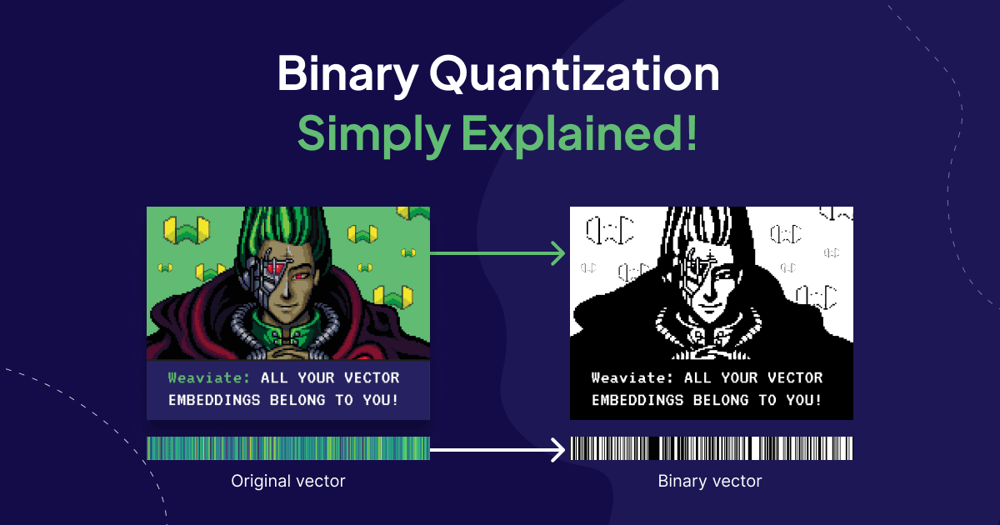
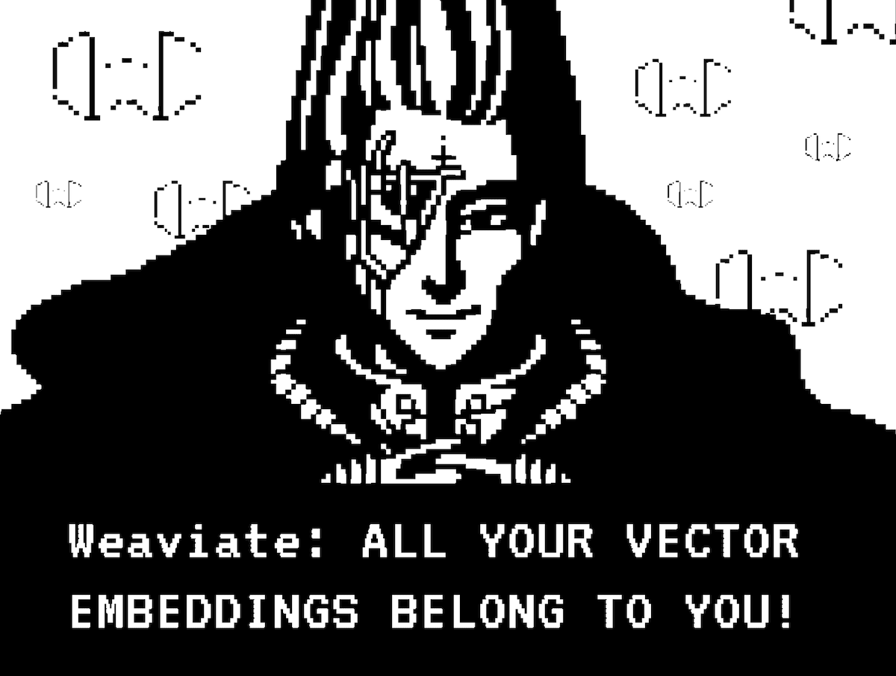
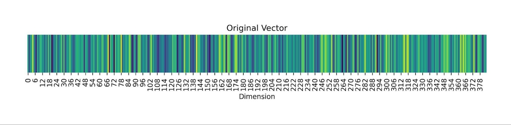
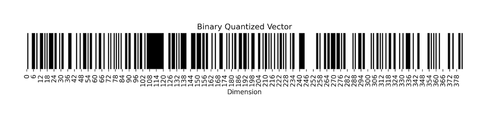
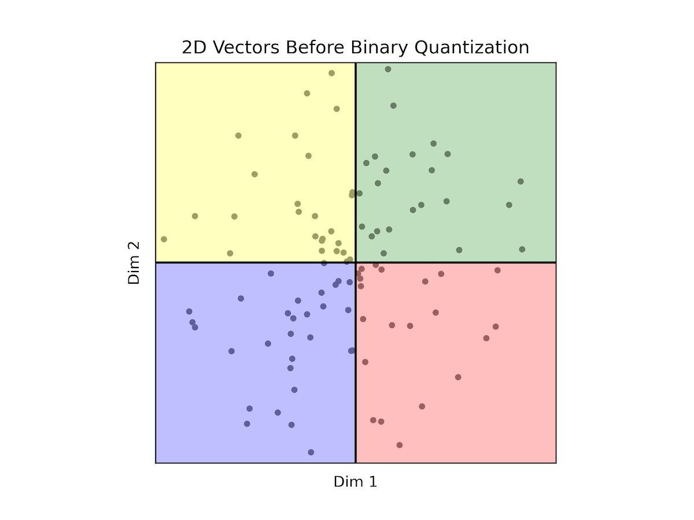
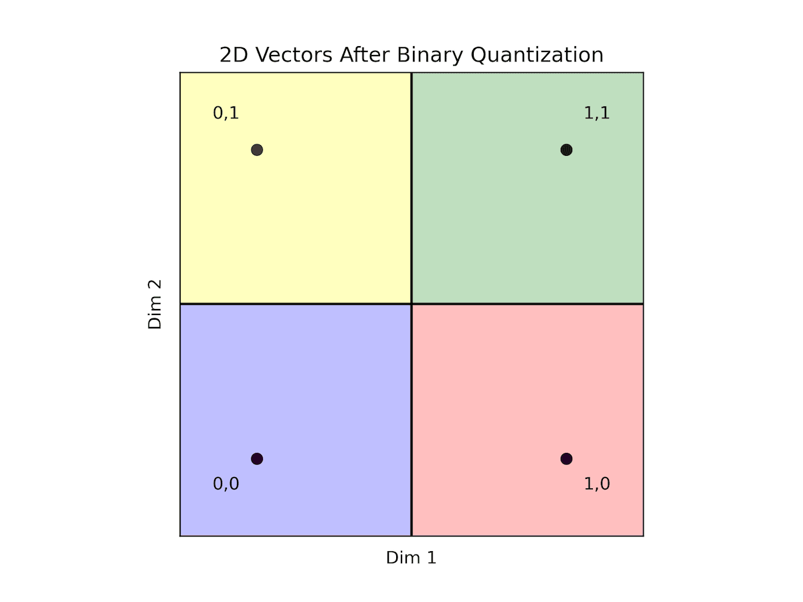
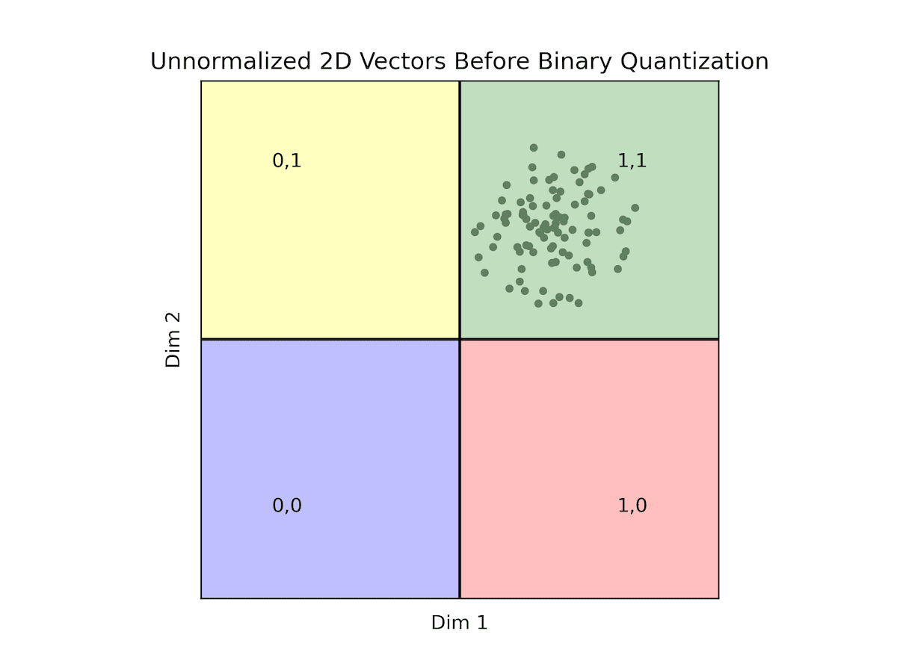
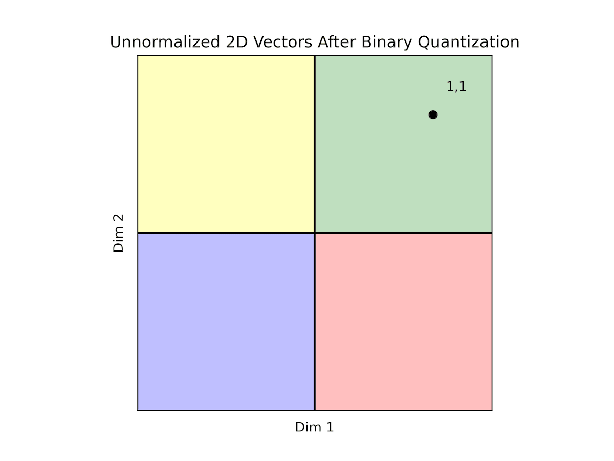

:::info Overview
- [What is Binary Quantization?](#what-is-binary-quantization) - How BQ reduces the memory requirements of running Weaviate.
- [Details of Working with Binarized Vectors](#details-of-working-with-binarized-vectors) - What to consider when using binary quantization.
- [Weaviate Performance Improvements with BQ](#-performance-improvements-with-bq) - QPS vs. recall, indexing times, and memory savings.
- [Comparing Product and Binary Quantization](#%EF%B8%8Fcomparing-product-and-binary-quantization) - Experiments comparing PQ and BQ.
- [Benchmarking BQ](#benchmarking-bq-with-your-own-data) - Scripts for benchmarking BQ with your own data.
:::

-----

## 🧮What is Binary Quantization?

To perform search current vector databases build massive vector indices and search over them in memory. This allows for real-time responses to queries however, compute costs can add up. Binary quantization(BQ) is a vector compression algorithm that allows you to trade-off between retrieval accuracy and memory requirements.

Lets understand how this technique works by way of an analogy. Imagine every vector you want to store is a home address. The details of this home address allow you to precisely locate where someone lives including the country, state, city, street number, and even down to the house number. The price you pay for this pin-point accuracy is that each address takes up more memory to store, search and read. Similarly, to locate a vector in space you can think of each dimension as instructions on exactly how far to move along an axis. The sign of the number at that dimension tells you which direction to move and the magnitude of the number tells you how much to move in that direction.

The process of binary quantization(BQ) takes all the numbers stored per dimension of a vector and only retains a 1(for positive values) or a 0(for negative values) capturing the sign of the corresponding number. That seems a bit radical, how can you ever locate a vector without information on how far along to move in the direction of an axis? Though BQ might sound like a crazy proposition, it does work particularly well for high-dimensional vectors. Let's see why!


**Fig**: *Elementwise binary quantization of a vector from float32 to 1 bit.*


:::info Enabling Binary Quantization in Weaviate
To learn how to enable and configure Weaviate to use BQ refer to the docs [here](/developers/weaviate/configuration/bq-compression). You can read more about HNSW+BQ in the documentation [here](/developers/weaviate/concepts/vector-quantization#binary-quantization).
:::

Binarizing is not exclusive to embedding vectors, we can also understand it from the other domains in which it is used - for example in computer vision. Imagine you have an image. The process of binarizing that image entails looking at every pixel. If that pixel is larger than a certain threshold value, we will replace it with 1; otherwise, we will replace it with 0. The resulting image is a black-and-white binary image. This process loses image details but significantly compresses the image size.

|Original Image            |  Binarized Image |
|:-------------------------:|:-------------------------: |
|   |   |
**Fig**: *An image when binary quantized*

Now, let's consider what the process of binarizing a vector embedding for a sentence looks like. In the figure below we have vectorized the sentence: “All your vector embeddings belong to you!” into a 384-dimensional vector. The first image shows all 384 numbers of the vector, each one being a 32-bit floating point, as color shades on a heatmap. Each vector dimension dictates the colour gradient on the heatmap. The image below shows the same vector, but we threshold the vector such that all positive valued dimensions are turned into 1(white) and negative valued dimensions are turned to 0(black). As a result, we get a black-and-white heatmap that looks kind of like a bar code. This is what the process of binary quantization looks like for vector embeddings! The resulting vectors are much smaller but also less detailed.

|Sentence: *"All your vector embeddings belong to you!"*  |
|:-------------------------:|
|   | 
|      |
**Fig**: *Visualization of a sentence vector embedding when binary quantized*

The concept of binary quantization simplifies the encoding of vectors by retaining only their directionality. Each vector dimension is encoded with a single bit, indicating whether it's positive or negative. For instance, a vector like `[12, 1, -100, 0.003, -0.001, 128, -1000, 0.0001]` would be condensed into a single byte, resulting in the binary sequence `[1,1,0,1,0,1,0,1]`. This massively reduces the amount of space every vector takes by a factor of 32x by converting the number stored at every dimension from a `float32` down to `1-bit`. However, reversing this process is impossible - making this a lossy compression technique.

## 📐Details of Working with Binarized Vectors

### Distance Between Binary Vectors

First, let’s consider how we compute the distance between two BQ compressed vectors. The solution is straightforward: since we're solely concerned with their directional aspects, we only need to assess the agreement between their dimensions. This requires you to count the differing bits in both compressed representations. Here you can leverage bitwise operations and is significantly faster than computing the distance between non-binarized vectors.

For example, considering the vector `[12, 1, -100, 0.03, -0.01, 128, -100, 0.01]` encoded as `11010101`, and a second vector `[11, 4, -99, -0.01, 0.02, 130, -150, 0.02]` encoded as `11001101`, the distance between them is determined by the count of differing bits, resulting in a distance of 2. This is more popularly known as the `hamming distance` between the two binary vectors.


### The importance of data distribution for BQ

Unlike product quantization, which we cover in a previous [blog here](/blog/pq-rescoring), binary quantization is not universally applicable to all types of data - we will see illustration of why this is this case in a second. However, assuming we are operating with normalized data, particularly when utilizing the cosine metric, there's no need for concern as Weaviate handles data normalization for you seamlessly. Now, let's discuss the implications of increasing the dimension count.

**BQ with 1 Dimensional Vectors:**

In the picture below, we plot the only two possible points, in red, for a normalized one-dimensional space (0, 1). The quantizer would assign the code with a single bit set to one to a positive vector and the code with a single bit set to zero to a negative vector.


**Fig**: *BQ with 1 dimensional vectors*


Let's broaden our perspective to encompass two dimensions. Here, we anticipate all vectors lying within the circle centered at (0,0) with a radius of 1 (normalized vectors). Our focus shifts to understanding how the quantizer divides the data into four distinct regions, leveraging two codes and two dimensions to achieve the power of two.

|Original Vectors            |  BQ Vectors |
|:-------------------------:|:-------------------------: |
|   |   |
**Fig**: *BQ with 2 dimensional vectors*

In this context, the green region (coded as 11) aggregates points where both dimensions are positive, while the blue region (coded as 00) encompasses points where both dimensions are negative. The red region (coded as 10) represents scenarios where the first dimension is positive and the second is negative, while the yellow region (coded as 01) signifies instances where the first dimension is negative while the second is positive.

Importantly, within each region, any point shares a zero distance with any other point within the same region. Conversely, points in adjacent regions maintain a distance of 1 from one another. When traversing to the opposite region, the maximal distance extends to 2.

This delineation underscores the critical role of data distribution. While we've emphasized normalized data, it's worth noting that while normalization isn't mandatory, it significantly aligns with the scenario described. Contrastingly, let's analyze another scenario.

|Original Vectors            |  BQ Vectors |
|:-------------------------:|:-------------------------: |
|   |   |


All of our data falls within the quadrant where both dimensions are positive. Consequently, all vectors are encoded as '11', making it challenging to discern between most vectors. This scenario exemplifies how the distribution of data can render binary quantization impractical. As previously noted, while normalization isn't obligatory, opting for normalized data provides reassurance in terms of data distribution, facilitating the use of binary quantization.

However, if your data isn't normalized, ensuring balance and logical division of regions becomes imperative. Consider the following example.


**Fig**: *Displays some counter-intuitive facts about hamming distances between 2d binary vectors*


In this scenario, counterintuitively, the quantizer would indicate that yellow points are further from red points and closer to both blue and green points. While this holds in angular-based metrics like `cosine`, it contradicts the interpretation under the `L2` metric where we can see that the yellow and red points are closer in proximity.

**BQ with N-Dimensional Vectors**

Let's talk about the density of your data and the ability to uniquely represent vectors after applying binary quantization. By comparing the number of dimensions to the number of data points, you can anticipate the level of collisions, we define a collision occurring between two vectors as the vectors having the same representation once binarized. As seen in previous examples, with binary quantization in two dimensions, you're limited to constructing four regions. Consequently, when the number of vectors exceeds four, collisions occur, rendering distinction impossible.

However, the upside lies in the exponential growth of regions with additional dimensions. With each dimension, the number of regions doubles ($2^d$), offering greater potential for differentiation between vector representations. For instance, with 756 dimensions, you already have astonishing $2^{756}$ regions at your disposal - this makes collisions between vectors highly improbable even when you have billions or trillions of vectors. With 1.5K dimensions, the number of regions can easily accommodate any practical amount of vectors without a single collision.


**Fig**: *Displays the exponentially decreasing probability for collisions in vector representations. In essence, this means that the higher the dimensionality of your data, the more effectively you can expect binary quantization to perform.*

## 🚀 Performance Improvements with BQ

Let's revisit the advantages of binary quantization. Typically, we employ quantization to conserve memory, encoding each dimension as a single bit. In Weaviate, floating-point vectors are represented as `float32` arrays, yielding a compression rate of 1:32, which is already commendable.

However, there's a significant secondary benefit: bitwise operations now suffice for distance calculations between compressed binary vectors. This calculation involves a straightforward exclusive OR (XOR) operation between two binary arrays, tallying the resulting ones. Moreover, Go offers SIMD-optimized operations for these binary functions, resulting in notably faster computation than with original vectors. But how much faster exactly?

To address this inquiry, we present brute-force search results using our quantizer and the original vectors. We conduct searches across 10,000 vectors with 100 queries, across dimensions ranging from 768, 1536, to 4608.

| **Dimensions**  | **768d** | **1536d** | **4608d** |
|-------------|------|-------|-------|
| Latency uncompressed (microseconds) | 1771.85     | 3703.68            | 16724.41     |
| Latency compressed (microseconds) | 230.72 (13%) | 353.3 (9%) | 896.37 (5%)|
| Recall       | 0.745 | 0.744 | 0.757     |
**Table 1**: *Vector search time improvements between uncompressed and BQ.*


While the recall isn't exceptionally high, we tackle this concern later through over fetching candidate neighbors and rescoring results. It's worth noting that as the vector dimension gets larger, we observe more significant speedups. For instance, when brute forcing 768-dimensional compressed vectors, we require only 13% of the time compared to using uncompressed vectors. Similarly, for 1536-dimensional compressed vectors, we need just 9% of the time, and for 4608-dimensional ones, only 5% of the time compared to uncompressed vectors.

Traditionally, we rely on building a graph to facilitate approximate search, as manually searching through millions of vectors is impractical. However, with such significant time reductions, brute forcing your data becomes a viable option. For instance, in the case of 768 dimensions, brute forcing 1 million vectors should only take 23 milliseconds. Even in the worst-case scenario (4608 dimensions), it's now feasible, requiring approximately 90 milliseconds.

So, what's the bottom line? Can Weaviate deliver lightning-fast brute-force searches for your data? The answer depends on the size of your data and your search speed expectations. 

There are several advantages to brute force searching your data. Firstly, you can bypass the need for data indexing, saving the time required to build the index. While indexing in Weaviate isn't overly sluggish, brute forcing allows you to skip this step entirely. Secondly, you no longer need to store a proximity graph, resulting in further memory savings. In fact, if you opt to brute force search your data directly from disk, memory usage becomes negligible – a mere 100MB is sufficient to host your application.

Weaviate recently introduced the [flat index](/developers/weaviate/concepts/vector-index#flat-index), offering the option to brute force data either from disk (the default behavior) or by retaining only compressed data in memory and fetching a small selection of full vectors from disk for final candidate rescoring. Both approaches expedite data ingestion compared to the traditional HNSW index while also reducing memory consumption. However, if your requirements demand high performance, HNSW remains the preferred choice. Nevertheless, the flat index presents a cost-effective, high-performing alternative. Furthermore, Weaviate now supports binary quantization (BQ) for use with both the flat and HNSW indexes.

### Indexing Time Improvements

Now, let's discuss the performance metrics. All experiments were conducted using the Go benchmark. Towards the end of this blog, we'll provide information for those interested in replicating these experiments with their data. To kick things off, we'll start with a modest dataset of 100,000 vectors from DBPedia, utilizing ADA002 (1536 dimensions) and Cohere v2 (4096 dimensions) embeddings, beginning with looking at indexing time.

| **Dimensions**        | **1536**   | **4096**   |
|-------------------|--------|--------|
| Flat index        | 5s     | 7s     |
| Hnsw index        | 47s    | 1m36s  |
| Hnsw index+BQ     | 21s    | 25s    |
**Table 2**: *Indexing time improvements between flat, HNSW uncompressed and BQ indices.*

As mentioned previously, the flat index eliminates the need for data indexing. Instead, we simply send the data to the server and store it in the stores. Conversely, the HSNW index necessitates data indexing. It's worth noting that the HNSW index can also benefit significantly from this compression in terms of indexing time.

### Memory Footprint Improvements

Now, let's discuss the memory footprint. We'll differentiate between the available options for the flat index as they exhibit varying footprints. When using the flat index with or without BQ, all data is retrieved from disk, independent of data size. If we opt to cache the compressed data, it's stored in memory. As observed, the footprint remains lower than that produced by HNSW+BQ, as no proximity graph resulting from the indexing process is required. Additionally, we'll showcase the footprint for the HNSW cases. In both cases, you can anticipate the memory footprint to grow more or less linearly with both dimensions and vectors.

| **Dimensions**                  | **1536**   | **4096**   |
|-----------------------------|--------|--------|
| Flat index                  | 77MB   | 77MB   |
| Flat index + BQ + Cache     | 141MB  | 183MB  |
| Hnsw index                  | 1.02GB | 1.79GB |
| Hnsw index+BQ               | 214MB  | 297MB  |
**Table 3**: *Memory footprint improvements for the various indices.*

### Latency Analysis

Finally, let us take a look at the QPS(queries per second) vs. Recall curves to get an idea of the solutions' performance. To produce such curves, we modified the `ef` parameter for the case of HNSW and the `rescoringLimit` for the case of the flat index. We also used a total of 10 concurrent cores to measure the QPS.


**Fig**: *QPS vs Recall for 100k DBPedia vectors*


Note the low QPS in the scenario of the pure flat index (depicted as the green dot at the bottom right). Here, we're compelled to retrieve all full vectors from the disk and conduct brute-force operations over the uncompressed vectors. While this approach is notably slow, it requires zero memory allocation.

Moving on, we employ the same process but integrate binary quantization (BQ). In this iteration, we retrieve less information from disk, as we only need to access the compressed vectors (32x smaller than their uncompressed counterparts). Moreover, brute force operations are expedited, as we operate solely with bits. We generate a candidates list and subsequently rescore them. During the rescoring process, we retrieve only a small subset of the full vectors to construct the final solution. This intermediary solution still maintains a memory-free operation while delivering significantly enhanced performance. It's important to note that this approach hinges on BQ compatibility; otherwise, optimal recall may not be achieved. Additionally, ensuring a sufficiently high `rescoringLimit` is important to guarantee good recall.

Lastly, we introduce the flat index with cached compressed vectors (illustrated by the blue curve). Depending on your recall expectations, you can anticipate QPS ranging from 600 to 1000. However, the memory footprint slightly increases in this scenario, as the list of compressed vectors is retained in memory, with only a small subset of full vector candidates fetched from disk.

Next, we'll present the corresponding results for cases involving larger dimensions.


**Fig**: *QPS vs Recall for 100k DBPedia vectors comparing various indices.*


Given these results it's worth considering the following: for a relatively small set of vectors (~100,000), if you're aiming for exceptionally high recall, the performance disparity between the flat-compressed-cached curve and any HNSW solution isn't notably significant. Some may argue that ~100,000 vectors isn't a substantial amount, and that's a valid point. However, let's discuss the implications of combining this feature with Multi-tenancy.

Weaviate ensures total information isolation for each tenant. Imagine having ~1000 tenants, each with ~100,000 vectors. Surprisingly, the expected performance remains more or less consistent. Suddenly, 100 million vectors constitute a substantial amount of data. Moreover, Weaviate facilitates rapid tenant deactivation/lazy reactivation, enabling the creation of an exceptionally performant solution with an incredibly low memory footprint, provided you've designed a robust architecture.

Now, let's scale the numbers up further. What should we anticipate with a larger dataset? Unfortunately, brute force scales linearly with the data size. If we were to increase the dataset to 1,000,000 vectors, the QPS would be roughly 10 times slower than those exhibited here. However, even with this increased latency, brute force remains a viable option for certain applications.


**Fig**: *QPS vs Recall for 1000k DBPedia vectors comparing various indices.*

## ⚖️Comparing Product and Binary Quantization

Now that you have multiple quantization techniques available in Weaviate the question arises which one is better and where to use PQ vs. BQ. This decision will come down to your specific data and will require you to run your own benchmarks. We make code and instructions on how to do this available in the next section. The memory and performance experiments below are meant to make the PQ vs. BQ choice a little easier for you.


**Fig**: *QPS vs Recall for 1000k DBPedia vectors comparing HNSW with and without PQ and BQ compression.*

Notice that the main contribution of BQ is not just that it compresses the vectors. The more efficient bitwise distance calculations also play a significant role. This is why the flat+bq option we discussed above is such a good choice. Not only do we need to read less from disk, but also, the faster distance calculations make brute force faster in Weaviate.

| **Index**           | **Indexing Time** | **Memory Usage** |
|------------------|---------------|--------------|
| HNSW             | 8m42s         | 6437.05MB    |
| HNSW+PQ          | 21m25s        | 930.36MB     |
| HNSW+BQ          | 3m43s         | 711.38MB     |
| FLAT+BQ          | 54s           | 260.16MB     |
| FLAT+BQ+CACHE    | 53s           | 352.99MB     |
**Table 4**: *Comparing the various indices and compression techniques.*

Notice how BQ shortens the indexing time with HNSW enormously.

## 🧑‍💻Benchmarking BQ with your own data

Here we provide code and instructions that will help you to balance recall, latency, and memory footprint optimally by allowing you to replicate these above experiments yourself on your data.

We have included some very useful tools in this [repository](https://github.com/weaviate). To easily run these tests (or any test using your data) you would need the data to be in `hdf5` format with the same specifications as described in the [ANN Benchmarks](https://ann-benchmarks.com/). You could index your data using the [Go benchmarker](https://github.com/weaviate/weaviate-benchmarking). This benchmarker could give you a better idea of QPS using concurrent queries. It takes several parameters that you could explore but in our runs, we use the following commands:

```bash
go run main.go ann-benchmark -v ~/Documents/datasets/dbpedia-100k-openai-ada002.hdf5 -d cosine --indexType flat
```

Notice the `-d` parameter for the distance and –indexType for switching between hnsw and flat.

To run compressed (BQ enabled):

```bash
go run main.go ann-benchmark -v ~/Documents/datasets/dbpedia-100k-openai-ada002.hdf5 -d cosine --indexType flat --bq enabled
```

Notice the `-bq` parameter is used to activate compression.

Once you run the script, you will see the different metrics in your terminal at the end of the run. Pay special attention to the QPS and recall. The results will be saved in JSON format under a repository named `results` in the same path as the script. Next, you can also run the `visualize.py` script to produce the same graphs we show in this post. Your graphs will be available in the same path as the script as `output.png`.

Happy compressing!🚀

import WhatNext from '/_includes/what-next.mdx'

<WhatNext />
