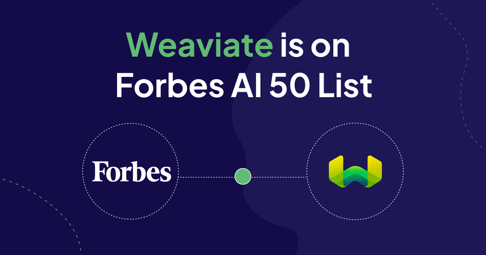

# We’ve been named one of Forbes’ AI 50

Of course, I was happy to see Weaviate on Forbes’ recently released [2024 AI 50 list](https://www.forbes.com/lists/ai50/?sh=3d5886d8290f). This is the sixth year for the list of “AI startups to watch”, which Forbes develops with Sequoia Capital and Meritech Capital. Companies under consideration are vetted by two separate judging panels—one that looks at products from a technical perspective and another that examines performance from an investment and business perspective. Since previous selectees include Hugging Face, Anthropic, and Databricks, it would be an understatement to say I’m flattered that list now includes Weaviate.

Hearing we’d be included in this list was a happy surprise and testament to the hard work of all the talented folks at Weaviate who I think very highly of. But honestly, what I think or what any group of experts thinks is less important than what developers decide. It’s still too early to really know all the companies that will evolve, flourish, and grow as the economy is influenced by generative AI; things are moving so fast. But we are starting to see some broad outlines as genAI projects move out of lab or innovation settings and into production environments. In this context, being interesting or cool is less important than being functional, reliable, easy to work with, and adding value. Those are the standards by which I hope Forbes judged us, and if those are the standards by which the market will judge us, well… I’ll take it!

##  As generative AI moves into production, functional performance highlights stronger ideas

I really believe that in a few years, every application will use AI. Some will sprinkle a little AI functionality onto legacy software—hopefully making it work a little better. Other applications will have AI at their core. It’s this latter group, the AI-native developers, that interests me. Now that more companies are graduating their AI experiments into production, we’re seeing generative AI tech stacks begin to converge. Here are some of the big trends and forces at work:

* **Every engineering team is being tasked with building AI capabilities into their product**: With the  demand for specialized talent outsizing the supply, one of our strengths is being an engineer-friendly core piece of the stack.
* **Control over proprietary data remains a key concern**: This is one of the advantages of using open source software on prem, or inside a VPN on any cloud provider.
* **Customizability is a virtue**: The ability for customers to easily fine tune models, or use retrieval-augmented generation, is critical for getting—and staying—in production.
* **To use infrastructure in the enterprise with confidence, companies need transparency into how the software functions**: This is another argument in favor of open source software like ours.
* **Since not all problems are nails, companies need more than a hammer in the toolbox**: Teams increasingly want to try different models and easily switch between them to optimize performance. Working with multiple models also eliminates the risk of becoming overly reliant on a single supplier.
* **Use cases in this space are evolving fast**: Where vector search is the end goal for some—we see it as just the beginning. From vector and multimodal search, to RAG and [generative feedback loops](../2023-05-05-generative-feedback-loops/index.mdx), we’re committed to staying on the cutting edge and bringing our customers with us. This recognition further validates the importance of being forward-looking.
* **We are still at a stage where customers likely must build apps that are simply not available for purchase off the shelf**: This point circles back to my first one, in favor of platforms that make things easy for your engineers.

## As the AI tech stack evolves, vector databases are increasingly seen as foundational

As a new piece of technology emerges from the cosseted confines of the lab and must prove itself in the rough-and-tumble of production environments, it often finds itself on the steep downslope of the “hype cycle.” In this case, enthusiasm around enterprise uses for generative AI is higher than ever. But the harsh reality of putting AI into meaningful production is definitely being felt as companies settle on their AI stacks. At Weaviate, we’re excited to see enterprise customers going to production with applications that save time for employees and customers and uncover new business value.

I hope that our selection to Forbes’ AI 50 means that their judges agree with me, and see Weaviate as being perfectly positioned for two significant, simultaneous transitions: Moving from the, “Wow, that’s so cool!” phase of gen-AI into the, “What can it do for us?” phase. And moving from the “Let’s try sprinkling some AI on it!” phase to imagining entirely new, AI-native applications that will solve problems in ways we’ve yet to imagine.

import WhatNext from '/_includes/what-next.mdx'

<WhatNext />
