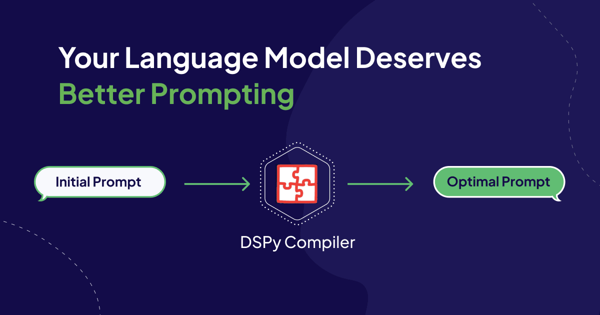

<!-- truncate -->

Language models have revolutionized the way we interact with and utilize artificial intelligence. These powerful tools can be prompted to perform a wide array of tasks, from creative writing to answering complex questions, and even assisting with decision making. However, the quality and effectiveness of the generated output is heavily dependent on the particular language in the prompt to the language model.

Crafting the perfect prompt, also known as Prompt Engineering, is generally more of an art than a science. AI developers typically have unique styles of prompting large language models (LLMs) through trial-and-error experiences. With the inception of DSPy, prompting is returning to its roots in Machine Learning, allowing us to better control generative AI systems.

To achieve this, DSPy introduces two new concepts: a programming model and a collection of optimizers or compilers. The DSPy programming model lets you define each component that makes a language model request, such as an initial task description and input and output fields. You can then connect these components to build complex pipelines. For example, if you’d like to convert questions into blog posts, the simplest pipeline consists of two components: 1. Question to Blog Outline, and 2. Outline to Paragraphs. The `Question2BlogOutline` takes in two inputs, question and contexts, and outputs a comma-separated list of topics. The `Topic2Paragraph` takes the topic and contexts as input, and outputs the paragraph. We then piece these components (or signatures) together in the program (see this [notebook](https://github.com/weaviate/recipes/blob/main/integrations/dspy/2.Writing-Blog-Posts-with-DSPy.ipynb) for the full example). This lets you interface this program with the DSPy compilers.

Compilers enter the picture to give your LLMs “the prompts they deserve.” This blog post will help you gain a deep understanding of the current state of Prompt Engineering and how DSPy’s BootstrapFewShot, COPRO, and MIPRO optimizers can help you.

You can follow along with the demo notebook [here](https://github.com/weaviate/recipes/blob/main/integrations/dspy/5.Advanced-Optimizers.ipynb)!

## Examples and Instructions
The role of optimization in machine learning systems has been dramatically transformed with the introduction of LLMs. LLMs no longer **require** gradient descent training to increase their performance for a specific task. Instead, we can tweak the language of the prompt which is presented to the LLM. There are 2 main aspects of the prompt to tweak, instructions and examples.

Instructions refer to the task description typically placed at the beginning of the prompt. Different ways of phrasing the task will result in better or worse performance for a given task and/or language model. For example, the prompt "Write a paragraph to answer this question" will perform differently than the prompt: "Analyze the given question, identify its key components, and compose a well-structured, coherent paragraph that thoroughly addresses the main points.”

Further, LLM performance may be improved by providing examples of inputs and outputs. Adding these examples to the prompt is known as few-shot learning. Few-shot learning has even had successes described in the original release of GPT-3, before the explosion of instruction tuning with Reinforcement Learning from Human Feedback (RLHF).

Both of these strategies are fairly intuitive. A detailed instruction for the task you would like completed will certainly help communicate it, and what better way to demonstrate the task then with a few examples?

This article will explain how DSPy tunes instructions and creates high-quality examples to help you get higher quality responses from LLMs.

<details>
  <summary>RAG Prompt Example</summary>

```text
Assess the context and answer the question.

---

Follow the following format.

Contexts: May contain helpful information
Question:
Answer:

---

Contexts: Weaviate 1.24 is here!
Here are the release highlights!

- Named vectors: A single object can have multiple vectors. Create vectors for properties, use different vectorization models, and apply different metrics to fine tune interactions with your data.
- HNSW and binary quantization (BQ): HNSW indexes and BQ combine for serious compression and blazing speed.
- Simplified Docker configuration: A new Docker image that needs no configuration.
- Backend improvements: Numerous improvements to make updates, imports, and deletions faster.
- Python client update: General availability, support for all the latest features.

Question: Does Weaviate support Binary Quantization?
Answer:
```
</details>

## Setting up our Pipeline for Optimization
This blog post will illustrate how the BootstrapFewShot, COPRO, and MIPRO optimizers work through the lens of a RAG example. BootstrapFewShot optimizes **Examples**, COPRO optimizes **Instructions**, and MIPRO optimizes both **Instructions and Examples**.

There are 4 steps before we can optimize our program:

1. Connect DSPy to the LLMs we want to use, as well as external tools such as vector databases like Weaviate, and Arize Phoenix for logging and tracing.

2. Define our LLM Pipeline using DSPy’s Signatures and Modules.

3. Wrap examples of your dataset in dspy.Example objects.

4. Define your metric to judge responses.

### Connect DSPy to our LLMs and Tools
We’ll begin with configuring the language model, connecting to our Weaviate cluster, and launching Phoenix:

```python
import dspy
from dspy.retrieve.weaviate_rm import WeaviateRM
import weaviate
import phoenix as px

command_r = dspy.Cohere(model="command-r", max_tokens=4000, api_key=cohere_api_key)
command_r_plus = dspy.Cohere(model="command-r-plus", max_tokens=4000, api_key=cohere_api_key)
gpt4 = dspy.OpenAI(model="gpt-4", max_tokens=4000)

weaviate_client = weaviate.connect_to_local()
retriever_model = WeaviateRM("WeaviateBlogChunk", weaviate_client=weaviate_client)
dspy.settings.configure(lm=command_r, rm=retriever_model)


phoenix_sessin = px.launch_app()
# ... more setup omitted in blog post, please see the full notebook.
```

### Define our LLM Pipeline (RAG)
As a primer to the DSPy programming model if you are unfamiliar, we have a 1-layer DSPy pipeline consisting of a retrieval and a Signature to implement `GenerateAnswer`. This LLM pipeline is commonly referred to as Retrieval-Augmented Generation (RAG). The RAG pipeline is shown below:

```python
class GenerateAnswer(dspy.Signature):
    """Assess the context and answer the question."""
    
    context = dspy.InputField()
    question = dspy.InputField()
    answer = dspy.OutputField()

class RAG(dspy.Module):
    def __init__(self, passages_per_hop=3, max_hops=2):
        super().__init__()
        
        self.retrieve = dspy.Retrieve(k=passages_per_hop)
        self.generate_answer = dspy.ChainOfThought(GenerateAnswer)
    
    def forward(self, question):
        context = self.retrieve(question).passages
        with dspy.context(lm=command_r):
            pred = self.generate_answer(context=context, question=question).answer
        return dspy.Prediction(context=context, answer=pred, question=question)
```

### Wrap examples of your dataset in `dspy.Example` objects
Now that we have our DSPy program, we can work on optimizing the language model that answers the question. To optimize your program, you will need a training dataset, and a performance metric as the input. For this demo, we’re using a dataset consisting of Weaviate questions and answers. In total, we have 50 `query`, and `gold_answer` pairs.

```python
import json

file_path = './WeaviateBlogRAG-0-0-0.json'
with open(file_path, 'r') as file:
    dataset = json.load(file)

gold_answers = []
queries = []

for row in dataset:
    gold_answers.append(row["gold_answer"])
    queries.append(row["query"])
    
data = []

for i in range(len(gold_answers)):
    data.append(dspy.Example(gold_answer=gold_answers[i], question=queries[i]).with_inputs("question"))

trainset, devset, testset = data[:25], data[25:35], data[35:]
```

### Define your metric to judge responses
Additionally, we will need the LLM metric that assesses the generated answer, as well as its alignment to the gold answer in the uncompiled RAG program. The LLM metric is:

```python
class TypedEvaluator(dspy.Signature):
    """Evaluate the quality of a system's answer to a question according to a given criterion."""
    
    criterion: str = dspy.InputField(desc="The evaluation criterion.")
    question: str = dspy.InputField(desc="The question asked to the system.")
    ground_truth_answer: str = dspy.InputField(desc="An expert written Ground Truth Answer to the question.")
    predicted_answer: str = dspy.InputField(desc="The system's answer to the question.")
    rating: float = dspy.OutputField(desc="A float rating between 1 and 5")


def MetricWrapper(gold, pred, trace=None):
		alignment_criterion = "How aligned is the predicted_answer with the ground_truth?"
		return dspy.TypedPredictor(TypedEvaluator)(criterion=alignment_criterion,
            question=gold.question,
			ground_truth_answer=gold.answer,
			predicted_answer=pred.answer
        )
```

## BootstrapFewShot
Collecting a dataset with examples of the task you want your LLM pipeline to perform can be very time consuming to annotate. If you want to add Chain-of-Thought reasoning to each LLM call, well now you have to manually write the rationales that lead to the desired outputs **for each example in your dataset.** This tutorial is only concerned with 1-layer DSPy pipelines, but imagine you have 5 or more intermediate calls in the LLM pipeline. This means you would have to write 5 or more examples for each of these components (and their respective rationales if using Chain-of-Thought).

DSPy to the rescue with the `BootstrapFewShot` compiler. `BootstrapFewShot` generates traces through the program and passes the outputs into a metric to see if the example is worth keeping as an input-output example. This metric can be either boolean valued (true or false) or numeric valued paired with a `metric_threshold` to check if the example is worth keeping. In fact, the training dataset used in this demo was created using this compiler.

The following code snippet illustrates how to pass in our RAG program and our LLM_Metric into the `BootstrapFewShot` compiler. We are further looping through values of `max_bootstrapped_demos`. If set to 1, `BootstrapFewShot` will produce 1 input-output example to use in the prompt. Similarly, if set to 3, `BootstrapFewShot` will use 3 input-output examples to use in the prompt. This loop can help you get a quick sense if adding more examples will improve performance.

```python
from dspy.teleprompt import BootstrapFewShot

for i in range(1, 4, 1):
    teleprompter = BootstrapFewShot(metric=MetricWrapper, max_bootstrapped_demos=i, max_rounds=1)
    compiled_RAG = teleprompter.compile(RAG(), trainset=trainset)
    compiled_RAG_score = evaluate(compiled_RAG, metric=MetricWrapper)
    print(f"\n\033[91mCompiled RAG Score at Demos = {i}: {compiled_RAG_score}\n")
```

### Adding Random Search or Optuna to BootstrapFewShot
`BootstrapFewShot` will stop searching for examples once it finds the `K` desired number of examples for the prompt; however, these may not be the optimal `K`.

One solution to this is to use DSPy’s `BootstrapFewShotWithRandomSearch` or `BootstrapFewShotWithOptuna`. Instead of generating the desired K and stopping, these optimizers will generate `num_candidate` examples and use either random search or bayesian optimization, respectively, to find the optimal set of `K` examples to use in the prompt. 

Random search and Bayesian optimization are two common techniques for hyperparameter tuning. Random search is used to explore the space of possible example combinations by randomly selecting `K` examples from the generated `num_candidate` examples and evaluating their performance, ultimately finding the optimal set of examples for the prompt. `BootstrapFewShotWithOptuna` employs Bayesian optimization, which builds a probabilistic model of the relationship between the selected examples and the prompt's performance, guiding the search for the optimal set of `K` examples by balancing exploration and exploitation based on the model's predictions.

We began by testing `max_bootstrapped_demos=2`, `num_candidate_programs=2` and then `max_bootstrapped_demos=1`, `num_candidate_programs=5`. The `max_bootstrapped_demos` parameter controls for the maximum number of examples used in the prompt (these two extensions of `BootstrapFewShot` will also check the metric of less demos, for example if `max_bootstrapped_demos=2`, it will check the performance of just using 1 example as well). The `num_candidate_programs` parameter will control how many configurations are added to the search space.

```python
from dspy.teleprompt import BootstrapFewShotWithRandomSearch

teleprompter = BootstrapFewShotWithRandomSearch(metric=MetricWrapper,
			    max_bootstrapped_demos=2,
				num_candidate_programs=2)

compiled_RAG = teleprompmter.compile(RAG(), trainset=trainset)
```

MIPRO will also use this mechanism in tandem with instruction optimization, but first we will begin by covering COPRO instruction optimization and then bring these concepts together (and introduce 1 more new concept) to understand MIPRO.

### Instruction Optimization
In `BootstrapFewShot`, we use an LLM to generate examples of our program, for instruction optimization we similarly use an LLM to write better instructions. DSPy has two optimizers to achieve this: COPRO and MIPRO. Both of which use the `BasicGenerateInstruction` Signature as a core building block:

```python
class BasicGenerateInstruction(Signature):
    """You are an instruction optimizer for large language models. I will give you a ``signature`` of fields (inputs and outputs) in English. Your task is to propose an instruction that will lead a good language model to perform the task well. Don't be afraid to be creative."""

    basic_instruction = dspy.InputField(desc="The initial instructions before optimization")
    proposed_instruction = dspy.OutputField(desc="The improved instructions for the language model")
    proposed_prefix_for_output_field = dspy.OutputField(
        desc="The string at the end of the prompt, which will help the model start solving the task",
    )
```

COPRO begins by generating `breadth` instruction candidates with `BasicGenerateInstruction`. These candidates are then evaluated by running each candidate instruction through the trainset with the provided metric. These results are then formatted into `GenerateInstructionGivenAttempts` to generate new instructions. This continues for `depth` rounds to produce the optimized instruction.

```python
class GenerateInstructionGivenAttempts(dspy.Signature):
    """You are an instruction optimizer for large language models. I will give some task instructions I've tried, along with their corresponding validation scores. The instructions are arranged in increasing order based on their scores, where higher scores indicate better quality.

    Your task is to propose a new instruction that will lead a good language model to perform the task even better. Don't be afraid to be creative."""

    attempted_instructions = dspy.InputField(format=dsp.passages2text)
    proposed_instruction = dspy.OutputField(desc="The improved instructions for the language model")
    proposed_prefix_for_output_field = dspy.OutputField(
        desc="The string at the end of the prompt, which will help the model start solving the task",
    )
```

Here are the results we found in the first round of running COPRO (Note: COPRO runs for `depth` rounds). The first instruction is, “Assess the context and answer the question”, COPRO then generates 4 additional phrasings of the task. COPRO then takes each instruction and its corresponding metric value as input to propose a new instruction.

| Instruction | Metric Value |
|-------------|--------------|
| Assess the context and answer the question. | 4.5 |
| Carefully read the provided context, ensuring you understand the nuances and main points. Then, answer the question posed, drawing on the relevant information from the context, and provide a clear, concise, and accurate response that directly addresses the question. If the question is open-ended or subjective, offer a well-reasoned answer supported by the information given. | 4.17 |
| Read the provided context carefully to understand the nuances and details. Then, thoughtfully answer the question posed, ensuring your response is directly relevant to the context given. Make sure your answer is clear, concise, and logically derived from the information provided. | 4.5 |
| Read the provided context carefully to fully understand the details and nuances. Then, answer the question based on your understanding of the context in a clear, concise, and accurate manner. Ensure your response is well-reasoned and directly addresses the question, using relevant information from the context. | 4.5 |
| Read the provided context carefully, ensuring you fully understand the details and nuances. Then, answer the question accurately and concisely, providing any necessary explanation to support your answer. Make sure your response is directly relevant to the question asked and is based on the information from the context. If the context does not contain enough information to answer the question definitively, state this explicitly and give the best possible answer based on the available information, noting any assumptions you make. | 4.0 |

These are the 5 outputs from our LLM paraphrasing the initial instructions to write a new and better instruction. The next step of COPRO takes the 5 outputs, their resulting performance according to the metric, and writes a new instruction.

Output of `GenerateInstructionGivenAttempts`: “Delve into the provided context with attention to detail to grasp the subtleties and core elements. Subsequently, craft a response to the question that is both pertinent and substantiated by the context. Your answer should be articulate, succinct, and precise, effectively capturing the essence of the question. In instances where the information at hand is insufficient to provide a definitive response, acknowledge this limitation, and present the most plausible answer, highlighting any presuppositions. Strive to ensure that your reasoning is transparent and that your answer adds value to the discussion by being insightful.” This instruction achieves an improved score of 4.83!

Another interesting work on prompting is [“The Unreasonable Effectiveness of Eccentric Automatic Prompts”](https://arxiv.org/abs/2402.10949) from Battle and Gollapudi. Their paper demonstrates that the highest scoring, automatically generated prompts can be remarkably different from what a human would devise. For example, the optimized prompt for Llama2-70B that expresses an affinity for Star Trek led to improved mathematical reasoning performance. This suggests that DSPy compilers should be open to exploring a wide range of prompt variations, even those that may seem counterintuitive to humans.

## Example and Instruction Optimization
[MIPRO](https://twitter.com/kristahopsalong/status/1766166198079889737) combines both example **optimization** and **instruction tuning**. By generating one or multiple examples for a candidate instruction, we get a better sense of how well it performs. Further, MIPRO introduces a dataset summarizer to bring in more information about the particular task and dataset you are optimizing for.

MIPRO begins by calling `_observe_data` to generate observations about the dataset. MIPRO uses the `DatasetDescriptor` Signature to generate initial observations based on the first `view_data_batch_size examples`. Then, MIPRO iteratively updates the observations using the `DatasetDescriptorWithPriorObservations` Signature for the remaining examples in the dataset, processed in batches of size `view-data_batch_size`. The final observations are then summarized with the `ObservationSummarizer`. This is very similar to the research around [summarization chains](https://python.langchain.com/docs/modules/chains/).

MIPRO then generates `num_candidates` sets of input-output examples for each predictor in the program using `BootstrapFewShot`, these are stored in the `demo_candidates` dictionary. MIPRO then uses `BasicGenerateInstructionsWithExamplesAndDataObservations` to generate new task descriptions. Dataset observations and bootstrapped examples can also be toggled on or off with the `view_data` and `view_examples` flags. If `view_data` is turned off, MIPRO will use `BasicGenerateInstructionsWithExamples`. If `view_examples` is turned off, MIPRO will use `BasicGenerateInstructionsWithDataObservations`. If both are turned off, MIPRO will just use the `BasicGenerateInstruction` Signature to generate new instructions. MIPRO will then find the optimal combination of instruction and the few-shot example candidate set with the Optuna Bayesian Optimization library. This is guided by the metric provided to MIPRO.

Here is the result of the dataset summarizer on the Weaviate RAG dataset:
```text
The dataset is tailored for an audience with technical expertise in Weaviate and related technologies, focusing on providing practical, step-by-step troubleshooting and optimization guidance. It is designed to train AI for technical support, offering concise, actionable instructions and contextual explanations, which could also serve educational purposes for users seeking to enhance their understanding of these technologies.
```

After running MIPRO, here is the final RAG prompt:
```text
Carefully read the provided context, which may contain technical information, links, and code snippets related to advanced technology and machine learning topics. Your task is to interpret this information and provide a clear, concise, and accurate answer to the question posed. Use domain-specific language appropriate for an audience knowledgeable in computational linguistics or AI technologies. Ensure that your answer is context-rich and directly addresses the question, citing any specific resources or guides mentioned in the context when relevant.
```

MIPRO is able to jointly leverage information about how well different prompts have performed, as well as additional information about the dataset it is being optimized for, such as questions derived from Weaviate’s blog collection.

## Compiling Weaviate’s `generative-search` modules with DSPy
This article has demonstrated a few tools DSPy gives you to produce an optimized prompt for RAG! Now that you have this prompt, you can plug it into Weaviate’s `generative-search` modules. Weaviate’s `generative-search` module, [released in March 2023](https://www.youtube.com/watch?v=ro3ln4A9N8w), is our solution to help developers build Stateful AI.

After we compile a DSPy program, we save the instructions with:
```python
COPRO_compiled_RAG.save("My-RAG-Prompt.json")
```

We then load it into Weaviate by reading the JSON file,
```python
def GenerateAnswer_instruction_from_dspy_json(file_path):
    with open(file_path, "r") as file:
        data = json.load(file)
    return data["generate_answer"]["signature_instructions"]

task_description = GenerateAnswer_instruction_from_dspy_json("RAG-with-Command-R-Example.json")
```

We can then query in Weaviate using the v4 Python client with:
```
weaviate_blogs = weaviate_client.collections.get("WeaviateBlogChunk")

query = "What is Product Quantization? Why is it helpful for Vector Databases?"
extended_task_description = task_description + "\nQuery: {query}\nAnswer:"

response = weaviate_blogs.generate.near_text(
    query = query,
    limit = 3,
    grouped_task=task_description
)

print(response.generated)
```

## Beyond Prompting: Gradient Descent and DSPy
In this blog post, we covered how we can optimize the prompt that we feed to the language model. However, there is one additional way that we can boost our RAG performance – fine tuning with gradient descent. DSPy offers a level of abstraction around both methods of optimization. [Here](https://twitter.com/lateinteraction/status/1777082868357070972) are more thoughts on this from Omar Khattab.

## Conclusion 
In conclusion, this article presents the DSPy optimizers and advice on when to use which depending on whether you need instruction tuning, few-shot examples, gradient descent or combinations of the three. Which optimization strategy you need generally depends on the size of the LLM, for example, GPT-4 and Claude Opus are much larger models than Cohere’s Command R, which is similarly much larger than Mistral or Llama2 7B. This article provides a deep dive into how each of the optimizers work, BootstrapFewShot, COPRO, and MIPRO. Hopefully this has helped your understanding of DSPy’s optimizers!


import WhatNext from '/_includes/what-next.mdx'

<WhatNext />