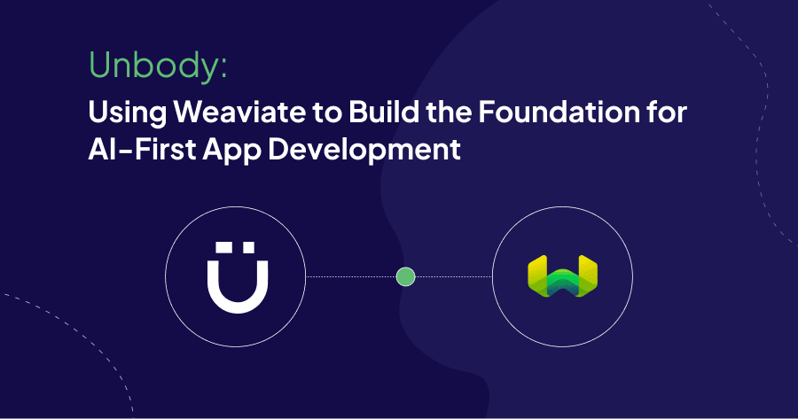
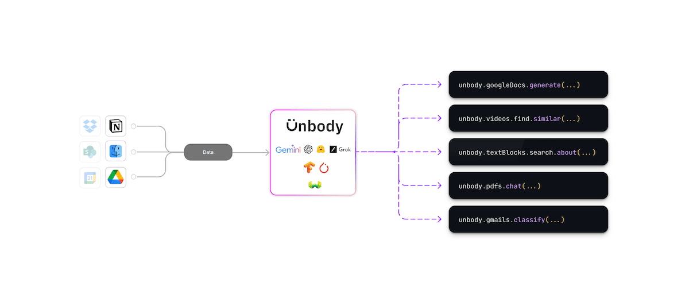
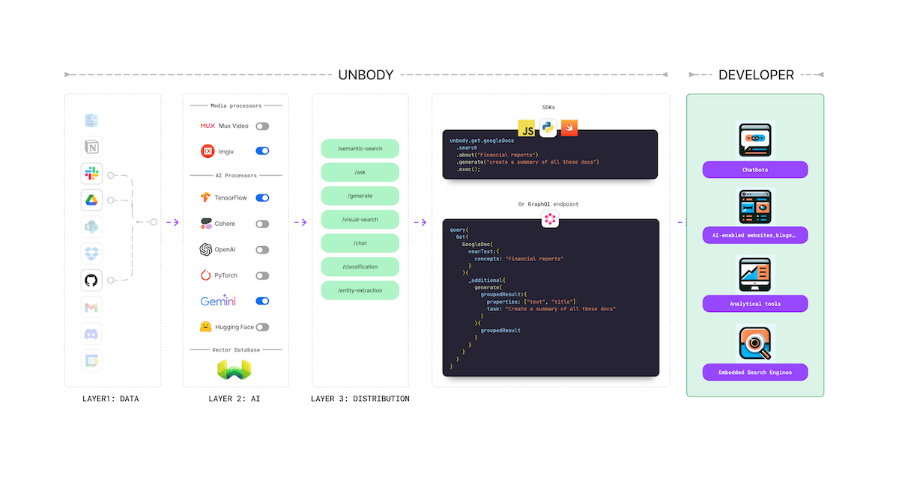
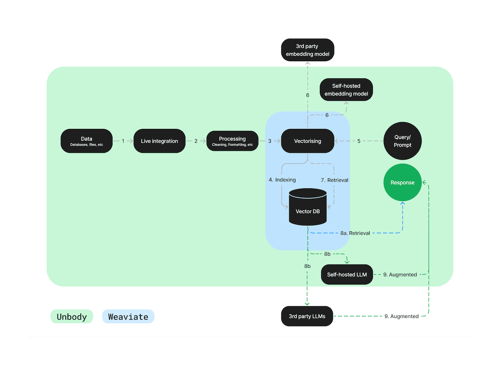
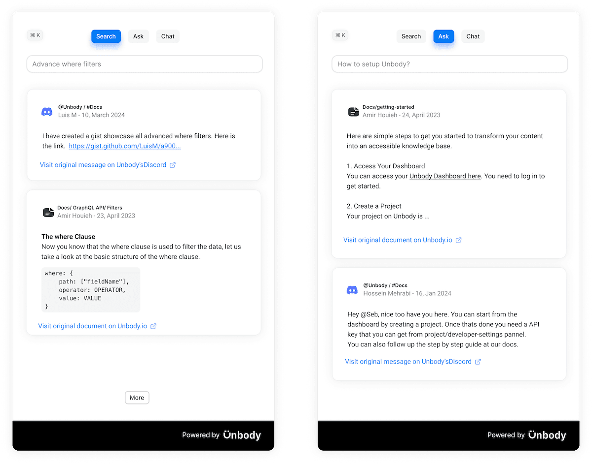

<!-- truncate -->

import nextlog from './img/nextlog.mp4';

As developers, we're constantly adapting to the evolution of technology, and nothing signifies this shift more than the transition to AI-first. It's a big move, similar to when the world went mobile-first, but it comes with unique challenges, especially in seamlessly integrating AI into apps and websites. But we've come a long way with [Unbody](https://unbody.io) to make this different, and here is our story:

<blockquote class="twitter-tweet">

 Wow this is amazing. We are implementing Weaviate into <a href="https://twitter.com/unbody_io?ref_src=twsrc%5Etfw"> @unbody_io </a>. It has required us to make some major refactors in our architecture but it's worth it. Thank you for all this amazing work 😊

 - amir (@amirhouieh) <a href="https://twitter.com/amirhouieh/status/1626349250882699267?ref_src=twsrc%5Etfw"> February 16, 2023 </a>
</blockquote> 

Unbody's first line of code was written in 2016 as a headless CMS for Google Drive. The project kept growing, and fast forward to 2022, during our search for a better search engine, we stumbled upon Weaviate. What started as a simple test quickly led to a rather crazy decision: we migrated our entire content database to Weaviate. This required a ground-up refactoring of our codebase, but actually, it was worth it. This post explores our journey through this transformation, detailing the challenges, surprises, and major changes it brought to our operations.

Unbody is crafted by a team of two: [Hossein Mehrabi](https://www.linkedin.com/in/jeangovil/) and [Amir Houieh](https://www.linkedin.com/in/amirhouieh/), both seasoned developers with a strong background in web development. We've spent the last five years mastering AI technologies to simplify the process for fellow developers who aren't AI specialists. Our goal is to make advanced AI integration accessible to all developers, allowing them to focus on creativity and innovation without the steep learning curve.

## The challenge

"AI-first" is becoming the new "mobile-first", but navigating the current development toolchain is a headache for many. It's especially tough when we dive into personalization with domain-specific data and customizing AI models. The main challenges include:

1. **Personalization hurdles**

   We're all impressed by the capabilities of AI in general conversations, right? But when we want it to understand and act on our unique data, things fall apart. Our data is private and distinct, not something these general AI models handle well. The challenge is to make AI adapt to our specific requirements while ensuring privacy and security—a daunting task.

2. **Data scattered everywhere**

   Our next big issue is that our data is everywhere—emails, Dropbox, Google Drive, social media, Slack, etc— and in various formats —PDFs, Spreadsheets, images, videos, presentation files, etc.. It’s a complete mess. Each type of data speaks a different language and lives in different corners of our digital world. Getting AI to navigate and understand this variety without forcing us to change our habits is no small feat.

3. **Complex development tools**

   When it comes to the tools we use for developing AI applications, it often feels like we're making it up as we go along. Imagine building a chatbot that pulls data from Google Drive and Slack, mixing in tools like LangChain, vector databases, and RAG APIs. Before you know it, you’re lost in a jungle of query languages and document parsers.

### Why we must tackle these challenges

But what if we tackle these challenges? We can't afford not to. The potential of non-AI developers is too great to ignore. AI is expected to be a standard feature in every website and app soon, and developers need to be able to deploy it without a hitch. Otherwise, the gap between AI's technological advances and its real-world application just keeps growing. We need to enable and empower developers and makers with no AI expertise.

### The impact of solving these problems

Once we address these issues, the changes will start to be noticeable. AI can do wonders in everyday life, both at work and at home. Just like the process of turning crude oil into fuel, there's a complex journey from collecting data to making it usable in AI applications. We at Unbody are working to streamline this process, aiming to support a portion of 200 million web products by 2026. Next, let me explain how.

## Solution

Unbody is an AI-as-service platform that automates the entire AI pipeline from data to the front-end, all in one API, simplifying the complexity of AI development to one line of code. In other words, If the data is the fuel for AI; we’re automating the entire pipeline from oil-rigs to the refinery (powered by Weaviate) to distribution, all in one API. Here’s how it works:

1. **Tell Unbody Where Your Data Is**: Our platform can integrate data from virtually any source—documents, spreadsheets, images, videos, whether they're stored in Google Drive, SharePoint, Slack, or even locally on your desktop. This flexibility addresses the problem of scattered and fragmented data by centralizing and simplifying data access.
2. **Choose Your Preferred AI Engine**: Users can select from a wide range of AI engines according to their specific needs, including advanced models like OpenAI's GPT, Gemini, or various open-source models available on Hugging Face. This choice empowers users to personalize AI features tailored to their requirements, tackling the personalization challenge head-on.
3. **Start Building Now**: Once the data sources are set and the AI engine selected, Unbody automatically aggregates, syncs, and transforms your data into ready-to-use AI functionalities. These are accessible through a single GraphQL endpoint or one of our specialized SDKs, simplifying the complex development tools issue by providing a unified, straightforward interface.

### Our Transformation with Weaviate

In 2022, our search for a powerful semantic search engine led us to Weaviate. Impressed by its capabilities, we quickly realized that it was more than just a search engine—it could significantly enhance our direction. We decided to migrate our entire content database from MongoDB to Weaviate, transforming Unbody into the first-ever headless CMS built entirely on a vector database. But the journey didn’t stop there. During the migration, we realized that Weaviate could significantly automate many of AI processes on our roadmap without much of technical overall or demand for more resources, which accelerated our transition toward becoming a comprehensive AI API platform.

### Weaviate's role in Unbody's solution

Weaviate plays a crucial role in two key layers of our solution:

1. **Layer 2: AI data processing and enhancement**: At this layer, Weaviate's [modular architecture](https://weaviate.io/developers/weaviate/modules) comes into play. It allows Unbody to apply chosen embeddings and vectorizers effortlessly, supporting a diverse range of content types:

   - **Text**: Integration with LLMs like OpenAI's GPT models.
   - **Images**: Support for various image vectorizers
   - **Multimodal data**: Capabilities to handle combinations of text, images, and more.

   This functionality directly addresses the challenge of AI understanding diverse data types and formats, enabling personalized, secure, and efficient data processing.

2. **Layer 3: delivery and interaction**: Enhanced data is delivered through APIs that are built directly on [Weaviate’s GraphQL interface](https://weaviate.io/developers/weaviate/concepts/interface#graphql) but tailored with custom classes to suit various application needs. This setup ensures that our solution is not only capable of sophisticated data interaction but also user-friendly and adaptable to real-world applications.

By integrating Weaviate, Unbody has successfully addressed the pressing challenges of AI-first development: complexity, personalization, and data fragmentation.

## Results & Achievements

We launched Unbody at Websummit in November 2023 and by February 2024, my co-founder and I were working on it full-time. Since then, we've seen our user base grow to 250 beta users. We've done more than just tweak the RAG pipeline at Unbody; we've built a complete toolkit for developers to create AI-native apps efficiently, which includes everything from a streamlined RAG, a content API, to GraphQL, and APIs for images and videos.

Thanks to Weaviate, we've managed without having to expand our team significantly. Without it, we'd need to hire at least an AI engineer and a backend developer. It's not just us who find Weaviate makes things easier; our users have also noticed—they frequently comment on how Unbody is super easy to use and effective for their projects.

## Future Directions

We're continually enhancing Unbody and showcasing its capabilities through open-source projects that demonstrate the power of our platform:

- **[Nexlog](https://github.com/unbody-io/Nexlog)**:  Nextlog is an AI-native, open-source blogging framework built on [Unbody.io](https://github.com/unbody-io/Nexlog/blob/main/Unbody.io) that makes reading more contextual and dynamic.

<figure>
  <video width="100%" autoplay loop muted controls>
    <source src={nextlog} type="video/mp4" />
    Your browser does not support the video tag.
  </video>
  <figcaption>Nextlog: AI Blogging framework</figcaption>
</figure>

- **Search Plugin**: This tool is an example of improving search functionalities on websites and documentation. Built on Unbody, it makes searches feel as natural as conversation, showcasing the practical applications of our technology in everyday tasks.

These initiatives not only enhance the functionality of Unbody but also serve as practical demonstrations of how developers can use our platform to create advanced AI-driven applications.

Our continued development of Unbody is supported by our foundational use of Weaviate, which provides the robust database infrastructure necessary for our operations. This partnership allows us to focus on expanding Unbody’s features and usability, ensuring that we remain at the forefront of making AI integration as straightforward as adding a new feature to a website.

import WhatNext from '/_includes/what-next.mdx';

<WhatNext />
