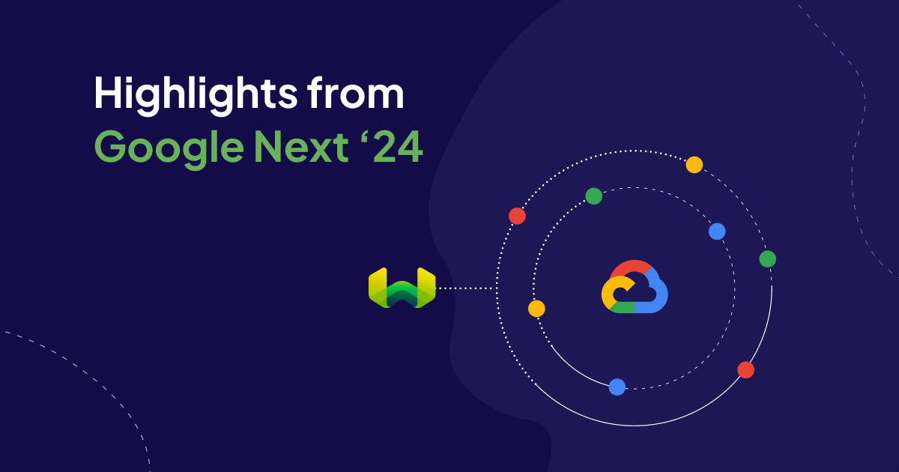
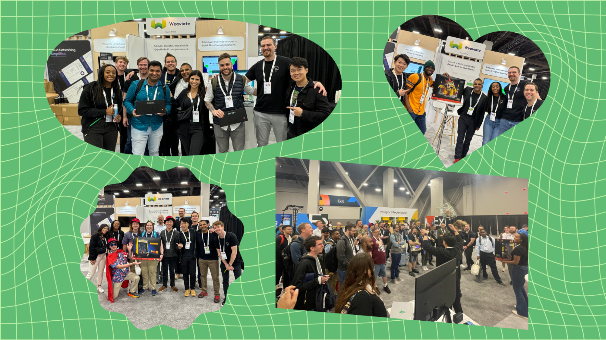

<!-- truncate -->

Team Weaviate attended our first [Google Cloud](/partners/gcp) Next and we had a blast! We connected with folks from our community, made lots of new friends, and shared our latest product features and trend predictions. Check out some of the highlights from our week in Vegas and a few things we learned along the way.

## The app-mosphere is changing fast
Our team spoke with hundreds of people who came by our booth – whether they were learning about genAI for the first time or were elbows deep into their latest application in production. Here are some observations from our folks on site:

**The vector database is cementing its place in the new AI stack**. Conversations have changed since our last big conference. GenAI projects are moving forward and teams have a better idea of the stack they need to achieve their goals. We talked with a lot of people who had hands-on experience with vector databases, where six months ago most were still just learning what a vector database was.

**Enterprises 💚 open source**. People gravitated toward our booth because of our *We 💚 open source* stickers and the open source messaging on our signage. Highly-regulated organizations – due to regional data compliance or security standards requiring data to stay on-premises – are drawn to databases like Weaviate because they can be deployed anywhere while maintaining a high level of performance.

**Lots (and lots) of use cases**. People in every industry are building AI applications. At our booth, the large majority of visitors came from financial services, retail, and media. They’re working to build solutions for document search, inventory search and management, and marketing content generation. A few were also looking into migrating codebases from one language to another.

**Quantization and rescoring are all the rage**. We received a lot of questions from people interested in optimizing efficiency of their AI setup and how these concepts work within Weaviate. If you’re curious, check out [this blog post about binary quantization](/blog/binary-quantization) and [this one about product quantization and rescoring](/blog/pq-rescoring).

## Breakout session: From RAG to Autonomous apps with Weaviate and Gemini on Google Kubernetes Engine

    <iframe src="//youtube.com/embed/WORgeRAAN-4?si=RVoqcV84bJIlaShE" 
    frameBorder="0"
    width="700"
    height="360" 
    allowFullScreen></iframe>

Our CEO Bob joined Brian Kaufman, Senior Product Manager from Google Cloud, to teach users how to:

* Deploy Weaviate on Google Kubernetes Engine
* Set up a pipeline to ingest data from the Cloud Storage bucket
* Query, RAG, and enhance the responses… all with just a few lines of code! 

If you want to give it a try for yourself, [explore the GitHub repository here](https://github.com/GoogleCloudPlatform/ai-on-gke/tree/main/tutorials-and-examples/vector-databases/NEXT-2024-Weaviate-Demo).

## Our favorite Google Cloud product announcements
Next is Google Cloud’s big annual conference, so of course we were waiting to see what new products and features would be announced at the keynote. Here are some of our favorites:

* The newly announced [VertexAI Agent Builder](https://cloud.google.com/products/agent-builder?hl=en), a suite of tools helping developers build enterprise-ready AI applications, is now in preview. You can orchestrate the agent pipeline with LangChain! 
* [Google Gemini 1.5 Pro](https://developers.googleblog.com/2024/04/gemini-15-pro-in-public-preview-with-new-features.html?m=1) and its new embedding model is now available in 180+ countries.
* There are [two new open-source Gemma models](https://developers.googleblog.com/2024/04/gemma-family-expands.html?m=1) tailored to developers and researchers.
* Gemini is now integrated with Google Workspace – think Docs / Slides / Sheets / Vids – and we’re excited to see what new capabilities this unlocks.

## Weaviate winners
We’re a fully remote company, so our team has a ton of fun when we’re together in person. It’s always a good time getting the crowd excited for our booth giveaways and seeing the joy in their faces when they win (or don’t and can have a good laugh about it). This time around we gave away clicky-clacky Keychron keyboards and some crowd-favorite Lego sets.

## What comes next?
**Google I/O**: Google’s developer conference is happening on May 14th in Mountain View, CA. Keep an eye out for some big announcements, maybe even from your favorite vector database. 😉

**In-person**: On May 21st, we’re hosting an in-person event in New York City with our friends from Google Cloud. The day will feature tech talks from industry leaders and customers will share their stories of building AI apps in production. After lunch (yes, there’s food) we’re hosting a free training where you can earn a certificate for completing Sebastian’s famous Intro to Building AI-Native Applications course. [Request a ticket here](https://events.weaviate.io/ai-in-prod-ny-24). 💚

**Virtual fundraiser**: We got invited to participate in the Solve with Google Hackathon at the [Prinses Máxima Centrum voor kinderoncologie](https://www.linkedin.com/company/prinses-m-xima-centrum-voor-kinderoncologie/). We’ll be supporting hospital staff and the attending data science and machine learning teams to build generative AI projects using Google Gemini and Weaviate. We’re raising money to support these awesome kids, so if you’re interested, [you can donate here](https://www.maximaalinactie.nl/fundraisers/weaviate-for-good). Even a small amount can make a world of difference to the children who receive medical treatment at the Princess Máxima Center. 🫶

import WhatNext from '/_includes/what-next.mdx'

<WhatNext />