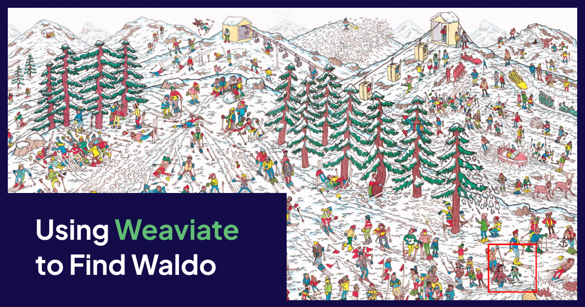
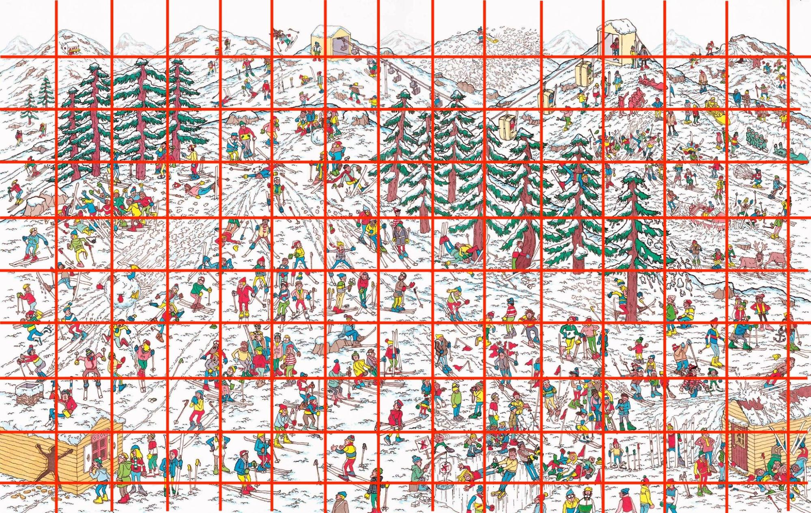
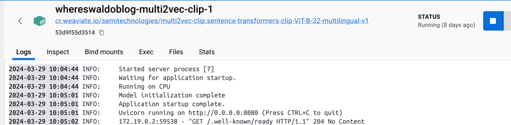
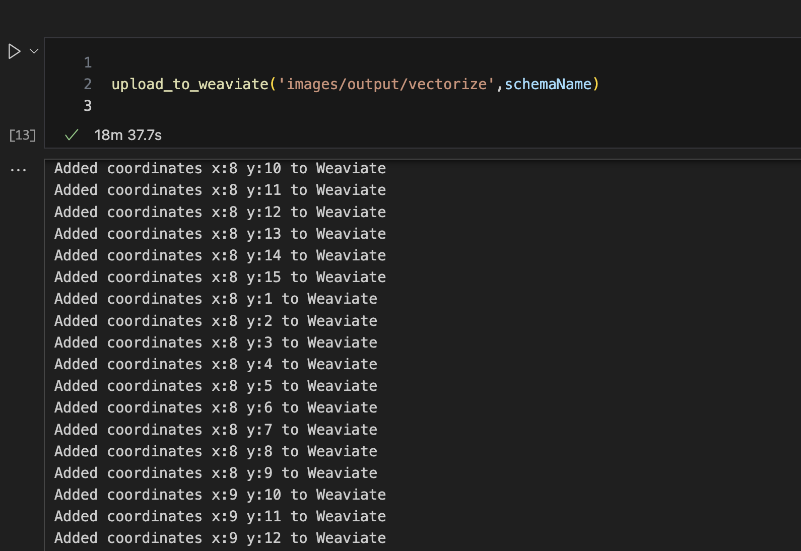

:::info GitHub Repo

[https://github.com/tuitejc/WeaviateWaldo](https://github.com/tuitejc/WeaviateWaldo)

:::

## Defeated, but not out…

One night while doing the usual bedtime routine with my son, we started going through a “Where’s Waldo” book. My son happens to be fantastic at pattern recognition and we raced to see who could find him first. My son was faster than me each time. Assuming that he had obviously memorized the locations on each page, I pulled out my phone and pulled up a fresh new image. He still won!

After admitting defeat to my son, I told him I’d be back for a rematch. Realizing his younger eyes would always have the edge, I decided I would try and use something he didn’t have. Weaviate!

## Can Weaviate Find Waldo?

Most use cases I come across while working with users of Weaviate involve searching across text data. Retrieval Augmented Generation (RAG) use cases break up large bodies of text into smaller chunks, then use the context of a natural language question to find appropriate pieces of information, and stuff that into an LLM prompt. Finding the correct pieces of information, or chunks of text, to add into the prompt is the art of creating a good RAG application that doesn’t hallucinate or provide inaccurate information.

Weaviate is well suited for this purpose by converting the text chunks into a multidimensional vector space. By converting natural language questions into a vector, then finding other nearby vectors, Weaviate can easily pinpoint which chunks of data (vectors) are applicable to your question. In other words, Weaviate is really good at finding the “needle in the haystack” of information.

## Weaviate is Multimodal

Besides text, Weaviate also supports image, or multimodal data and performs the same type of “near image” search across a vector space. Applying the technique used in RAG applications to chunk text data, I can create chunks of my starting image, and convert each of those into a vector. Then, I can provide an image of Waldo and search across those image chunks for which one is similar. Once I find him, I can re-assemble the original image with the identified chunk highlighted.



## Docker-Compose

To start I need to spin up an instance of Weaviate and a vectorizer that supports a multi-modal dataset. Weaviate provides a docker image for the Clip model which is perfectly suited for this use case. It’s lightweight and I can spin up both the vectorizer and Weaviate together using Docker-Compose:

```
version: '3.4'
services:
 weaviate:
   image: cr.weaviate.io/semitechnologies/weaviate:latest
   restart: on-failure:0
   ports:
    - 8080:8080
    - 50051:50051
   environment:
     QUERY_DEFAULTS_LIMIT: 20
     AUTHENTICATION_ANONYMOUS_ACCESS_ENABLED: 'true'
     PERSISTENCE_DATA_PATH: "./data"
     ENABLE_MODULES: multi2vec-clip
     DEFAULT_VECTORIZER_MODULE: multi2vec-clip
     CLIP_INFERENCE_API: http://multi2vec-clip:8080
     CLUSTER_HOSTNAME: 'node1'
 multi2vec-clip:
   image: cr.weaviate.io/semitechnologies/multi2vec-clip:sentence-transformers-clip-ViT-B-32-multilingual-v1
   environment:
     ENABLE_CUDA: 0 # set to 1 to enable
 ...
```

I did this on my laptop and I only had 16GB of memory and no GPU and was able to run this locally, so this demo is very reproducible. A GPU would increase performance by up to 90% so this is definitely not the preferred method to run this, but it works.

Wait a few minutes for the services to start. You can tell when the vectorizer is up and running based on the log in Docker.



## Jupyter Notebook

Once running, open the WheresWaldo.ipynb notebook and install Weaviate-Client and the PILLOW library for python.

Once installed set up the connection to your local instance to Weaviate:

```python
from PIL import Image, ImageDraw
import base64, os, weaviate
from io import BytesIO
from pathlib import Path

client = weaviate.connect_to_local()
print("Connected to Weaviate")
```

Once connected, create the Python functions that do all the work of splitting the image, sending it to Weaviate, and re-assembling it.

In the next cell we defined how big of chunks we want to use. In this case I set each chunk to 250 pixels by 250 pixels. Based on the requirements of the Clip model, this was the smallest I could go and ended up working well for this initial test.

```python
input_image_path = 'images/waldo_ski_image.jpeg'  # Change this to the path of your input image
schemaName='WaldoCollection'
split_width = 250  # Width of each small image
split_height = 250  # Height of each small image
```

Running the next cell will create a new schema within Weaviate. Running this code more than once will delete and re-create the schema.

```python
create_schema(schemaName)
```

The next cell will split the Where’s Waldo image locally. We will use these local versions of the image chunks for re-assembly later.

```python
split_image_locally(input_image_path, split_width, split_height, 'images/output')
print("Image is now split into local directory")
```

Once the images are stored locally we can loop through them and upload them to Weaviate which will automatically create vectors using the Clip vectorizer running alongside Weaviate.

```
print("Uploading to weaviate in batches...")
upload_to_weaviate('images/output',schemaName)
```

## Upload and Vectorize

Normally I would recommend using batching to upload data but since this is a demo, we want to wait for each image to get vectorized so we know when it’s safe to run a query on the data. This may take a few minutes to run through depending on the resources of the machine you are running it on. GPUs will increase speed significantly, but if you just want to prove a point on your laptop, expect to wait during this part. Go grab a cup of coffee and check your email and by the time you get back to it it will be done.



## Find Waldo

Once it is finished vectorizing we are ready to query Weaviate. Run the following code and it will perform a near_image check on the provided image of Waldo, get the coordinates of the chunk then re-assemble the original image with the chunk highlighted.

```python
schemaName = "WaldoCollection"
input_image_path = 'images/waldo_ski_image.jpeg'
query_image = 'images/Waldo_ski.png'

highlighted_parts = findWaldo(query_image,split_width,split_height,schemaName)
print(highlighted_parts)

if highlighted_parts == []:
   print("Waldo not found")
else:
  print("Waldo found!")
  reassembled_image = reassemble_and_highlight(input_image_path, split_width, split_height, highlighted_parts, 'images/output')
  reassembled_image.show()  # This will display the reassembled image with highlighted parts
```


It worked! Using Weaviate I was able to find Waldo in a group of images. This has a lot of implications on the application. Using the same technique you could utilize a large corpus of image data to create an image lookup system.

## The possibilities

Imagine taking aerial photos of crops and being able to identify which ones need additional nutrition or water. Take a picture of car damage to get an instant estimation of repair costs. Take a picture of a product to check the price across all major online vendors. You get the idea, but it all goes back to the concept “finding a needle in a haystack”, which is what we at Weaviate do best.

Now for my rematch…

import WhatNext from '/_includes/what-next.mdx';

<WhatNext />
