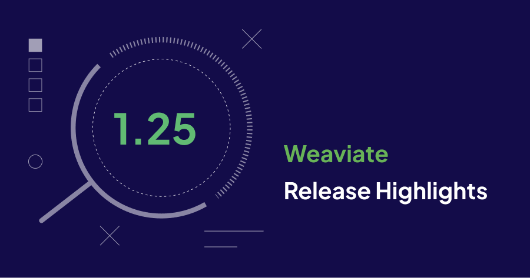
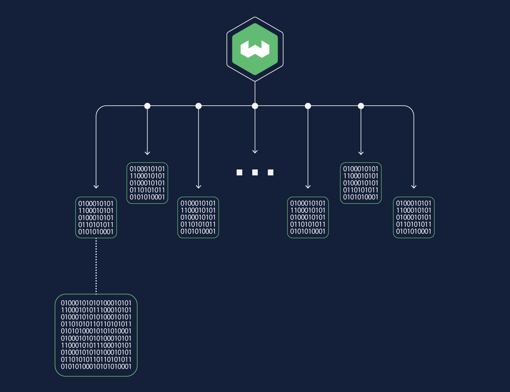

Weaviate `1.25` is here!

Here are the release ⭐️*highlights*⭐️!



- [**Dynamic Vector Index**](/blog/weaviate-1-25-release#dynamic-vector-index) Dynamically switch from flat indexes to HNSW to efficiently scale as your data grows.
- [**Raft**](/blog/weaviate-1-25-release#raft) Improves schema management for faster updates and more reliable clusters. 
- [**New Modules**](/blog/weaviate-1-25-release#new-modules) Loads of new modules that empower you to host and run open source embedding and language models locally!
- [**Batch vectorization**](/blog/weaviate-1-25-release#batch-vectorization) Faster and more efficient use of APIs during data import.
- [**Automatic tenant creation**](/blog/weaviate-1-25-release#automatic-tenant-creatio) Easier data uploads and tenant creation for you application.
- [**Search improvements**](/blog/weaviate-1-25-release#search-improvements) Hybrid search gets vector similarity search and grouping. method. Keyword search also gets grouping.

## Dynamic Vector Index



Configuring Weaviate and not sure if you have enough objects to justify building a full HNSW index or to stick to a flat index? We’ve got good news for you: In 1.25 we’re introducing the dynamic vector index!

Previously you’d have to decide at the outset if you wanted a flat or HNSW index. The flat index was ideal for use cases with a small object count where brute force nearest neighbors search was viable and would provide lower memory overhead and good latency. As the object count increased the flat index would become prohibitively slow and this is what the HNSW index would solve.

With 1.25 you can now configure Weaviate to use a dynamic index. This will initially create a flat index to be used and once the number of objects exceeds a certain threshold (by default 10,000 objects) it will dynamically switch you over to an HNSW index. 

Here is how you can configure Weaviate to use a dynamic index:

```json
{
	"vectorIndexType": "dynamic",
	"vectorIndexConfig": {
		"distance": "dot",
		"threshold": 10000,
		"hnsw" : {
			... standard HNSW configuration
		},
		"flat": {
		  ... standard Flat configuration
		}
}
```

This is a one-way dynamic switch that converts the flat index to HNSW. The index does not switch back to a flat index even if the object count drops below the threshold.

Above the threshold value, HNSW indexes are faster for queries, but they also have a larger memory footprint.

Dynamic indexes are particularly useful in a multi-tenant setup. The resource costs are high to build an HNSW index for every tenant. However, if a tenant collection grows large enough, the index dynamically switches to HNSW. The smaller tenants continue to use flat indexes.

## Raft

Weaviate clusters can be large, with a lot of systems to coordinate. The host systems have to work together reliably and efficiently, even under high loads. [Raft](https://raft.github.io/) is a robust consensus algorithm that helps make Weaviate faster and more fault tolerant. 

There are two types of data in a Weaviate cluster: your actual data, and system state information. Earlier releases use the same mechanism to store both types of data. Starting in 1.25, Weaviate uses Raft to store schema information and cluster state details. The underlying data [storage](/developers/weaviate/concepts/storage) is managed the same way as before. [Replication](/developers/weaviate/concepts/replication-architecture) and [sharding](/developers/weaviate/concepts/cluster) continue to safeguard your data while making it available for your applications.

If you are new to Weaviate, you can take immediate advantage of Raft. If you are upgrading from an earlier version, be sure to review the [migration guide](/developers/weaviate/more-resources/migration/weaviate-1-25) before you upgrade. There is a one-time change in the upgrade process. 

## New Modules

This release brings important new integrations with third party APIs.

### OctoAI Modules

With version 1.25 we’re announcing an integration with OctoAI which will make it even easier for users to access many open source embedding and language models such as Llama3-70b, Mixtral-8x22b and more. 

We are releasing two modules: text2vec-octoai and generative-octoai that integrate Weaviate and the OctoAI service. OctoAI provides hosted inference services for embedding models and large language models.

The current models supported include:

	"qwen1.5-32b-chat"
	"meta-llama-3-8b-instruct"
	"meta-llama-3-70b-instruct"
	"mixtral-8x22b-instruct"
	"nous-hermes-2-mixtral-8x7b-dpo"
	"mixtral-8x7b-instruct"
	"mixtral-8x22b-finetuned"
	"hermes-2-pro-mistral-7b"
	"mistral-7b-instruct"
	"codellama-7b-instruct"
	"codellama-13b-instruct"
	"codellama-34b-instruct"
	"llama-2-13b-chat"
	"llama-2-70b-chat"

To get started using Weaviate with OctoAI all you need is an OctoAI API key that you can get [from here](https://octo.ai/)! Read more about how you can use the `generative-octoai` module [here](/add/link/here) and the `text2vec-octoai` module [here](/add/link/here).

### Multimodal Google PaLM Module:

The multi2vec-palm module is an update to v1.24 that lets you use Google’s hosted embedding models to embed multimodal data.

Prior to the release of this module if users wanted to embed multimodal data they’d have to self-host the embedding model on their own compute but with multi2vec-palm building multimodal applications is easier than ever. 

Using Google’s [multimodal embedding model](https://cloud.google.com/vertex-ai/generative-ai/docs/embeddings/get-multimodal-embeddings) you can now embed text, images and videos all into the same vector space and perform cross-modal retrieval!

Learn more about how you can use the module [here](/developers/weaviate/modules/retriever-vectorizer-modules/multi2vec-palm).

## Batch vectorization

Data imports often involve a vectorization step. You designate a third party vectorization service in your collection schema, and Weaviate sends object to the service's API during data imports. In earlier versions, each object was sent as a single API call. Some third part services offer a more efficient, batch option. Starting 1.25, you can configure Weaviate to [send batches of objects](developers/weaviate/manage-data/import#batch-vectorization) to vectorization services that offer batch APIs.

Batch operations have two primary advantages. Sending batches of objects is significantly faster than sending objects one at a time. You may also save on costs. Some third party providers discount batch processing.

## Automatic tenant creation

[Multi-tenant operations](/developers/weaviate/manage-data/multi-tenancy) are a useful way to separate and organize data. [Batch imports](/developers/weaviate/manage-data/import) are an efficient way to load data. In earlier versions, you have to create tenants before you import data. Starting in 1.25, Weaviate [creates tenants on import](/developers/weaviate/manage-data/multi-tenancy#automatically-add-new-tenants) if the tenant doesn't already exist.

## Search improvements

[Hybrid search](/developers/weaviate/search/hybrid) combines the strengths of vector search and keyword search. Standalone vector searches use the [`nearText`](/developers/weaviate/search/similarity#search-with-text) and [`nearVector`](/developers/weaviate/search/similarity#search-with-a-vector) similarity operators to fine tune search results. This release adds the [similarity operators](/developers/weaviate/search/hybrid#vector-similarity-search) to the vector component of hybrid search.

Starting in 1.25, the `groupBy` operator is available for [hybrid search](/developers/weaviate/search/hybrid#group-results) and [keyword search](/developers/weaviate/search/bm25#group-results)

## Summary

Enjoy the new features and improvements in Weaviate `1.25`. This release is available as a docker image and on [WCS](https://console.weaviate.cloud/). Try it out in a free, WCS sandbox, or download a copy and try it out locally.

Thanks for reading, see you next time 👋!
