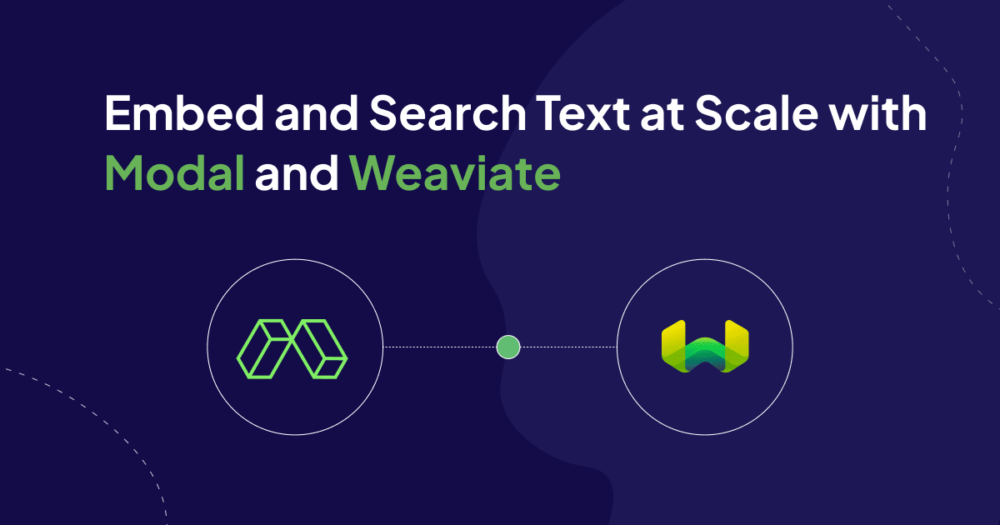

A full application of AI or embeddings is much more than just a prompt or a model: it’s an integrated system that combines data, models, compute, and user interfaces.

In this blog post, we’ll talk about how we built a full application that discovers analogies between Wikipedia articles by combining serverless infrastructure from Modal with the search and storage capabilities of Weaviate. Try it [here](https://vector-analogies-wikipedia.vercel.app/)!

<figure style={{ maxWidth: "70%", margin: "0 auto" }}>
  
<figcaption style={{ marginBottom: "1em" }}>
  An analogy from our system: Kobe Bryant is the Albert Einstein of Basketball. <br />
</figcaption>
</figure>

The goal of this blog post is to provide you with a quick overview of Modal and Weaviate and how we used them together to build out the search backend for our application. A tutorial on how to run and deploy the demo yourself can be found in [Modal's documentation](https://modal.com/docs/examples/vector-analogies-wikipedia).    

## Modal: Serverless Infrastructure for GPUs and More
We’ll be searching Wikipedia for articles that complete analogies using a combination of text search and vector-based semantic search. Naturally, that makes Weaviate a great fit!

To provide the infrastructure for computing the vector embeddings, we used [Modal](https://modal.com/).

Modal makes it easy for Python developers to deploy serverless applications. That means they can deploy applications that dynamically scale to match their workload – no PhD in Kubernetes required! Your application can scale up to tens or hundreds of GPUs during peak times and then back down to zero when requests do – and you only pay for what you use.

Unlike other serverless cloud offerings, Modal uses a custom container runtime written in Rust and designed to run data/ML/AI workloads at low latency and high throughput. Most importantly for us, it has GPUs, which make inference faster for embedding and generative models. And we can run them only when we need to, spinning them up in seconds! 

And Modal does more than just inference – it’s a whole serverless infrastructure platform. So we can also host the client that talks to our Weaviate database on Modal, giving us the flexibility to further customize our search using Python’s powerful ML libraries.

## Using Weaviate and Modal for performant data ingestion
In designing a complex pipeline, like data ingestion for a search engine, it’s important to first look for a bottleneck, a step whose speed determines the speed of all the others.

Because embedding vectors are so hot and cutting edge these days, you might expect that creating the embeddings is the bottleneck. But it’s not: we can easily scale up to the point where [all of English Wikipedia is converted into vectors in under fifteen minutes](https://modal.com/blog/embedding-wikipedia).

In fact, creating the text and vector search indices is the bottleneck. This shouldn’t be too surprising: databases are frequently the bottleneck. They have a treacherously difficult job to do, providing a storage abstraction that has the durability of disk but the flexibility and speed of memory.

Once you’ve identified the bottleneck, the [first step in managing it](https://www.leanproduction.com/theory-of-constraints/) is to maximize the speed of the bottleneck. In addition to having the combination text and vector search capabilities our application required, Weaviate provided both a scalable, managed deployment with [Weaviate Cloud Services](https://weaviate.io/developers/wcs) and all the knobs we needed to configure our indexing to maximize speed while providing the needed features.

With careful tuning, described below, we were able to increase the throughput from the low hundreds of rows up to ~7500 rows/second, ingesting and indexing ~50,000,000 snippets from Wikipedia articles in under two hours.

The [second step in managing a bottleneck](https://www.leanproduction.com/theory-of-constraints/#:~:text=Integrating%20with%20Lean-,What%20Is%20the%20Theory%20of%20Constraints%3F,no%20longer%20the%20limiting%20factor.) is to subordinate the rest of the system to that bottleneck. With serverless infrastructure defined as code, this was as easy as changing a few configuration values in our ingestion scripts. To find out what those numbers should be, all we needed to do was calculate the throughput per GPU worker and divide the indexing throughput by that number to get the maximum number of workers.

## Weaviate Features to Improve Indexing Speed
In this section, we walk through some of the key Weaviate features we used to improve the indexing performance while preserving search quality.

1. [Async Indexing](#async-indexing) 
2. [Product Quantization](#product-quantization)
3. [Vector Index Configuration](#vector-index-configuration) 
4. [Text Search Configuration](#text-search-configuration)
5. [Batch Imports](#batch-imports)

### Async Indexing
Importing data into a vector database is a two-step process: 1. Object creation, and 2. Vector index construction. Typically, the database won’t receive another batch of objects until it has finished indexing the prior batch. Weaviate `1.22` introduced [async indexing](/developers/weaviate/release-notes/900_1_22#asynchronous-vector-indexing-experimental) to speed up data ingestion.

Async indexing speeds up object ingestion by separating it from the vector index construction process. Rather than waiting for the new objects to be indexed, the objects are put in an in-memory queue before getting indexed. Since we imported millions of objects, it was important to enable this feature to reduce the import time. 

For open-source users, you can enable it by adding `ASYNC_INDEXING=true` in your environment variable, or you can enable it through Weaviate Cloud Services.

### Product Quantization
While async indexing helped with importing, [product quantization](/developers/weaviate/concepts/vector-quantization#product-quantization) (PQ) was important for alleviating the memory footprint. PQ is a technique used to compress the size of vector embeddings by representing the vectors as centroid ids. The centroid ids are calculated by clustering each segment. We enabled PQ to reduce the memory requirements without slowing down the ingestion.

You can either [manually](/developers/weaviate/configuration/pq-compression#manually-configure-pq) enable PQ or have it [automatically triggered](/developers/weaviate/configuration/pq-compression#configure-autopq) based on the number of vectors. You can manually enable PQ by setting it at the collection level. You’ll first need to import at least 10,000 to 100,000 vectors in order to form the centroids. AutoPQ can be used for new collections and the training step to form the centroids is set at 100,000 vectors by default.

It is important to keep in mind that PQ will have a tradeoff between recall, performance, and memory usage. You can tune HNSW parameters to complement the PQ configuration you selected.

### Vector Index Configuration
Since our application didn’t require high recall, we opted in to save costs by enabling PQ. There are a few [PQ parameters](/developers/weaviate/config-refs/schema/vector-index#pq-configuration-parameters) that you can configure like `trainingLimit`, `segments`, and `distribution`. Additionally, you can configure the [HNSW parameters](/developers/weaviate/config-refs/schema/vector-index#hnsw-index-parameters) like the `distance`, `ef`, `efConstruction`, and more. It is important to note that some parameters cannot be changed once the collection is created.

When configuring HNSW, you should consider a few questions: 
1. How many queries do you expect per second?
2. Do you expect a lot of imports or updates?
3. How high should the recall be?

Consider the answers in this [table](/developers/weaviate/config-refs/schema/vector-index#hnsw-configuration-tips) to help with your use case!

### Text Search Configuration
Weaviate lets you tune how each property is indexed, or if they’re indexed at all! By skipping the indexes, you speed up the insert time and reduce the memory for indexing. 

In this demo, we determined that search performance could be improved by exactly matching a particular `title` value. This requires creating an inverted index to find text matches on the `title` property. This is denoted in your schema by setting `indexFilterable` to `True`. We further want to use BM25 scoring on the title, so we create an inverted index for keyword scoring as well. This is achieved by setting `indexSearchable` to `True`. However, for the `url` and `content` properties, although we want the data stored, we do not need an index, so we turn it off by setting both `indexFilterable` and `indexSearchable` to `False`.

### Batch Imports
When importing data into Weaviate, we suggest using batch imports. This will send multiple objects in a single request, rather than importing them individually. There are [three methods](/developers/weaviate/client-libraries/python#batch-sizing) to choose from:

1. `dynamic`: The batch size and number of requests are dynamically adjusted as you import data. The size and number of each are dependent on the server load.

```python
with client.batch.dynamic() as batch:
```

2. `fixed_size`: The user specifies the batch size and number of requests. 
```python
with client.batch.fixed_size(batch_size=100, concurrent_requests=4) as batch:
```

3. `rate_limit`: If there is a third-party vectorization rate limit you want to avoid, you can specify the number of objects to send per minute.

```python
with client.batch.rate_limit(requests_per_minute=600) as batch:
```

For our application, we used the fixed size batch import set to 1,024 objects.

## Take-Aways
We built an end-to-end application that searches Wikipedia for an article that completes an analogy, like “the peso is to Mexico as the dollar is to the United States”. You can try it [here](https://vector-analogies-wikipedia.vercel.app).

We powered our text and vector search with Weaviate and our embeddings, ingestion, and database queries with [Modal](https://modal.com).

We think the two tools make a great pair for data- and compute-intensive applications of generative models and artificial intelligence. Take them for a spin on your next project, whether it’s a [blog post generator](https://github.com/weaviate-tutorials/Hurricane) or a [pet art generator](https://modal.com/docs/examples/dreambooth_app), and let us know what you build!

import WhatNext from '/_includes/what-next.mdx';

<WhatNext />
