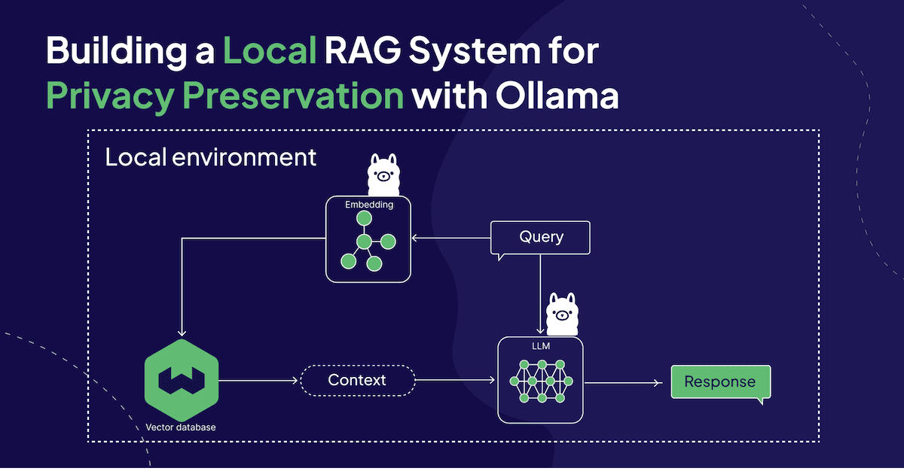
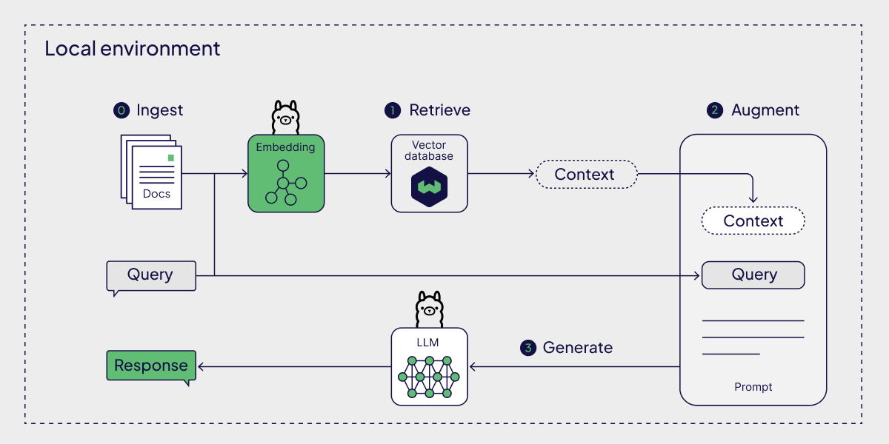

Prototyping an LLM-powered application is fun and easy but when you want to make it production-ready to use in your company, you will quickly face a variety of challenges, such as mitigating hallucinations or protecting data privacy. While [Retrieval-Augmented Generation (RAG)](https://towardsdatascience.com/retrieval-augmented-generation-rag-from-theory-to-langchain-implementation-4e9bd5f6a4f2) has been shown to be effective against hallucinations, local deployments are a popular approach for privacy preservation.

This article showcases how you can implement a local RAG-based chatbot in Python in an on-premises environment without any dependencies on the outside world using the following local components:

- Local LLM and embedding models via [Ollama](https://ollama.com/)
- Local [Weaviate](https://weaviate.io/) [vector database](https://weaviate.io/blog/what-is-a-vector-database) instance via [Docker](https://www.docker.com/)

Everything is local, open source, and doesn’t require any API keys!

## How to Setup Local Language Models with Ollama

Had I known that getting set up with Ollama takes less than 5 minutes, I wouldn’t have put it off for so long.

### Step 1: Download and install Ollama

Download the Ollama version for your operating system from the official [download page](https://ollama.com/download) and follow the few installation steps.

### Step 2: Pull models

Open a terminal and pull the relevant LLMs and [embedding models](https://ollama.com/blog/embedding-models) of your choice. For this tutorial, we will be using [`llama2`](https://ollama.com/library/llama2) by Meta for the LLM and [`all-minilm`](https://ollama.com/library/all-minilm) for the embedding model.

```
ollama pull llama2
ollama pull all-minilm
```

Other available embedding models are [`mxbai-embed-large`](https://ollama.com/library/mxbai-embed-large) (334 M parameters) and [`nomic-embed-text`](https://ollama.com/library/nomic-embed-text) (137 M parameters).

### Step 3: Install Ollama Python library

Since we’re implementing the RAG pipeline in Python, you will need to `pip` install the Python library. In this tutorial, we’re using version 0.1.8.

```
pip install ollama
```

Alternatively, a [REST API](https://github.com/ollama/ollama/blob/main/docs/api.md#generate-embeddings) or a [JavaScript](https://github.com/ollama/ollama-js) library are also available.

## How to Setup a Local Vector Database Instance with Docker

In a local RAG pipeline, you want to host your vector database locally as well. This tutorial shows you how you can [host an instance of the open source Weaviate vector database locally with Docker](https://weaviate.io/developers/weaviate/installation/docker-compose).

### Step 1: Download and install Docker

Install both the [`docker`](https://docs.docker.com/desktop/) (Docker 17.09.0 or higher) and the [`docker-compose`](https://docs.docker.com/compose/install/) ([Docker Compose V2](https://docs.docker.com/compose/migrate/)) CLI tools.

### Step 2: Start up the Docker container with a Weaviate instance

Now, you can run the following command from a terminal to start up a Weaviate instance from the default Docker image.

```
docker run -p 8080:8080 -p 50051:50051 cr.weaviate.io/semitechnologies/weaviate:1.24.8
```

### Step 3: Install the Weaviate Python client

Since we’re implementing the RAG pipeline in Python, you will need to `pip` install the Python library. In this tutorial, we’re using version 4.5.5.

```
pip install -U weaviate-client
```

## How to Build a Local RAG Pipeline

Once you have the relevant models pulled locally and ready to be served with Ollama and your vector database self-hosted via Docker, you can start implementing the RAG pipeline.

The following example is based on a post in the Ollama blog titled “[Embedding models](https://ollama.com/blog/embedding-models)”.



Local Retrieval-Augmented Generation System with language models via Ollama

### Preparation: Ingest data into vector database

The first step in building a RAG pipeline is to ingest your data into a vector database. For this, you will need to generate the data's embeddings.

Below, you can see a few sample documents from an [example used in an Ollama blog post](https://ollama.com/blog/embedding-models).

```python
documents = [
  "Llamas are members of the camelid family meaning they're pretty closely related to vicuñas and camels",
  "Llamas were first domesticated and used as pack animals 4,000 to 5,000 years ago in the Peruvian highlands",
  "Llamas can grow as much as 6 feet tall though the average llama between 5 feet 6 inches and 5 feet 9 inches tall",
  "Llamas weigh between 280 and 450 pounds and can carry 25 to 30 percent of their body weight",
  "Llamas are vegetarians and have very efficient digestive systems",
  "Llamas live to be about 20 years old, though some only live for 15 years and others live to be 30 years old",
]
```

Next, you will connect to your locally running vector database instance.

```python
import weaviate

client = weaviate.connect_to_local()
```

At startup, this vector database is empty. To populate it with your data, you first need to define the structure (a collection, called `docs` in this example) in which to store your data. Since the example data is just a simple list of strings, you can define a single property with the name `text` and the datatype `DataType.TEXT`.

```python
import weaviate.classes as wvc
from weaviate.classes.config import Property, DataType

# Create a new data collection
collection = client.collections.create(
    name = "docs", # Name of the data collection
    properties=[
        Property(name="text", data_type=DataType.TEXT), # Name and data type of the property
    ],
)
```

Now, you can load the data into the predefined structure. For this, you can iterate over your `documents` and generate the embeddings for each data object with Ollama’s `embeddings()` method. Then, the text and its embedding are stored together in the vector database.

```python
import ollama

# Store each document in a vector embedding database
with collection.batch.dynamic() as batch:
  for i, d in enumerate(documents):
    # Generate embeddings
    response = ollama.embeddings(model = "all-minilm",
                                 prompt = d)

    # Add data object with text and embedding
    batch.add_object(
        properties = {"text" : d},
        vector = response["embedding"],
    )
```

### Step 1: Retrieve context

Now, at inference, you will want to retrieve additional context for your prompt. For this, you will conduct a simple similarity search for your prompt (e.g., “What animals are llamas related to?”).

For the similarity search, you will have to first generate the vector embeddings of your search query (here, the prompt) similar to the ingestion stage with the `embeddings()` method. Then, you can pass the resulting embeddings to Weaviate’s `near_vector()` method and specify to retrieve only the closest result (`limit = 1`).

```python
# An example prompt
prompt = "What animals are llamas related to?"

# Generate an embedding for the prompt and retrieve the most relevant doc
response = ollama.embeddings(
  model = "all-minilm",
  prompt = prompt,
)

results = collection.query.near_vector(near_vector = response["embedding"],
                                       limit = 1)

data = results.objects[0].properties['text']
```

```
Llamas are members of the camelid family meaning they're pretty closely related to vicuñas and camels
```

### Step 2: Augment the prompt

Next, you can augment a prompt template with the original prompt and the retrieved context:

```python
prompt_template = f"Using this data: {data}. Respond to this prompt: {prompt}"
```

### Step 3: Generate a response

Finally, you can use Ollama’s `generate()` method to generate a response from the augmented prompt template.

```python
# Generate a response combining the prompt and data we retrieved in step 2
output = ollama.generate(
  model = "llama2",
  prompt = prompt_template,
)

print(output['response'])
```

```
Llamas are members of the camelid family, which means they are closely related to other animals in the same family, including:
1. Vicuñas: Vicuñas are small, wild relatives of llamas and alpacas. They are found in the Andean region and are known for their soft, woolly coats.
2. Camels: Camels are large, even-toed ungulates that are closely related to llamas and vicuñas. They are found in hot, dry climates around the world and are known for their ability to go without water for long periods of time.
3. Guanacos: Guanacos are large, wild animals that are related to llamas and vicuñas. They are found in the Andean region and are known for their distinctive long necks and legs.
4. Llama-like creatures: There are also other animals that are sometimes referred to as "llamas," such as the lama-like creatures found in China, which are actually a different species altogether. These creatures are not closely related to vicuñas or camels, but are sometimes referred to as "llamas" due to their physical similarities.
In summary, llamas are related to vicuñas, camels, guanacos, and other animals that are sometimes referred to as "llamas."
```

## Summary

This article guided you through a very simple example of a RAG pipeline to highlight how you can build a local RAG system for privacy preservation using local components (language models via Ollama, Weaviate vector database self-hosted via Docker).

Note, that this tutorial does not use any orchestration frameworks, such as [LangChain](https://www.langchain.com/) or [LlamaIndex](https://www.llamaindex.ai/). However, both LangChain and LlamaIndex have integrations with both Ollama and Weaviate, so that you can easily modify the above tutorial to the orchestration framework of your choice.

You can find the Notebook related to this article in [this GitHub repository](https://github.com/weaviate/recipes/blob/main/integrations/ollama/local_rag.ipynb).

import WhatNext from '/_includes/what-next.mdx';

<WhatNext />
