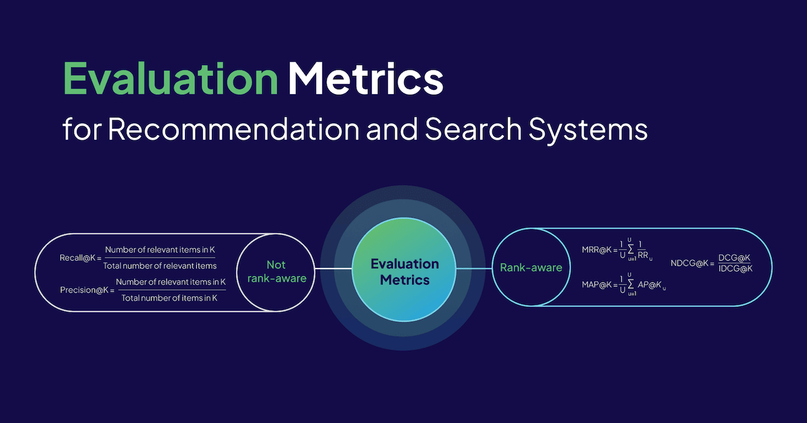
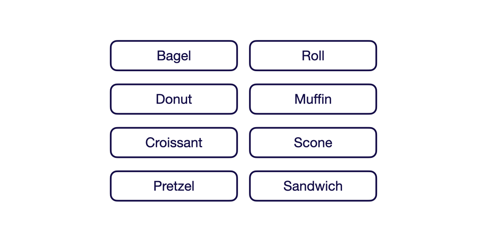
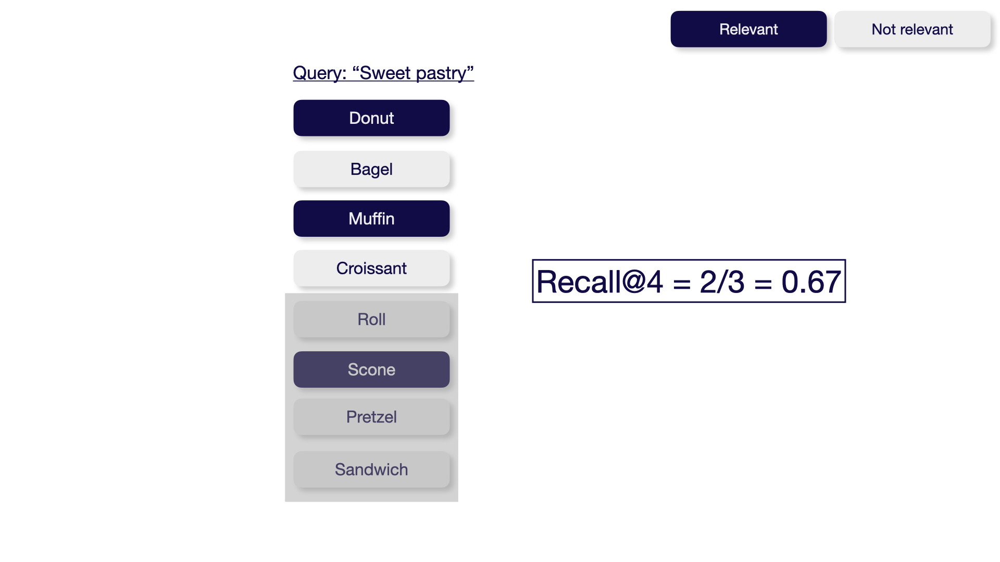
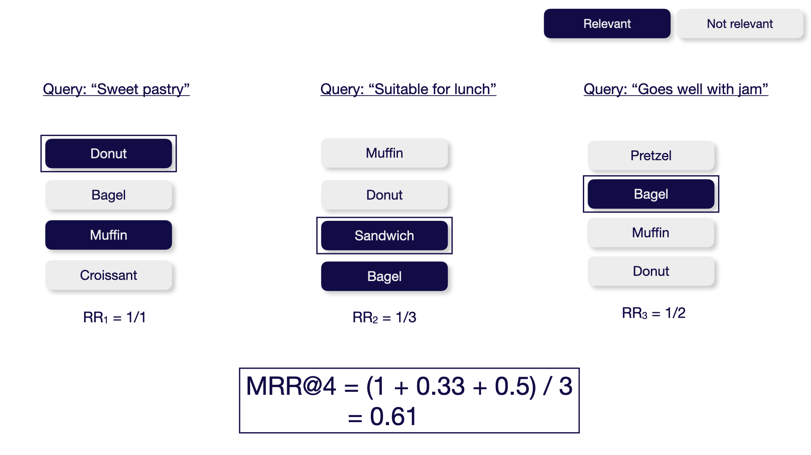
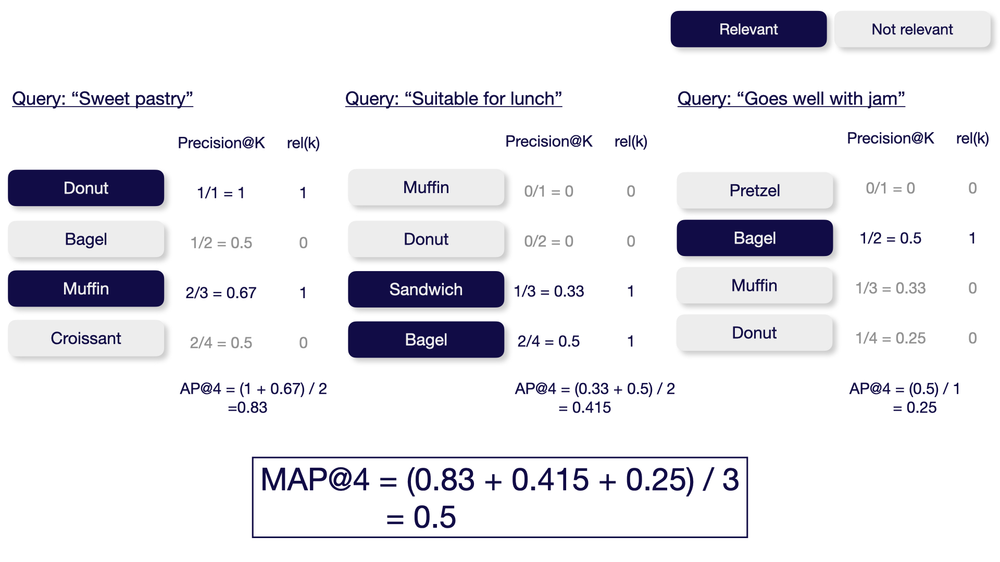
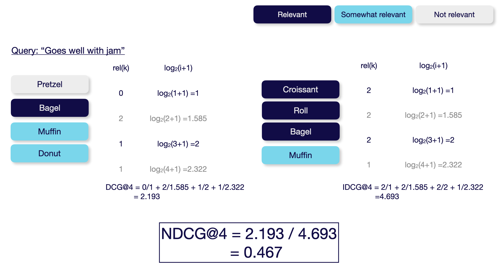

How do you evaluate the quality of your search results in a Retrieval-Augmented Generation (RAG) pipeline or in a recommendation system? While many new metrics are currently emerging to evaluate the quality of retrieved contexts for RAG pipelines, there are already established metrics to objectively measure information retrieval systems.

This article gives a comprehensive overview of commonly used evaluation metrics in search and recommendation systems. As recommendation systems can be viewed as a special case of information retrieval or search systems, similar metrics apply to both.

---

To explain how each of the following metrics is calculated, this article uses a minimal example dataset of eight pastries - to stay in line with the bagel example our colleagues used in their recent [discussion on how to choose and evaluate an embedding model](https://youtu.be/lpdN3aw-yTg?si=CHzV9zS_L2-rdUel) - as shown below.



We will use the [`pytrec_eval` Python package](https://github.com/cvangysel/pytrec_eval) to showcase how you can evaluate your retrieval or recommendation pipelines in your code. Check out the code in the [related GitHub repository](https://github.com/weaviate/recipes/blob/main/evaluation/evaluation_metrics_information_retrieval.ipynb).

> `pytrec_eval` is a Python interface to TREC's evaluation tool, [trec_eval](https://github.com/usnistgov/trec_eval). It is an attempt to stop the cultivation of custom implementations of Information Retrieval evaluation measures for the Python programming language.
> 

To use the `pytrec_eval` package, you can simply pip install it.

```python
pip install pytrec_eval
```

## Metrics to Evaluate Information Retrieval Systems

This section covers the most popular offline metrics for evaluating information retrieval systems, such as search and recommendation systems. It explores [precision@K](#precision), [recall@K](#recall), [MAP@K](#mean-average-precision-map), [MRR@K](#mean-reciprocal-rank-mrr), and [NDCG@K](#normalized-discounted-cumulative-gain-ndcg).

As you might have noticed, all of these metrics end with “@K” (pronounced: “at K”). This simply means we are only evaluating the top K results. 

All of the following metrics can take values between 0 and 1, where higher values mean better performance. 

Additionally, the following evaluation metrics can be categorized into not rank-aware vs. rank-aware metrics. While not rank-aware metrics, such as precision and recall, only reflect the **number** of relevant items in the top K results, rank-aware metrics, such as MAP, MRR, and NDCG, consider the **number** of relevant items and their **position** in the list of results.

### Precision

The **precision@K** metric measures how many of the retrieved items are relevant. This metric is not rank-aware and thus only considers the number of relevant results but not their order. You can calculate precision@K by dividing the number of relevant items within the top K results by K. 

$$
\text{Precision@K} = \frac{TP}{TP+FP}= \frac{TP}{K}
=\frac{\text{Number of relevant items in K}}{\text{Total number of items in K}}
$$


With `pytrec_eval` you can evaluate your search results as follows:

```python
import pytrec_eval

qrel = {
    'sweet pastry' : {
        'donut' : 1,
        'muffin' : 1,
        'scone' : 1, 
    },
}

run = {
    'sweet pastry' : {
        'donut' : 0.95,
        'bagel' : 0.9,
        'muffin' : 0.8, 
        'croissant' : 0.7, 
    },
}

evaluator = pytrec_eval.RelevanceEvaluator(qrel, {'P.4'})
results = evaluator.evaluate(run)
```

```json
{
 "sweet pastry": {
  "P_4": 0.5,
 },
}
```

### Recall

The **recall@K** metric measures how many relevant items were successfully retrieved from the entire dataset. This metric is not rank-aware and thus only considers the number of relevant results but not their order. You can calculate the recall@K by dividing the number of relevant items within the top K results by the total number of relevant items in the entire dataset. 

$$
\text{Recall@K} = \frac{TP}{TP+FN}
=\frac{\text{Number of relevant items in K}}{\text{Total number of relevant items}}
$$



With `pytrec_eval` you can evaluate your search results as follows:

```python
evaluator = pytrec_eval.RelevanceEvaluator(qrel, { 'recall.4' })
results = evaluator.evaluate(run)
```

```json
{
 "sweet pastry": {
  "recall_4": 0.6666666666666666
 },
}
```

### Mean Reciprocal Rank (MRR)

The **Mean Reciprocal Rank@K (MRR@K)** metric measures how well the system finds a relevant result as the top result. This metric only considers the order of the first relevant results but not the number or order of the other relevant results. You can calculate the MRR@K by averaging the Reciprocal Ranks (RR) across multiple queries (in case of information retrieval) or users (in case of recommendations) `U` in the evaluated dataset.

$$
\text{MRR@K} = \frac{1}{U}\sum_{u=1}^{U}\frac{1}{\text{RR}_u}
$$

The Reciprocal Rank is calculated as follows:

$$
\text{RR} = \frac{1}{\text{Rank of the first relevant item}}
$$



Note that the MRR metric is not available in the `pytrec_eval` package as of this writing.

### Mean Average Precision (MAP)

The **Mean Average Precision@K (MAP@K)** metric measures the system's ability to return relevant items in the top K results while placing more relevant items at the top. You can calculate the MAP@K metric by averaging the average precision at K across multiple queries (in case of information retrieval) or users (in case of recommendations) `U` in the evaluated dataset.

$$
\text{MAP@K} = \frac{1}{U}\sum_{u=1}^{U}AP@K_u
$$

The average precision@K (AP@K) metric measures the precision values at all the relevant positions within K and averages them.

$$
\text{AP@K} = \frac{1}{N}\sum_{k=1}^{K}\text{Precision(k)}\times \text{rel(k)}
$$



This is also the default metric used in the [Massive Text Embedding Benchmark (MTEB) Leaderboard](https://huggingface.co/spaces/mteb/leaderboard) for the **Reranking** category.

With `pytrec_eval` you can evaluate your search results as follows. 

```python
qrel = {
    'sweet pastry' : {
        'donut' : 1,
        'muffin' : 1,
    },
}

run = {
    'sweet pastry' : {
        'donut' : 0.95,
        'bagel' : 0.9,
        'muffin' : 0.8, 
        'croissant' : 0.7, 
    },
}

evaluator = pytrec_eval.RelevanceEvaluator(qrel, { 'map_cut.4'})
results = evaluator.evaluate(run)
```

```json
{
    "sweet pastry": {
        "map_cut_4": 0.8333333333333333
    }
}
```

Note that the `pytrec_eval` package doesn’t take average across multiple queries. 

### Normalized Discounted Cumulative Gain (NDCG)

The **Normalized Discounted Cumulative Gain@K (NDCG@K)** metric measures the system's ability to sort items based on relevance. In contrast to the above metrics, this metric requires not only **if** a document is relevant but also **how** relevant it is (e.g., relevant vs. somewhat relevant vs. not relevant).

You can calculate the NDCG@K by calculating the discounted cumulative gain (DCG) and then normalizing it over the ideal discounted cumulative gain (IDCG).

$$
\text{NDCG@K} = \frac{\text{DCG@K}}{\text{IDCG@K}}
$$

The DCG is calculated as follows:

$$
\text{DCG@K} = \sum_{k=1}^K\frac{\text{rel}_i}{\log_2(i+1)}
$$



This is the default metric used in the [MTEB Leaderboard](https://huggingface.co/spaces/mteb/leaderboard) for the **Retrieval** category.

With `pytrec_eval` you can evaluate your search results as follows:

```python
qrel = {
    'goes well with jam' : {
        'bagel' : 2,
        'croissant' : 2,
        'roll' : 2,
        'scone' : 1,
        'muffin' : 1,
        'donut' : 1,
    },
}

run = {
    'goes well with jam' : {
        'pretzel' : 0.9,
        'bagel' : 0.85,
        'muffin' : 0.7, 
        'donut' : 0.6, 
    },
}

evaluator = pytrec_eval.RelevanceEvaluator(qrel, { 'ndcg_cut.4', })
results = evaluator.evaluate(run)
```

```json
{
    "goes well with jam": {
        "ndcg_cut_4": 0.4672390440360399
    }
}
```

## Summary

This article gave a brief overview of the most popular evaluation metrics used in search and recommendation systems: Precision@K, recall@K, MRR@K, MAP@K, and NDCG@K. We have also discussed that MAP@K is most popular for evaluating recommendation systems, while NDCG@K is highly popular for evaluating retrieval systems.
Additionally, you have learned how to calculate each of these metrics and how to implement their calculation in Python with the `pytrec_eval` library. You can review the implementation details by checking out the code in the [related GitHub repository](https://github.com/weaviate/recipes/blob/main/evaluation/evaluation_metrics_information_retrieval.ipynb).

import WhatNext from '/_includes/what-next.mdx';

<WhatNext />
