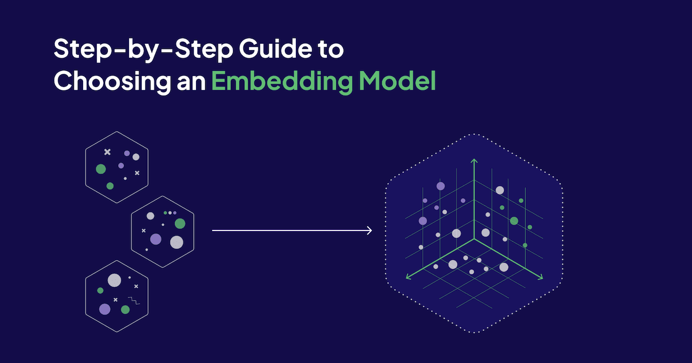
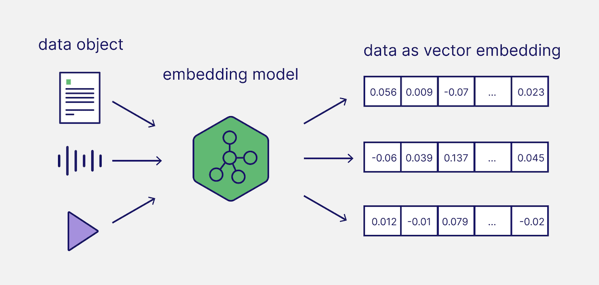
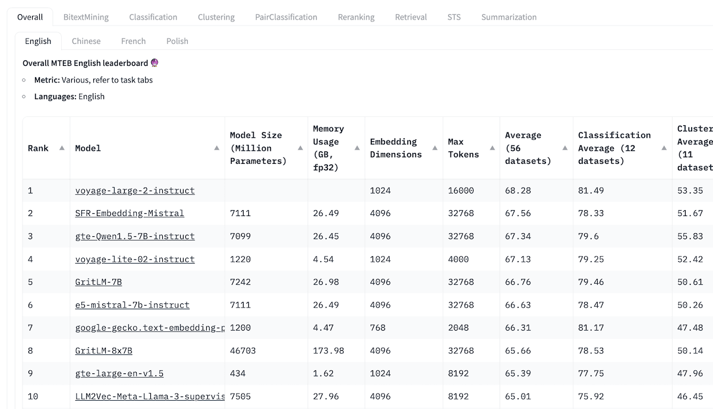

[Vector embeddings](/blog/vector-embeddings-explained) power modern search and Retrieval-Augmented Generation (RAG) applications. Embeddings capture the semantic meaning of data objects (e.g., text) and represent them in an array of numbers. In today’s Generative AI applications, these vector embeddings are typically generated with so-called embedding models.



As a [vector database](/blog/what-is-a-vector-database) that stores vector embeddings and retrieves data objects based on vector search, Weaviate has many [integrations with various model providers and their wide variety of embedding models](/developers/weaviate/model-providers). 

But how do you approach selecting the right embedding model for your search or RAG application? As you will learn in this article, it depends on your use case and specific requirements.

## Step 1: Identify your use case

Would a general-purpose model be sufficient for what you are trying to achieve, or do you have specific needs, such as modality (e.g., text only or multimodal), subject domain (e.g., coding, law, medical, multilingual, etc.), and deployment mode? In most cases, starting with a general-purpose model for your desired modalities would be a sensible baseline.

## Step 2: Select a baseline model

The [Massive Text Embedding Benchmark (MTEB) Leaderboard](https://huggingface.co/spaces/mteb/leaderboard) is a good starting point for getting an overview of the current landscape of the wide range of proprietary and open source text embedding models. For each embedding model, the MTEB lists various metrics, such as the model size, memory usage, embedding dimensions, maximum number of tokens, and its score for tasks such as retrieval, summarization, etc.

Here are a few considerations for choosing the best model for your application:

- **Task:** On the top of the MTEB Leaderboard, you will see various tabs. You first have to decide whether you want an all-rounder or if you can find a task (classification, clustering, retrieval, summarization, etc.) that matches your specific use case. For example, if you are building an RAG application, you might want to look closer at the “Retrieval” task. You might also want to refine your selection if you have more specific needs, such as a specific language (e.g., English, Chinese, French, Polish) or domain (e.g., law).
- **Score**: This will show you how well the model performs on a specific benchmark dataset or across multiple benchmark datasets. Depending on the task, different [evaluation metrics](/blog/retrieval-evaluation-metrics/) are used. Usually, these metrics can take values between 0 and 1, where higher values indicate a better performance.
- **Model size and memory usage:** These give you an idea of the computational resources required to run the model. While retrieval performance scales with model size, it is important to note that model size also directly impacts latency. Additionally, it is worth mentioning that larger models can also overfit and thus underperform in production. Thus, you want to aim for a good latency-performance trade-off for a production setup. Ideally, start with a small, lightweight model to be able to build a baseline upon which you can iterate quickly. Once your pipeline works, you can switch out the model with a bigger and more performant one later.
- **Embedding dimensions**: This is the length of the embedding vector. While larger embedding dimensions can capture more nuanced details and relationships in the data, they aren't necessarily always better. Do you really need 2048 dimensions to chat with a PDF? Probably not. On the other hand, smaller embedding dimensions offer faster inference and are more storage- and memory-efficient. Thus, you will want to aim for a good trade-off between capturing the complexity of data and operational efficiency.
- **Max tokens**: This is the maximum number of tokens that can be converted into a single embedding. For common RAG applications, a good chunk size for an embedding is typically about a single paragraph of text or less. In this case, models with max tokens of 512 should be sufficient. However, there will be special cases where you need to embed longer source texts that require models with a larger context window.



## Step 3: Evaluate the model on your use case

While the MTEB Leaderboard is a great place to start, you should take its results cautiously and skeptically. Bear in mind that these results are self-reported. It is also possible that some models produce inflated performance scores, as they may include the MTEB datasets in their training data since they are publicly available. Finally, the datasets the models are benchmarked on might not accurately represent the data you are dealing with. Thus, we recommend that you evaluate the embedding model on your own dataset, as we will show you below. You can find the related code in our [recipes GitHub repository](https://github.com/weaviate/recipes/blob/main/evaluation/how_to_choose_an_embedding_model.ipynb).

### Prepare dataset

For this, you could generate a small, hand-labeled dataset with 50 to 100 data objects and see what performance you can achieve. We will create a minimal dataset with eight different pastries to follow the example used in [Zain and JP’s discussion](https://youtu.be/lpdN3aw-yTg?si=6-gC0ql-m0KMf3Qh) and our [previous blog post on evaluation metrics](/blog/retrieval-evaluation-metrics/). You can find the .csv file in the [related GitHub repository](https://github.com/weaviate/recipes/blob/main/evaluation/how_to_choose_an_embedding_model.ipynb).

| pastry_id | pastry_name | pastry_description |
| --- | --- | --- |
| 1 | Bagel | A classic round bread with a chewy interior and a golden crust, perfect for toasting or topping with cream cheese, smoked salmon, or your favorite spreads. |
| 2 | Roll | Soft and pillowy, these rolls are versatile companions to any meal. Enjoy them fresh out of the oven or sliced for sandwiches, filled with your choice of meats, cheeses, and veggies. |
| 3 | Donut | Indulge in these sweet, fried delights. Glazed, powdered, or filled with decadent creams and fruit jams, each bite is a delightful burst of flavor and nostalgia. |
| 4 | Muffin | Moist and tender, these muffins are bursting with flavor. Whether you prefer classic blueberry, indulgent chocolate chip, or hearty bran, there's a muffin for every craving. |
| 5 | Croissant | Buttery layers of flaky pastry are folded to perfection, creating a delicate and irresistible treat. Enjoy them plain, stuffed with savory fillings, or paired with your favorite coffee. |
| 6 | Scone | Crumbly yet tender, these scones are the epitome of comfort. Enjoy them plain or studded with fruits, nuts, or chocolate chips, accompanied by a dollop of clotted cream and jam. |
| 7 | Pretzel | Crunchy on the outside, soft on the inside, these pretzels are a salty snack lover's dream. Enjoy them twisted into traditional shapes or dipped in sweet or savory toppings for a delightful twist. |
| 8 | Sandwich | Freshly baked bread is the foundation for these hearty sandwiches. Pile on layers of meats, cheeses, crisp vegetables, and flavorful spreads for a satisfying meal on the go. |

### Create embeddings

Now, let’s generate and store the corresponding vector embeddings in our Weaviate vector database. For this, you will first connect to a Weaviate client in [embedded mode](https://weaviate.io/developers/weaviate/installation/embedded) for simplicity ([but you can instantiate a Weaviate client locally or use our managed cloud service](https://weaviate.io/developers/weaviate/installation)). 

```python
import weaviate
import os

# Connect to Weaviate client in embedded mode for simplicity
client = weaviate.connect_to_embedded(
	headers = {
		"X-OpenAI-Api-Key": os.environ["OPENAI_API_KEY"]
		}
)
```

Then, you will configure a data collection called `"Pastries"` and configure the properties and vectorizer. This example uses OpenAI’s `text-embedding-3-small` embedding model to vectorize the data at import and query time automatically. Note, that we will repeat this step later with `text-embedding-3-large` to compare the two models. For this, you might want to have a look at [how to delete a collection](/developers/weaviate/manage-data/delete.mdx).

```python
import weaviate.classes as wvc
from weaviate.classes.config import Property, DataType

# Create data collection
pastries = client.collections.create(
    name="Pastries",
    vectorizer_config=wvc.config.Configure.Vectorizer.text2vec_openai(model='text-embedding-3-small'),
    properties=[
        Property(name="pastry_name", data_type=DataType.TEXT),
        Property(name="pastry_description", data_type=DataType.TEXT),
    ]
)
```

Finally, you can import your data:

```python
# Import data objects
pastry_objects = list()
for _, row in df.iterrows():
    properties = {
        "pastry_name": row.pastry_name,
        "pastry_description": row.pastry_description
    }
    pastry_objects.append(properties)

pastries.data.insert_many(pastry_objects)
```

### Retrieve

Now, you can run a few queries:

```python
from weaviate.classes.query import MetadataQuery

response = pastries.query.near_text(
    query="Sweet pastry",
    limit=4,
    return_metadata=MetadataQuery(distance=True)
)
```

### Evaluate performance

This section compares two OpenAI embedding models, `text-embedding-3-small` and `text-embedding-3-large`, for three sample queries. Note that the desired outputs for each query are highly subjective. But this is exactly the point: You must decide what result you want for your use case.

Various [evaluation metrics](/blog/retrieval-evaluation-metrics/) are available, such as precision, recall, MRR, MAP, and NDCG. In this section, we will use precision and recall as evaluation metrics.

**Query 1: “Sweet pastry”**

Relevant items: Donut, Muffin, Scone (Note, that this list is subjective because we have decided what will be relevant for this query)

Results:

| Rank | text-embedding-3-small | text-embedding-3-large |
| --- | --- | --- |
| 1 | ✅Donut | ❌Croissant |
| 2 | ❌Croissant | ✅Donut |
| 3 | ❌Roll | ✅Scone |
| 4 | ❌Bagel | ❌Sandwich |
| Precision | 0.25 | 0.5 |
| Recall | 0.33 | 0.67 |

**Query 2: “Suitable for lunch”**

Relevant items: Sandwich, Bagel, Roll, Pretzel (Note, that this list is subjective because we have decided what will be relevant for this query)

Results:

| Rank | text-embedding-3-small | text-embedding-3-large |
| --- | --- | --- |
| 1 | ✅Sandwich | ✅Sandwich |
| 2 | ✅Roll | ✅Roll |
| 3 | ✅Bagel | ✅Bagel |
| 4 | ❌Scone | ❌Croissant |
| Precision | 0.75 | 0.75 |
| Recall | 0.75 | 0.75 |

**Query 3: “Goes well with jam”**

Relevant items: Bagel, Croissant, Roll (Note, that this list is subjective because we have decided what will be relevant for this query)

Results:

| Rank | text-embedding-3-small | text-embedding-3-large |
| --- | --- | --- |
| 1 | ❌Sandwich | ❌Scone |
| 2 | ✅Bagel | ✅Bagel |
| 3 | ❌Scone | ❌Donut |
| 4 | ✅Roll | ❌Sandwich |
| Precision | 0.5 | 0.25 |
| Recall | 0.67 | 0.33 |

Across the three example queries, both `text-embedding-3-small` and `text-embedding-3-large` result in an average precision of 0.5 and an average recall of 0.58, although they return different results for the queries. As you can see, you would need to increase both the number of data objects in the dataset and the number of queries to evaluate the embedding models. However, this small example should give you a good starting point for building your own evaluation pipeline.

## Step 4: Iterate

After you’ve built an initial pipeline for your use case with a small baseline model, you can experiment with a few different embedding models and see if you can perform better than your baseline choice.

## Optional Step: Fine-tuning

Fine-tuning an embedding model is only an optional step. Ideally, you can find a suitable model off the shelf, and fine-tuning might only be necessary for the last bit of performance squeeze. 

## Summary

This article is inspired by a recent discussion between [Zain](https://twitter.com/ZainHasan6) and [JP](https://twitter.com/_jphwang). It discussed the steps you can take to select the right embedding model for your search or Generative AI application. You can listen to the full discussion on YouTube and find the related code in our [recipes GitHub repository](https://github.com/weaviate/recipes/blob/main/evaluation/how_to_choose_an_embedding_model.ipynb).

<iframe width="560" height="315" src="https://www.youtube.com/embed/lpdN3aw-yTg?si=Wg-bHmgZK6Oa3cxz" title="YouTube video player" frameborder="0" allow="accelerometer; autoplay; clipboard-write; encrypted-media; gyroscope; picture-in-picture; web-share" referrerpolicy="strict-origin-when-cross-origin" allowfullscreen></iframe>

import WhatNext from '/_includes/what-next.mdx';

<WhatNext />
