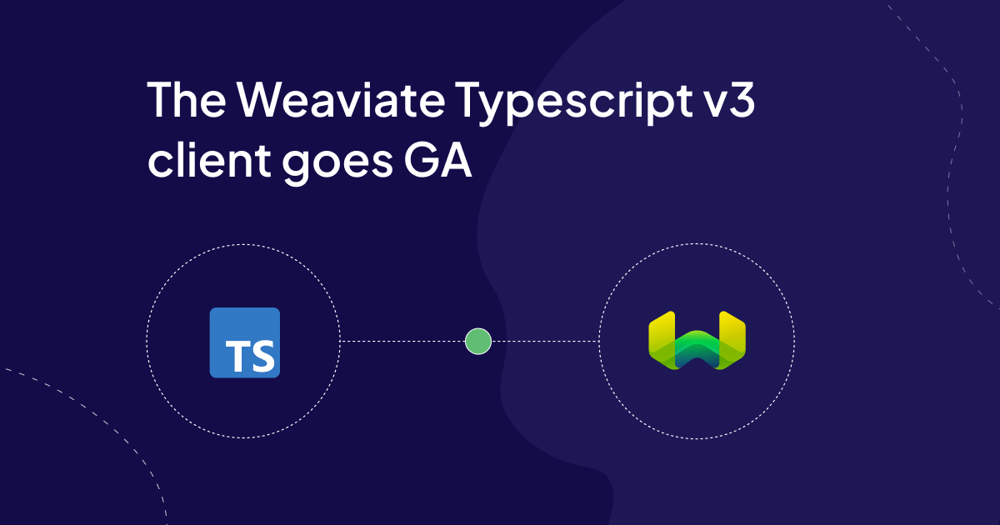

The new TypeScript client is now GA!!! After a successful beta phase, we are ready to share the best Weaviate TypeScript client yet. 

Not too long ago we released the [beta version](https://weaviate.io/blog/typescript-client-beta) of the Weaviate v3 Typescript client, an extremely well received release! After a successful beta, today we’re happy to share that the v3 Weaviate Typescript client is stable. We're even more excited to invest more in enabling the JavaScript ecosystem with this and subsequent releases.

To install the new client, run the following command in your terminal.

```bash
npm install weaviate-client # Or yarn add weaviate-client
```

As highlighted previously, following the release of a new Python client, we felt it necessary to dedicate time to serving the Javascript community. The v3 client is what came out; with a faster gRPC-powered API, first-class Typescript support and numerous quality-of-life improvements! Don't just take our word for it. We've had a wonderful group of early adopters building real applications and solving problems.

:::info Developer Experience First

"I’ve been enjoying the v3 client as it nears release! Lots of care is taken with matching the developer mental model, and developer experience if you use TypeScript. We’ve been migrating a production system and all the love and support from the Weaviate developers helps me sleep at night!" 

<br/>

Richard Rodger, CEO at [Voxgig](https://www.voxgig.com/). 

:::


With the client being out in the wild, we’re itching to see what you get to build!


## Changes since the beta

If you haven't already, take a look at the updates we introduced in the [v3 client beta](https://weaviate.io/blog/typescript-client-beta#providing-your-own-generics). Since the beta release, besides squashing bugs, we’ve got a lot of feedback on what we could do better and have changed the functionality of a few things. Namely

### Client connection methods

We've updated the client connection methods to make their names more intuitive. 

`connectToWeaviateCloud()` replaced `connectToWCS()`. We've also added `connectToLocal()` and `connectToCustom()` to make it easier to connect local and custom Weaviate instances.

Connecting to [Weaviate Cloud](https://console.weaviate.cloud/dashboard) looks like this with the new connection method. 

```ts
  const client = await weaviate.connectToWeaviateCloud(
    process.env.WEAVIATE_URL || '',
    {
      authCredentials: new weaviate.ApiKey(process.env.WEAVIATE_API_KEY || ''),
      headers: {
        'X-OpenAI-Api-Key': process.env.OPENAI_API_KEY || '',  
      }
    }
  )
```

### Vectorizer configuration

We've added the option to have multiple vectorizers to a collection definition. This leans on our approach to enable users create multiple vectors 

A collection definition with two properties and multiple vectorizers looks like this.

```ts
import weaviate from 'weaviate-client';
const { vectorizer, dataType } = weaviate.configure;

const newCollection = await client.collections.create({
  name: 'Article',
  properties: [
    {
      name: 'title',
      dataType: dataType.TEXT,
    },
    {
      name: 'body',
      dataType: dataType.TEXT,
    },
  ],
 // highlight-start
  vectorizers: [
    vectorizer.text2VecOpenAI({
      name: 'title_body',
      sourceProperties: ['title', 'body'],
    }), 
    vectorizer.text2VecCohere({
      name: 'body',
      sourceProperties: ['body']
    })
  ]
 // highlight-end
})
```

Notice `sourceProperties` in each vectorizer. With it, you can define what properties you want your vector to be created from.

The changes to the vectorizer configuration still let you define a single vectorizer as shown below.

```ts
import weaviate from 'weaviate-client';
const { vectorizer, dataType } = weaviate.configure;

const newCollection = await client.collections.create({
  name: 'Article',
  properties: [
    {
      name: 'title',
      dataType: dataType.TEXT,
    },
    {
      name: 'body',
      dataType: dataType.TEXT,
    },
  ],
 // highlight-start
  vectorizers: vectorizer.text2VecCohere()
 // highlight-end
})
```

### v2 backwards compatibility
To make the transition from v2 to v3 smoother, we've added backwards compatibility to the client. You can use the Weaviate v2 client as follows.

```ts
import { weaviateV2 } from 'weaviate-client'
```

This by design means you can have an application running both v3 and v2 code all from a single client; v3. Should you want to avoid any confusion with the default v3 import, we recommend renaming the import. This might be useful as you migrate your code base or test out v3 in a v2 project. 

```ts
import weaviateNext, { weaviateV2: weaviate } from 'weaviate-client'
```


### Collection reconfiguration 

We've refreshed the way you reconfigure collections.

```ts
import weaviate from 'weaviate-client';
const { vectorizer, vectorIndex } = weaviate.reconfigure;

const myCollection = client.collection.get('Article')

const config = await myCollection.config.update({
  vectorizers: vectorizer.update({
    name: 'body',
    vectorIndexConfig: vectorIndex.hnsw({ ef: 4 }),
  }),
})
```


## Using the client


### Updating your client

To update your application from a beta or RC version of the client, run the following command.

```bash
npm install weaviate-client@latest
```

You should have the latest version of the v3 client installed.

### Resources

To support your usage, we have put together the following resources

- [Migrate from v2 to v3](https://weaviate.io/developers/weaviate/client-libraries/typescript/v2_v3_migration)
- [JS/TS client v3](https://weaviate.io/developers/weaviate/client-libraries/typescript/typescript-v3)

A vast majority of our documentation has also been updated to support you as you build with the new client.

### Demo applications

You can also find some demo applications written in TypeScript and JavaScript below

- [QuoteFinder](https://github.com/weaviate/quote-finder)
- [NuxtVectorSearch](https://github.com/malgamves/nuxt-typescript-vector-search)


You might be thinking about upgrading your applications, we’ve put together a guide to help you navigate through your migration. Again, if there is anything you need please let us know. 


With the client released, we are now focused on supporting developers building AI Native Web Applications. 


## Weaviate v2 Support 

To bring performance and speed improvements to client, we opted to use gRPC for CRUD operations. This means the Weaviate v3 client can only be used to build server-side applications. Given the constraints this brings for people wanting a client-side package, we found it fitting to keep supporting the v2 client until we have a web version out.

We will support both the v2 and v3 clients and ship new Weaviate features to both. When this commitment to support both clients changes, we'll be sure to communicate it promptly. Our plan is to launch a web version of the client and gracefully sunset the v2 client.

## What's next 

As happy as we are about the client release, we won't slow down in our commitment to helping developers build AI-Native applications.

We're going to focus our energy on the following in the next few months.

- Improving client error messages 
- Releasing a web version of the v3 Typescript client 
- Improving the batching experience of the client


if you think there's something we should focus on. Please open an [issue](https://github.com/weaviate/typescript-client/tree/collections/main) on the client repo and let us know.


:::info Production Ready

"We are using Weaviate to power retrieval-augmented generation for Aimee, our platform for customizable human-like AI assistants. The ease-of-use of the database (be it local or in the cloud), as well as the TypeScript client, is unparalleled - just like the superb support." 

<br/>

Steffen Schreiber, CTO at [AccessPoint AI](https://www.accesspoint-ai.com/).

:::

We're really excited to share this with everyone and cannot wait to see what you all build. We've already seen so much interest in the client and want to support builders in any way we can. 


import WhatsNext from '/_includes/what-next.mdx';

<WhatsNext />
