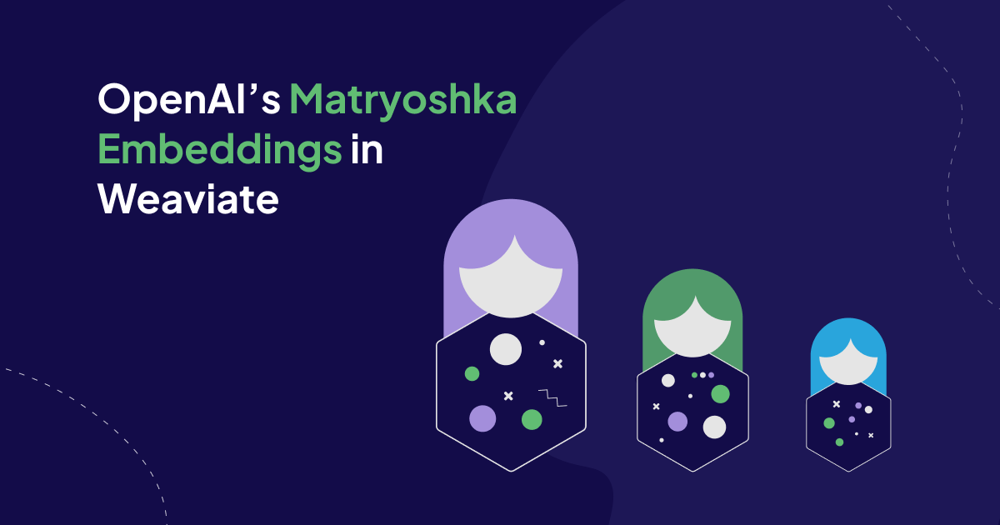
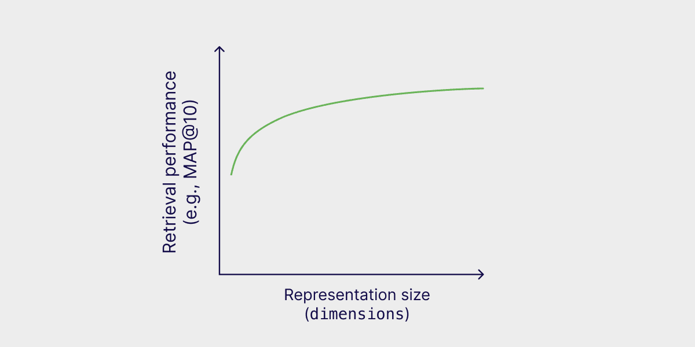

In [January, OpenAI released](https://openai.com/index/new-embedding-models-and-api-updates/) two new embedding models: `text-embedding-3-small` and `text-embedding-3-large`. These models are trained with the [Matryoshka Representation Learning](https://arxiv.org/abs/2205.13147) technique, which lets developers trade off performance and cost in embeddings.

Since then, we’ve discussed Matryoshka embeddings in various formats, such as in our 89th Weaviate podcast episode, [Matryoshka Embeddings with Aditya Kusupati, Zach Nussbaum, and Zain Hasan](https://youtu.be/-0m2dZJ6zos?si=dGO_jIfrKPAqHo-W), and in our [Weaviate paper review, Matryoshka Representation Learning](https://weaviate.io/papers/paper21).

This article briefly covers the fundamentals of Matryoshka Representation Learning and shows how to use the newly released OpenAI’s Matryoshka embedding models with the Weaviate vector database.

## What is Matryoshka Representation Learning?

[Matryoshka Representation Learning](https://arxiv.org/abs/2205.13147) is a technique used in training embedding models. It allows you to trade off a small amount of accuracy in exchange for much smaller embedding sizes. Thus, you can store more information at a lower cost and search for it faster.

The embeddings are shortened by removing dimensions from the end of the sequence and only using a subset of the dimensions of the embedding vector. For example, you can only use the first 8, 16, 32, etc. dimensions (or any other slice of dimensions) of a vector that originally had 1536 dimensions.

In contrast to common vector embeddings, where all dimensions are equally important, in Matryoshka embeddings, earlier dimensions store more information than dimensions later on in the vector, which simply adds more details. You can think of this by the analogy of trying to classify an image at multiple resolutions: The lower resolutions give more high-level information, while the higher resolutions add more details. 

Thus, the retrieval performance increases with increasing representation size. However, [OpenAI reported](https://platform.openai.com/docs/guides/embeddings/) that a `text-embedding-3-large` embedding can be shortened to a size of 256 while still outperforming an unshortened `text-embedding-ada-002` embedding with a size of 1536 on the MTEB benchmark. 



Retrieval performance over representation size for Matryoshka embeddings. (This image is based on Figure 7 in the [original Matryoshka Representation Learning paper.](https://arxiv.org/abs/2205.13147))

## Getting Familiar with OpenAI’s Matryoshka Embeddings

OpenAI has released two new models, `text-embedding-3-small` and `text-embedding-3-large`, which are trained using the [Matryoshka Representation Learning](https://aniketrege.github.io/blog/2024/mrl/) technique. The API of these models supports a `dimensions` parameter with which you can control the length of the resulting embedding.

If you embed the same text with the same model but with a different `dimensions` parameter, you can see that the shorter embedding is not the truncated version of the longer one. 

```python
# !pip install openai
from openai import OpenAI

openai = OpenAI()

def vectorize(text,
              dimensions,
              model = "text-embedding-3-small"):
   text = text.lower()

   return openai.embeddings.create(input = [text], 
                                   model = model, 
                                   dimensions = dimensions).data[0].embedding

example_text = "Learned representations are a central component in modern ML systems, serving a multitude of downstream tasks."

full = vectorize(example_text, dimensions = 1536)
short = vectorize(example_text, dimensions = 8)

print(full[:8])
print(short)
```

```
[-0.001463836757466197, -0.0241670124232769,  0.00683123804628849, -0.013936602510511875, 0.0320618636906147, 0.00872271228581667, 0.031053075566887856, 0.021820487454533577]
[-0.025210261344909668, -0.41620534658432007, 0.11764788627624512, -0.24001678824424744,  0.5521708130836487, 0.15022294223308563, 0.5347974300384521,   0.3757933974266052]
```

However, if you examine their cosine similarity, you can see that they are very similar (or even equal due to rounding).

```python
from sklearn.metrics.pairwise import cosine_similarity

cosine_similarity([full[:8]], [short])
```

```
array([[1.]])
```

If you take an even closer look, you can see that the embeddings actually only differ by a scaling factor (of 0.058 in this case).

```python
scale = full[0]/short[0]
print(scale)
print([x * scale for x in short])
print(full[:8])
```

```
0.05806511632065122
[-0.001463836757466197, -0.0241670118626955, 0.006831238201508919, -0.01393660272831134, 0.03206186249057062, 0.008722712614794586, 0.031053074983168057, 0.021820487334108546]
[-0.001463836757466197, -0.0241670124232769, 0.00683123804628849, -0.013936602510511875, 0.0320618636906147, 0.00872271228581667, 0.031053075566887856, 0.021820487454533577]
```

---

Note that `text-embedding-3-large` and `text-embedding-3-small` differ in the length of the default embedding length:

- Default dimension for `text-embedding-3-small`: 1536
- Default dimension for `text-embedding-3-large`: 3072

Additionally, they do **not** produce compatible embeddings when sliced to the same size:

```python
large = vectorize(example_text, dimensions = 3072, model = "text-embedding-3-large")
small = vectorize(example_text, dimensions = 1536, model = "text-embedding-3-small")
print(large[:1536])
print(small)

cosine_similarity([large[:1536]], [small])
```

```
[0.011070899665355682,   0.014488349668681622, -0.021118611097335815, -0.011152755469083786, 0.011555208824574947, -0.0007622754783369601, ... ]
[-0.001463836757466197, -0.0241670124232769,    0.00683123804628849,  -0.013936602510511875, 0.0320618636906147,    0.00872271228581667,   ... ]
array([[-0.00149749]])
```

Note that if you need to change the embedding dimension after you generate it, you need to normalize the embedding dimensions. The [OpenAI documentation](https://www.notion.so/OpenAI-s-Matryoshka-Embeddings-in-Weaviate-6d6817039caa4012a4958ce1a0434670?pvs=21) explains this more fully. 

## Example: How to Use Matryoshka Embeddings in Weaviate

This section quickly guides you through the steps to use OpenAI’s Matryoshka embeddings with the Weaviate vector database.

First you need to pip install the relevant Python packages.

```python
pip install -U weaviate-client
```

Next, you need to setup a Weaviate vector database instance. For this example, you can [start up a local instance of Weaviate via Docker](/developers/weaviate/installation/docker-compose.md), as follows:
```powershell
docker run -p 8080:8080 -p 50051:50051 cr.weaviate.io/semitechnologies/weaviate:1.25.0
````

Once your vector database instance is up and running, you can connect to it as shown below:

```python
import weaviate

client = weaviate.connect_to_local()
```

### With default dimensions

As the OpenAI models are tightly integrated with Weaviate, you can use them through the `text2vec_openai` module, which enabled automatic vectorization of data at import and query time. You only need to define the model name and the dimensions. The `text2vec_openai`
module has some pre-defined dimensions. Available default dimensions for these models in Weaviate can be found [in our documentation](https://weaviate.io/developers/weaviate/model-providers/openai/embeddings#available-models) and are:
* `text-embedding-3-small`:  512, 1536
* `text-embedding-3-large`: 256, 1024, 3072

```python
from weaviate.classes.config import Property, DataType

# Define schema and create collection
my_collection = client.collections.create(
    name="MyCollection",
    vectorizer_config=wvc.config.Configure.Vectorizer.text2vec_openai(model='text-embedding-3-small',
                                                                      dimensions = 512,
                                                                      vectorize_collection_name=False,
),
    properties=[
        Property(name="text", 
                 data_type=DataType.TEXT,
                 vectorize_property_name=False,
),
    ]
)

# Insert single data object
my_collection.data.insert({
    "text": example_text,
})
```

### With custom dimensions

If you want to use Matryoshka embeddings with a different value for the `dimensions` parameter, you will need to manually generate the embeddings at import and query time.

```python
from openai import OpenAI
from weaviate.classes.config import Property, DataType

openai = OpenAI()

# Define function to embed text
def vectorize(text,
              dimensions,
              model = "text-embedding-3-small"):
   text = text.lower()

   return openai.embeddings.create(input = [text], 
                                   model = model, 
                                   dimensions = dimensions).data[0].embedding

# Define schema and create collection
my_collection = client.collections.create(
    name="MyCollection",
    properties=[
        Property(name="text", data_type=DataType.TEXT),
    ]
)

# Insert single data object
my_collection.data.insert(
        properties = {"text" : example_text},
        vector = vectorize(example_text, dimensions=128),
    )
```

## Summary

This article introduced you to the Matryoshka Representation Learning technique, used to shorten embeddings, and showcased how you can use them in the Weaviate vector database. 

You can learn more about Matryoshka embeddings in our [Weaviate paper review on Matryoshka Representation Learning](https://weaviate.io/papers/paper21) by [Zain](https://twitter.com/ZainHasan6) or in our 89th Weaviate podcast episode [Matryoshka Embeddings with Aditya Kusupati, Zach Nussbaum, and Zain Hasan](https://youtu.be/-0m2dZJ6zos?si=dGO_jIfrKPAqHo-W) with [Connor](https://twitter.com/CShorten30).

<iframe width="560" height="315" src="https://www.youtube.com/embed/-0m2dZJ6zos?si=sy8s6Vv_nQRGm9ml" title="YouTube video player" frameborder="0" allow="accelerometer; autoplay; clipboard-write; encrypted-media; gyroscope; picture-in-picture; web-share" referrerpolicy="strict-origin-when-cross-origin" allowfullscreen></iframe>

import WhatNext from '/_includes/what-next.mdx';

<WhatNext />
