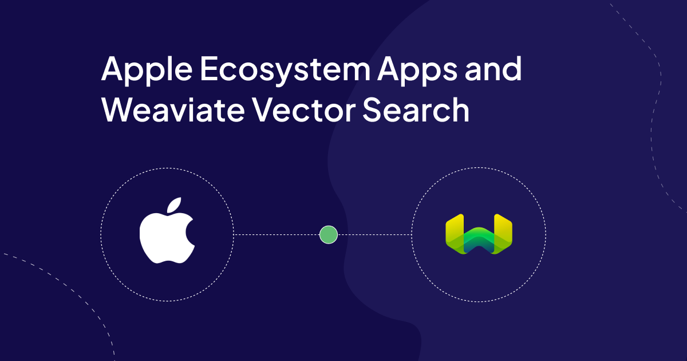

# Overview

Unfold the power of generative AI within your iOS and MacOS projects using Weaviate and Apple Dev Tools. This step-by-step guide will equip you to seamlessly integrate Weaviate's generative AI capabilities with Apple's development environment.

Inject a shot of Python power into your Xcode workflow for MacOS apps! Leverage Python scripting to streamline Weaviate database creation and tap into the vast potential of native Python frameworks - including frameworks that specialize in data science tasks.

Gain the ability to utilize generative AI models directly within your applications, unlocking innovative features and functionalities for yourself and your users.

This article assumes little or no working knowledge of python, generative AI or Weaviate.

# Resources

A number of articles and working code (Swift, SwiftUI and Python) are included to help you with your journey.

To run some of the code, you will need an OpenAI Key which you can get for free.

Instructions on how to do that can be found here.

https://www.howtogeek.com/885918/how-to-get-an-openai-api-key/

Each article is designed to be followed in the following sequence.

1. [IOS Intro - Search with Benefits](/apple-and-weaviate/apple-apps-part-1). A working IOS app using a live Weaviate Database.
1. [Unpacking Search Functionality](/apple-and-weaviate/apple-apps-part-2). Query a live Weaviate Database using Postman.
1. [Running Python on your Mac](/apple-and-weaviate/apple-apps-part-3). The basics on running python on your Mac.
1. [External Builder (Xcode) for Python](/apple-and-weaviate/apple-apps-part-4). Using Xcode External Builder to run python scripts.
1. [Create and Load Cluster](/apple-and-weaviate/apple-apps-part-5). Create and load a Weaviate Cluster.
Special Thanks

These articles are based on Adam Chan’s Book Recommendation project.

https://github.com/weaviate/BookRecs

Without his collaboration and support these articles would not have been possible.

import WhatsNext from '/_includes/what-next.mdx';

<WhatsNext />
