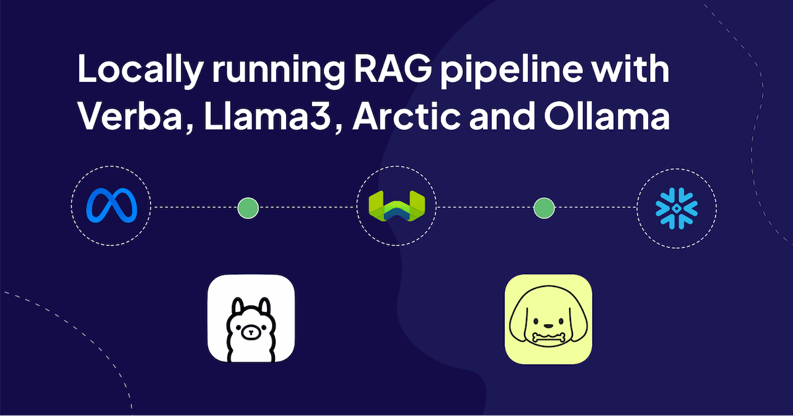
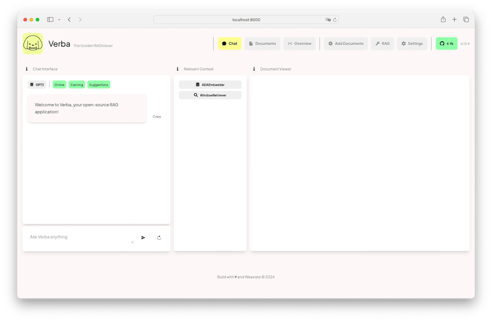
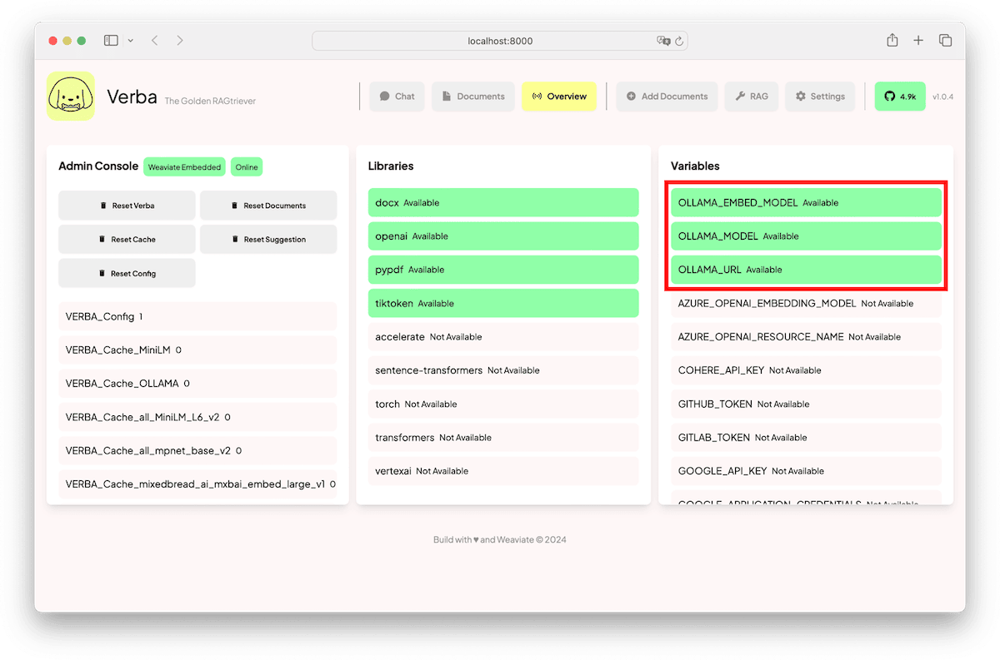
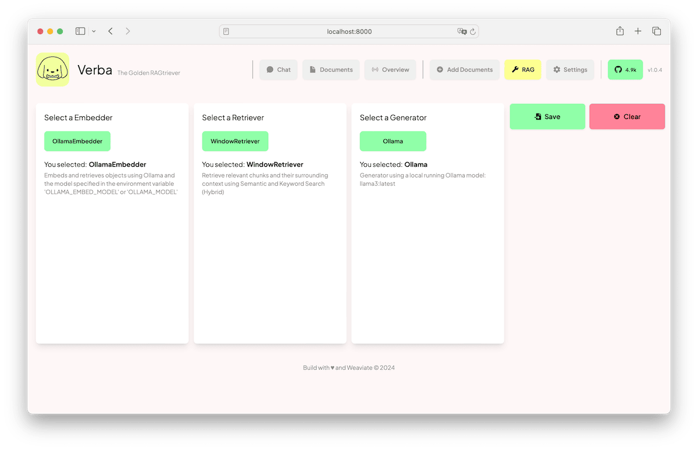
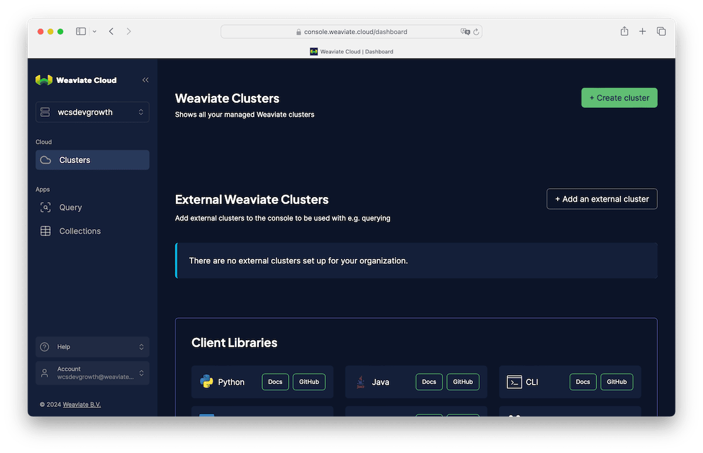
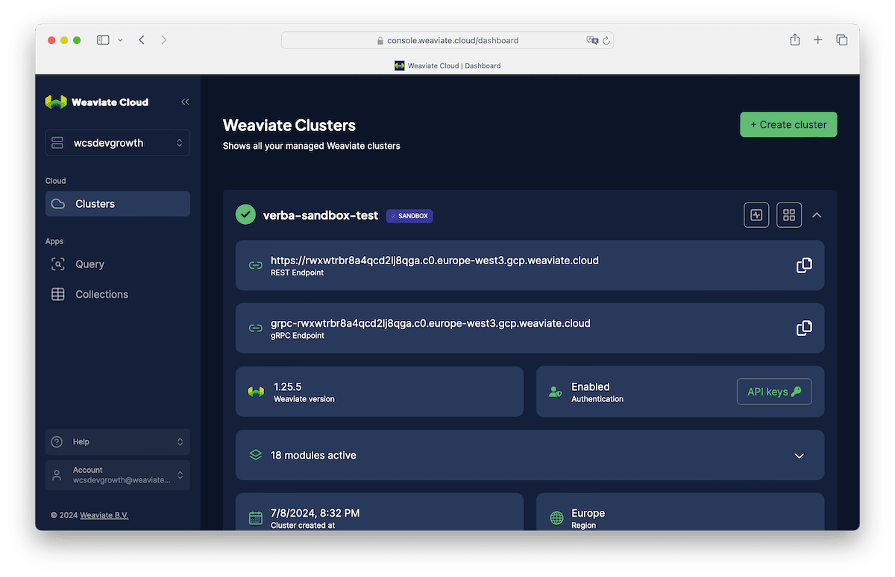
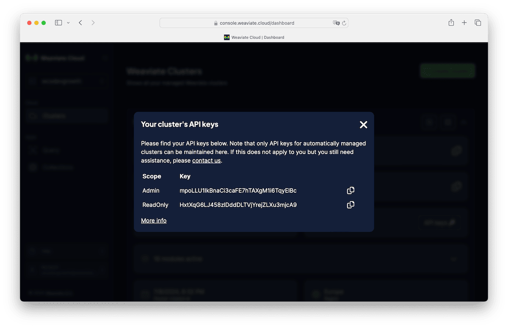

import OllamaPull from './img/OllamaPullLlama3.mp4';
import DocumentImportAndInference from './img/import-docs-and-do-inference.mp4';
import GenerateCluster from './img/GenerateCluster.mp4';

# Overview

We've been talking about RAG, or Retrieval Augmented Generation, for some time now. It's a common design pattern that developers are starting to implement into their applications to leverage the power of large language models with contextual data that wasn't part of a language models training dataset. There are many options you have when building your own RAG pipelines. At Weaviate, we've built Verba to showcase how you can get started, fast.

Verba is Weaviate's first party, best practices, RAG example that demonstrates a variety of chunking and retrieval techniques for building Retrieval Augmented Generation applications. In this blog post, we'll explore various methods on how we can run Verba, from running Verba locally with Weaviate Cloud, to running a local instance of Weaviate, and then connecting it all up to Ollama for local inference.

If you want to learn more about RAG and Verba, check out our blog post from March, [here](/blog/verba-open-source-rag-app).

Let's get started!

# Getting Verba Running

The Verba frontend is a NextJS application that talks to a FastAPI backend. There's a few ways to get the web application of Verba running locally, from cloning the repo and starting the front end and the back end separately, to using docker. The easiest way by far is installing it directly from [Pypi](https://pypi.org/project/goldenverba/) and then configuring it with environment variables locally.

First ensure your Python version is >=3.10.0. You can check your python version with:

    $ python3 --version


To install Verba from Pypi, we'll want to set up and activate a Python virtual environment.

    $ python3 -m venv venv
    $ source venv/bin/activate
    $ pip install goldenverba

Once those complete, you'll be able to start Verba running locally with:

    $ verba start

This will start a web server at port 8000, and if you point your browser to `localhost:8000`, you'll see Verba running on your local machine! 




:::note 
If you used Verba before, you may have noticed that Verba looks different! Verba continues to evolve in our Open Source ecosystem with developers like you! We welcome all sorts of contributions and community engagements to make Verba even better, if you have an idea, don't hesitate to create a GitHub issue for it and talk about it in our Community Slack!
:::


Under the hood, `verba start` looks for a `.env` environments file to configure Verba. Since we did not create any `.env` files yet, Verba defaults to loading an embedded instance of Weaviate locally on your computer as well. 

Embedded Weaviate is an experimental feature that runs an instance of Weaviate through your application code. It stores data on disk at some configurable location, so that even if your application code stops running, the data will persist. Learn more about Embedded Weaviate [here](/developers/weaviate/installation/embedded).

Embedded Weaviate is perfect if you're testing or prototyping with small datasets, but you may find that you are limited in how much data you can load into this embedded database, especially if the machine you're working on is also hardware constrained.

For now, we'll keep this configuration of Verba and Weaviate.


# Getting Ollama for Local inference

At this point, we have Embedded Weaviate running, along with Verba on your computer. We haven't connected any language models for Verba, the Golden RAGtriever to do inference with, so let's get that set up. We're going to use [Ollama](https://ollama.com/) which let's you download a quantized language model to run locally. Ollama also sets up a web server on your machine so that you can do inference through an API, much like you get when you do inference with OpenAI for example.

Download and install Ollama for your operating system [here](https://ollama.com/download). Once installed, you'll have the Ollama daemon running in the background and you'll be able to use the `ollama` command in the shell or Terminal to download and pull a language model. Let's download Llama 3:8B. You can do this by executing the following command in the shell:

    $ ollama pull llama3:latest

Your terminal will begin pulling Meta's Llama3 8B parameter model to your local machine.

<figure>
  <video width="100%" autoplay loop muted controls>
    <source src={OllamaPull} type="video/mp4" />
    Your browser does not support the video tag.
  </video>
  <figcaption>Ollama Pull in terminal</figcaption>
</figure>

Once complete, you'll have the language model available on your computer. You can use Llama3 8B in your terminal through ollama with the command `ollama run llama3:latest`. If you disconnect from the internet, you can continue doing inference entirely locally!

While we're still in the terminal, let's download an embedding model to help us generate vector embeddings of the data we'll load into Weaviate through Verba. We'll use [Snowflake Arctic Embed](https://ollama.com/library/snowflake-arctic-embed) to generating embeddings. You can download this embedding model also from Ollama with the following command:

    $ ollama pull snowflake-arctic-embed

This will download the Snowflake embedding model which we'll configure Weaviate ard Verba to use for generating the embeddings of our dataset so we can execute retrieval for augmenting our LLM generations.

# Enviroment Variable Configuration 

To use Ollama with Verba we need to apply some configuration through a `.env` environment variables file. 

Verba looks for a .env file and will use it as configuration. Some configurable paramaters include, but not limited to:
- Weaviate instance to use
- what embedding model to use
- what language model to use
- what endpoint the models are available at

For a full list of configurable features and details, please see the official [git repository for Verba](https://github.com/weaviate/Verba?tab=readme-ov-file#api-keys).

If you've been following along, you can copy the following into a `.env` file next to your virtual environment where you ran `verba start`. Let's configure our instance of Verba to use the following Configuration

```
OLLAMA_MODEL=llama3:latest
OLLAMA_EMBED_MODEL=snowflake-arctic-embed
OLLAMA_URL=http://localhost:11434
```

Once you do this, restart Verba, and load it back into your browser and you should see updated configuration parameters in the **Overview** page.




# Loading Data into Weaviate through Verba

With Verba configured with Ollama for inference and vectorization of your documents, let's go ahead and import some documents. 

Let's set up the RAG settings. Click on **RAG** at from the top nav. Ensure that the Ollama Embedder is selected, the Window Retriever is selected, and that Ollama is configured for Inference. Your RAG configuration should look like the following:



Once you click **Save**, Verba should redirect you back to the conversational interface. Now we have to add some documents for retrieval.

In the top nav again, select "Add Documents". On the far left, we can `Add Files` with the **Basic Reader**, which can import plain text, pdf, markdown, json and docx files. Select a small text or markdown file for experimentation. Let's leave everything in the middle pane alone for now, we can keep the defaults for the **Token Chunker**. On the third pane, ensure **Ollama Embedder** has been selected, and that it shows up green. Then click **Import**. This view will present some logs of Verba chunking the document and then generating the embeddings using the selected embedding model.

In the following video snippet, we walk through the above flow. We select Ollama for embedding creation and Ollama for inference, we've imported this blog post directly into Verba as a document and it generated 34 chunks. Once we saved the generator to use Ollama, Verba redirects us back to the conversational interface allowing us to chat with our docs.

<figure>
  <video width="100%" autoplay loop muted controls>
    <source src={DocumentImportAndInference} type="video/mp4" />
    Your browser does not support the video tag.
  </video>
  <figcaption>Document Import and Inference</figcaption>
</figure>

Notice how the generated response surfaces a response that has context of this blog post? That's the power of RAG!

So that's the foundation! You now have a full RAG pipeline running locally on your machine, using Weaviate for vector storage and retrieval, Ollama for inference, Snowflake's Arctic Embed for embedding generation, Llama3 for generation, and Verba tying it altogether.

In the next portion of this blog post, we're going to explore more robust deployment methods of Weaviate, while still using Ollama and Verba. 


# Alternative Deployment Methods for Weaviate

We've already explored Embedded Weaviate, so let's dive into a more reliable, production ready ways to use Weaviate. If you are unsure of the size of your use case, and don't want to manage additional compute resources, we recommend using Weaviate Cloud. You can create and use a free Weaviate Cloud Sandbox for 14 days. 

In the following section, we'll set up a free Weaviate Cloud Sandbox.

## Weaviate Cloud

Point your browser over to Weaviate Cloud at [https://console.weaviate.cloud/](https://console.weaviate.cloud/). Click on Sign Up if you don't have an account, and once you've completed the registration or auth flow, you'll be presented with the Weaviate Cloud Console Dashboard.




At the top right, click Create Cluster, give your sandbox a name, scroll down and acknowledge this is 100% free sandbox that expires in 14 days. With that said, you will be able to extend these once, but if you want to keep your data you'll have to export the data programmatically and then import it into a new Weaviate cluster when you're ready.


<figure>
  <video width="100%" autoplay loop muted controls>
    <source src={GenerateCluster} type="video/mp4" />
    Your browser does not support the video tag.
  </video>
  <figcaption>Generate a free Weaviate Sandbox</figcaption>
</figure>


Now that a cluster has been created, you can access the **REST Endpoint** and the **API Key**. Click on "Details" of your shiny new Weaviate sandbox from the Console Dashboard. You'll see the **REST Endpoint**, copy that into a text file for later. Then click on **API Keys**, this will produce a modal that exposes your Admin API Key. Don't let this get exposed in a git repo, or anywhere else! It's a sensitive key that allows you to connect to your private Weaviate Cluster!






We'll take these two parameters and update our `.env` environment variables file, make sure to replace the values with your own REST Endpoint and API Key.

```
WEAVIATE_URL_VERBA=<Insert-Your-REST-Endpoint>
WEAVIATE_API_KEY_VERBA=<Insert-Your-API-Key>
```

Now restart Verba, and you'll be set up. Verba will now use your free Weaviate sandbox from Weaviate Cloud!

Weaviate Clusters from Weaviate Cloud are designed to scale with you. To learn more about pricing on these Weaviate clutsers, check out our page on [Pricing](/pricing).

If you want to scale beyond what Weaviate Cloud offers, we recommend Weaviate Enterprise Cloud. Weaviate Enterprise Cloud is a Weaviate installation on dedicated compute resources on AWS, GCP, or Azure. These are great for large-scale production use cases without the complexities of self-management.

Bring Your Own Cloud allows us to work with your engineering teams to deploy Weaviate in your own VPCs and private compute resources on AWS, GCP, and Azure. We can provide support to help ensure your Weaviate resources are reliable, are operating smoothly, give recommendations when the compute resources may need to be increased, etc.

## Dockerized Weaviate

Weaviate Cloud is great, but there are reasons why you might want to manage the clusters and the compute resources yourself. Especially say you want to work with private and sensitive data. The power of open source gives you the flexibility to deploy Weaviate wherever you want, and however you want.

With Weaviate running in a Docker container, you'll have to manage which modules are enabled for your instance of Weaviate running in docker. For example, if you want to use OpenAI for vectorization, you'll have to ensure the `text2vec-openai` module is included in your docker configuration.

You can read more about docker-compose configuration from the documentation [here](https://weaviate.io/developers/weaviate/installation/docker-compose).

Once you've configured your docker-compose correctly, you can start Weaviate by running this command `$ docker-compose up -d` in the same directory as your docker-compose.yml file.

Then you can modify your verba configuration by updating the `.env` file with the following:

```
WEAVIATE_URL_VERBA=localhost:8080
```

This assumes you did not change the default port from 8080, and that you've enabled anonymous access.

:::note
It wasn't discussed in this blog post, but Weaviate can also be deployed in a Kubernetes environment with our Helm charts.
:::


That's a wrap! If you like [Weaviate](https://github.com/weaviate/weaviate) and [Verba](https://github.com/weaviate/verba), make sure to give the Open Source git repositories some love and star those repos!

If you have questions, come on by to our community Forum on Slack.

import WhatsNext from '/_includes/what-next.mdx';

<WhatsNext />
