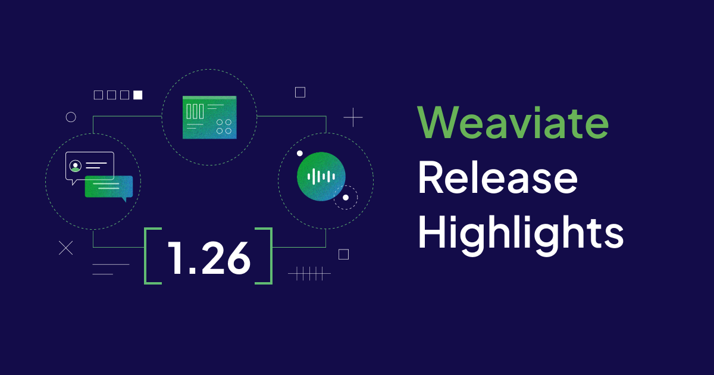

Weaviate `1.26` is here!

Here are the release ⭐️*highlights*⭐️!

- [**Improved Range Queries**](#improved-range-queries)
- [**Async Replication**](#async-replication)
- [**Module improvements**](#module-improvements)
- [**Multi target vector**](#multi-target-vector)
- [**Tenant offload to cloud storage**](#tenant-offload-to-cloud-storage)
- [**Async Python Implementation**](#async-python-implementation)
- [**Scalar Quantization**](#scalar-quantization)
- [**Dashboards for async indexes**](#dashboards-for-async-indexes)
- [**Additional changes**](#additional-changes)

## Improved Range Queries

Cool stuff goes here

## Async Replication

Cool stuff goes here

## Module improvements

Cool stuff goes here

## Multi target vector

Cool stuff goes here

## Tenant offload to cloud storage

Cool stuff goes here

## Async Python Implementation

Cool stuff goes here

## Scalar Quantization

Cool stuff goes here

## Dashboards for async indexes

Cool stuff goes here

## Additional changes

- Starting in Helm chart version 17.0.1, constraints on module resources are commented out to improve performance. To constrain resources for specific modules, add the constraints in your `values.yaml` file.

- The HNSW `maxConnections` value is updated. Instead of 64 connections, the HNSW graph now defaults to 32 connections.

 The lower value works better with modern ANN datasets that have high dimensionality. Testing shows that the QPS/recall curves improve with lower `maxConnections` values. The best values are in the 16-32 range, depending on dataset size. To improve target recall, `ef` can be increased.

## Summary

Enjoy the new features and improvements in Weaviate `1.26`. This release is available as a docker image and is coming soon to Weaviate Cloud [WCD](https://console.weaviate.cloud/).

Thanks for reading, see you next time 👋!
