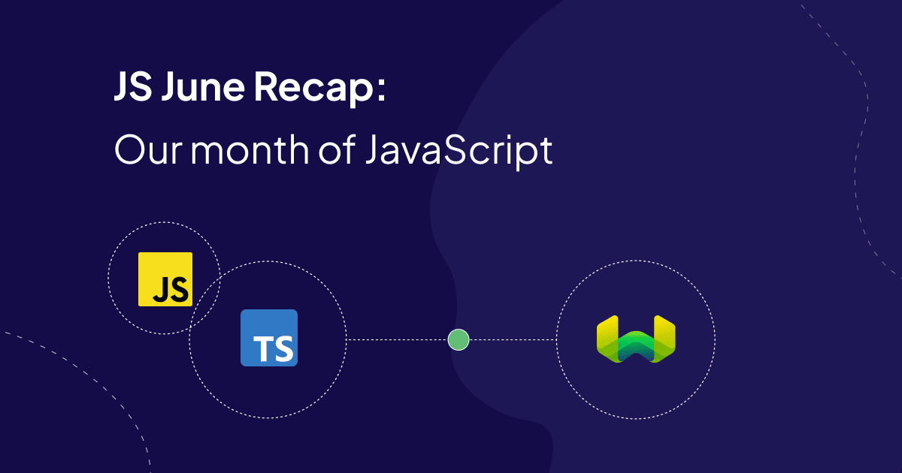
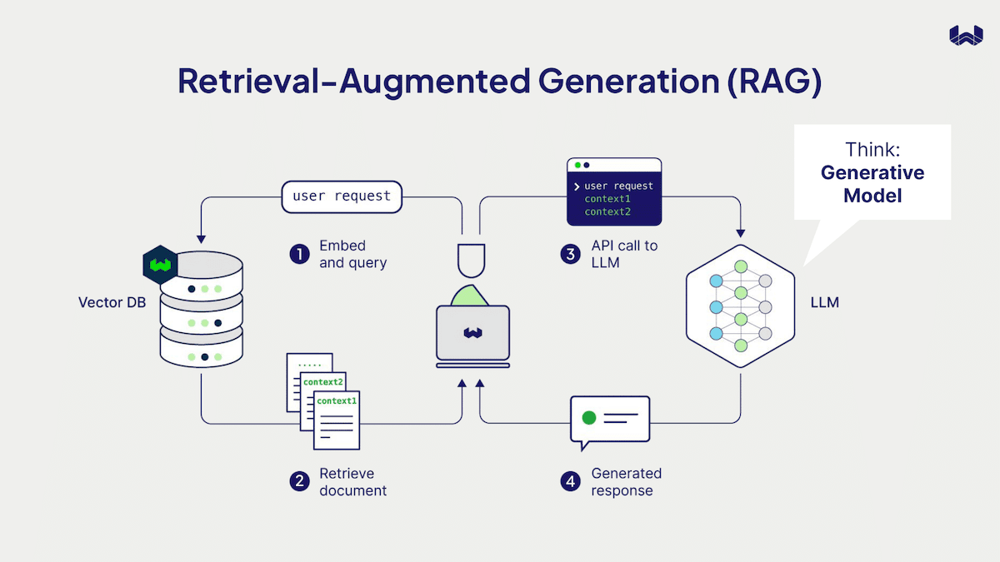
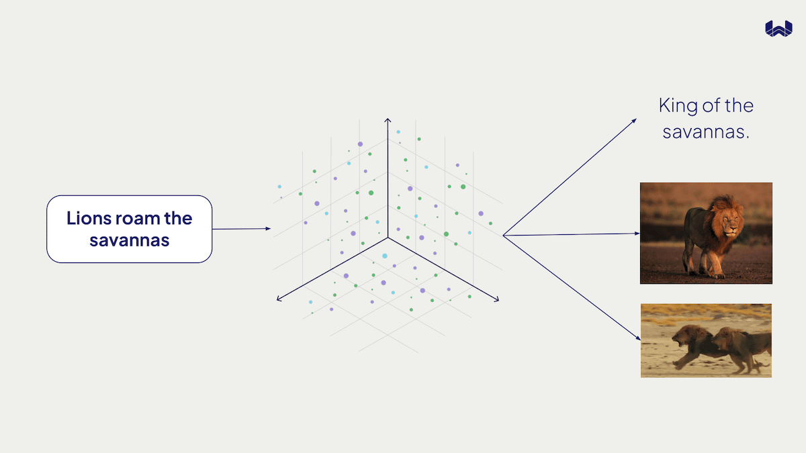
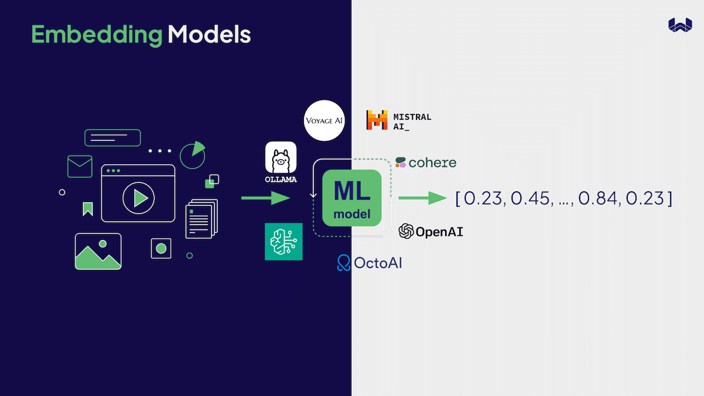
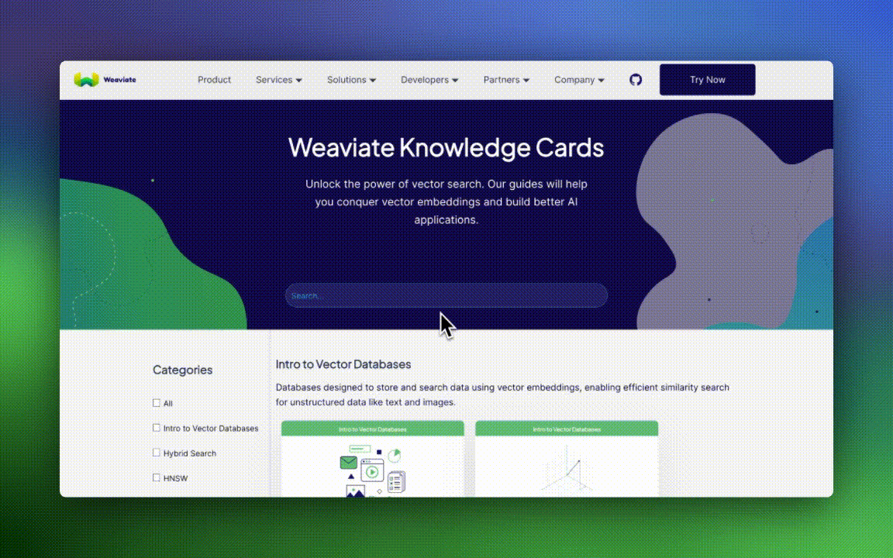

To celebrate the [Typescript v3 client release](https://weaviate.io/blog/typescript-client-stable-release), we held 3 events to showcase the new client to the JavaScript community and empower users building with it. We dedicated a month of webinars focused on people building with Angular, React and Vue.js.

Vector Databases are almost commonplace in most AI-Native applications in the Python ecosystem and are inching closer to doing the same in the JavaScript ecosystem. We’re committed to helping make that happen by showing developers the flexibility and versatility working with embeddings brings to building experience in products, AI-Native and beyond.

Here is how JS June contributed to this.

### Response: search is still relevant (pun intended)

RAG (Retrieval Augmented Generation) is an incredible technique to eliminate the shortcomings of LLMs. Search is a big part of that. We found that even outside of RAG, developers find so much value in being able to index data (structured or unstructured) and provide better search experience in the applications they build. Semantic and Hybrid search got a lot of people really beaming with ideas. Search stays relevant for use cases beyond RAG. 

### Websites need, nay, want vision! Hello multimodality

There is so much value in working with modalities beyond text. Engineers now understand the need to expand experiences by incorporating multiple modalities. Video, audio and image data can be notoriously hard to search through, let alone gather value from. [Vector databases](https://weaviate.io/blog/what-is-a-vector-database) make this easier. Judging from the number of people we see building things from transcription services to on platform image search in eCommerce, the only way is up. We had numerous engineers ask about storing vectors that represent multiple modalities.

### The fullstack (AI) engineer is here

We were awestruck by the depth of questions asked in our sessions. The tides are shifting! Outside of traditional questions in authentication, multi-tenancy, deployment, and the like. We saw engineers asking questions on context windows, embedding dimensions, model benchmarks to influence their solutions. If anything there is an appreciation for the flexibility and depth Weaviate provides, more so it showed that frontend Javascript engineers are growing and embracing the prospect of being AI engineers. 

We’re happy to help facilitate that growth! We know that AI can be daunting. More so, models and ML can be confusing, here is a [knowledge center](https://weaviate.io/learn/knowledgecards) with cards you can use to look up anything that might be confusing.

As always, our [client pages](https://weaviate.io/developers/weaviate/client-libraries/typescript/typescript-v3) remain a great place to start your Weaviate journey with JavaScript.

## Session Recordings

You can register for the on-demand webinar series [here](https://events.weaviate.io/js-june-24) to watch the session recordings!

## Code Examples

As a parting gift we have a couple things for our friends who build with Angular, React, and Vue.js.

#### Semantic Search and Generative Search for RAG
- [Vue.js](https://github.com/weaviate-tutorials/nuxt-vector-search)
- [React](https://github.com/weaviate-tutorials/next-vector-search)
- [Angular](https://github.com/weaviate-tutorials/angular-search)

#### Multimodal Search
- [Vue.js](https://github.com/weaviate-tutorials/nuxt-multimodal-search)
- [React](https://github.com/weaviate-tutorials/next-multimodal-search-demo)
- [Angular](https://github.com/weaviate-tutorials/angular-search)

Til the next one! Take care, stay curious! 

import WhatsNext from '/_includes/what-next.mdx';

<WhatsNext />
