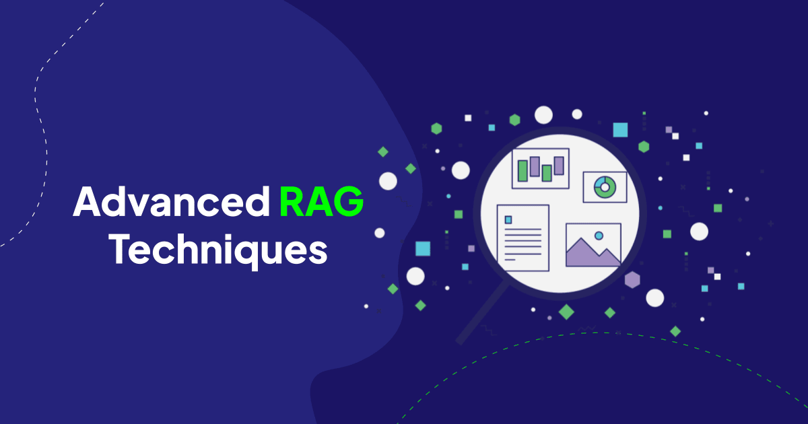

In this post we’ll dig into Retrieval-Augmented Generation (RAG) and show you practical tips and tricks to improve every part of the RAG pipeline! We’ll start by considering a a practical example: building a chatbot to emulate or assist a human doctor.

Consider the typical North American doctor. After over a decade of education and treating around 100,000 patients, they have a pretty vast, intricate knowledge base. When diagnosing a patient, they retrieve relevant information from this extensive experience to provide accurate and context-specific advice.

To create a chatbot using RAG that mimics this process, we need to replicate several key functions of a human doctor. First, we must establish a knowledge base equivalent to a doctor's decade of study and patient interactions. This knowledge base should allow efficient searching, retrieving only the most pertinent information based on the patient's current issue.

Next, our system must be capable of reasoning over the retrieved information, akin to a doctor discerning the relevant details for a specific case. Explainability is also crucial, particularly in regulated fields where understanding the reasoning behind a diagnosis or treatment recommendation is as important as the recommendation itself.

Moreover, the entire process must operate in real time. The system should handle patient queries, retrieve and reason over relevant knowledge, and provide actionable suggestions or diagnoses promptly.

The simplest approach might involve feeding patient information into a language model, which then generates responses based on pre-trained medical data. Enhancements include fine-tuning the model on specialized medical literature and employing advanced prompt engineering techniques to improve performance. 

However, the more sophisticated RAG approach involves integrating a comprehensive knowledge base—such as medical histories and literature—into a retrieval system. By indexing and querying this extensive database, we can supply the language model with precise, relevant information to augment its generation capabilities

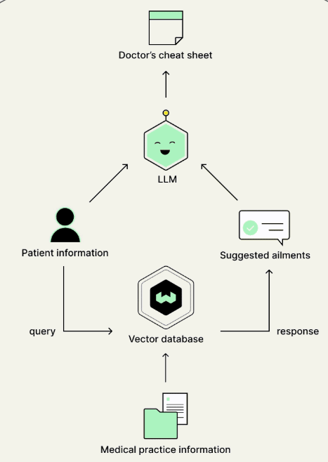

This is the simple RAG framework and for our purposes we will break this down into a three step process: indexing, retrieval and generation.

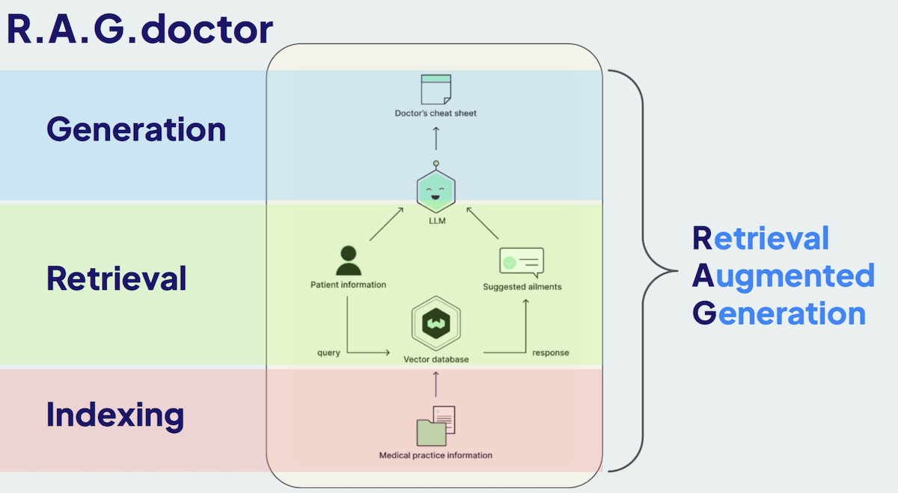

Throughout this post, we'll explore each component of the RAG stack and discuss how to refine and enhance them, using open-source libraries and resources. Whether you’re developing a chatbot for healthcare or other applications, these techniques are generally applicable and will help improve most RAG setups! 

Let's start!🚀

# Indexing

Effective indexing is critical for any RAG system. The first step involves how we ingest, chunk, and store the data. Let's explore some techniques to index data into a database, focusing on various methods for chunking text and leveraging metadata.

### Chunking Text

#### 1. Simple Chunking:

- **Overview**: This method involves breaking documents into fixed-size chunks with some overlap. This ensures that each chunk retains context from the previous chunk.
    
- **Implementation**: You can specify a chunk size (e.g., 35 characters) and an overlap size to maintain context across chunks. This approach works well for straightforward documents but might not be ideal for more complex texts and does not take advantage of the document structure at all.
    
- **Pros and Cons**: Simple to implement but may break semantic units, leading to incoherent chunks and poorer retrieval performance.

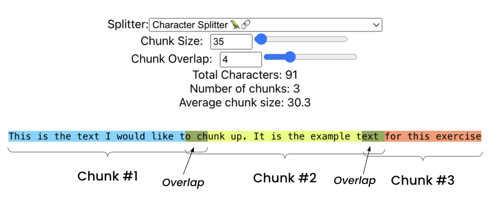
[Greg Kamradt (Data Indy)](https://github.com/FullStackRetrieval-com/RetrievalTutorials/blob/main/tutorials/LevelsOfTextSplitting/5_Levels_Of_Text_Splitting.ipynb) - Text Splitting

#### 2. Semantic Chunking:

- **Overview**: Semantic chunking involves dividing text based on meaning rather than fixed sizes. This technique ensures that each chunk represents a coherent piece of information.

- **Implementation**: Calculate the cosine distance between sentence embeddings. If two sentences are semantically similar (below a certain threshold), they belong in the same chunk. This creates variable-length chunks based on the content's semantic structure.

- **Pros and Cons**: Produces more coherent and contextually meaningful chunks, improving retrieval accuracy but requires forward passes through a BERT based encoder model which is more computationally intensive then simple chunking.

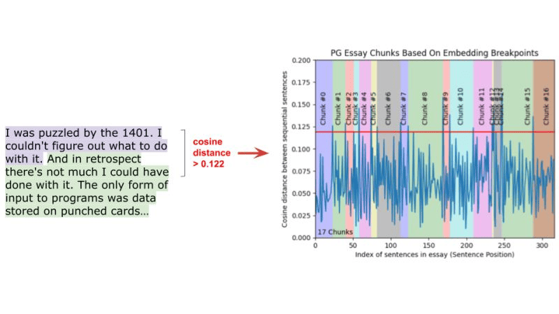
[Greg Kamradt (Data Indy)](https://github.com/FullStackRetrieval-com/RetrievalTutorials/blob/main/tutorials/LevelsOfTextSplitting/5_Levels_Of_Text_Splitting.ipynb) - Semantic Chunking

#### 3. Language Model-Based Chunking:

- **Overview**: This advanced method uses a language model to create self-contained propositions from text, ensuring that each chunk is semantically complete.
    
- **Implementation**: A language model (e.g., a 7-billion parameter model) processes the text, breaking it into propositions that make sense independently. The model then combines these propositions into chunks, balancing semantic completeness and context. This method is computationally intensive but provides the highest accuracy.
    
- **Pros and Cons**: Adapts to text nuances and results in high-quality chunks, but computationally intensive and may require fine-tuning for specific applications.

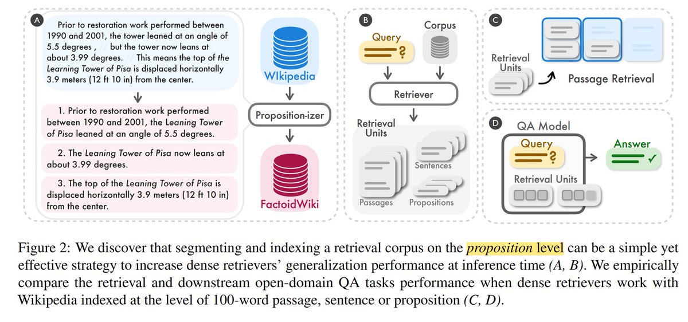
[Dense X Retrieval: What Retrieval Granularity Should We Use?](https://arxiv.org/abs/2312.06648)

Model: https://huggingface.co/chentong00/propositionizer-wiki-flan-t5-large

### Leveraging Metadata

#### 1. Adding and Filtering Based on Metadata:

- **Overview**: Metadata provides additional context that can significantly improve retrieval accuracy. By incorporating metadata like dates, patient age, and preconditions, you can filter irrelevant information during searches. Filtering helps in narrowing down the search space, making the retrieval process more efficient and relevant.

- **Implementation**: When indexing data, store metadata alongside the vectorized text. For instance, if indexing patient records, include metadata such as age, date of visit, and specific conditions. Use this metadata to filter search results, ensuring the system only retrieves relevant information.

For example, if a query relates to pediatric patients, filter out records of patients over 18 years old before performing the semantic search. This reduces the noise in retrieval results and enhances the relevance of the output.

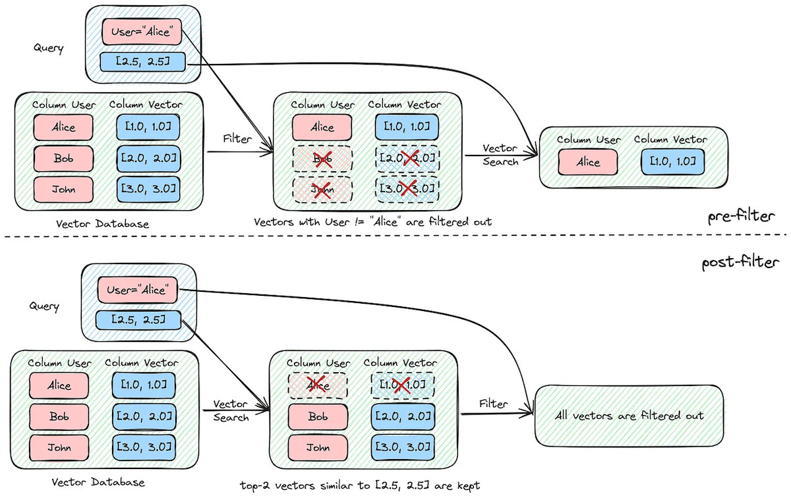
[MyScale](https://medium.com/@myscale/optimizing-filtered-vector-search-in-myscale-77675aaa849c)

#### 2. Using GLiNER to Generate Metadata for Chunks

You might not always have extensive metadata to augment your chunks with but using the GLiNER (Generalized Linear Named Entity Recognizer) model you can generate metadata from chunks on the go! GLiNER is a robust BERT based model that can be used to tag and label chunks during the ingestion phase to create metadata on the go. This can significantly improving the retrieval process.

- **Autolabeling with GLiNER**:
    **Implementation**: You can simply provide each chunk into GLiNER along with the tags you want to identify in the chunk. If the tags are found in the chunk text it will identify them if nothing matches with high confidence then tags wont be produced, reducing false positives! 
    
    **Pros and Cons**: Works quite well for general use but might require finetuning for niche and domain specific datasets and applications.

- **Query Parsing and Filtering**:
    **Implementation**: Another use for GLiNER is to parse incoming queries and match them against labeled metadata to filter results.
    
    **Pros and Cons**: Enhances retrieval accuracy by ensuring contextual relevance but adds an extra processing step.

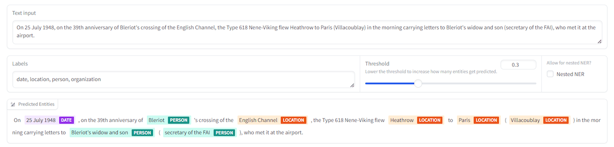
[GLiNER: Generalist Model for Named Entity Recognition using Bidirectional Transformer](https://arxiv.org/abs/2311.08526)
Demo: https://huggingface.co/spaces/urchade/gliner_multiv2.1

These techniques lay the groundwork for a robust RAG system, enabling efficient retrieval from large datasets. The choice of chunking method and the use of metadata will depend on the specific requirements and characteristics of your dataset.

# Retrieval

Now let's discuss the R part of the RAG setup! How can we enhance retrieval recall from a vector database? This process is all about retrieving as many of the documents relevant to a query, significantly improving the chances the LLM can then produce high quality results. Here are several techniques to achieve this:

### 1. Hybrid search

Vector search which captures the semantic meaning of the query and keyword search which identifies exact matches for specific terms. Hybrid search combines the strengths of vector search and keyword search to enhance retrieval accuracy. In fields like medicine, many terms and concepts are not semantically understood but are instead specific keywords such as medication names, anatomical terms, disease names, and diagnoses.

Pure vector search might miss these critical keywords, whereas keyword-based search ensures that specific, important terms are considered. By integrating both methods, hybrid search allows for a more comprehensive retrieval process.

These search, vector and keyword, methods run in parallel, and the results are then merged and ranked according to a weighted system. For instance, using Weaviate, you can adjust the alpha parameter to balance the importance of vector versus keyword search results, creating a combined, ranked list of documents. This balances precision and recall, improving overall retrieval quality but requires careful tuning of weighting parameters.

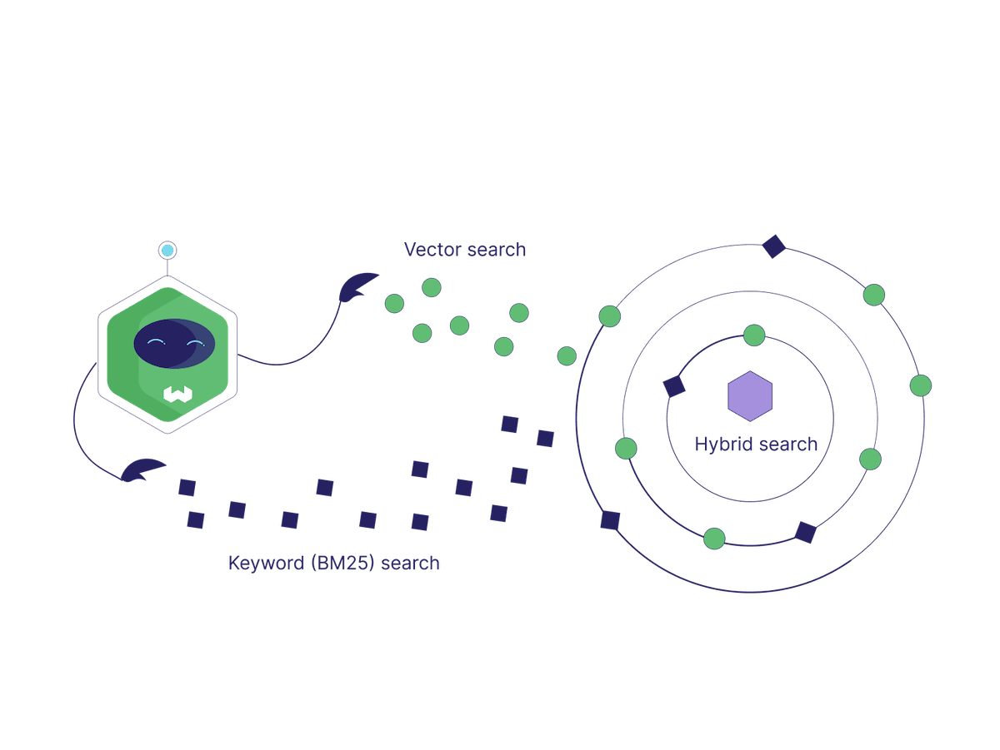

### 2. Query rewriting

Query rewriting acknowledges that human queries may not be optimized for vector databases or language models. By leveraging a language model to rewrite queries, the retrieval process can be significantly improved.

- **Query Rewriting for Vector Databases**: The patient's initial query is transformed into a more database-friendly format. For example, "My left shoulder hurts and I have numbness in my thumb and index finger" might be rewritten as "Pain left shoulder. Numbness. Numbness index finger."
- **Prompt Rewriting for Language Models**: This involves the automatic and interactive automatic construction of prompts to optimize interaction with the language model, enhancing the quality and accuracy of the generated results. Frameworks like [DSPy](https://github.com/stanfordnlp/dspy) help with this process.

These rewritten queries and prompts ensure that the search process better understands and retrieves relevant documents and the language model is prompted optimally. Query rewriting can be achieved as demonstrated below.

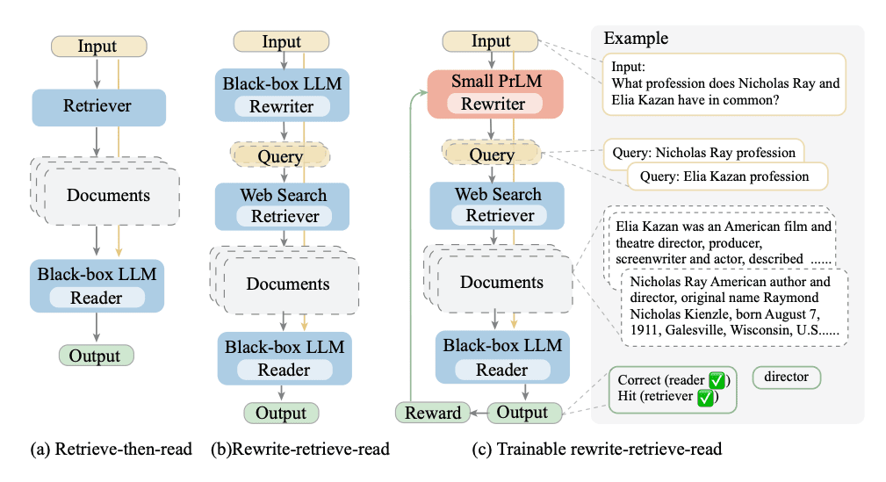
[Query Rewriting - Ma et al. 2023](https://arxiv.org/abs/2305.14283)

### 3. Fine-Tuning Embedding Models

While pre-trained embedding models provide a good starting point, fine-tuning these models on your specific dataset can dramatically improve retrieval performance. This involves:

- **Selecting Appropriate Models**: For specialized fields like medicine, choose models pre-trained on relevant data. For this particular examples I chose to use the MedCPT family of query and document encoders that have been pre-trained by an unprecedented scale of 255M query-article pairs from PubMed search logs.

- **Fine-Tuning with Positive and Negative Object Pairs**: You can further improve the performance of these models by collecting your own data and creating pairs of similar (positive) and dissimilar (negative) examples, and fine-tune the model to better understand these distinctions. This helps the model learn domain-specific relationships and semantics, improving retrieval performance but requires carefully curated training data.

These techniques, when combined, create a robust retrieval system that enhances the overall relevance of objects that when eventually given to a LLM improve generation quality.

# Generation

Lastly, let's discuss how you can improve control the generation quality of a Language Model (LLM). Here the name of the game is again to make sure the context you give to your LLM is as relevant to the prompt as possible, irrelevant data could trigger hallucinations. Here are some tips to achieve better generation results:

### 1. Autocut to Remove Irrelevant Information

Autocut is a method to filter out irrelevant information retrieved from the database, which can otherwise mislead the LLM and cause hallucinations. Here's how it works:

- **Retrieve and Score Similarity**: When a query is made, multiple objects are retrieved along with their similarity scores.

- **Identify and Cut Off**: Using the similarity scores, identify a cutoff point where the scores drop significantly. Objects beyond this point are considered less relevant and are automatically excluded.

For example, if you retrieve six objects, the similarity scores might drop sharply after the fourth object. By examining the rate of change of the similarity scores, you can determine which objects to exclude, ensuring only the most relevant information is fed to the LLM.

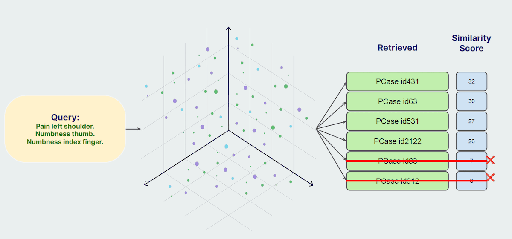
[AutoCut](https://weaviate.io/developers/weaviate/api/graphql/additional-operators#autocut)

### 2. Reranking Retrieved Objects

Reranking involves using a secondary, more sophisticated model to reassess and reorder the initially retrieved objects based on their relevance to the query. This process enhances the quality of the final retrieved set. Here’s how it works:

- **Overfetch**: Initially retrieve more objects than needed.
- **Apply Ranker Model**: Use a high-latency, heavy model, typically a cross encoder, to re-evaluate the relevance of each retrieved object. This model considers the query and each retrieved object pairwise to reassess their similarity.
- **Reorder Results**: Based on the new assessment, reorder the objects to reflect the most relevant results at the top.

This method ensures that the most relevant documents are prioritized, improving the overall quality of the data provided to the LLM.

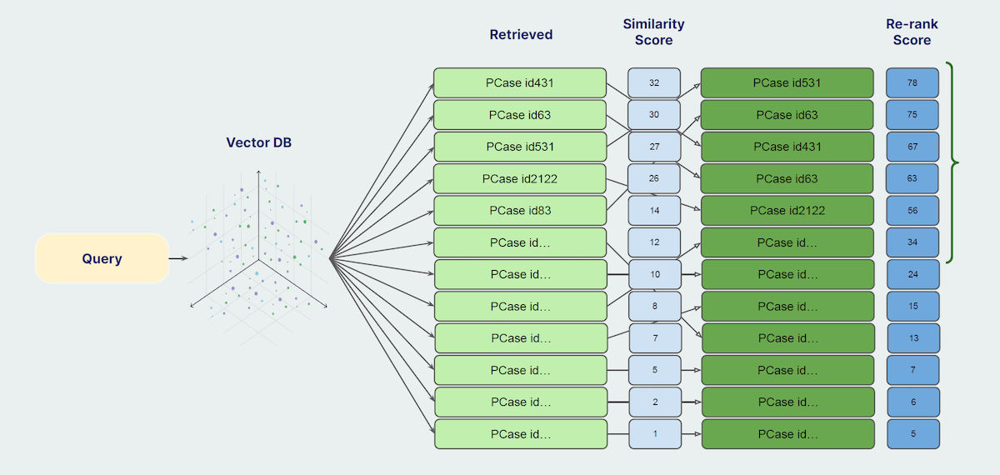
[AutoCut](https://weaviate.io/developers/weaviate/search/rerank)

### 3. Fine-Tuning the LLM

Fine-tuning the LLM on domain-specific data can significantly enhance its performance within that domain. For instance, using a model like Meditron 70B, which is a fine-tuned version of LLaMA 2 70b specifically for medical data using both:
- **Unsupervised Fine-Tuning**: Continue pre-training the model on a large corpus of domain-specific text (e.g., PubMed literature).
- **Supervised Fine-Tuning**: Further refine the model using supervised learning on domain-specific tasks (e.g., medical multiple-choice questions).

This specialized training helps the model perform exceptionally well in the targeted domain, outperforming both its base model and larger, less specialized models like GPT-3.5 in specific tasks.

## Summary

Improving retrieval and generation in Retrieval-Augmented Generation (RAG) systems is crucial for enhancing the performance and reliability of AI applications. 

The techniques discussed above range from low-investment, high-return methods like query rewriting and reranking, to more intensive processes like embedding and LLM fine-tuning. The choice of technique depends on the specific requirements and constraints of your application.

To make these techniques accessible, we’ve developed Verba, an open-source chatbot that integrates many of these improvements. Check it out on [GitHub](https://github.com/weaviate/Verba) and try it out at [verba.weaviate.io](https://verba.weaviate.io/) to see how it works with all of our documentation indexed into it. You can take this further by customizing and indexing with your data. You can also checkout the latest and greatest with Verba in the video below!

<iframe width="560" height="315" src="https://www.youtube.com/embed/swKKRdLBhas?si=m08JIUcgqC3sLdCr" title="YouTube video player" frameborder="0" allow="accelerometer; autoplay; clipboard-write; encrypted-media; gyroscope; picture-in-picture; web-share" referrerpolicy="strict-origin-when-cross-origin" allowfullscreen></iframe>

import WhatNext from '/_includes/what-next.mdx';

<WhatNext />
